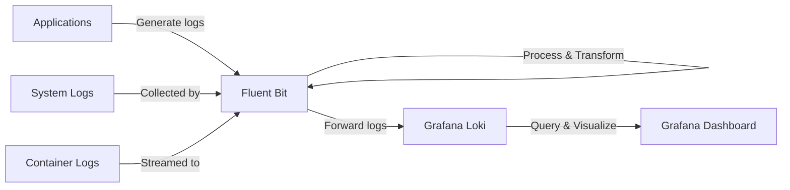

# Fluent Bit Integration with Grafana Loki

## Introduction

Fluent Bit is a lightweight and high-performance log processor and forwarder that allows you to collect logs from various sources and send them to different destinations. In this guide, we'll explore how to integrate Fluent Bit with Grafana Loki, a horizontally-scalable, highly-available log aggregation system. This integration is particularly useful for centralizing logs from different applications and infrastructure components, making them easier to search and analyze.

Fluent Bit offers several advantages for log collection:

- **Lightweight**: Requires minimal system resources
- **Extensible**: Supports numerous input sources and output destinations
- **High Performance**: Written in C, optimized for speed and efficiency
- **Cross-Platform**: Works on Linux, macOS, Windows, and container environments

By the end of this guide, you'll understand how to configure Fluent Bit to collect logs and forward them to Grafana Loki for centralized log management.

## Prerequisites

Before we begin, make sure you have:

- Basic understanding of logging concepts
- Grafana Loki instance running and accessible
- Fluent Bit installed on your system or containers
- Access to the systems where logs need to be collected

## Understanding the Log Collection Flow

Let's first understand how logs flow from your applications to Grafana Loki using Fluent Bit:



## Installing Fluent Bit

Let's start by installing Fluent Bit. The installation process varies depending on your operating system:

### On Debian/Ubuntu

```bash
curl https://raw.githubusercontent.com/fluent/fluent-bit/master/install.sh | sh
```

### Using Docker

```bash
docker run -d --name fluent-bit -p 24224:24224 fluent/fluent-bit:latest
```

### On Kubernetes using Helm

```bash
helm repo add fluent https://fluent.github.io/helm-charts
helm install fluent-bit fluent/fluent-bit
```

## Basic Fluent Bit Configuration for Loki

Fluent Bit uses a configuration file to define its behavior. Let's create a basic configuration file called `fluent-bit.conf` that collects system logs and forwards them to Loki:

```ini
[SERVICE]
    Flush        1
    Log_Level    info
    Daemon       off
    Parsers_File parsers.conf

[INPUT]
    Name        tail
    Path        /var/log/syslog
    Tag         system.*

[OUTPUT]
    Name        loki
    Match       *
    Host        loki.example.com
    Port        3100
    Labels      job=fluentbit, env=production
    Label_Keys  $tag
```

Let's break down this configuration:

1. **SERVICE section**: General Fluent Bit settings
   - `Flush`: How often (in seconds) to flush the buffer
   - `Log_Level`: Level of logging detail
   - `Parsers_File`: Location of additional parser definitions

2. **INPUT section**: Defines where Fluent Bit collects logs
   - `Name`: Type of input (tail watches for file changes)
   - `Path`: File(s) to monitor
   - `Tag`: Identifier for the log stream

3. **OUTPUT section**: Defines where to send the logs
   - `Name`: Type of output (loki in this case)
   - `Match`: Pattern to match tags for this output
   - `Host`: Loki server address
   - `Port`: Loki server port
   - `Labels`: Fixed labels to attach to all logs
   - `Label_Keys`: Log fields to convert to labels

## Advanced Configuration

### Adding Parsers

Parsers help Fluent Bit understand the structure of your logs. Let's add a parser for nginx logs:

```ini
# Add this to your fluent-bit.conf file
[PARSER]
    Name        nginx
    Format      regex
    Regex       ^(?<remote>[^ ]*) (?<host>[^ ]*) (?<user>[^ ]*) \[(?<time>[^\]]*)\] "(?<method>\S+)(?: +(?<path>[^\"]*?)(?: +\S*)?)?" (?<code>[^ ]*) (?<size>[^ ]*)(?: "(?<referer>[^\"]*)" "(?<agent>[^\"]*)")?$
    Time_Key    time
    Time_Format %d/%b/%Y:%H:%M:%S %z
```

### Using Filters to Modify Logs

Filters allow you to modify logs before they're sent to the output:

```ini
[FILTER]
    Name        modify
    Match       system.*
    Add         hostname ${HOSTNAME}
    Rename      message log_message
```

### Multi-tenant Configuration for Loki

If your Loki setup uses multi-tenancy, you can specify a tenant ID:

```ini
[OUTPUT]
    Name             loki
    Match            *
    Host             loki.example.com
    Port             3100
    Tenant_ID        team-backend
    Labels           job=fluentbit, env=production
    Label_Keys       $tag
    Line_Format      json
```

## Collecting Kubernetes Logs

Fluent Bit is particularly useful in Kubernetes environments. Here's a configuration for collecting Kubernetes pod logs:

```ini
[INPUT]
    Name              tail
    Tag               kube.*
    Path              /var/log/containers/*.log
    Parser            docker
    DB                /var/log/flb_kube.db
    Mem_Buf_Limit     5MB
    Skip_Long_Lines   On
    Refresh_Interval  10

[FILTER]
    Name                kubernetes
    Match               kube.*
    Kube_URL            https://kubernetes.default.svc:443
    Kube_CA_File        /var/run/secrets/kubernetes.io/serviceaccount/ca.crt
    Kube_Token_File     /var/run/secrets/kubernetes.io/serviceaccount/token
    Merge_Log           On
    K8S-Logging.Parser  On
    K8S-Logging.Exclude Off

[OUTPUT]
    Name        loki
    Match       *
    Host        loki-service.monitoring
    Port        3100
    Labels      job=fluentbit, k8s_cluster=production
    Label_Keys  $kubernetes['namespace_name'],$kubernetes['pod_name'],$kubernetes['container_name']
```

This configuration:
1. Collects container logs from the standard Kubernetes log path
2. Enhances logs with Kubernetes metadata (pod name, namespace, etc.)
3. Forwards logs to Loki with Kubernetes metadata as labels

## Practical Example: Application Logs to Loki

Let's set up a practical example where we collect logs from a web application and send them to Loki:

```ini
[SERVICE]
    Flush        1
    Log_Level    info
    Daemon       off
    Parsers_File parsers.conf

[INPUT]
    Name        tail
    Path        /var/log/webapp/app.log
    Tag         webapp

[FILTER]
    Name        parser
    Match       webapp
    Key_Name    log
    Parser      json

[FILTER]
    Name        modify
    Match       webapp
    Add         service_name webapp
    Add         environment production

[OUTPUT]
    Name            loki
    Match           webapp
    Host            loki.example.com
    Port            3100
    Labels          job=webapp, env=production
    Label_Keys      level,method,status_code
    Remove_Keys     host,user_agent
    Line_Format     json
```

In this example:
1. We're tailing a log file from our web application
2. Using a JSON parser to extract structured fields
3. Adding additional context with the modify filter
4. Sending to Loki with specific fields as labels
5. Removing unnecessary fields to reduce storage needs

## Configuring Fluent Bit as a Systemd Service

To run Fluent Bit as a system service, create a systemd service file:

```bash
sudo tee /etc/systemd/system/fluent-bit.service > /dev/null << 'EOF'
[Unit]
Description=Fluent Bit
Requires=network.target
After=network.target

[Service]
Type=simple
ExecStart=/opt/fluent-bit/bin/fluent-bit -c /etc/fluent-bit/fluent-bit.conf
Restart=always

[Install]
WantedBy=multi-user.target
EOF

sudo systemctl daemon-reload
sudo systemctl enable fluent-bit
sudo systemctl start fluent-bit
```

## Troubleshooting

If you're experiencing issues with your Fluent Bit and Loki integration, here are some common troubleshooting steps:

### Check Fluent Bit Logs

```bash
sudo journalctl -u fluent-bit -f
# or if running in Docker
docker logs -f fluent-bit
```

### Verify Connectivity to Loki

```bash
curl -v http://loki.example.com:3100/ready
```

### Test Loki Output Plugin

Set higher logging level for detailed output:

```ini
[SERVICE]
    Log_Level    debug

[OUTPUT]
    Name            loki
    Match           *
    Host            loki.example.com
    Port            3100
    Log_Level       debug
    # Other settings...
```

### Common Issues and Solutions

1. **Connection refused**
   - Check if Loki is running and accessible
   - Verify firewall rules allow connections

2. **Authentication failures**
   - Ensure your tenant ID is correct
   - Check if Basic Auth credentials are properly configured

3. **Rate limiting**
   - Increase `Flush` interval
   - Add batching configuration to reduce request frequency

## Performance Tuning

For high-volume log collection, consider these performance optimizations:

```ini
[SERVICE]
    Flush             5
    HTTP_Server       Off
    Log_Level         info
    Storage.path      /var/log/flb-buffers/
    Storage.sync      normal
    Storage.checksum  off
    Storage.backlog.mem_limit 5M

[INPUT]
    Name              tail
    # Other settings...
    Buffer_Chunk_Size 512k
    Buffer_Max_Size   5M
    Skip_Long_Lines   On

[OUTPUT]
    Name              loki
    Match             *
    Host              loki.example.com
    Port              3100
    Workers           4
    compress          true
```

## Summary

In this guide, we've explored how to integrate Fluent Bit with Grafana Loki for effective log collection and centralization. We covered:

- Basic installation and configuration of Fluent Bit
- Setting up inputs to collect logs from various sources
- Using filters to parse and transform log data
- Configuring the Loki output plugin
- Advanced configurations for Kubernetes environments
- Troubleshooting and performance tuning

This integration provides a powerful, lightweight solution for collecting logs from across your infrastructure and making them searchable and analyzable through Grafana Loki.

## Additional Resources

Here are some resources to deepen your understanding:

- [Fluent Bit Official Documentation](https://docs.fluentbit.io/)
- [Grafana Loki Documentation](https://grafana.com/docs/loki/latest/)
- [Fluent Bit Output Plugin for Loki](https://docs.fluentbit.io/manual/pipeline/outputs/loki)

## Exercises

To solidify your understanding, try these exercises:

1. Configure Fluent Bit to collect logs from a custom application and add custom labels based on log content
2. Set up a Fluent Bit configuration that filters out debug logs before sending to Loki
3. Create a Grafana dashboard that visualizes logs collected by Fluent Bit 
4. Implement log rotation monitoring with Fluent Bit to ensure no logs are missed during rotation
5. Configure Fluent Bit to handle multiline logs (like Java stack traces) correctly before sending to Loki