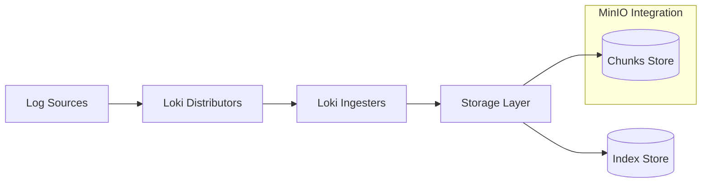

# MinIO Integration

## Introduction

When working with Grafana Loki, one of the key considerations is how to efficiently store your logs. Loki is designed to be cost-effective and highly scalable, which is achieved by separating the storage of logs (chunks) from their indexes. For optimal performance and scalability, using object storage for your log data is recommended.

MinIO is a high-performance, Kubernetes-native object storage system that's compatible with Amazon S3 API. It provides an excellent option for storing Loki's log chunks, especially for on-premises environments or when you want more control over your storage infrastructure.

In this guide, we'll explore how to integrate MinIO with Grafana Loki, configure the necessary components, and optimize your log storage strategy.

## Understanding Object Storage in Loki

Before diving into MinIO integration, let's understand how Loki uses storage:



Loki has two primary storage components:
- **Index Store**: Stores metadata and labels to quickly locate logs
- **Chunks Store**: Stores the actual log content in compressed chunks

MinIO is used as the Chunks Store in this architecture, providing durable and scalable object storage for your log data.

## Prerequisites

Before integrating MinIO with Loki, ensure you have:

- A running MinIO server or cluster
- Grafana Loki installed
- Basic understanding of Kubernetes (if deploying in a Kubernetes environment)
- Access credentials for your MinIO server

## Setting Up MinIO Server

If you don't already have a MinIO server, you can quickly set one up using Docker:

```bash
docker run -p 9000:9000 -p 9001:9001 \
  --name minio \
  -e "MINIO_ROOT_USER=minioadmin" \
  -e "MINIO_ROOT_PASSWORD=minioadmin" \
  -v ./minio-data:/data \
  quay.io/minio/minio server /data --console-address ":9001"
```

This command starts a MinIO server with:
- The API server on port 9000
- The web console on port 9001
- Default credentials (which you should change in production)
- Local data storage in the `./minio-data` directory

Once MinIO is running, access the web console at `http://localhost:9001` and create a new bucket for Loki (e.g., `loki-chunks`).

## Integrating MinIO with Loki

### Step 1: Configure Loki Storage

To configure Loki to use MinIO as its storage backend, you'll need to update the Loki configuration file. Here's a sample configuration:

```yaml
storage_config:
  boltdb_shipper:
    active_index_directory: /loki/index
    cache_location: /loki/cache
    cache_ttl: 24h
    shared_store: s3
  aws:
    s3: http://minio:9000
    s3forcepathstyle: true
    bucketnames: loki-chunks
    access_key_id: minioadmin
    secret_access_key: minioadmin
    insecure: true
    http_config:
      idle_conn_timeout: 90s
      response_header_timeout: 0s
      insecure_skip_verify: true

schema_config:
  configs:
    - from: 2020-07-01
      store: boltdb-shipper
      object_store: aws
      schema: v11
      index:
        prefix: index_
        period: 24h
```

Key points in this configuration:
- `boltdb_shipper` defines how indexes are stored and shipped to shared storage
- `aws` section configures the S3-compatible storage (MinIO in this case)
- `schema_config` defines how data is organized in storage

### Step 2: Configure Loki Compactor

The compactor is an important component that manages and optimizes chunks stored in the object store. Add these settings to your Loki configuration:

```yaml
compactor:
  working_directory: /loki/compactor
  shared_store: s3
  compaction_interval: 10m
```

### Step 3: Deploy Loki with MinIO Configuration

If you're using Docker Compose, your configuration might look like this:

```yaml
version: '3'
services:
  minio:
    image: quay.io/minio/minio
    command: server /data --console-address ":9001"
    ports:
      - "9000:9000"
      - "9001:9001"
    environment:
      - MINIO_ROOT_USER=minioadmin
      - MINIO_ROOT_PASSWORD=minioadmin
    volumes:
      - ./minio-data:/data

  loki:
    image: grafana/loki:latest
    ports:
      - "3100:3100"
    volumes:
      - ./loki-config.yaml:/etc/loki/local-config.yaml
    command: -config.file=/etc/loki/local-config.yaml
    depends_on:
      - minio
```

For Kubernetes deployments, use a ConfigMap to store the configuration and reference it in your Loki Deployment or StatefulSet.

## Testing the Integration

To verify your MinIO integration is working correctly:

1. Send some logs to Loki using a client like Promtail
2. Check that logs are queryable in Grafana
3. Examine the MinIO bucket to confirm chunks are being stored

You can query logs in Grafana using LogQL:

```logql
{job="my-app"} |= "error"
```

If logs appear in your queries, MinIO integration is working correctly.

## Optimizing MinIO for Loki

To get the best performance from your MinIO storage with Loki:

### 1. Configure Retention Policies

Set up a retention policy to automatically manage old logs:

```yaml
limits_config:
  retention_period: 744h  # 31 days
```

### 2. Configure Bucket Lifecycle Management

In MinIO, you can set lifecycle rules to automatically expire old objects:

```bash
mc ilm add --expiry-days 32 --tags "retention=loki" myminio/loki-chunks
```

### 3. Enable Compression

Ensure Loki compresses chunks to minimize storage usage:

```yaml
chunk_store_config:
  max_look_back_period: 744h
```

### 4. Monitor Storage Usage

Set up monitoring for your MinIO instance to track storage growth and performance metrics.

## Security Considerations

For production environments, implement these security best practices:

1. Use dedicated MinIO credentials for Loki with minimal permissions
2. Enable TLS for MinIO communication
3. Use secrets management for storing credentials
4. Configure network policies to restrict access

Example secure configuration:

```yaml
storage_config:
  aws:
    s3: https://minio.example.com:9000
    s3forcepathstyle: true
    bucketnames: loki-chunks
    access_key_id: ${MINIO_ACCESS_KEY}
    secret_access_key: ${MINIO_SECRET_KEY}
    insecure: false
```

## Troubleshooting Common Issues

### Connection Issues

If Loki cannot connect to MinIO:

1. Verify network connectivity
2. Check credentials are correct
3. Ensure bucket permissions are proper
4. Verify MinIO is running and healthy

### Performance Problems

If query performance is slow:

1. Check index configuration
2. Verify chunk cache size is adequate
3. Optimize log volume and retention period
4. Consider scaling MinIO horizontally

### Error Logs to Look For

Watch for these errors in Loki logs:

```
level=error msg="error storing chunks" err="Access Denied"
level=warn msg="failed to upload chunks" err="RequestTimeout"
```

## Summary

Integrating MinIO with Grafana Loki provides a powerful, scalable solution for log storage:

- MinIO offers S3-compatible storage that works seamlessly with Loki
- Proper configuration ensures efficient log storage and retrieval
- Security and optimization settings help maintain performance at scale
- The combination provides a cost-effective alternative to cloud-based storage

By following this guide, you've learned how to:
1. Set up MinIO as an object store for Loki
2. Configure Loki to use MinIO for chunk storage
3. Optimize and secure your storage implementation
4. Troubleshoot common integration issues

## Additional Resources

- [Grafana Loki Documentation](https://grafana.com/docs/loki/latest/)
- [MinIO Documentation](https://min.io/docs/minio/linux/index.html)
- [Loki Storage Documentation](https://grafana.com/docs/loki/latest/operations/storage/)

## Exercises

1. Set up a local MinIO and Loki instance using Docker Compose and send logs using Promtail
2. Configure different retention periods for different log streams using Loki's tenant configuration
3. Set up alerting in Grafana to notify when MinIO storage usage exceeds a threshold
4. Experiment with different compression algorithms and measure their impact on storage efficiency