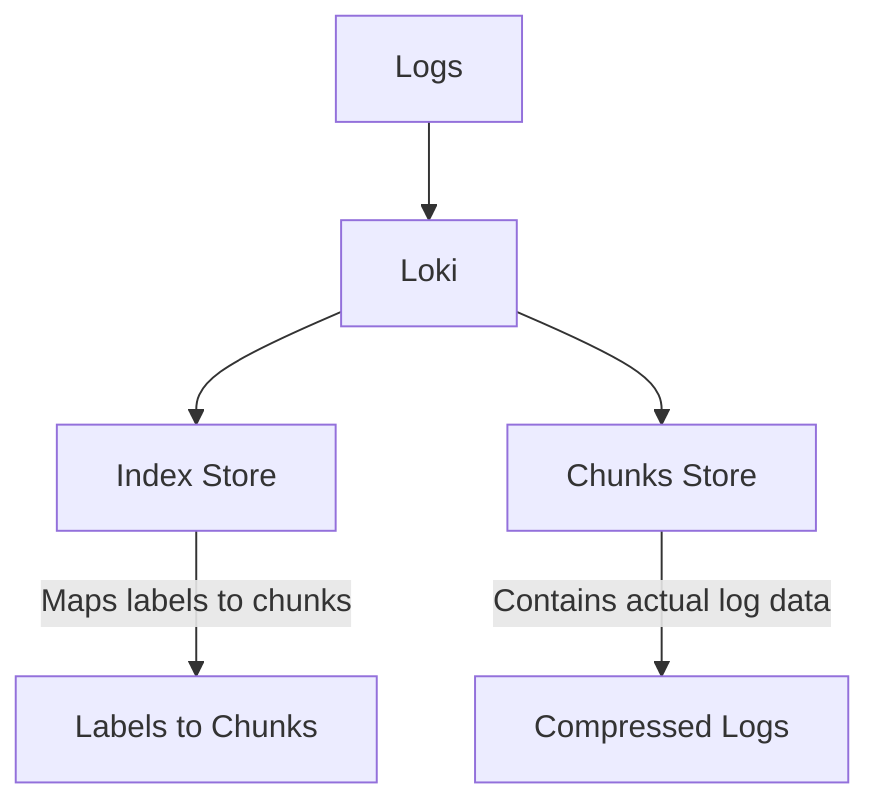
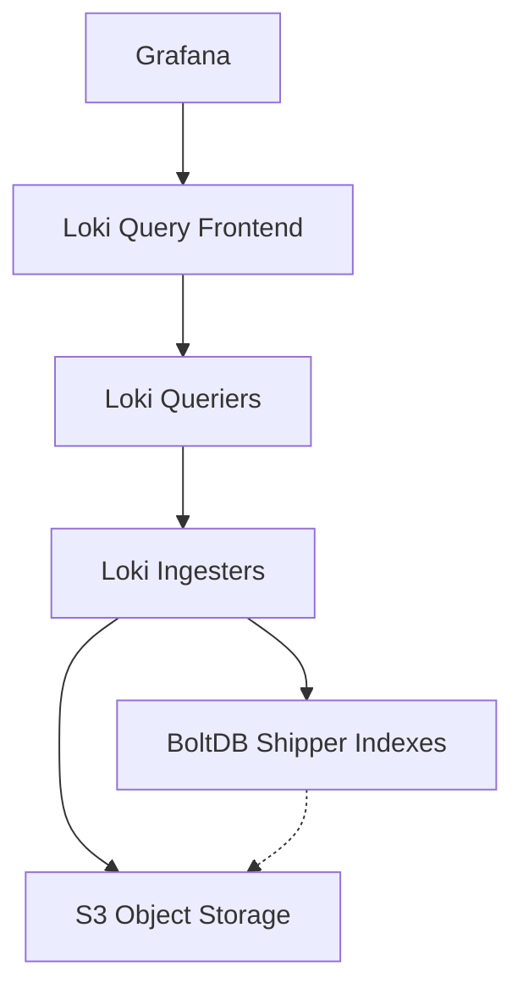

# Storage Backends Comparison

## Introduction

When setting up Grafana Loki for log storage and analysis, one of the most critical decisions you'll make is choosing the right storage backend. Storage backends in Loki determine how your log data is stored, accessed, and managed throughout its lifecycle. Each backend option comes with different trade-offs regarding performance, scalability, operational complexity, and cost.

In this guide, we'll explore the various storage backend options available for Grafana Loki, compare their strengths and weaknesses, and provide guidance on selecting the most appropriate solution for your specific use case.

## Understanding Loki's Storage Architecture

Before diving into the comparison, it's important to understand that Loki's storage is split into two main components:

1. **Index Store** - Stores metadata about your logs, making them searchable
2. **Chunks Store** - Stores the actual compressed log content



Each storage component can use different backends, allowing you to optimize for different requirements. Let's explore the available options for both index and chunks storage.

## Index Store Options

### 1. BoltDB

BoltDB is a simple key-value store that operates as an embedded database.

**Characteristics:**
- Single-node, embedded database
- Good for small, local deployments
- Simple to set up with no external dependencies
- Limited scalability

**Example Configuration:**
```yaml
schema_config:
  configs:
    - from: 2020-07-01
      store: boltdb
      object_store: filesystem
      schema: v11
      index:
        prefix: index_
        period: 24h
```

**Best for:** Development environments, small deployments, or testing.

### 2. Cassandra

Apache Cassandra is a distributed NoSQL database designed for handling large amounts of data across many servers.

**Characteristics:**
- Highly scalable and decentralized
- Excellent for large-scale deployments
- Good write performance
- No single point of failure
- Complex to operate and maintain

**Example Configuration:**
```yaml
schema_config:
  configs:
    - from: 2020-07-01
      store: cassandra
      object_store: gcs
      schema: v11
      index:
        prefix: loki_index_
        period: 24h

storage_config:
  cassandra:
    addresses: cassandra-host1,cassandra-host2,cassandra-host3
    keyspace: loki
    consistency: QUORUM
```

**Best for:** Large enterprises with existing Cassandra expertise.

### 3. BigTable

Google BigTable is a fully managed, scalable NoSQL database service.

**Characteristics:**
- Fully managed service (on Google Cloud)
- Highly scalable
- Low operational overhead
- Higher cost compared to self-hosted options
- Vendor lock-in to Google Cloud

**Example Configuration:**
```yaml
schema_config:
  configs:
    - from: 2020-07-01
      store: bigtable
      object_store: gcs
      schema: v11
      index:
        prefix: loki_index_
        period: 24h

storage_config:
  bigtable:
    project: my-gcp-project
    instance: loki-bigtable
```

**Best for:** Organizations already on Google Cloud looking for minimal operational overhead.

### 4. DynamoDB

Amazon DynamoDB is a fully managed, serverless NoSQL database service.

**Characteristics:**
- Fully managed service (on AWS)
- Automatic scaling
- Pay-per-use pricing model
- Low maintenance overhead
- Vendor lock-in to AWS

**Example Configuration:**
```yaml
schema_config:
  configs:
    - from: 2020-07-01
      store: aws-dynamo
      object_store: s3
      schema: v11
      index:
        prefix: loki_index_
        period: 24h

storage_config:
  aws:
    dynamodb:
      dynamodb_url: dynamodb://us-west-2
      metrics_table: loki_metrics
      chunks_table: loki_chunks
      periodic_table: loki_index
```

**Best for:** AWS users wanting managed services with minimal operational overhead.

### 5. BoltDB Shipper

BoltDB Shipper is a Loki-specific solution that combines local BoltDB instances with object storage.

**Characteristics:**
- Simple and cost-effective
- Uses object storage for persistence
- Good balance of performance and scalability
- Works well with horizontally scaled Loki deployments
- Lower operational complexity than distributed databases

**Example Configuration:**
```yaml
schema_config:
  configs:
    - from: 2020-07-01
      store: boltdb-shipper
      object_store: s3
      schema: v11
      index:
        prefix: index_
        period: 24h

storage_config:
  boltdb_shipper:
    active_index_directory: /loki/boltdb-shipper-active
    cache_location: /loki/boltdb-shipper-cache
    cache_ttl: 24h
    shared_store: s3
```

**Best for:** Most production deployments that need scalability without excessive complexity.

## Chunks Store Options

### 1. Filesystem

The local filesystem option stores log chunks directly on disk.

**Characteristics:**
- Simplest option
- No external dependencies
- Limited to single node's storage capacity
- Not suitable for distributed deployments
- No built-in redundancy

**Example Configuration:**
```yaml
storage_config:
  filesystem:
    directory: /loki/chunks
```

**Best for:** Development, testing, or very small production deployments.

### 2. AWS S3 (or S3-compatible)

Amazon S3 is an object storage service that offers scalability, data availability, security, and performance.

**Characteristics:**
- Highly durable and available
- Virtually unlimited storage capacity
- Cost-effective for large volumes
- Compatible with many S3-compatible alternatives (MinIO, etc.)
- Integrated with AWS ecosystem

**Example Configuration:**
```yaml
storage_config:
  aws:
    s3: 
      s3: s3://region/bucket-name
      s3forcepathstyle: true
```

**Best for:** AWS users, or those using S3-compatible storage like MinIO.

### 3. Google Cloud Storage (GCS)

Google Cloud Storage is a RESTful object storage service for storing and accessing data.

**Characteristics:**
- Highly durable and available
- Virtually unlimited storage capacity
- Good integration with other Google Cloud services
- Various storage classes for cost optimization

**Example Configuration:**
```yaml
storage_config:
  gcs:
    bucket_name: loki-chunks
    chunk_buffer_size: 10485760
```

**Best for:** Google Cloud users seeking a fully managed storage solution.

### 4. Azure Blob Storage

Microsoft Azure's object storage solution for the cloud.

**Characteristics:**
- Highly durable and available
- Integrated with Azure ecosystem
- Multiple access tiers for cost optimization
- Global distribution capabilities

**Example Configuration:**
```yaml
storage_config:
  azure:
    account_name: loki
    account_key: key
    container_name: loki-chunks
```

**Best for:** Organizations using Microsoft Azure cloud services.

### 5. Swift

OpenStack Swift is an object storage system that stores and retrieves files.

**Characteristics:**
- Open-source
- Good for private clouds built on OpenStack
- Horizontally scalable
- Designed for multi-tenancy

**Example Configuration:**
```yaml
storage_config:
  swift:
    container_name: loki-chunks
    auth_url: https://swift-auth-url
    username: username
    password: password
    domain_name: default
    domain_id: default
    tenant_id: tenant
    tenant_name: tenant
```

**Best for:** Organizations using OpenStack for private clouds.

## Comparison Matrix

Let's compare these options across several important factors:

| Storage Backend | Scalability | Setup Complexity | Operational Overhead | Cost | Cloud Vendor | Best For |
|-----------------|-------------|------------------|----------------------|------|--------------|----------|
| BoltDB (Index)  | Low | Low | Low | Low | Agnostic | Development, Small Deployments |
| Cassandra (Index) | High | High | High | Medium | Agnostic | Large Enterprise Deployments |
| BigTable (Index) | High | Low | Low | High | Google | GCP Users, Managed Service Needs |
| DynamoDB (Index) | High | Low | Low | Medium-High | AWS | AWS Users, Managed Service Needs |
| BoltDB Shipper (Index) | Medium-High | Medium | Medium | Low | Agnostic | Most Production Deployments |
| Filesystem (Chunks) | Low | Low | Low | Low | Agnostic | Development, Small Deployments |
| S3 (Chunks) | High | Low | Low | Low-Medium | AWS/Agnostic | Most Production Deployments |
| GCS (Chunks) | High | Low | Low | Low-Medium | Google | GCP Users |
| Azure Blob (Chunks) | High | Low | Low | Low-Medium | Azure | Azure Users |
| Swift (Chunks) | Medium-High | Medium | Medium | Medium | Agnostic | OpenStack Users |

## Recommended Combinations

Based on common deployment scenarios, here are some recommended combinations:

### 1. Local Development Setup
- **Index:** BoltDB
- **Chunks:** Filesystem
- **Advantages:** Simple setup, no external dependencies
- **Configuration Example:**

```yaml
schema_config:
  configs:
    - from: 2020-10-24
      store: boltdb
      object_store: filesystem
      schema: v11
      index:
        prefix: index_
        period: 24h

storage_config:
  boltdb:
    directory: /loki/index
  filesystem:
    directory: /loki/chunks
```

### 2. Small Production Deployment
- **Index:** BoltDB Shipper
- **Chunks:** S3 or S3-compatible (like MinIO)
- **Advantages:** Simple, cost-effective, scalable
- **Configuration Example:**

```yaml
schema_config:
  configs:
    - from: 2020-10-24
      store: boltdb-shipper
      object_store: s3
      schema: v11
      index:
        prefix: index_
        period: 24h

storage_config:
  boltdb_shipper:
    active_index_directory: /loki/boltdb-shipper-active
    cache_location: /loki/boltdb-shipper-cache
    cache_ttl: 24h
    shared_store: s3
  aws:
    s3: s3://region/bucket-name
    s3forcepathstyle: true
```

### 3. AWS-Based Large Deployment
- **Index:** DynamoDB
- **Chunks:** S3
- **Advantages:** Fully managed, highly scalable, AWS ecosystem integration
- **Configuration Example:**

```yaml
schema_config:
  configs:
    - from: 2020-10-24
      store: aws-dynamo
      object_store: s3
      schema: v11
      index:
        prefix: index_
        period: 24h

storage_config:
  aws:
    dynamodb:
      dynamodb_url: dynamodb://us-west-2
      metrics_table: loki_metrics
      chunks_table: loki_chunks
      periodic_table: loki_index
    s3: s3://region/bucket-name
```

### 4. Google Cloud-Based Deployment
- **Index:** BigTable
- **Chunks:** GCS
- **Advantages:** Fully managed, highly scalable, GCP ecosystem integration
- **Configuration Example:**

```yaml
schema_config:
  configs:
    - from: 2020-10-24
      store: bigtable
      object_store: gcs
      schema: v11
      index:
        prefix: loki_index_
        period: 24h

storage_config:
  bigtable:
    project: my-gcp-project
    instance: loki-bigtable
  gcs:
    bucket_name: loki-chunks
```

## Performance Considerations

When selecting a storage backend, consider these performance aspects:

1. **Query Patterns**
   - Frequent queries over recent data favor faster index stores like Cassandra or BigTable
   - Historical analytics might work well with BoltDB Shipper and object storage

2. **Write Volume**
   - High write throughput scenarios benefit from distributed databases like Cassandra
   - Lower volumes can work well with BoltDB Shipper

3. **Retention Period**
   - Longer retention periods increase the importance of cost-effective chunk storage
   - Consider storage classes or tiers for older data

4. **Read/Write Ratio**
   - Read-heavy workloads might benefit from caching mechanisms
   - Write-heavy workloads need storage backends with good write performance

## Real-World Example: Scaling Loki with BoltDB Shipper and S3

Let's examine a practical example of setting up Loki with BoltDB Shipper and S3 for a medium-sized deployment.

1. **Initial Configuration**

```yaml
schema_config:
  configs:
    - from: 2022-01-01
      store: boltdb-shipper
      object_store: s3
      schema: v11
      index:
        prefix: index_
        period: 24h

storage_config:
  boltdb_shipper:
    active_index_directory: /loki/index
    cache_location: /loki/index-cache
    cache_ttl: 24h
    shared_store: s3
  aws:
    s3: s3://us-east-1/loki-storage
    s3forcepathstyle: true
    insecure: false
    sse_encryption: true
    http:
      idle_conn_timeout: 90s
      response_header_timeout: 0s
      insecure_skip_verify: false
```

2. **Deployment Structure**



3. **Operational Benefits**
   - Ingesters write BoltDB files locally and periodically upload to S3
   - Queriers download and cache index files as needed
   - Horizontal scaling of components is straightforward
   - Cost-effective compared to managed database solutions

## Migration Between Storage Backends

If you need to migrate between storage backends as your deployment grows, consider these approaches:

1. **Same-time Migration**
   - Configure Loki to write to both old and new storage
   - Read from old storage but gradually shift to new storage
   - Once all historical data is available in new storage, decommission old storage

2. **Schema-based Migration**
   - Use Loki's schema configuration to specify different backends for different time periods
   - Example:

```yaml
schema_config:
  configs:
    - from: 2020-01-01
      store: boltdb
      object_store: filesystem
      schema: v11
      index:
        prefix: index_old_
        period: 24h
    - from: 2022-01-01
      store: boltdb-shipper
      object_store: s3
      schema: v11
      index:
        prefix: index_new_
        period: 24h
```

## Summary

Choosing the right storage backend for Grafana Loki is a critical decision that impacts performance, scalability, cost, and operational complexity. The best choice depends on your specific requirements, existing infrastructure, and team expertise.

For most users, the BoltDB Shipper with object storage (S3, GCS, Azure Blob) offers an excellent balance of performance, cost, and operational simplicity. Larger enterprises with specific cloud preferences might opt for the fully managed solutions provided by their cloud vendor.

Remember that Loki's storage is split between index and chunks, allowing you to optimize each independently for your specific use case.

## Additional Resources

1. **Learn More**
   - [Grafana Loki Documentation on Storage](https://grafana.com/docs/loki/latest/operations/storage/)
   - [Scaling Loki: BoltDB Shipper Design](https://grafana.com/blog/2020/09/03/how-we-designed-loki-to-work-easily-both-as-a-microservice-and-as-monolithic-deployment/)
   - [Loki Storage Best Practices](https://grafana.com/docs/loki/latest/operations/storage/best-practices/)

2. **Practice Exercises**
   - Set up a local development environment with BoltDB and Filesystem
   - Deploy a small production environment with BoltDB Shipper and MinIO (S3-compatible)
   - Compare query performance between different backends for your specific log patterns
   - Practice configuring retention policies for different storage backends