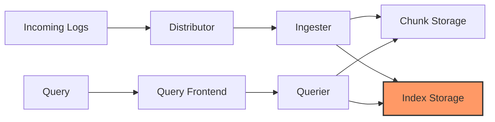
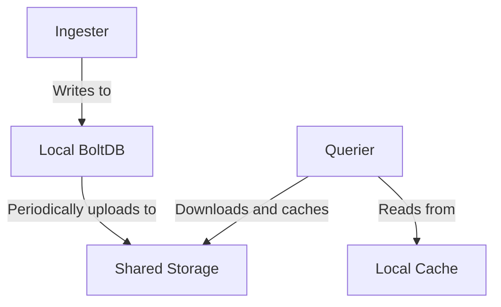

# Index Storage in Grafana Loki

## Introduction

In Grafana Loki's architecture, one of the most critical components is the **index storage** system. While log data (chunks) contains the actual content of your logs, the index is what makes those logs quickly searchable and retrievable. Think of index storage as the "table of contents" for your logging system - without it, finding specific logs would require scanning through all data sequentially, which would be prohibitively slow at scale.

This guide will help you understand how Loki's index storage works, how to configure it, and how to optimize it for your specific use case.

## What is Index Storage?

Index storage in Loki is a database that maintains the relationship between your log labels (metadata) and the actual chunks of log data. It maps the combination of labels and timestamps to where the actual log data is stored.



The index contains critical information such as:
- Label sets for each log stream
- Time ranges for chunks
- References to where actual log chunks are stored
- Series information

## Index Storage Options

Loki supports multiple backend options for storing index data:

### 1. Local Storage

For testing, development, or small deployments, you can use the filesystem-based local storage for your index:

```yaml
storage_config:
  boltdb_shipper:
    active_index_directory: /loki/index
    cache_location: /loki/index_cache
    cache_ttl: 24h
    shared_store: filesystem
    filesystem:
      directory: /loki/index_shared
```

This configuration:
- Stores active indexes in `/loki/index`
- Maintains a cache in `/loki/index_cache` with a 24-hour TTL
- Uses the local filesystem for shared storage at `/loki/index_shared`

### 2. Cloud Storage Options

For production deployments, you'll typically use a cloud storage provider:

#### AWS S3

```yaml
storage_config:
  boltdb_shipper:
    active_index_directory: /loki/index
    cache_location: /loki/index_cache
    cache_ttl: 24h
    shared_store: s3
  aws:
    s3: s3://region/bucket-name
    s3forcepathstyle: true
```

#### Google Cloud Storage

```yaml
storage_config:
  boltdb_shipper:
    active_index_directory: /loki/index
    cache_location: /loki/index_cache
    cache_ttl: 24h
    shared_store: gcs
  gcs:
    bucket_name: loki-index-bucket
```

#### Azure Blob Storage

```yaml
storage_config:
  boltdb_shipper:
    active_index_directory: /loki/index
    cache_location: /loki/index_cache
    cache_ttl: 24h
    shared_store: azure
  azure:
    account_name: loki_storage
    account_key: <account_key>
    container_name: loki-index
```

## BoltDB Shipper - Loki's Default Index Store

The most commonly used index storage implementation in Loki is **BoltDB Shipper**. This index store uses BoltDB (a simple, fast, key-value store) for active indexes, and periodically uploads these index files to the configured shared storage.

### How BoltDB Shipper Works

1. **Write Path**:
   - Ingesters write logs to local BoltDB files in `active_index_directory`
   - Periodically (default: 15 minutes), these files are uploaded to the configured shared store
   - This approach improves write performance by batching index updates

2. **Read Path**:
   - Queriers download index files from shared storage
   - Files are cached in `cache_location` to improve read performance
   - The cache is managed based on the configured `cache_ttl`



## Configuring Index Storage

Let's look at a complete configuration example with explanations:

```yaml
storage_config:
  # BoltDB Shipper configuration
  boltdb_shipper:
    # Directory to store active index files (not yet uploaded)
    active_index_directory: /loki/index
    
    # Directory to cache downloaded index files
    cache_location: /loki/index_cache
    
    # How long to keep index files in cache
    cache_ttl: 24h
    
    # How often to upload index files to shared storage
    resync_interval: 5m
    
    # The storage backend to use for shared index files
    shared_store: s3
  
  # Configuration for the chosen storage backend
  aws:
    s3: s3://us-east-1/loki-index
    region: us-east-1
    access_key_id: ${AWS_ACCESS_KEY_ID}
    secret_access_key: ${AWS_SECRET_ACCESS_KEY}
```

## Index Storage Performance Optimization

Optimizing your index storage is crucial for Loki's performance. Here are some key considerations:

### 1. Cardinality Management

High cardinality (too many unique label combinations) is the most common performance issue with Loki indexes:

```yaml
# In limits_config section
limits_config:
  max_label_name_length: 1024
  max_label_value_length: 2048
  max_label_names_per_series: 30
  reject_old_samples: true
  reject_old_samples_max_age: 168h
  cardinality_limit: 100000
```

### 2. Cache Tuning

Properly sized caches improve query performance:

```yaml
# In chunk_store_config section
chunk_store_config:
  chunk_cache_config:
    enabled: true
    size: 1GB
  write_dedupe_cache_config:
    enabled: true
    size: 512MB
```

### 3. Compaction

Index compaction helps reduce storage size and improve query performance:

```yaml
compactor:
  working_directory: /loki/compactor
  shared_store: s3
  compaction_interval: 2h
  retention_enabled: true
```

## Practical Example: Setting Up Index Storage in a Distributed Environment

Let's walk through a practical example of setting up Loki with appropriate index storage for a medium-sized production environment:

First, we'll define our storage configuration in a file called `loki-config.yaml`:

```yaml
storage_config:
  boltdb_shipper:
    active_index_directory: /loki/index
    cache_location: /loki/index_cache
    cache_ttl: 48h
    shared_store: s3
  aws:
    s3: s3://us-west-2/loki-index-storage
    region: us-west-2
    sse_encryption: true

schema_config:
  configs:
    - from: 2022-01-01
      store: boltdb-shipper
      object_store: s3
      schema: v12
      index:
        prefix: loki_index_
        period: 24h

chunk_store_config:
  chunk_cache_config:
    enabled: true
    size: 2GB
  write_dedupe_cache_config:
    enabled: true
    size: 1GB

compactor:
  working_directory: /loki/compactor
  shared_store: s3
  compaction_interval: 3h
```

Then, we can deploy this using Docker:

```bash
docker run -d --name loki \
  -v $(pwd)/loki-config.yaml:/etc/loki/config.yaml \
  -v loki-data:/loki \
  -p 3100:3100 \
  -e AWS_ACCESS_KEY_ID=your_access_key \
  -e AWS_SECRET_ACCESS_KEY=your_secret_key \
  grafana/loki:latest \
  -config.file=/etc/loki/config.yaml
```

## Monitoring Index Storage

To ensure your index storage is functioning properly, monitor these key metrics:

1. **Index Gateway Metrics**:
   - `loki_boltdb_shipper_request_duration_seconds` - Time taken for index operations
   - `loki_boltdb_shipper_request_errors_total` - Count of index operation errors

2. **Query Performance**:
   - `loki_query_frontend_query_seconds` - Time taken for queries
   - `loki_index_entries_per_chunk` - Index density

You can set up a Grafana dashboard to monitor these metrics:

```yaml
# Example Prometheus rules for index monitoring
groups:
- name: loki-index-alerts
  rules:
  - alert: LokiIndexUploadFailures
    expr: rate(loki_boltdb_shipper_upload_failures_total[5m]) > 0
    for: 15m
    labels:
      severity: warning
    annotations:
      description: "Loki is failing to upload index files to storage"
```

## Common Issues and Troubleshooting

Here are some common issues related to index storage and how to address them:

### 1. High Cardinality Problems

**Symptom**: Slow queries, high memory usage, index size growing rapidly

**Solutions**:
- Audit your label usage and eliminate unnecessary high-cardinality labels
- Implement dynamic labels for high-cardinality values
- Configure cardinality limits in Loki

### 2. Index Upload Failures

**Symptom**: Errors in logs like `failed to upload index with key...`

**Solutions**:
- Check storage permissions
- Verify network connectivity
- Ensure sufficient disk space for temporary files

### 3. Slow Queries

**Symptom**: Queries take a long time to complete

**Solutions**:
- Increase cache sizes
- Add more querier instances
- Optimize your label queries to be more specific
- Enable compaction to optimize index files

## Summary

Index storage is a vital component of Loki's architecture that enables efficient log retrieval. In this guide, we've covered:

- What index storage is and why it's important
- Available storage backend options (local, S3, GCS, Azure)
- How BoltDB Shipper works
- Configuration options and best practices
- Performance optimization techniques
- Practical deployment examples
- Monitoring and troubleshooting

By properly configuring and optimizing your index storage, you can ensure that Loki performs well even as your logging volume grows.

## Additional Resources

- [Grafana Loki Documentation](https://grafana.com/docs/loki/latest/)
- [Loki Architecture Documentation](https://grafana.com/docs/loki/latest/fundamentals/architecture/)
- [BoltDB GitHub Repository](https://github.com/boltdb/bolt)

## Practice Exercises

1. Set up a local Loki instance with filesystem-based index storage and monitor its performance.
2. Configure Loki with S3 as the index storage backend and test uploading and retrieving logs.
3. Analyze the impact of different cache TTL values on query performance by running benchmarks.
4. Create a Grafana dashboard to monitor the key index storage metrics mentioned in this guide.