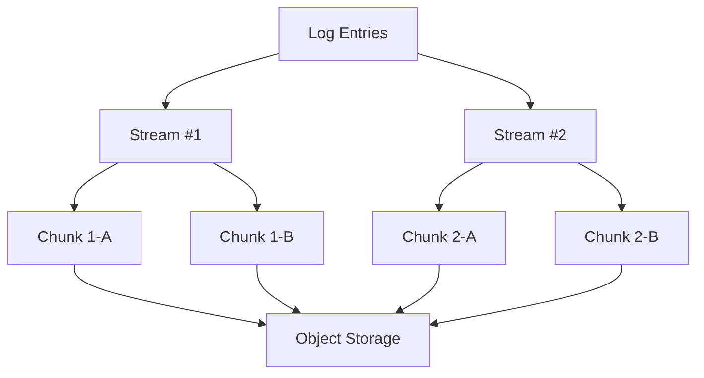

# Chunks Storage

## Introduction

Chunks Storage is a fundamental concept in Grafana Loki's architecture that defines how log data is organized, compressed, and stored. In Loki's design, logs are broken down into manageable pieces called "chunks" before being persisted to storage. Understanding chunks is essential for optimizing Loki's performance and cost-efficiency in production environments.

## What are Chunks?

Chunks are Loki's basic storage unit - compressed collections of log entries that share the same set of labels for a specific time period. When you send logs to Loki, they aren't stored as individual entries. Instead, Loki groups logs by their label sets, compresses them, and stores them as chunks.



## Chunk Lifecycle

Let's explore how chunks are created, managed, and eventually stored:

1. **Creation**: When logs enter Loki, they're initially kept in memory in the ingester component.
2. **Compression**: Logs are compressed using algorithms optimized for log data.
3. **Flushing**: Chunks are "flushed" (written) to long-term storage when they:
   - Reach a configured maximum age
   - Reach a configured maximum size
   - Contain logs that span a configured maximum time range
   - When an ingester is shutting down

### Chunk Configuration Example

Here's how you might configure chunk parameters in your Loki configuration:

```yaml
limits_config:
  ingestion_rate_mb: 4
  ingestion_burst_size_mb: 6

schema_config:
  configs:
    - from: 2020-07-01
      store: boltdb-shipper
      object_store: s3
      schema: v11
      index:
        prefix: index_
        period: 24h

chunk_store_config:
  max_look_back_period: 0s

table_manager:
  retention_deletes_enabled: true
  retention_period: 744h

compactor:
  working_directory: /loki/compactor
  shared_store: s3
```

## Chunk Encoding and Compression

Loki offers several encoding and compression options for chunks, each with different trade-offs between compression ratio, query performance, and CPU usage:

### Compression Algorithms

| Algorithm | Description | Pros | Cons |
|-----------|-------------|------|------|
| `gzip` | Standard compression | Good balance | Medium CPU usage |
| `lz4` | Fast compression | Low CPU usage | Lower compression |
| `snappy` | Balanced compression | Fast decompression | Medium compression |

### Chunk Encoding Formats

Loki supports different encoding formats for chunks:

1. **Logfmt**: Optimized for logs in logfmt format
2. **JSON**: Optimized for logs in JSON format
3. **Protobuf**: Default general-purpose encoding

## Configuring Chunk Storage

Let's look at how to configure the chunk storage in Loki:

```yaml
chunk_store_config:
  # The maximum time between the oldest and newest log entry in a chunk
  max_look_back_period: 0s
  
  # The chunk cache configuration
  chunk_cache_config:
    enable_fifocache: true
    fifocache:
      max_size_bytes: 500MB
      validity: 24h

storage_config:
  # AWS S3 configuration 
  aws:
    s3: s3://access_key:secret_access_key@region/bucket_name
    s3forcepathstyle: true
  
  # How long to keep chunks in the store
  boltdb_shipper:
    active_index_directory: /loki/index
    cache_location: /loki/cache
    cache_ttl: 24h
    shared_store: s3
```

## Chunk Storage Backends

Loki supports multiple storage backends for chunks:

1. **Local filesystem**: Good for testing, not recommended for production
2. **AWS S3**: Highly scalable object storage
3. **Google Cloud Storage**: GCP's object storage solution
4. **Azure Blob Storage**: Microsoft's object storage
5. **OpenStack Swift**: Object storage for OpenStack
6. **MinIO**: Self-hosted S3-compatible storage

## Practical Example: Analyzing Chunk Usage

Let's see how we can analyze Loki's chunk usage using its metrics:

```promql
# Total number of chunks stored
sum(loki_ingester_memory_chunks)

# Chunk flush operations
rate(loki_ingester_chunks_flushed_total[5m])

# Chunk flush errors
rate(loki_ingester_chunk_flush_errors_total[5m])

# Average chunk size
avg(loki_ingester_chunk_size_bytes)
```

## Optimizing Chunk Storage

Here are some best practices for optimizing chunk storage:

1. **Tune chunk target size**: Find the right balance between too many small chunks and too few large chunks
2. **Set appropriate retention periods**: Only keep logs as long as you need them
3. **Monitor chunk metrics**: Watch for issues with chunk flushing or size
4. **Choose the right compression algorithm**: Based on your CPU vs storage constraints
5. **Label carefully**: Too many unique label combinations create more chunks

## Troubleshooting Chunk Issues

Common chunk-related issues and their solutions:

| Issue | Possible Cause | Solution |
|-------|---------------|----------|
| High memory usage | Too many active chunks | Reduce cardinality, increase flush rate |
| Slow queries | Inefficient chunk caching | Increase cache size, optimize query patterns |
| Chunk flush errors | Storage backend issues | Check connectivity, permissions |
| Growing storage costs | Inefficient compression | Review compression settings, label strategy |

## Summary

Chunks are Loki's fundamental storage unit, containing compressed logs that share labels for specific time periods. Understanding how chunks work helps you:

- Configure Loki for optimal performance
- Minimize storage costs
- Troubleshoot issues effectively
- Design efficient log collection strategies

By properly configuring chunk parameters like size, encoding, compression, and storage backends, you can build a scalable logging solution that meets your organization's needs.

## Additional Resources

- Review the [official Loki documentation](https://grafana.com/docs/loki/latest/) for detailed configuration options
- Experiment with different chunk configurations in a test environment
- Use Grafana dashboards to monitor Loki's chunk metrics

## Exercises

1. Configure Loki with different chunk compression algorithms and compare their performance and storage efficiency
2. Write queries to analyze your Loki deployment's chunk metrics
3. Implement a retention policy appropriate for your organization's compliance requirements
4. Compare the performance of different storage backends for chunks