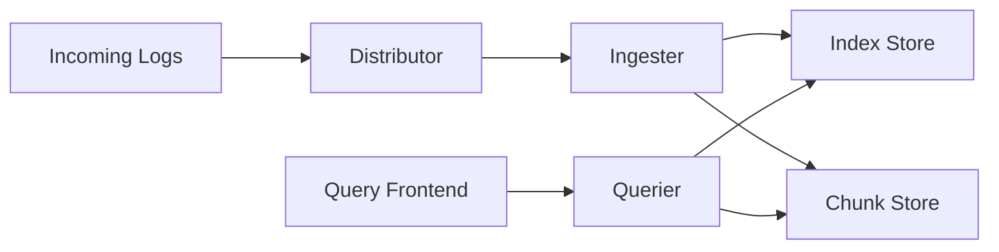

# Storage Schemas

## Introduction

Storage schemas define how Grafana Loki organizes and stores your log data. Properly configured storage schemas are crucial for Loki's performance, efficiency, and query responsiveness. In this guide, we'll explore how Loki's storage schemas work, different schema options, and how to configure them for your specific use case.

## Understanding Loki's Storage Model

Before diving into schemas, let's understand Loki's fundamental storage architecture. Loki splits log data into two components:

1. **Index** - Stores metadata about your logs and label information
2. **Chunks** - Stores the actual log content

This separation allows Loki to be incredibly efficient, as it only needs to scan through relevant chunks during queries.



## Storage Schema Configurations

Loki provides different schema options that determine how data is stored and organized:

### Schema Types

Loki supports several schema versions, with each newer version improving upon the previous:

- **v9**: The legacy schema (pre-Loki 1.0)
- **v10**: Improved for better label cardinality (Loki 1.0)
- **v11**: Enhanced with customer shard factor (Loki 1.5+)
- **v12**: Added periodic compaction (Loki 2.0+)

Most new deployments should use v11 or v12 schemas.

### Key Components of a Schema Configuration

```yaml
schema_config:
  configs:
    - from: 2020-07-01
      store: boltdb-shipper
      object_store: aws
      schema: v11
      index:
        prefix: index_
        period: 24h
```

Let's break down the key properties:

- **from**: When this schema configuration begins to apply
- **store**: The type of index store to use
- **object_store**: Where chunks are stored
- **schema**: The schema version to use
- **index**: Configuration for the index, including:
  - **prefix**: Prefix for index files
  - **period**: How often to create new index files

## Schema Strategies

### Time-Based Schema

The most common approach is to use a time-based schema, which organizes logs based on when they were received:

```yaml
schema_config:
  configs:
    - from: 2020-01-01
      store: boltdb-shipper
      object_store: s3
      schema: v11
      index:
        prefix: index_
        period: 24h
```

This configuration creates daily index files, making it easier to manage retention and query performance.

### Label-Based Schema

You can also incorporate label information into your schema design for more advanced use cases:

```yaml
schema_config:
  configs:
    - from: 2020-01-01
      store: boltdb-shipper
      object_store: s3
      schema: v11
      index:
        prefix: index_
        period: 24h
      row_shards: 16
```

The `row_shards` parameter increases sharding based on labels, which can improve write performance for high-cardinality workloads.

## Real-World Example: Multi-Tenant Schema Setup

Here's an example of a more complex schema setup for a multi-tenant environment:

```yaml
schema_config:
  configs:
    # Historical data with longer retention but less frequent queries
    - from: 2020-01-01
      store: boltdb-shipper
      object_store: s3
      schema: v11
      index:
        prefix: historical_
        period: 168h  # Weekly index files
    
    # Recent data with higher query load
    - from: 2022-01-01
      store: boltdb-shipper
      object_store: s3
      schema: v12
      index:
        prefix: recent_
        period: 24h  # Daily index files
```

This configuration uses different schema settings for historical versus recent data, optimizing for their different access patterns.

## Schema Migration

As your Loki deployment evolves, you might need to migrate to a newer schema version. Here's how to do it seamlessly:

1. Add a new schema configuration with a future `from` date
2. Deploy the updated config
3. Loki will start using the new schema from that date forward
4. Your old data remains accessible with the previous schema

```yaml
schema_config:
  configs:
    # Old schema config
    - from: 2020-01-01
      store: boltdb-shipper
      object_store: s3
      schema: v11
      index:
        prefix: index_v11_
        period: 24h
    
    # New schema config
    - from: 2023-01-01
      store: boltdb-shipper
      object_store: s3
      schema: v12
      index:
        prefix: index_v12_
        period: 24h
```

## Performance Considerations

When configuring your storage schema, consider these performance factors:

1. **Index period**: Longer periods create fewer, larger files, while shorter periods create more, smaller files
2. **Cache configuration**: Properly sized caches can significantly improve query performance
3. **Row shards**: Higher values help with high-cardinality labels but use more resources

## Practical Example: Configuring a Schema for a Web Application

Let's walk through setting up a schema for a typical web application:

```yaml
schema_config:
  configs:
    - from: 2023-01-01
      store: boltdb-shipper
      object_store: filesystem
      schema: v11
      index:
        prefix: index_
        period: 24h
storage_config:
  boltdb_shipper:
    active_index_directory: /loki/index
    cache_location: /loki/cache
    cache_ttl: 24h
    shared_store: filesystem
  filesystem:
    directory: /loki/chunks
```

This configuration:
- Uses the filesystem for storage (good for development or small deployments)
- Creates daily index files
- Uses schema v11 for good performance and features
- Sets up appropriate cache directories and TTLs

## Troubleshooting Schema Issues

Here are common schema-related issues and how to solve them:

1. **Query timeouts**: Often related to inefficient schemas - consider shortening your index period
2. **High storage usage**: May indicate inappropriate chunk encoding or compression - check your limits_config
3. **Missing logs**: Could be a schema mismatch between write and read paths - verify schema configs

## Summary

Storage schemas are a critical component of your Grafana Loki setup. They determine how efficiently your logs are stored and how quickly they can be queried. Key takeaways include:

- Choose the right schema version for your needs (v11 or v12 for most users)
- Configure index periods based on your query patterns
- Consider sharding for high-cardinality workloads
- Plan for schema migrations as your deployment grows

By understanding and properly configuring storage schemas, you can ensure your Loki deployment is efficient, performant, and cost-effective.

## Additional Resources

- Experiment with different schema configurations in a test environment
- Try the following exercise: Set up two different schema configurations and compare their performance for your specific log patterns
- Review the [official Loki documentation](https://grafana.com/docs/loki/latest/configuration/) for the most up-to-date schema options