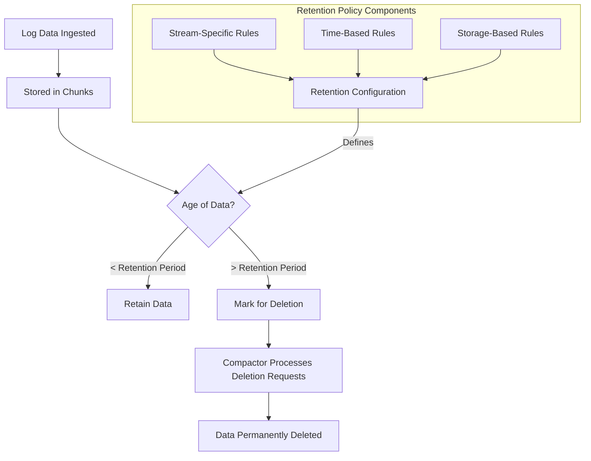

# Storage Retention Policies

## Introduction

Storage retention policies in Grafana Loki define how long log data is kept before being automatically deleted. Implementing effective retention policies is essential for:

- Managing storage costs
- Complying with data governance requirements
- Optimizing query performance
- Ensuring relevant data is available when needed

In this guide, we'll explore how Loki handles log retention, how to configure different retention strategies, and best practices for implementing retention policies that balance performance, compliance, and cost.

## Understanding Log Retention in Loki

Loki stores log data in chunks, which are collections of compressed log entries. As these chunks age, they move through different storage tiers and can eventually be deleted based on your retention configuration.

### Retention Types

Loki supports several types of retention rules:

1. **Time-based retention**: Delete data older than a specified time period
2. **Stream-based retention**: Apply different retention periods to different log streams
3. **Label-based retention**: Define retention based on log labels
4. **Storage-based retention**: Delete oldest data when storage limits are reached

## Configuring Basic Retention Policies

The simplest way to configure retention in Loki is through time-based policies in your Loki configuration file.

```yaml
limits_config:
  retention_period: 744h  # Retain logs for 31 days
```

This configuration will remove any chunks older than the specified period. The value can be specified in hours (`h`), days (`d`), or any other Go duration format.

### Retention in Multi-tenant Environments

For multi-tenant setups, you can set different retention periods for different tenants:

```yaml
limits_config:
  retention_period: 744h  # Default retention period

  per_tenant_override_config: /etc/loki/retention-overrides.yaml
  
  # Or define directly in the main config
  per_tenant_override:
    customer1:
      retention_period: 1440h  # 60 days for customer1
    customer2:
      retention_period: 168h   # 7 days for customer2
```

## Stream Selector-Based Retention

Loki supports more granular retention policies using stream selectors in the `compactor` configuration:

```yaml
compactor:
  retention_enabled: true
  retention_delete_worker_count: 150
  retention_delete_delay: 2h
  working_directory: /loki/compactor
  shared_store: s3
  compaction_interval: 10m
  retention_delete_delay: 2h
  
  retention_config:
    - discard_after: 744h   # 31 days
      selector: '{namespace="production"}'
    - discard_after: 168h   # 7 days
      selector: '{namespace="development"}'
    - discard_after: 336h   # 14 days
      selector: '{env="staging"}'
```

This configuration sets different retention periods based on the stream selectors:
- Production logs are kept for 31 days
- Development logs are kept for 7 days
- Staging logs are kept for 14 days

## Visualizing Retention Policies

A retention policy workflow can be visualized using the following diagram:



## Advanced Retention Strategies

### Implementing Storage-Based Retention

To prevent unbounded growth, you can configure storage limits:

```yaml
limits_config:
  retention_period: 744h  # Time-based retention
  retention_stream_limit_bytes: 1073741824  # 1GB per stream max
```

### Implementing Compliance-Focused Retention

For regulatory compliance, certain logs might need longer retention:

```yaml
compactor:
  retention_enabled: true
  
  retention_config:
    - discard_after: 8760h  # 1 year
      selector: '{category="audit"}'
    - discard_after: 744h   # 31 days
      selector: '{category!="audit"}'
```

## Real-World Examples

### Scenario 1: Cost-Optimized Retention

A cloud-native application might implement tiered retention to optimize costs:

```yaml
compactor:
  retention_enabled: true
  
  retention_config:
    - discard_after: 24h  # 1 day only
      selector: '{level="debug"}'
    - discard_after: 168h  # 1 week
      selector: '{level="info"}'
    - discard_after: 744h  # 31 days
      selector: '{level="warn"}'
    - discard_after: 2160h  # 90 days
      selector: '{level="error"}'
```

In this example:
- Debug logs are kept for only 24 hours
- Info logs are kept for a week
- Warning logs are retained for a month
- Error logs are saved for 90 days

### Scenario 2: Regulatory Compliance

A financial institution might configure:

```yaml
compactor:
  retention_enabled: true
  
  retention_config:
    - discard_after: 17520h  # 2 years
      selector: '{domain=~"payment|account|transaction"}'
    - discard_after: 744h    # 31 days
      selector: '{domain=~"ui|frontend"}'
```

## Implementation Best Practices

1. **Start conservative**: Begin with longer retention periods and adjust downward
2. **Monitor storage growth**: Track your storage usage over time to fine-tune policies
3. **Use log levels effectively**: Configure applications to use appropriate log levels
4. **Create logical log streams**: Group related logs to apply coherent retention policies
5. **Document your retention policies**: Create clear documentation for compliance audits

## Monitoring Your Retention Policies

Use Grafana to monitor the effectiveness of your retention policies:

```
rate({job="loki-compactor"}[5m] |= "deleted")
```

This query shows the rate of log deletion by the compactor.

## Common Pitfalls

- **Retention without compaction**: Ensure the compactor is properly configured and running
- **Overlapping rules**: If multiple rules match a stream, the longest retention period applies
- **High cardinality**: Too many unique label combinations can lead to excessive storage
- **No default rule**: Always include a catch-all rule for logs that don't match specific selectors

## Practical Exercise: Implementing Tiered Retention

Try implementing a tiered retention policy for a sample application:

1. Configure retention for different environments (dev, staging, prod)
2. Set up log level-based retention (debug, info, warn, error)
3. Create a special retention rule for security-related logs
4. Monitor the storage usage before and after implementation

## Summary

Storage retention policies are crucial for managing the lifecycle of your log data in Grafana Loki. By properly configuring retention rules based on time, stream selectors, or storage limits, you can:

- Control storage costs
- Meet compliance requirements
- Maintain system performance
- Keep relevant data accessible for analysis

Remember that the best retention policy balances your operational needs, compliance requirements, and resource constraints.

## Additional Resources

- [Loki Configuration Documentation](https://grafana.com/docs/loki/latest/configuration/)
- [Loki Retention Documentation](https://grafana.com/docs/loki/latest/operations/storage/retention/)
- [Data Governance Best Practices](https://grafana.com/blog/2021/04/05/how-to-manage-grafana-loki-log-retention/)

## Next Steps

- Learn about configuring storage backends for Loki
- Explore advanced compaction strategies
- Understand how to implement log lifecycle management across your organization