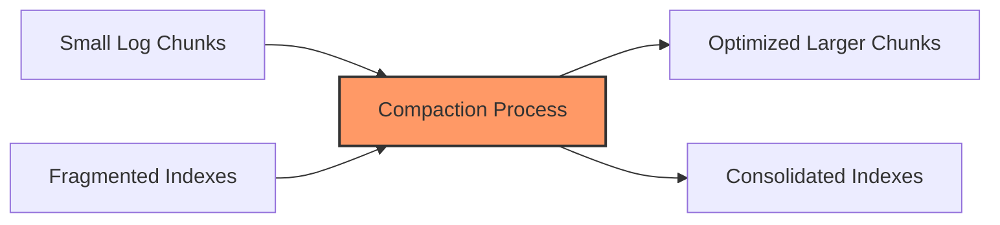

# Compaction Strategies

## Introduction

Compaction is a critical process in log storage systems like Grafana Loki that helps optimize storage usage, improve query performance, and reduce operational costs. In this guide, we'll explore what compaction is, why it's necessary, and the different strategies you can implement to maintain an efficient Loki deployment.

Log data tends to accumulate rapidly in monitoring systems. Without proper management, this can lead to storage inefficiency, slower queries, and higher costs. Compaction addresses these challenges by reorganizing and optimizing how log data is stored.

## What is Compaction?

Compaction is the process of merging multiple smaller files into larger ones, eliminating duplicate data, and organizing the data in a way that improves read efficiency. In Loki, compaction specifically refers to the consolidation of chunks and indexes to optimize storage and retrieval.



## Why Compaction Matters

Compaction provides several important benefits for a Loki deployment:

1. **Reduced Storage Costs**: By eliminating duplicates and optimizing storage formats, compaction reduces the overall storage footprint.
2. **Improved Query Performance**: Fewer, well-organized files mean faster query execution.
3. **Better Resource Utilization**: Compaction reduces the overhead of managing many small files.
4. **Optimized Retention Policies**: Makes it easier to implement and enforce data retention rules.

## Compaction Strategies in Loki

### 1. Time-Based Compaction

Time-based compaction organizes and merges chunks based on time boundaries. This is the default strategy in Loki and works well for most deployments.

#### Configuration Example

```yaml
compactor:
  working_directory: /loki/compactor
  shared_store: filesystem
  compaction_interval: 10m
  retention_enabled: true
  retention_delete_delay: 2h
  retention_delete_worker_count: 150
```

In this configuration:
- `compaction_interval` determines how frequently the compaction process runs
- `retention_enabled` activates the retention policies alongside compaction
- `retention_delete_delay` sets a safety buffer before deleting data marked for deletion

### 2. Size-Based Compaction

Size-based compaction triggers the compaction process when chunks reach a certain size threshold. This approach helps maintain consistent performance regardless of ingestion rates.

#### Configuration Example

```yaml
limits_config:
  max_chunk_age: 1h
  chunk_target_size: 1536000
  chunk_idle_period: 30m
```

Here:
- `max_chunk_age` defines the maximum time a chunk can be open before being compacted
- `chunk_target_size` specifies the target size in bytes for chunks
- `chunk_idle_period` sets how long a chunk can be idle before being closed and considered for compaction

### 3. Hybrid Compaction

Many production environments benefit from a hybrid approach that considers both time and size factors. This provides the best balance between storage efficiency and query performance.

#### Configuration Example

```yaml
compactor:
  working_directory: /loki/compactor
  compaction_interval: 10m
  retention_enabled: true

limits_config:
  max_chunk_age: 2h
  chunk_target_size: 1536000
  chunk_idle_period: 45m

schema_config:
  configs:
    - from: 2022-01-01
      store: boltdb-shipper
      object_store: filesystem
      schema: v12
      index:
        prefix: loki_index_
        period: 24h
```

This configuration combines time-based compaction settings with size thresholds for a more balanced approach.

## Implementing a Compaction Strategy

Let's walk through the process of implementing a compaction strategy for a medium-sized Loki deployment:

### Step 1: Assess Your Log Patterns

Before choosing a compaction strategy, understand your log patterns:

```javascript
// Example log volume analysis script
const hourlyVolumes = await client.query(`
  sum(rate(loki_distributor_bytes_received_total[1h])) by (tenant)
`);

// Analyze daily patterns to identify peak times
const dailyPatterns = await client.query(`
  sum(rate(loki_distributor_bytes_received_total[1d])) by (hour)
`);
```

### Step 2: Configure Basic Compaction

Start with a basic configuration that you can adjust based on observation:

```yaml
compactor:
  working_directory: /loki/compactor
  compaction_interval: 15m
  retention_enabled: true
  retention_delete_delay: 3h
  
limits_config:
  max_chunk_age: 2h
  chunk_target_size: 1048576  # 1MB
  chunk_idle_period: 30m
```

### Step 3: Monitor and Adjust

Implement metrics to track compaction effectiveness:

```javascript
// Example dashboard query to monitor compaction
const compactionMetrics = await client.query(`
  # Compaction duration
  sum(rate(loki_compactor_duration_seconds_sum[5m])) /
  sum(rate(loki_compactor_duration_seconds_count[5m]))
  
  # Compacted bytes
  sum(increase(loki_compactor_compacted_bytes_total[1h]))
`);
```

### Step 4: Iterate on Your Strategy

Based on the metrics, adjust your configuration:

```yaml
# Improved configuration after monitoring
compactor:
  working_directory: /loki/compactor
  compaction_interval: 20m  # Adjusted based on performance
  retention_enabled: true
  retention_delete_delay: 2h
  retention_delete_worker_count: 100  # Adjusted based on delete queue
  
limits_config:
  max_chunk_age: 3h  # Increased to reduce compaction frequency
  chunk_target_size: 2097152  # Increased to 2MB for better performance
  chunk_idle_period: 45m  # Increased based on log patterns
```

## Real-World Example: E-Commerce Application

Let's consider a real-world example of implementing compaction strategies for an e-commerce application:

### Scenario

- High traffic during business hours
- Periodic sales events create traffic spikes
- Different log volumes for different services
- Cost sensitivity for storage

### Solution: Custom Compaction Strategy

```yaml
compactor:
  working_directory: /loki/boltdb-shipper-compactor
  shared_store: s3
  compaction_interval: 30m
  
  # During high-volume periods, adjust the strategy
  retention_enabled: true
  retention_delete_delay: 4h
  retention_delete_worker_count: 200
  
schema_config:
  configs:
    - from: 2023-01-01
      store: boltdb-shipper
      object_store: s3
      schema: v12
      index:
        prefix: index_
        period: 24h  # Daily index rotation for easier compaction
        
storage_config:
  boltdb_shipper:
    active_index_directory: /loki/index
    cache_location: /loki/boltdb-cache
    
    # Periodic compaction schedule with boltdb-shipper
    cache_ttl: 24h
    shared_store: s3
```

### Results

- 42% reduction in storage costs
- 65% improvement in query performance for 7-day historical queries
- More consistent performance during sales events

## Common Compaction Issues and Troubleshooting

### Issue 1: Compaction Isn't Happening

If you notice compaction isn't occurring:

```bash
# Check compactor logs
kubectl logs -l app=loki -c compactor | grep "compaction"

# Verify compactor metrics
curl -s http://loki:3100/metrics | grep compactor
```

Fix: Ensure the compactor component is properly configured and has access to the storage backend.

### Issue 2: High Disk Usage Despite Compaction

If storage usage remains high despite compaction:

```yaml
# Adjust retention settings
compactor:
  retention_enabled: true
  retention_delete_delay: 1h  # Reduce delay
  retention_delete_worker_count: 200  # Increase workers
  
  # Add specific retention period
limits_config:
  retention_period: 168h  # 7 days retention
```

### Issue 3: Slow Queries After Compaction

If queries become slow after compaction:

```yaml
# Optimize chunk cache settings
chunk_store_config:
  max_look_back_period: 168h
  
query_range:
  split_queries_by_interval: 12h  # Split long queries
  
limits_config:
  max_query_parallelism: 16  # Increase parallelism
```

## Advanced Compaction Techniques

### 1. Multi-Tenant Compaction Strategies

For environments with multiple tenants or teams:

```yaml
limits_config:
  per_tenant_override_config: /etc/loki/overrides.yaml
  
# In overrides.yaml
overrides:
  tenant1:
    retention_period: 336h  # 14 days for tenant1
    chunk_target_size: 2097152
  tenant2:
    retention_period: 72h  # 3 days for tenant2
    chunk_target_size: 1048576
```

### 2. Time-Shifting Compaction

For environments with cyclical load patterns:

```yaml
compactor:
  compaction_interval: dynamic://15m,30m,1h
  compaction_window: 1h
  working_directory: /loki/compactor
  
  # Add a schedule to avoid peak hours
  schedule:
    - cron: "0 2-5 * * *"  # Run between 2-5 AM
      parallelism: 10
    - cron: "0 14-16 * * *"  # Run between 2-4 PM
      parallelism: 5
```

## Summary

Compaction strategies are essential for maintaining an efficient and cost-effective Grafana Loki deployment. By carefully selecting and tuning your compaction approach based on your specific log patterns and requirements, you can significantly improve query performance while reducing storage costs.

The key takeaways from this guide:

1. Compaction merges smaller chunks into larger ones to optimize storage and improve query efficiency
2. Different strategies (time-based, size-based, and hybrid) suit different use cases
3. Regular monitoring and adjustment are crucial for maintaining optimal performance
4. Real-world implementations should be tailored to your specific log patterns and requirements

## Exercise: Design Your Compaction Strategy

As an exercise, design a compaction strategy for one of these scenarios:

1. A high-volume microservices architecture with 50+ services
2. A security monitoring system that needs to retain logs for compliance
3. A low-volume IoT application with occasional traffic spikes

For each scenario, define:
- Compaction interval
- Chunk size and age settings
- Retention policies
- Monitoring approach

## Additional Resources

- [Grafana Loki Documentation on Compaction](https://grafana.com/docs/loki/latest/operations/storage/retention/)
- [Loki Storage Optimization Best Practices](https://grafana.com/blog/2023/02/08/how-to-optimize-grafana-loki-storage-with-compaction/)
- [Monitoring Loki Compaction Metrics](https://grafana.com/docs/loki/latest/operations/observability/)

Through proper compaction strategies, you'll be able to build a more efficient, performant, and cost-effective logging system with Grafana Loki.