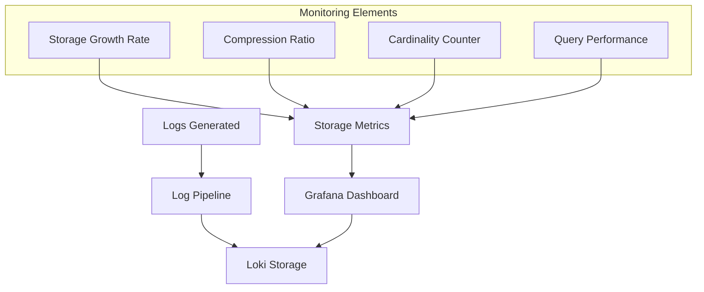

# Storage Optimization

## Introduction

Storage optimization is a critical aspect of managing Grafana Loki deployments effectively. As your logging system scales, the volume of log data can grow exponentially, potentially leading to increased storage costs and performance issues. This guide explores various strategies and best practices to optimize your Loki storage, helping you maintain system performance while keeping resource usage and costs under control.

## Why Storage Optimization Matters

Log data can accumulate rapidly in production environments. Without proper optimization:

- Storage costs can increase significantly
- Query performance may degrade
- System scalability becomes limited
- Operational overhead increases

Proper storage optimization helps you extract maximum value from your logs while minimizing resource consumption.

## Core Storage Optimization Strategies

### 1. Compression

Loki applies compression to logs before storing them, significantly reducing storage requirements.

#### Default Compression

By default, Loki uses the [Snappy](https://github.com/google/snappy) compression algorithm which provides a good balance between compression ratio and CPU usage.

```yaml
chunk_store_config:
  chunk_encoding: snappy
```

#### Compression Options

You can configure different compression algorithms based on your requirements:

| Algorithm | Compression Ratio | CPU Usage | Best For |
|-----------|-------------------|-----------|----------|
| None | 1:1 | None | Testing only |
| Snappy | ~2:1 | Low | General use (default) |
| Gzip | ~3:1 | Medium | Better compression |
| Lz4 | ~2:1 | Very low | Performance-critical |

Example configuration using Gzip compression:

```yaml
chunk_store_config:
  chunk_encoding: gzip
```

### 2. Log Volume Reduction

Before logs even reach Loki, consider strategies to reduce their volume:

#### Filtering Unnecessary Logs

Configure your logging agents (Promtail, Fluentd, etc.) to filter out unnecessary logs:

```yaml
scrape_configs:
  - job_name: system
    static_configs:
    - targets: [localhost]
      labels:
        job: varlogs
        __path__: /var/log/*.log
    pipeline_stages:
      - match:
          selector: '{job="varlogs"}'
          stages:
            - regex:
                expression: '.*DEBUG.*'
            - drop:
                source: message
                expression: '.*DEBUG.*'
```

This example filters out DEBUG log messages before they're sent to Loki.

#### Sampling High-Volume Logs

For extremely high-volume logs, consider sampling:

```yaml
pipeline_stages:
  - sampling:
      rate: 100 # Keep 1 out of every 100 log lines
```

### 3. Chunk Size and Retention Configuration

Optimizing chunk parameters can dramatically improve storage efficiency:

#### Chunk Size

Loki stores logs in "chunks." Properly sized chunks improve compression and query performance:

```yaml
limits_config:
  ingestion_rate_mb: 4
  ingestion_burst_size_mb: 6
  max_entries_limit_per_query: 5000
  max_chunk_age: 1h
  chunk_target_size: 1048576 # Target chunk size in bytes (1MB)
  chunk_idle_period: 30m
```

#### Retention Periods

Configure retention periods to automatically delete old logs:

```yaml
chunk_store_config:
  max_look_back_period: 720h # 30 days

table_manager:
  retention_deletes_enabled: true
  retention_period: 720h # 30 days
```

### 4. Cardinality Control

High cardinality is one of the biggest challenges in Loki deployments:

#### Label Optimization

Excessive labels create storage overhead. Focus on essential labels:

```yaml
scrape_configs:
  - job_name: app
    static_configs:
    - targets: [localhost]
      labels:
        app: myapp
        environment: production
        # Avoid high-cardinality labels like:
        # user_id: ${USER_ID}
        # session_id: ${SESSION_ID}
```

#### Using Log Contents vs. Labels

Store variable data in log content, not in labels:

```
# Inefficient (high cardinality)
{app="payment", user_id="12345", transaction_id="abc-123"} Transaction completed

# Efficient (low cardinality)
{app="payment"} Transaction completed for user 12345 with ID abc-123
```

## Real-World Optimization Examples

### Example 1: Production Microservices Setup

A production environment with 50 microservices optimized its Loki storage by:

1. Implementing log level filtering at the source
2. Using structured logging with consistent fields
3. Limiting labels to service name, environment, and component
4. Setting appropriate retention periods by log importance

**Configuration:**

```yaml
limits_config:
  # Critical logs - 90 days
  - selector: '{importance="critical"}'
    max_look_back_period: 2160h
  
  # Error logs - 30 days
  - selector: '{importance="error"}'
    max_look_back_period: 720h
  
  # All other logs - 7 days
  - selector: '{}'
    max_look_back_period: 168h
```

**Results:**
- 78% reduction in storage requirements
- Improved query performance
- Reduced operational costs

### Example 2: Log Compaction Strategy

An e-commerce platform implemented log compaction to maintain critical information while reducing storage:

```yaml
compactor:
  working_directory: /loki/compactor
  shared_store: s3
  compaction_interval: 10m
  retention_enabled: true
  retention_delete_delay: 2h
  retention_delete_worker_count: 150
```

Combined with a LogQL aggregation job that runs daily:

```logql
sum by (status_code, endpoint) (rate({app="api"}[24h]))
```

This strategy preserved critical metrics while reducing raw log volume.

## Monitoring Storage Usage

To optimize effectively, monitor your storage usage:



Create a monitoring dashboard with the following metrics:

1. `loki_ingester_memory_chunks`: Number of chunks in memory
2. `loki_chunk_store_index_entries_per_chunk`: Entries per chunk
3. `cortex_chunk_store_index_entries_per_chunk`: Series cardinality
4. `loki_distributor_bytes_received_total`: Total ingested bytes

## Optimization Checklist

Use this checklist to ensure you're following best practices:

- [ ] Configure appropriate compression algorithm
- [ ] Filter unnecessary logs at the source
- [ ] Limit label cardinality
- [ ] Set appropriate chunk sizes
- [ ] Configure retention policies based on log importance
- [ ] Monitor storage usage metrics
- [ ] Regularly review and optimize configurations

## Summary

Storage optimization in Grafana Loki requires a thoughtful approach to compression, log volume reduction, chunk configuration, and cardinality control. By implementing these strategies, you can maintain an effective logging system while minimizing storage costs and maximizing performance.

Remember that optimization is an ongoing process. Regularly review your storage metrics and adjust your configuration as your system evolves and grows.

## Additional Resources

- [Grafana Loki Configuration Reference](https://grafana.com/docs/loki/latest/configuration/)
- [LogQL Query Language Guide](https://grafana.com/docs/loki/latest/logql/)
- [Loki Best Practices](https://grafana.com/docs/loki/latest/best-practices/)

## Practice Exercises

1. Analyze your current log volume and identify the top 3 sources of log data
2. Create a Promtail configuration to filter out development debug logs
3. Design a label strategy that balances observability needs with cardinality concerns
4. Configure different retention periods for logs based on their importance
5. Create a Grafana dashboard to monitor your Loki storage metrics