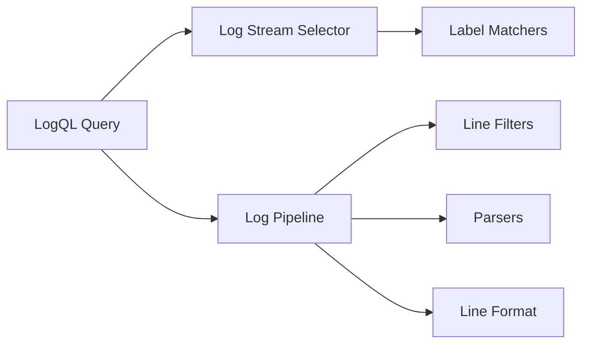

# LogQL Introduction

## What is LogQL?

LogQL (Log Query Language) is Grafana Loki's query language. It's designed specifically for querying and filtering log data stored within Loki. If you're familiar with Prometheus' PromQL, you'll notice many similarities, as LogQL was inspired by it but adapted for working with logs rather than metrics.

LogQL allows you to:
- Filter logs based on their labels and content
- Extract metrics from your logs
- Perform operations on those metrics
- Create powerful visualizations in Grafana dashboards

## LogQL Structure

LogQL queries typically consist of two parts:

1. **Log Stream Selector** - Selects the log streams to query
2. **Log Pipeline** (optional) - Filters, processes, and formats the selected logs



Let's break down these components:

### Log Stream Selector

The log stream selector uses **label matchers** to select log streams. Label matchers are enclosed in curly braces `{}` and can include one or more key-value pairs:

```
{app="frontend", environment="production"}
```

This selects all logs from the application labeled "frontend" in the "production" environment.

#### Basic Label Matching Operations

| Operator | Description                 | Example                |
|----------|-----------------------------|------------------------|
| `=`      | Exactly equal               | `{app="api"}`          |
| `!=`     | Not equal                   | `{app!="api"}`         |
| `=~`     | Regex match                 | `{app=~"front.*"}`     |
| `!~`     | Regex not match             | `{app!~"test.*"}`      |

### Log Pipeline

The log pipeline comes after the stream selector and consists of one or more **pipeline expressions**, each preceded by a pipe character `|`. These expressions filter and process the logs further.

#### Line Filters

Line filters keep only logs that contain or don't contain specific text:

```
{app="frontend"} |= "error"
```

This returns only logs from the "frontend" app that contain the word "error".

Common line filter operators:

| Operator | Description                | Example                      |
|----------|----------------------------|------------------------------|
| `|=`     | Log line contains string   | `|= "error"`                 |
| `!=`     | Log line doesn't contain   | `!= "debug"`                 |
| `|~`     | Log line matches regex     | `|~ "error.*timeout"`        |
| `!~`     | Log line doesn't match     | `!~ "200 OK"`                |

## Basic LogQL Examples

Let's explore some basic LogQL queries:

### Example 1: Simple Label Selection

```
{app="frontend"}
```

**What it does**: Returns all logs from the application labeled "frontend".

### Example 2: Multiple Label Selection

```
{app="frontend", environment="production"}
```

**What it does**: Returns logs from the frontend application in the production environment.

### Example 3: Basic Line Filtering

```
{app="frontend"} |= "error"
```

**What it does**: Returns only logs from the frontend that contain the word "error".

### Example 4: Combining Multiple Filters

```
{app="frontend"} |= "error" != "timeout"
```

**What it does**: Returns logs from the frontend that contain "error" but do not contain "timeout".

### Example 5: Using Regular Expressions

```
{app=~"front.*"} |~ "error.*timeout"
```

**What it does**: Returns logs from any app with a name starting with "front" that contain text matching the regex "error.*timeout".

## Practical Real-World Applications

Let's look at some practical applications of LogQL in real-world scenarios:

### Troubleshooting Application Errors

Imagine you're investigating a spike in errors in your production environment:

```
{app="payment-service", environment="production"} 
|= "error" 
|~ "transaction failed|payment rejected" 
```

This query helps you find all error logs from the payment service in production that mention transaction failures or payment rejections.

### Monitoring HTTP Status Codes

To monitor for HTTP 5xx errors across your web services:

```
{app=~".*-api", component="http"} 
|~ "status=(5\\d{2})" 
```

This would match logs from any API service where HTTP status codes in the 500 range are recorded.

### Tracking User Activity

To track a specific user's activity across your system:

```
{environment="production"} 
|= "user_id=12345" 
| json
| line_format "{{.timestamp}} - {{.action}} - {{.status}}"
```

This query finds all logs mentioning a specific user ID, parses them as JSON, and formats the output to show just the timestamp, action, and status.

## Advanced Features Preview

As you become more comfortable with LogQL, you'll want to explore more advanced features:

- **JSON and Logfmt parsing**: Extract structured data from your logs
- **Labels extraction**: Create new labels from log content
- **Aggregation operators**: Perform calculations on your log data
- **Range vectors**: Query logs over specific time intervals
- **Functions**: Apply mathematical functions to your log data

Here's a quick example of parsing JSON logs:

```
{app="user-service"} 
| json 
| status_code=500
```

This query:
1. Selects logs from the user-service
2. Parses them as JSON
3. Filters for entries where the JSON field "status_code" equals 500

## Summary

In this introduction to LogQL, we've covered:

- What LogQL is and its basic structure
- How to select log streams using label matchers
- How to filter logs using line filters
- Basic examples of LogQL queries
- Practical real-world applications

LogQL is a powerful tool for exploring, filtering, and analyzing your logs in Grafana Loki. As you continue your learning journey, you'll discover more advanced features that will help you extract even more value from your log data.

## Next Steps

Now that you understand the basics of LogQL, you can:

1. Practice writing simple queries to filter your logs
2. Learn about log parsers to extract structured data from logs
3. Explore metric queries to generate metrics from your logs
4. Create visualizations in Grafana using your LogQL queries

## Additional Resources

- Official Grafana Loki Documentation
- LogQL Cheat Sheet
- Community Forums and Examples