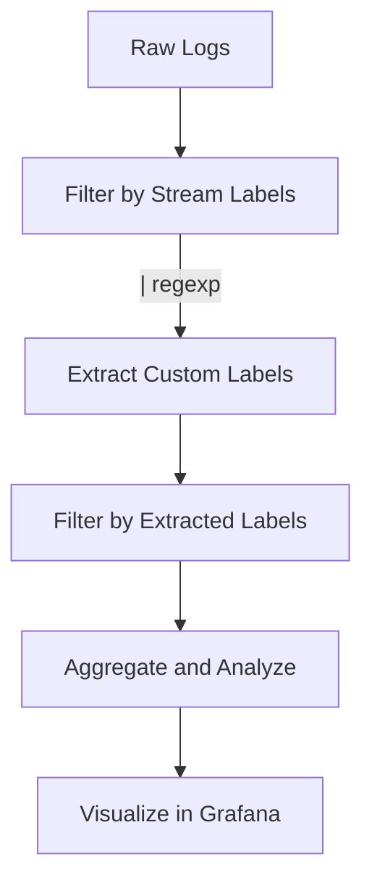

# Labels Extraction in LogQL

## Introduction

When working with Grafana Loki, one of the most powerful features is the ability to extract information from your logs and convert it into **labels**. Labels in Loki are key-value pairs that help identify and categorize log streams. While Loki comes with some built-in labels (like `filename`, `job`, or `namespace`), Labels Extraction allows you to create custom labels derived from the content of your logs.

In this guide, we'll explore how to extract labels from log data using LogQL - Loki's query language. You'll learn how to transform unstructured log data into structured, queryable information that can help you gain deeper insights from your logs.

## Understanding Labels Extraction

Labels Extraction is the process of parsing log lines to extract specific values and convert them into labels that can be used for filtering, grouping, and analysis. This creates a more powerful and flexible way to work with your logs.

### Why Extract Labels?

1. **Improved filtering**: Extract specific values to filter logs more precisely
2. **Better organization**: Group related logs together based on extracted values
3. **Enhanced metrics**: Generate metrics based on extracted labels
4. **Dynamic dashboards**: Create dynamic Grafana dashboards using extracted labels

## Basic Label Extraction Syntax

LogQL provides several operators for extracting labels from log content. The most commonly used ones are:

### The `|=` Operator (Line Filter)

Before extraction, you often need to filter your logs to find relevant entries:

```logql
{app="myapp"} |= "error"
```

This filters logs from the application "myapp" that contain the word "error".

### The `|` Pipe Operator

The pipe operator (`|`) is used to apply processing operations to log lines:

```logql
{app="myapp"} | <extraction_operation>
```

### The `| label_format` Method

The `label_format` method allows you to create new labels from existing ones:

```logql
{app="myapp"} | label_format new_label=original_label
```

### The `| regexp` Extractor

The regexp extractor is one of the most powerful ways to extract labels:

```logql
{app="myapp"} | regexp `pattern`
```

## Extracting Labels with Regular Expressions

The most flexible way to extract labels is using regular expressions with the `| regexp` command.

### Basic Syntax

```logql
{app="myapp"} | regexp `(?P<label_name>pattern)`
```

The `?P<label_name>` syntax creates a named capture group, and any text that matches the pattern becomes the value of the new label.

### Example: Extracting HTTP Status Codes

Let's imagine we have access logs with lines like:

```
192.168.1.1 - - [25/Sep/2023:12:31:08 +0000] "GET /api/users HTTP/1.1" 200 1234
```

To extract the HTTP status code as a label:

```logql
{app="nginx"} | regexp `"(GET|POST|PUT|DELETE) (?P<endpoint>[^ ]*) [^"]*" (?P<status>[0-9]{3})`
```

This creates two new labels:
- `endpoint` with value `/api/users`
- `status` with value `200`

You can now filter or aggregate by these labels:

```logql
{app="nginx"} | regexp `"(GET|POST|PUT|DELETE) (?P<endpoint>[^ ]*) [^"]*" (?P<status>[0-9]{3})` | status="500"
```

This would only show logs with status code 500.

## Working with JSON Logs

If your application outputs logs in JSON format, Loki provides specialized extractors to make working with them easier.

### The `| json` Extractor

The `json` extractor automatically parses JSON logs and extracts fields as labels:

```logql
{app="myapp"} | json
```

This will extract all top-level fields from JSON logs as labels.

### Selecting Specific Fields

You can specify which fields to extract:

```logql
{app="myapp"} | json user_id, error_code
```

This only extracts the `user_id` and `error_code` fields as labels.

### Nested Fields

For nested JSON structures, use dot notation:

```logql
{app="myapp"} | json user.id, error.details.code
```

### Example: JSON Extraction

If your application produces logs like:

```json
{"timestamp":"2023-09-25T12:31:08Z","level":"error","message":"Payment failed","user":{"id":"user123","name":"John Doe"},"error":{"code":4002,"description":"Insufficient funds"}}
```

You can extract specific fields:

```logql
{app="payment-service"} | json user.id, error.code
```

This creates two labels:
- `user_id` with value `user123`
- `error_code` with value `4002`

## The `| logfmt` Extractor

For logs in logfmt format (key=value pairs), use the `logfmt` extractor:

```logql
{app="myapp"} | logfmt
```

### Example: Logfmt Extraction

If your log line looks like:

```
time=2023-09-25T12:31:08Z level=info msg="User logged in" user_id=user123 session_id=abc456
```

You can extract fields with:

```logql
{app="auth-service"} | logfmt
```

Or select specific fields:

```logql
{app="auth-service"} | logfmt user_id, session_id
```

## Pattern-Based Label Extraction

For simpler extraction tasks, you can use the `| pattern` operator which uses a template with wildcards to match and extract values.

### Basic Syntax

```logql
{app="myapp"} | pattern `<pattern with wildcards>`
```

### Example: Using Pattern

If your log line is:

```
INFO [2023-09-25 12:31:08] User user123 logged in from 192.168.1.100
```

You can extract the user ID and IP address with:

```logql
{app="auth-service"} | pattern `INFO * User <user_id> logged in from <ip_address>`
```

This creates two labels:
- `user_id` with value `user123`
- `ip_address` with value `192.168.1.100`

The `*` wildcard matches any text without capturing it, while text in `<>` creates a new label.

## Transforming Labels

After extraction, you can transform labels to create new ones.

### Using `| label_format`

```logql
{app="myapp"} 
| regexp `(?P<status_code>[0-9]{3})` 
| label_format status_category=
    {{if eq .status_code "200"}}success{{else if match .status_code "^[45].*"}}error{{else}}other{{end}}
```

This creates a new `status_category` label with values like "success" or "error" based on the status code.

## Real-World Use Cases

### Monitoring HTTP Error Rates

Extract status codes and create a rate of 5XX errors:

```logql
sum by (service) (
  rate({app="web"} | regexp `" (GET|POST) [^ ]+ [^ ]+ (?P<status>[0-9]{3})"`
  | status=~"5.." [1m])
)
```

### User Activity Tracking

Extract user IDs and track their activity:

```logql
{app="user-service"} 
| json user.id, action 
| user_id!="" 
| count_over_time[1h] by (user_id, action)
```

### Error Analysis

Extract error types and group them:

```logql
{app="backend"} 
| json error.type, error.module 
| error_type!="" 
| count by (error_type, error_module)
```

## Best Practices

1. **Be selective**: Only extract labels you need, as each label increases index size
2. **Use specific queries**: Filter logs before extraction when possible
3. **Test regular expressions**: Verify regexp patterns with sample logs
4. **Consider cardinality**: Avoid extracting high-cardinality values (like unique IDs) as labels
5. **Use appropriate extractors**: Choose JSON, logfmt, or regexp based on your log format

## Putting It All Together

Let's walk through a complete example of labels extraction and usage:



### Complete Example:

For a microservice architecture with logs like:

```
2023-09-25T12:31:08Z INFO [order-service] User user123 placed order ord456 with total $59.99
```

We can:

1. **Filter the logs:**
```logql
{service="backend"} |= "placed order"
```

2. **Extract labels:**
```logql
{service="backend"} |= "placed order" 
| regexp `User (?P<user_id>[^ ]+) placed order (?P<order_id>[^ ]+) with total \$(?P<amount>[0-9.]+)`
```

3. **Filter by extracted labels:**
```logql
{service="backend"} |= "placed order" 
| regexp `User (?P<user_id>[^ ]+) placed order (?P<order_id>[^ ]+) with total \$(?P<amount>[0-9.]+)`
| amount > "50"
```

4. **Analyze activity patterns:**
```logql
sum by (user_id) (
  count_over_time(
    {service="backend"} |= "placed order" 
    | regexp `User (?P<user_id>[^ ]+) placed order (?P<order_id>[^ ]+) with total \$(?P<amount>[0-9.]+)`
    [24h]
  )
)
```

This gives you the number of orders per user in the last 24 hours.

## Summary

Labels Extraction is a powerful feature in LogQL that transforms unstructured log data into structured, queryable information. By extracting meaningful data from your logs as labels, you can:

- Filter and search your logs more effectively
- Create metrics from log data
- Build detailed visualizations
- Gain deeper insights into your application behavior

The main extraction methods include:
- Regular expressions (`regexp`)
- JSON parsing (`json`)
- Logfmt parsing (`logfmt`) 
- Pattern matching (`pattern`)

Remember to consider cardinality and performance when designing your label extraction strategies.

## Exercises

1. Extract a `request_path` label from logs containing URLs like `/api/users/123/profile`
2. Create a query that extracts error codes and counts occurrences by type
3. Extract `method`, `endpoint`, and `latency_ms` from HTTP logs and find the slowest endpoints
4. Parse JSON logs to extract user information and action performed

## Additional Resources

- [Grafana Loki Documentation](https://grafana.com/docs/loki/latest/)
- [LogQL Query Language Reference](https://grafana.com/docs/loki/latest/logql/)
- [Regular Expression Testing Tools](https://regex101.com/)
- [Loki Label Best Practices](https://grafana.com/docs/loki/latest/best-practices/)