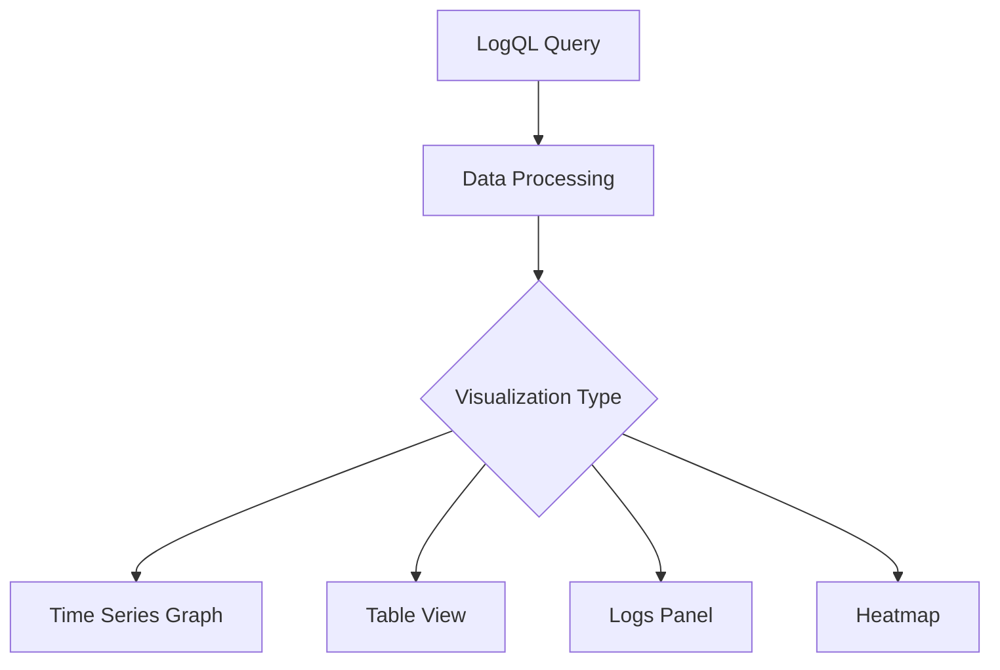

# Advanced LogQL Queries

## Introduction

LogQL is Grafana Loki's query language, designed to help you efficiently extract, filter, and analyze log data. While basic LogQL queries can help you find simple patterns, advanced LogQL techniques enable you to perform complex analyses, extract specific data points, and transform your logs into actionable insights.

In this guide, we'll explore advanced LogQL techniques that will take your log querying skills to the next level. We'll build on the fundamentals and dive into powerful features like regular expressions, parsing, line formats, unwrapped ranges, and more sophisticated filtering methods.

## Prerequisites

Before diving into advanced LogQL queries, you should:
- Have a basic understanding of LogQL syntax
- Be familiar with log labels and filtering
- Have access to a Grafana Loki instance

## Advanced Log Filtering Techniques

### Using Regular Expressions

Regular expressions (regex) provide powerful pattern matching capabilities in LogQL queries.

```
{app="frontend"} |~ "error.*timeout"
```

This query finds all logs from the frontend application containing words that start with "error" and are followed by "timeout".

Key regex operators:
- `|~`: Match using regex
- `!~`: Does not match regex
- `|=`: Simple string match (faster than regex)
- `!=`: Does not contain string

Example of complex regex pattern:

```
{job="api"} |~ "failed with status code [45][0-9]{2}"
```

This matches logs containing "failed with status code" followed by any HTTP error code (4xx or 5xx).

### Combining Multiple Filters

You can chain multiple filter expressions to create precise queries:

```
{app="payment-service"}
  |~ "transaction"
  |~ "user_id=\\w+"
  != "health_check"
```

This query finds logs that:
1. Come from the payment-service
2. Contain the word "transaction" 
3. Have a user_id pattern
4. Do not contain "health_check"

## Log Parsing and Extraction

### Using the `parse` Operator

The `parse` operator extracts fields from your log lines using patterns:

```
{app="auth-service"} 
| parse "method=* status=* duration=*ms" as method, status, duration
```

This extracts three fields (method, status, duration) from logs containing those patterns.

Let's see a more complete example:

```
{app="auth-service"} 
| parse "method=* status=* duration=*ms" as method, status, duration
| status=~"5.." 
| duration > 100
```

This query:
1. Extracts the method, status, and duration fields
2. Filters for 5xx status codes
3. Shows only requests with duration over 100ms

### JSON Parsing

For logs in JSON format, LogQL provides specialized operators:

```
{app="orders"} 
| json 
| order_total > 1000
```

This parses JSON logs and filters orders with a total greater than 1000.

You can also extract nested fields:

```
{app="orders"} 
| json order_details.customer_info.location as customer_location
| customer_location="New York"
```

This extracts the nested customer location field and filters for New York customers.

## Advanced Aggregations and Calculations

### Rate Calculations

Calculating the rate of log occurrences:

```
rate({app="api"} |= "error" [5m])
```

This shows the rate of error logs over 5-minute windows.

### Counting by Label

Count logs grouped by status code:

```
count_over_time({app="web"} | parse 'status=*' as status [5m]) by (status)
```

This counts logs by status code over 5-minute intervals.

### Complex Math Operations

Perform calculations on extracted metrics:

```
sum by (service) (
  rate({env="production"} | parse 'latency=*ms' as latency | unwrap latency [5m])
)
```

This calculates the sum of latencies across different services in the production environment.

## Unwrap Range Operator

The unwrap range operator extracts numeric values and treats them as sample data:

```
{app="payment"} 
| parse "processing_time=*ms" as processing_time 
| unwrap processing_time
```

This extracts processing times as numeric values.

You can then apply aggregation functions:

```
{app="payment"} 
| parse "processing_time=*ms" as processing_time 
| unwrap processing_time
| by (container)
| max without (container)
```

This finds the maximum processing time for each container.

## Line Formats

The `line_format` operator lets you reformat log lines based on extracted fields:

```
{app="auth"} 
| parse "user=* action=*" as user, action
| line_format "User '{{.user}}' performed action '{{.action}}'"
```

This reformats logs to a more readable format highlighting user and action.

## Working with Timestamps

Extract and filter based on timestamp fields within logs:

```
{app="batch-processor"} 
| parse 'started_at="*"' as started_at
| started_at > "2023-08-01T00:00:00Z"
```

This filters batch processes that started after August 1, 2023.

## Real-World Examples

### Identifying Failed Login Attempts

```
{app="auth-service"} 
| json 
| status="failed" 
| line_format "Failed login for user '{{.username}}' from IP '{{.ip_address}}' at {{.timestamp}}"
```

### Tracking System Performance Degradation

```
{app="backend"} 
| parse 'response_time=*ms' as response_time 
| unwrap response_time 
| by (endpoint)
| quantile_over_time(0.95, [1h])
```

This tracks the 95th percentile response time for each endpoint over 1-hour intervals.

### Troubleshooting Error Patterns

```
{app="web-server", env="production"} 
|= "Error"
| pattern `<_> Error: <message>`
| pattern `<_> file <file>:<line>`
| count by (message, file)
| top 10
```

This query:
1. Finds production error logs
2. Extracts error messages and file locations
3. Counts occurrences by message and file
4. Shows the top 10 most frequent errors

## Visualizing LogQL Results

LogQL queries can be visualized in Grafana dashboards:



For time series data, use unwrapped values:

```
{app="api"} 
| parse "duration=*ms" as duration 
| unwrap duration
```

For tables, use formatted lines:

```
{app="api"} 
| parse "method=* path=* status=* duration=*ms" as method, path, status, duration
| line_format "{{.method}} {{.path}} {{.status}} {{.duration}}"
```

## Performance Optimization Tips

1. **Use Label Filters First**: Always filter by labels before using pattern matching:
   ```
   # Good
   {app="auth", env="prod"} |= "error"
   
   # Less efficient
   {app="auth"} |= "error" | env="prod"
   ```

2. **Limit Time Ranges**: Keep your query time range as narrow as possible
   ```
   {app="api"} |= "error" [1h]
   ```

3. **Use String Matching Before Regex**: String matching (`|=`) is faster than regex matching (`|~`)
   ```
   # More efficient
   {app="auth"} |= "password" |~ "invalid.*format"
   
   # Less efficient
   {app="auth"} |~ "password.*invalid.*format"
   ```

4. **Be Specific with Label Queries**: More specific label queries reduce the amount of data processed
   ```
   # Good
   {app="auth", component="login", env="prod"}
   
   # Less efficient
   {app="auth"}
   ```

## Summary

Advanced LogQL queries give you powerful tools to extract meaningful insights from your log data. We've covered:

- Complex filtering with regex and multiple conditions
- Data extraction using parse and JSON operators
- Aggregations and calculations
- Unwrapping numeric values
- Line formatting
- Real-world applications

By combining these techniques, you can transform raw logs into actionable insights, troubleshoot issues more effectively, and build comprehensive monitoring dashboards.

## Further Resources

- Practice creating advanced queries with different filtering and parsing techniques
- Experiment with building Grafana dashboards using your LogQL queries
- Try combining metrics and logs in the same dashboard for comprehensive monitoring

## Exercises

1. Write a LogQL query that extracts and counts HTTP status codes from nginx logs
2. Create a query to find the top 5 users experiencing errors in your application
3. Build a query that shows the 99th percentile of response times by endpoint
4. Design a query that alerts when error rates exceed normal levels