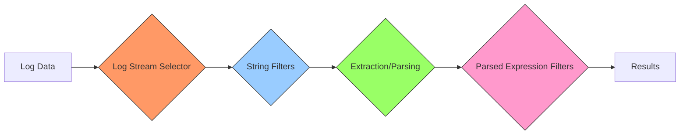

# Filter Expressions in LogQL

## Introduction

Filter expressions are a fundamental component of LogQL (Loki Query Language) that allow you to narrow down and retrieve specific log entries from your log data. When working with Grafana Loki, efficient filtering is essential for managing the potentially vast amounts of log data and finding exactly what you need.

In this guide, we'll explore how filter expressions work in LogQL, how to create them, and how to leverage them to build powerful log queries.

## What are Filter Expressions?

Filter expressions in LogQL are conditions that determine which log entries should be included in your query results. They act as criteria that each log entry must satisfy to be returned in the query response.

A basic LogQL query follows this pattern:

```
{<log stream selector>} [<filter expression>]
```

Where:
- `{<log stream selector>}` identifies the streams to query
- `[<filter expression>]` (optional) filters the logs from these streams

## Basic Filter Expressions

### String Matching

The simplest filter expressions match log lines containing specific text:

```
{app="frontend"} |= "error"
```

This query returns all logs from the `frontend` application that contain the word "error".

LogQL supports several string matching operators:

| Operator | Description                                | Example                                                                        |
|----------|--------------------------------------------|--------------------------------------------------------------------------------|
| `        | =`                                         | Log line contains string            \| `{app="frontend"} \|= "error"`          |
| `!=`     | Log line does not contain string           | `{app="frontend"} != "debug"`                                                  |
| `        | ~`                                         | Log line matches regular expression \| `{app="frontend"} \|~ "error.*timeout"` |
| `!~`     | Log line does not match regular expression | `{app="frontend"} !~ "2[0-9]{2}"`                                              |

Let's see examples of each:

```
# Match log lines containing "error" in the "frontend" service
{app="frontend"} |= "error"

# Match log lines that don't contain "successful" in the "payment" service
{app="payment"} != "successful"

# Match log lines containing errors with status codes (using regex)
{app="api"} |~ "error.*status: [45][0-9]{2}"

# Exclude all 2xx status codes from results
{app="api"} !~ "status: 2[0-9]{2}"
```

### Case Sensitivity

By default, string matching in LogQL is case-sensitive. To perform case-insensitive matching, you can use the `(?i)` flag with regex operators:

```
{app="frontend"} |~ "(?i)error"
```

This query matches "error", "Error", "ERROR", etc.

## Chaining Filter Expressions

You can combine multiple filter expressions to create more specific queries:

```
{app="frontend"} |= "error" != "timeout" |~ "user_id: [0-9]+"
```

This query:
1. Selects logs from the `frontend` application
2. Includes only lines containing "error"
3. Excludes lines containing "timeout"
4. Further filters to include only lines with a user ID (matches the regex pattern)

Filters are applied in sequence, with each filter operating on the results of the previous one, creating a pipeline of filtering operations.

## Using Parentheses for Grouping

LogQL 2.0+ supports parentheses for grouping filter expressions:

```
{app="frontend"} |= "error" |= "authentication" or |= "authorization"
```

This is equivalent to:

```
{app="frontend"} |= "error" (|= "authentication" or |= "authorization")
```

Both queries find logs containing "error" AND either "authentication" OR "authorization".

## Advanced Filter Expressions

### Parsing and Filtering JSON

Many applications output logs in JSON format. LogQL can parse and filter based on JSON fields:

```
{app="api"} | json | status_code >= 400
```

This query:
1. Selects logs from the `api` application
2. Parses the log lines as JSON
3. Filters for entries where `status_code` is greater than or equal to 400

### Regular Expression Named Captures

You can extract and filter on parts of log lines using regex named captures:

```
{app="frontend"} |~ "user_id=(?P<user_id>[0-9]+)" | user_id = "12345"
```

This query:
1. Selects logs from the `frontend` application
2. Uses regex to extract the `user_id` field
3. Filters for logs where `user_id` equals "12345"

## Real-World Examples

### Troubleshooting HTTP Errors

When investigating HTTP errors in a web application:

```
{app="web", env="production"} |= "status code" |~ "status code: [45][0-9]{2}" 
| regexp "status code: (?P<status>[0-9]+)" 
| status >= 500
```

This query finds all production HTTP 5xx server errors by:
1. Selecting logs from the production web application
2. Finding lines containing "status code"
3. Further filtering for status codes starting with 4 or 5
4. Extracting the actual status code
5. Filtering for codes 500 and above (server errors)

### Analyzing Authentication Failures

To identify authentication issues:

```
{app="auth-service"} |= "login" |= "failed" != "rate limit"
| json
| user_agent =~ "Mobile.*"
| count_over_time[1h] > 10
```

This query:
1. Selects logs from the authentication service
2. Finds failed logins (excluding rate limiting events)
3. Parses the JSON log
4. Filters for mobile user agents
5. Counts instances over a 1-hour window, showing only those with more than 10 failures

### Monitoring Application Performance

To analyze slow database operations:

```
{app="database"} |= "query" |= "execution time" 
| regexp "execution time: (?P<exec_time>[0-9.]+)ms" 
| exec_time > 100 
| sort_by exec_time desc
```

This query:
1. Selects database logs
2. Finds query execution time entries
3. Extracts the execution time in milliseconds
4. Filters for slow queries (>100ms)
5. Sorts by execution time (slowest first)

## Filter Optimization Tips

Optimizing your filter expressions is crucial for performance:

1. **Start with strict log stream selectors**: The more specific your log stream selection (`{app="frontend"}`), the fewer logs Loki needs to process.

2. **Apply high-cardinality filters first**: Put filters that exclude the most logs at the beginning of your query.

3. **Use line filters before extractions**: Apply `|=`, `!=`, `|~`, and `!~` operators before using `json`, `logfmt`, or `regexp` parsers.

4. **Use appropriate regex patterns**: Optimize regular expressions to match efficiently.



## Summary

Filter expressions are powerful tools in LogQL that enable you to precisely target the log data you need. By mastering string matching, regex patterns, and extraction techniques, you can build sophisticated queries to troubleshoot issues, monitor applications, and gain insights from your logs.

Remember these key points:
- Start with log stream selectors to narrow down the data source
- Use string matching operators (`|=`, `!=`, `|~`, `!~`) for basic filtering
- Chain multiple filters to refine your results
- Extract structured data using parsers like `json`, `logfmt`, or `regexp`
- Apply filters on extracted fields for precise targeting

## Additional Resources and Exercises

### Exercises

1. Write a filter expression to find all logs containing "error" but not "timeout" from a service called "payment-processor".

2. Create a query that extracts and filters on the status code from logs matching this format: `INFO Request completed with status=200 in 45ms`.

3. Write a query to find the top 10 slowest API calls in the last hour, assuming logs contain the pattern `processing time: 123ms`.

### Further Learning

- Explore the [Grafana Loki documentation](https://grafana.com/docs/loki/latest/logql/) for the latest LogQL features
- Practice creating dashboards that utilize your LogQL queries
- Learn about metric queries in LogQL to extract numerical data from logs