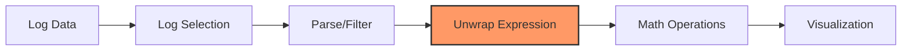

# Unwrap Expressions

## Introduction

In Grafana Loki, the primary purpose is to store and query logs. However, sometimes your logs contain valuable numeric data that you might want to analyze as metrics. This is where **unwrap expressions** come into play.

Unwrap expressions allow you to extract numeric values from your logs and perform calculations on them, effectively turning your logs into metrics. This powerful feature bridges the gap between logs and metrics, enabling you to visualize log data as time series and apply mathematical operations to extracted values.

## What Are Unwrap Expressions?

An unwrap expression extracts a numeric value from log lines and creates an instant vector where the timestamp is the timestamp of the log line and the value is the extracted numeric value.

The basic syntax of an unwrap expression is:

```
rate(unwrap <metric_identifier> [| <label_extraction>] [range])
```

where:
- `unwrap` is the keyword that triggers the extraction
- `<metric_identifier>` is the field or pattern containing the numeric value
- `<label_extraction>` is an optional label extraction or formatting
- `range` is the time range over which to perform the calculation

## Basic Usage of Unwrap Expressions

### Extracting Numeric Values from JSON Logs

Let's say you have JSON logs that include a `duration_ms` field representing API call durations:

```json
{"time":"2023-01-20T12:34:56Z", "level":"info", "message":"API call completed", "endpoint":"/users", "duration_ms":127.5}
```

To extract and analyze the `duration_ms` value:

```
rate(unwrap duration_ms[1m])
```

This query:
1. Extracts the numeric value from the `duration_ms` field
2. Calculates the rate of change over a 1-minute window

### Extracting Values from Text Logs

For non-JSON logs, you can use a regular expression with a capturing group:

```
rate(unwrap `request_time=([0-9.]+)` [1m])
```

This extracts numbers that come after `request_time=` in your logs.

## Advanced Unwrap Usage

### Label Formatting

You can add or modify labels before unwrapping:

```
rate(unwrap duration_ms | label_format instance="{{ instance }}_api" [1m])
```

This formats the `instance` label before performing the unwrap operation.

### Using with Log Pipelines

Unwrap expressions can be combined with log processing pipelines:

```
{app="payment-service"}
| json
| duration_ms > 100
| unwrap duration_ms
```

This:
1. Selects logs from the payment service
2. Parses JSON
3. Filters for durations greater than 100ms
4. Unwraps the duration value

### Aggregations with Unwrapped Values

You can aggregate the unwrapped values using various functions:

```
sum by (endpoint) (rate(unwrap duration_ms[5m]))
```

This calculates the sum of all duration rates grouped by the endpoint.

## Real-World Examples

### Example 1: Monitoring API Response Times

Let's say you want to monitor the 95th percentile response time for your API:

```
quantile_over_time(0.95, unwrap duration_ms[10m])
```

This gives you the 95th percentile of duration values over a 10-minute window.

### Example 2: Calculating Error Rates

If your logs include error codes:

```
sum(rate(unwrap error_count | error_code=500 [5m])) / sum(rate(unwrap request_count [5m]))
```

This calculates the percentage of 500 errors compared to total requests.

### Example 3: Memory Usage Tracking

For logs that contain memory usage information:

```
max by (instance) (unwrap memory_mb | memory_type="heap" [1h])
```

This tracks the maximum heap memory usage per instance over an hour.

## Unwrap Operations Workflow



## Common Pitfalls and Solutions

### Non-Numeric Values

If your field sometimes contains non-numeric values, they will be ignored. Make sure your filters properly select log lines with valid numeric values.

```
{app="payment-service"}
| json
| duration_ms != "N/A"
| unwrap duration_ms
```

### Missing Data Points

Unwrap expressions only create data points for log lines that contain the specified field. If you have sparse logs, your resulting metrics might have gaps.

Use aggregation windows to smooth out the data:

```
avg_over_time(unwrap duration_ms[5m])
```

### Performance Considerations

Unwrapping operations on large volumes of logs can be resource-intensive. Consider:

1. Adding specific label filters to reduce the log volume before unwrapping
2. Using larger time windows for rate calculations on high-volume logs

## Practical Exercise: Analyzing Service Performance

Let's build a complete query to analyze service performance from logs:

```
sum by (service, endpoint) (
  rate(
    {env="production"}
    | json
    | service=~"api-.*"
    | unwrap duration_ms
    [5m]
  )
)
```

This query:
1. Selects logs from production environment
2. Parses them as JSON
3. Filters for API services
4. Extracts duration values
5. Calculates the rate over 5 minutes
6. Sums the values grouped by service and endpoint

## Summary

Unwrap expressions are a powerful feature in LogQL that bridge the gap between logs and metrics. They allow you to:

- Extract numeric values from log entries
- Transform log data into time series metrics
- Perform calculations and aggregations on these metrics
- Combine log filtering with metric analysis

By mastering unwrap expressions, you can derive valuable insights from your logs without needing to implement separate metrics collection.

## Additional Resources

- Practice using unwrap expressions with different aggregation functions (sum, avg, max)
- Try combining unwrap with different label manipulations
- Experiment with extracting different types of values from your logs

## Exercise

Create an unwrap expression to extract and analyze the 99th percentile of API latency from the following log format:

```
2023-02-15T14:22:34Z INFO Request path=/api/users method=GET status=200 latency_ms=45.2 user_id=1001
```

<details>
<summary>Solution</summary>

```
quantile_over_time(0.99,
  {app="api-server"}
  | pattern `<_> <_> Request path=<path> method=<method> status=<status> latency_ms=<latency> user_id=<user_id>`
  | unwrap latency
  [10m]
)
```
</details>