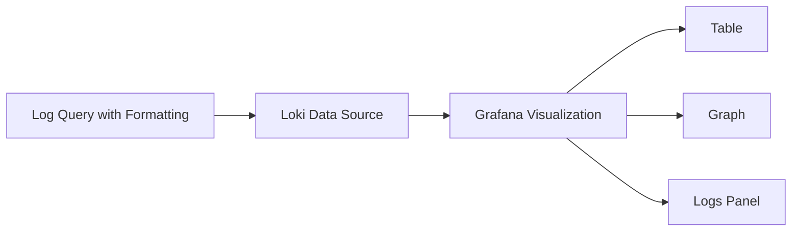

# Formatting Expressions

## Introduction

Formatting expressions in LogQL allow you to customize how your log data is presented and processed in Grafana Loki. As you work with log data, you'll often need to transform, combine, or reformat values to make them more useful for visualization or analysis. Formatting expressions give you the tools to perform these transformations directly within your queries.

In this guide, we'll explore how to use formatting expressions in LogQL to manipulate your query results and make your log data more meaningful and actionable.

## Understanding Formatting Expressions

Formatting expressions in LogQL allow you to:

1. Combine multiple log fields into a single value
2. Apply string operations to log fields
3. Format numerical values
4. Create complex transformations using template expressions

These expressions are particularly useful when creating metrics from logs or when you need to present log data in a specific format for visualization.

## Basic Syntax

The basic syntax for formatting expressions in LogQL uses the pipe (`|`) operator followed by formatting functions:

```logql
{job="nginx"} | pattern `<pattern>` | format <expression>
```

## Common Formatting Functions

### `format` Function

The `format` function is the primary way to create new values from existing log fields.

#### Example 1: Simple Field Concatenation

```logql
{job="webserver"} 
| pattern `<ip> - - <_> "<method> <path> <_>" <status> <size>` 
| format "Request: {{.method}} {{.path}} (Status: {{.status}})"
```

**Output:**
```
Request: GET /home (Status: 200)
Request: POST /api/users (Status: 201)
Request: GET /images/logo.png (Status: 404)
```

This query extracts fields from a standard web server log and reformats them into a more readable string.

### String Operations

#### Example 2: String Manipulation with `printf`

```logql
{app="payment-service"} 
| json 
| format "Transaction ID: {{printf \"%08d\" .transaction_id}} - Amount: ${{printf \"%.2f\" .amount}}"
```

**Output:**
```
Transaction ID: 00001234 - Amount: $156.50
Transaction ID: 00005678 - Amount: $42.75
```

This example formats a transaction ID as an 8-digit number with leading zeros and formats the amount as a currency value with 2 decimal places.

### Conditional Formatting

#### Example 3: Using Conditionals in Formatting

```logql
{job="api-gateway"} 
| json 
| format "{{if eq .status \"error\"}}❌ ERROR: {{.message}}{{else}}✅ SUCCESS: {{.operation}} completed{{end}}"
```

**Output:**
```
✅ SUCCESS: user_update completed
❌ ERROR: Database connection timeout
✅ SUCCESS: payment_process completed
```

This example uses conditional formatting to display different output based on the status field.

## Template Expressions

LogQL formatting expressions use Go's text/template syntax, which provides a powerful way to transform your data.

### Template Syntax Elements

1. Field access: `{{.fieldname}}`
2. Conditionals: `{{if condition}}...{{else}}...{{end}}`
3. Loops: `{{range .items}}...{{end}}`
4. Functions: `{{printf "format" arg}}`

### Example 4: Complex Template with Range

```logql
{app="order-service"} 
| json 
| format "Order #{{.order_id}}: {{range $index, $item := .items}}{{if $index}}, {{end}}{{$item.quantity}}x {{$item.name}}{{end}}"
```

**Output:**
```
Order #1001: 2x Widget, 1x Gadget
Order #1002: 5x Component, 3x Tool, 1x Manual
```

This example iterates through order items and formats them into a readable list.

## Numerical Formatting

### Example 5: Number Formatting

```logql
{job="system-metrics"} 
| json 
| format "CPU: {{printf \"%.1f%%\" .cpu_usage}}, Memory: {{humanizeBytes .memory_used}} / {{humanizeBytes .memory_total}}"
```

**Output:**
```
CPU: 34.5%, Memory: 2.4GB / 8.0GB
CPU: 78.2%, Memory: 6.7GB / 8.0GB
```

This example formats CPU usage as a percentage with one decimal place and memory values in human-readable units.

## Real-World Applications

### Application Monitoring

```logql
{app="web-server"} 
| pattern `<timestamp> <level> <module> - <message>` 
| format "{{.timestamp}} [{{upper .level}}] {{.module}}: {{.message}}"
```

This transforms unstructured log lines into a standardized format with uppercase log level.

### Error Reporting

```logql
{app=~".*service"} 
| json 
| level="error" 
| format "[{{.service_name}}] {{.error_type}}: {{.message}}{{if .stack_trace}}
Stack trace: {{.stack_trace}}{{end}}"
```

This formats error logs with contextual information and optional stack traces.

### Security Monitoring

```logql
{job="firewall"} 
| pattern `<_> SRC=<src_ip> DST=<dst_ip> PROTO=<proto> DPT=<dst_port>` 
| format "Blocked connection from {{.src_ip}} to {{.dst_ip}}:{{.dst_port}} ({{.proto}})"
```

This transforms firewall logs into readable security alerts.

## Performance Considerations

When using formatting expressions, keep these performance tips in mind:

1. Complex formatting operations can increase query execution time
2. Format only the fields you need for analysis
3. When possible, filter logs before applying formatting expressions
4. Consider using label extractors for simple field extractions instead of formatting

## Common Pitfalls and Solutions

### Escaping Special Characters

In template expressions, you need to escape special characters properly:

```logql
{job="app"} | format "Path: {{printf \"%s\" .url}}"
```

### Handling Missing Fields

Use conditional checks to handle potentially missing fields:

```logql
{job="app"} | format "User: {{if .username}}{{.username}}{{else}}anonymous{{end}}"
```

### Formatting Numbers

For reliable number formatting, convert strings to numbers first:

```logql
{job="metrics"} | format "Value: {{printf \"%.2f\" (toFloat .value)}}"
```

## Integration with LogQL Pipeline

Formatting expressions can be combined with other LogQL features:

```logql
sum by (status_category) (
  count_over_time(
    {job="nginx"} 
    | pattern `<_> <_> <_> [<timestamp>] "<method> <url> <_>" <status> <_> <_>` 
    | format "{{.status}}" 
    | label_format status_category="{{if le .status \"299\"}}2xx{{else if le .status \"399\"}}3xx{{else if le .status \"499\"}}4xx{{else}}5xx{{end}}"
    [5m]
  )
)
```

This complex query:
1. Extracts the status code from nginx logs
2. Uses `format` to isolate just the status code
3. Creates a category label based on the status code range
4. Counts occurrences over a 5-minute window
5. Sums the results by status category

## Visualizing Formatted Results

After formatting your logs, you can visualize them in Grafana:



## Summary

Formatting expressions in LogQL provide a powerful way to transform and customize your log data. By using these expressions, you can:

- Create readable, structured output from raw logs
- Combine multiple log fields into meaningful messages
- Apply conditional formatting based on log content
- Prepare log data for effective visualization

As you continue working with Grafana Loki, formatting expressions will become an essential tool in your LogQL toolbox, helping you extract more value from your log data.

## Practice Exercises

1. Create a formatting expression that combines timestamp, service name, and message from JSON logs into a readable format.
2. Write a query that formats error logs to show the error type, message, and user affected (if available).
3. Create a query that formats HTTP response times into categories (fast: `<100ms`, normal: `100-500ms`, slow: `>500ms`).

## Additional Resources

- [Grafana Loki Documentation](https://grafana.com/docs/loki/latest/)
- [Go text/template Package](https://pkg.go.dev/text/template)
- [LogQL Query Language Reference](https://grafana.com/docs/loki/latest/logql/)