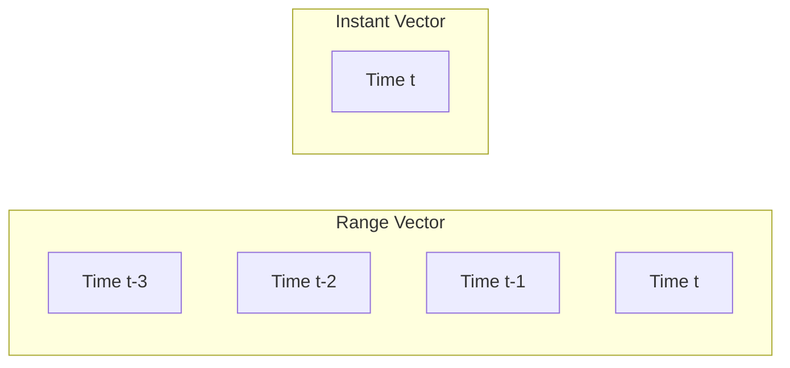

# Range Vector Aggregation

## Introduction

Range Vector Aggregation is a powerful concept in LogQL metrics that allows you to analyze how log data changes over time. While instant vector operations work with a single point in time, range vectors capture log data over a specified time duration. This provides a temporal dimension to your log analysis, enabling trend detection, rate calculations, and time-based aggregations.

In this guide, we'll explore how range vector aggregation works in Grafana Loki's LogQL, why it's useful, and how to implement it in your metrics queries.

## What are Range Vectors?

A range vector is a collection of sample values for a specific metric across a time range. Unlike an instant vector that represents a single moment, a range vector captures the evolution of values over a specified duration.



## Range Vector Syntax

In LogQL, you create a range vector by appending a time range selector to a log stream selector or a log pipeline:

```
<log-selector> [<range>]
```

The range is specified as a duration in the following format:

- `s` - seconds
- `m` - minutes
- `h` - hours
- `d` - days
- `w` - weeks
- `y` - years

For example:

```
{app="frontend"} |= "error" [5m]
```

This selects all logs from the `frontend` app containing "error" over the last 5 minutes.

## Range Vector Aggregation Functions

LogQL provides several functions designed specifically to work with range vectors:

### 1. `rate()`: Calculate per-second rate of log entries

The `rate()` function calculates how quickly log entries are being generated over time.

```
rate({app="frontend"} |= "error" [5m])
```

This returns the per-second rate of error logs from the frontend app over the last 5 minutes.

**Example output:**
```
{app="frontend"} => 0.133 (8 errors/60 seconds)
```

### 2. `count_over_time()`: Count log entries in a range

This function counts the total number of log entries that match your selector within the specified time range.

```
count_over_time({app="frontend"} |= "error" [1h])
```

**Example output:**
```
{app="frontend"} => 42
```

### 3. `sum_over_time()`: Sum values over a range

When working with extracted numeric values, you can sum them over time:

```
sum_over_time({app="checkout"} | json | latency > 0 | unwrap latency [10m])
```

This sums all latency values from checkout logs over the last 10 minutes.

### 4. `avg_over_time()`: Calculate average over a range

Similarly, you can calculate averages over time:

```
avg_over_time({app="checkout"} | json | latency > 0 | unwrap latency [10m])
```

This gives you the average latency over the last 10 minutes.

### 5. `min_over_time()` and `max_over_time()`: Find extremes

Find minimum or maximum values within a time range:

```
max_over_time({app="api"} | json | unwrap response_time [1h])
```

This returns the maximum response time recorded in the last hour.

## Aggregating Range Vectors

You can further aggregate the results of range vector functions by application, service, or other labels:

```
sum by (app) (rate({environment="production"} |= "error" [5m]))
```

This gives you the error rate per application in the production environment.

## Real-World Applications

### 1. Monitoring Error Rates

Tracking how error rates change over time helps detect incidents early:

```
sum by (app) (
  rate({environment="production"} |= "error" [5m])
)
```

### 2. Performance Trend Analysis

Analyze how response times trend throughout the day:

```
avg by (endpoint) (
  avg_over_time({app="api"} | json | unwrap response_time [30m])
)
```

### 3. Detecting Traffic Spikes

Identify unusual traffic patterns with rate analysis:

```
sum by (service) (
  rate({app=~"frontend|backend"} [10m])
)
```

### 4. SLO Monitoring

Track error budgets for service level objectives:

```
sum(rate({job="payment-service"} |= "transaction failed" [1h])) / 
sum(rate({job="payment-service"} |= "transaction" [1h]))
```

This calculates the failure rate as a percentage of total transactions.

## Best Practices

1. **Choose appropriate time ranges**: Too short ranges might not capture enough data, while too long ranges might smooth out important spikes.

2. **Group metrics by relevant labels**: Use `by (label1, label2)` to get meaningful aggregations.

3. **Consider cardinality**: Be cautious about high-cardinality labels in aggregations to avoid performance issues.

4. **Combine with alert thresholds**: Range vector aggregations work well with alerting:

```
sum by (app) (rate({environment="production"} |= "error" [5m])) > 0.01
```

This alerts if any app's error rate exceeds 1% per second over 5 minutes.

5. **Use quantile functions for distributions**: For latency analysis, consider quantile functions:

```
quantile_over_time(0.95, {app="api"} | json | unwrap response_time [10m])
```

This gives the 95th percentile response time over 10 minutes.

## Summary

Range Vector Aggregation is an essential concept in LogQL metrics that allows you to analyze log data over time intervals. By using time ranges and aggregation functions, you can detect trends, calculate rates, and derive meaningful insights from your logs.

Key takeaways:
- Range vectors capture metric samples over a specified time duration
- LogQL provides specialized functions for range vectors: `rate()`, `count_over_time()`, etc.
- Combine range vector functions with aggregation operators for powerful analytics
- Choose appropriate time ranges based on your monitoring needs

## Exercises

1. Write a LogQL query to find the average number of error logs per minute over the last hour, grouped by service.

2. Create a query to identify the three applications with the highest error rates in the last 30 minutes.

3. Develop a query that compares the current error rate (last 5 minutes) with the error rate from an hour ago.

## Additional Resources

- [Grafana Loki Documentation](https://grafana.com/docs/loki/latest/)
- [LogQL Metrics Documentation](https://grafana.com/docs/loki/latest/logql/)
- [Promtail Configuration Guide](https://grafana.com/docs/loki/latest/clients/promtail/)