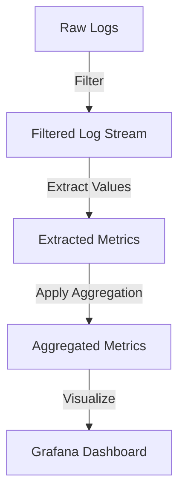

# Aggregation Operators

## Introduction

When working with logs in Grafana Loki, you'll often need to transform your raw log data into meaningful metrics for visualization and alerting. This is where **aggregation operators** in LogQL come into play. These powerful functions allow you to combine, group, and summarize log data in various ways to extract valuable insights.

Aggregation operators are essential components of LogQL's metrics capabilities that help you:

- Summarize large volumes of log data into concise metrics
- Calculate statistical measures across log entries
- Group related data for better analysis
- Transform raw log data into time series for visualization

In this guide, we'll explore the various aggregation operators available in LogQL, their syntax, and how to use them effectively in real-world scenarios.

## Understanding Aggregation Operators

Aggregation operators in LogQL take the extracted values from your logs and perform calculations to produce summary metrics. These operators are applied to log streams that have been filtered and from which values have been extracted.

### Basic Syntax

The general syntax for using aggregation operators in LogQL is:

```
<aggregation_operator>([parameter,] <expression>) [by|without (<label list>)]
```

Where:
- `<aggregation_operator>` is the function you want to apply (sum, avg, min, etc.)
- `<expression>` is the metric expression to aggregate
- `[by|without (<label list>)]` is an optional clause to control grouping

## Common Aggregation Operators

Let's explore the most commonly used aggregation operators in LogQL:

### Sum

The `sum` operator adds up all values across the specified range.

```logql
sum(rate({app="frontend"}[5m]))
```

This query calculates the sum of rates across all log streams from the frontend app over 5-minute intervals.

### Average (avg)

The `avg` operator calculates the average value across the specified range.

```logql
avg(rate({app="api"} |= "error" [5m]))
```

This query returns the average error rate across all API log streams over 5-minute intervals.

### Min and Max

The `min` and `max` operators return the minimum and maximum values respectively.

```logql
max(bytes_rate({app="fileserver"}[10m]))
```

This query returns the maximum byte transfer rate for the fileserver app over 10-minute intervals.

### Count

The `count` operator counts the number of elements or entries.

```logql
count(count_over_time({app="auth"} |= "login" [1h]))
```

This query counts the total number of login events across all authentication service logs over the past hour.

### Quantile

The `quantile` operator calculates the specified quantile (0-1) across the range.

```logql
quantile(0.95, http_request_duration_seconds{handler="/api/users"})
```

This query calculates the 95th percentile of HTTP request durations for the "/api/users" endpoint.

## Grouping with "by" and "without"

Aggregation operators become even more powerful when combined with grouping clauses:

### Using "by"

The `by` clause groups results by the specified labels.

```logql
sum(rate({app="web"}[5m])) by (status_code)
```

This query groups the sum of rates by status code, allowing you to see the distribution of request rates across different HTTP status codes.

### Using "without"

The `without` clause excludes specified labels from the grouping.

```logql
avg(rate({app="database"}[5m])) without (instance)
```

This query calculates the average rate across all database instances, removing the instance label from the results.

## Practical Examples

### Example 1: Error Rate by Service

Let's calculate the error rate by service across our application:

```logql
sum(rate({environment="production"} |= "error" [5m])) by (service) 
/ 
sum(rate({environment="production"}[5m])) by (service)
```

This query:
1. Calculates the rate of error logs for each service
2. Divides by the total rate of logs for each service
3. Returns the error percentage by service

### Example 2: 99th Percentile Latency

To monitor performance, we might want to track the 99th percentile latency:

```logql
quantile(0.99, 
  sum(rate({app="api"} 
    | json | unwrap latency_ms [5m]))
  by (endpoint)
)
```

This query:
1. Extracts the `latency_ms` field from JSON logs
2. Calculates the rate over 5-minute windows
3. Groups by endpoint
4. Calculates the 99th percentile value

### Example 3: Top 5 Most Active Users

Here's how to identify the top 5 most active users in a system:

```logql
topk(5, 
  sum(count_over_time({app="userservice"} 
    | json | unwrap user_id [1h]))
  by (user_id)
)
```

This query:
1. Counts occurrences of each user_id over the past hour
2. Groups by user_id
3. Returns only the top 5 most frequent users

## Advanced Aggregation Operators

LogQL also provides several advanced aggregation operators for more complex analyses:

### topk and bottomk

The `topk` and `bottomk` operators select the top or bottom K elements by value.

```logql
topk(3, sum(rate({app="api"}[5m])) by (endpoint))
```

This returns the 3 endpoints with the highest request rates.

### stddev and stdvar

Calculate standard deviation and variance across values.

```logql
stddev(rate({app="payment"} | unwrap response_time [5m])) by (endpoint)
```

This calculates the standard deviation of response times across different payment endpoints.

## Visualization with Aggregation Operators

Aggregation operators are particularly useful when creating visualizations in Grafana. Here's a simple example of how you might use them to create a meaningful dashboard panel:



For example, to create a panel showing HTTP error rates by service:

1. Create a new panel in Grafana
2. Use the following LogQL query:
   ```logql
   sum(rate({environment="production"} |= "status=5" [5m])) by (service) 
   / 
   sum(rate({environment="production"} |= "status=" [5m])) by (service)
   ```
3. Choose a visualization type (like a bar gauge or time series)
4. Configure thresholds and alerts based on acceptable error rates

## Summary

Aggregation operators are powerful tools in LogQL that transform raw log data into actionable metrics. They allow you to:

- Calculate rates, sums, averages, and other statistical measures
- Group and categorize data for better analysis
- Identify trends, anomalies, and patterns in your logs
- Create meaningful visualizations for monitoring and alerting

By mastering aggregation operators, you can unlock the full potential of your log data in Grafana Loki, turning what might otherwise be overwhelming volumes of information into clear, actionable insights.

## Exercises

1. Write a LogQL query to calculate the average response time by service and endpoint.
2. Create a query to find the 5 endpoints with the highest error rates.
3. Develop a query that compares the request rate today with the same period yesterday.
4. Write a query to calculate the 95th percentile of memory usage across all your application instances.

## Additional Resources

- [Grafana Loki Documentation](https://grafana.com/docs/loki/latest/)
- [LogQL Metric Queries](https://grafana.com/docs/loki/latest/logql/metric_queries/)
- [LogQL Functions](https://grafana.com/docs/loki/latest/logql/functions/)