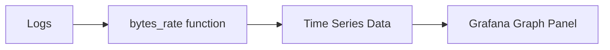

# Bytes Rate Function

## Introduction

The `bytes_rate` function is a powerful tool in LogQL (Loki Query Language) that allows you to measure and analyze the rate of data throughput in your logs. As part of Grafana Loki's metrics capabilities, this function helps you understand how much data is flowing through your systems over time, which is crucial for performance monitoring and capacity planning.

In this guide, we'll explore how to use the `bytes_rate` function effectively, understand its syntax, and see real-world applications.

## What is the Bytes Rate Function?

The `bytes_rate` function calculates the rate of bytes processed over a specified time window. It is particularly useful for:

- Monitoring network traffic flow
- Analyzing data ingestion rates
- Identifying throughput bottlenecks
- Planning capacity for storage and bandwidth

## Syntax and Parameters

The basic syntax for the `bytes_rate` function is:

```sql
bytes_rate(range)
```

Where:
- `range` is a time duration (e.g., `5m`, `1h`) over which the rate is calculated

The function works by:
1. Measuring the total number of bytes in the log entries over the specified range
2. Dividing by the time duration to get a per-second rate

## Basic Usage

### Example 1: Measuring API Response Size Rate

Let's say you want to measure the rate of bytes returned by your API:

```sql
sum by (endpoint) (
  bytes_rate({app="api-service"} | json | unwrap response_size_bytes)
)
```

This query:
1. Selects logs from the "api-service" application
2. Parses them as JSON
3. Extracts the "response_size_bytes" field
4. Calculates the bytes rate
5. Groups the results by endpoint

### Example 2: Monitoring Log Volume

To monitor the overall rate of log data being generated:

```sql
sum(
  bytes_rate({job="app"} [5m])
)
```

This shows the average bytes per second of log data generated by the "app" job over a 5-minute window.

## Advanced Usage

### Combining with Other Functions

The `bytes_rate` function becomes especially powerful when combined with other LogQL functions:

```sql
sum by (container) (
  bytes_rate({app="web-server"} | json | unwrap bytes_sent) > 1024*1024
)
```

This query identifies containers sending more than 1MB/s of data.

### Using with Vector Aggregations

You can use the `bytes_rate` function within vector aggregations:

```sql
avg_over_time(
  bytes_rate({app="database"} | json | unwrap query_response_bytes)[1h]
)
```

This calculates the average bytes rate over a 1-hour window for database query responses.

## Visualization Examples

### Time Series Graph

The `bytes_rate` function is commonly used in time series graphs to visualize data throughput trends:



### Example Dashboard Configuration

```yaml
panels:
  - title: API Response Throughput
    type: graph
    datasource: Loki
    targets:
      - expr: sum by (endpoint) (bytes_rate({app="api-service"} | json | unwrap response_size_bytes))
        legendFormat: "{{endpoint}}"
```

## Practical Applications

### Network Traffic Monitoring

Monitor the traffic rates between different services:

```sql
sum by (source, destination) (
  bytes_rate({app="network-monitor"} | json | unwrap transferred_bytes)
)
```

### Storage Planning

Track the growth rate of your log data to plan storage needs:

```sql
sum(
  bytes_rate({namespace="production"} [1d])
)
```

This helps estimate daily storage requirements for production logs.

### Performance Optimization

Identify which API endpoints are transferring the most data:

```sql
topk(5, 
  sum by (endpoint) (
    bytes_rate({app="api-gateway"} | json | unwrap response_bytes)
  )
)
```

This query shows the top 5 endpoints by data transfer rate.

## Common Pitfalls and Tips

### Watch Out For

- **Time Range**: Using too short a range can lead to spiky and unreliable results
- **Log Volume**: The function processes all matching logs, so be cautious with high-volume log sources
- **Units**: Remember the result is in bytes per second, so convert to KB/MB/GB as needed for readability

### Best Practices

- Use appropriate time windows (e.g., `[5m]` for real-time monitoring, `[1h]` for trends)
- Combine with `sum by` to group related metrics
- Use with `rate` and `unwrap` for analyzing specific numeric fields in structured logs

## Performance Considerations

The `bytes_rate` function works with the byte size of your log entries. For optimal performance:

- Apply label filters first to reduce the dataset
- Use reasonable time ranges
- Consider pre-filtering logs with high cardinality

## Summary

The `bytes_rate` function is a versatile tool in LogQL that enables monitoring and analysis of data throughput in your logs. By measuring the rate of bytes over time, it provides insights into system performance, network traffic, and capacity requirements.

Key takeaways:
- Use `bytes_rate` to understand data volume trends
- Combine with other LogQL functions for deeper analysis
- Visualize results in time series graphs for easy interpretation
- Apply appropriate time windows based on your monitoring needs

## Exercises

1. Calculate the bytes rate for your application logs grouped by log level
2. Compare the bytes rate between different environments (production vs. staging)
3. Create a Grafana dashboard that shows bytes rate alongside other performance metrics
4. Set up an alert that triggers when the bytes rate exceeds a threshold

## Additional Resources

- [LogQL Documentation](https://grafana.com/docs/loki/latest/logql/)
- [Grafana Loki Query Examples](https://grafana.com/docs/loki/latest/logql/query_examples/)
- [Monitoring Best Practices](https://grafana.com/docs/grafana/latest/best-practices/)