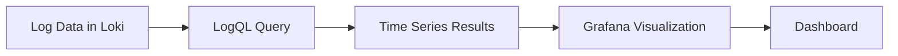

# Metrics Visualization

## Introduction

After extracting metrics from logs using LogQL, the next crucial step is to visualize this data effectively. Visualization transforms raw numerical data into intuitive graphical representations that help you identify patterns, anomalies, and trends that might otherwise remain hidden in tables of numbers. In this guide, we'll explore how to visualize metrics extracted from Loki logs using Grafana's powerful visualization capabilities.

## Understanding Metrics Visualization in Grafana Loki

When working with Loki, your metrics queries (using LogQL) generate time series data that can be visualized in various ways. Grafana acts as the visualization layer that connects to your Loki data source and renders the metrics in meaningful, interactive formats.

### The Visualization Pipeline



## Basic Metrics Visualization

Let's start with a simple example of visualizing HTTP status codes from a web server's logs.

### Example 1: Visualizing HTTP Status Codes

First, we need a LogQL query that extracts and counts status codes:

```logql
sum by(status_code) (
  count_over_time({job="nginx"} | json | status_code != "" [1m])
)
```

To visualize this in Grafana:

1. Create a new panel in your Grafana dashboard
2. Select Loki as the data source
3. Enter the LogQL query above
4. Select an appropriate visualization type (Bar chart, Time series, etc.)

Here's what the configuration might look like:

```
Panel Title: HTTP Status Codes
Data Source: Loki
Query: sum by(status_code) (count_over_time({job="nginx"} | json | status_code != "" [1m]))
Visualization: Time series
Legend: {{ status_code }}
```

This creates a time series visualization showing the count of different HTTP status codes over time, helping you monitor the health of your web service.

## Advanced Visualization Techniques

### Example 2: Heatmap for Latency Distribution

For visualizing request latencies, a heatmap can be more effective than a line chart:

```logql
quantile_over_time(0.5, 
  {job="api-gateway"} 
  | json 
  | unwrap response_time_ms [1m]) by (service)
```

In Grafana:
1. Create a new panel
2. Use the query above
3. Select "Heatmap" as the visualization type
4. Configure color scheme to show performance degradation patterns

### Example 3: Multi-Query Dashboard for System Health

To create a comprehensive system health dashboard, combine multiple metrics:

```logql
# Query 1: Error rate
sum(rate({job="api-service"} |= "ERROR" [5m])) / 
sum(rate({job="api-service"} [5m]))

# Query 2: CPU utilization
avg by(instance) (
  rate({job="node-exporter"} | json | unwrap cpu_usage_percent [5m])
)

# Query 3: Memory utilization
avg by(instance) (
  rate({job="node-exporter"} | json | unwrap memory_usage_percent [5m])
)
```

Arrange these in a single dashboard with appropriate visualizations for each metric.

## Customizing Visualizations

Grafana offers extensive customization options to make your metrics visualizations more effective:

### Time Range Controls

The time range selector allows you to zoom in on specific periods of interest:

```
Time Range Options:
- Last 5 minutes
- Last 15 minutes
- Last 1 hour
- Last 6 hours
- Last 24 hours
- Custom range
```

### Thresholds and Alerts

Add thresholds to your visualizations to highlight when metrics cross important boundaries:

1. In panel edit mode, go to the "Thresholds" section
2. Add thresholds like:
   - 0-80: Green (normal)
   - 80-95: Yellow (warning)
   - 95-100: Red (critical)

```
Threshold Settings Example:
- If value >= 95, color red
- If value >= 80, color orange
- If value < 80, color green
```

### Annotations

Annotations allow you to mark significant events on your visualizations:

```
Annotation Example:
- Name: Deployment
- Query: {app="deployment-service"} |= "Deployment completed"
- Color: Blue
```

## Real-World Application: Service Monitoring Dashboard

Let's create a practical example of a service monitoring dashboard combining multiple visualizations:

### Step 1: Define Your Metrics

For a web service, key metrics might include:
- Request rate (requests per second)
- Error rate (percentage of failed requests)
- Latency (response time in milliseconds)
- Resource utilization (CPU, memory)

### Step 2: Create LogQL Queries

```logql
# Request Rate
sum(rate({job="web-service"}[1m]))

# Error Rate
sum(rate({job="web-service"} |= "ERROR" [1m])) /
sum(rate({job="web-service"} [1m])) * 100

# P95 Latency
quantile_over_time(0.95, 
  {job="web-service"} 
  | json 
  | unwrap response_time_ms [1m])

# Resource Utilization
{job="node-exporter", instance=~"$instance"} 
| json 
| unwrap cpu_usage_percent
```

### Step 3: Create a Dashboard

1. Create a new dashboard in Grafana
2. Add four panels with the queries above
3. Configure appropriate visualizations:
   - Request Rate: Time series graph
   - Error Rate: Gauge with thresholds
   - Latency: Time series with thresholds
   - Resource Utilization: Time series or gauge

### Step 4: Add Dashboard Variables

Add template variables to make your dashboard interactive:

```
Variable Name: instance
Label: Instance
Query: label_values(job="node-exporter", instance)
```

This allows users to select specific instances to monitor.

## Best Practices for Metrics Visualization

When creating visualizations for your Loki metrics, consider these best practices:

1. **Choose appropriate visualization types**:
   - Time series for trends over time
   - Gauges for current values against thresholds
   - Bar charts for comparing categories
   - Heatmaps for distribution patterns

2. **Use consistent color schemes**:
   - Red for errors/critical issues
   - Yellow/orange for warnings
   - Green for healthy states
   - Blue for informational metrics

3. **Organize related metrics together**:
   - Group metrics by service or component
   - Arrange from high-level overviews to detailed metrics

4. **Add context with annotations**:
   - Mark deployments, incidents, and maintenance windows
   - Include links to relevant documentation or incident reports

5. **Optimize for different viewing contexts**:
   - TV display dashboards (larger text, fewer panels)
   - Operational dashboards (comprehensive but focused)
   - Executive dashboards (high-level KPIs)

## Common Visualization Types for Loki Metrics

### Time Series

Best for showing how metrics change over time. Ideal for:
- Request rates
- Error counts
- Resource utilization over time

### Gauges

Perfect for showing current value against thresholds:
- Error percentage
- SLA compliance
- Resource utilization percentage

### Bar Charts

Great for comparing categories:
- HTTP status code distribution
- Error types
- Log level distribution

### Heatmaps

Excellent for showing distribution patterns:
- Request latency distribution
- Resource utilization patterns
- User activity patterns

### Tables

Useful for detailed numeric data:
- Top N error messages
- Slow endpoints with detailed metrics
- Resource usage by service

## Troubleshooting Visualization Issues

If your visualizations aren't showing as expected, check these common issues:

1. **No data appears**:
   - Verify your LogQL query returns results in Explore view
   - Check the time range selection
   - Ensure your Loki data source is configured correctly

2. **Visualization shows unexpected patterns**:
   - Review your aggregation functions (sum, avg, max)
   - Check for log parsing errors
   - Verify label matching in queries

3. **Performance issues**:
   - Optimize queries with appropriate time ranges
   - Use rate() instead of count_over_time() for high-volume logs
   - Add label filters to reduce the dataset

## Summary

Effective visualization of metrics extracted from Loki logs is essential for monitoring and troubleshooting applications and infrastructure. In this guide, we've covered:

- Basic and advanced visualization techniques
- Different visualization types and when to use them
- Creating practical dashboards with multiple metrics
- Customizing visualizations with thresholds and annotations
- Best practices for effective metrics visualization

By mastering these techniques, you can transform raw log data into meaningful insights that help maintain the health and performance of your systems.

## Additional Resources

To further enhance your skills in metrics visualization with Grafana Loki:

- Explore the [Grafana visualization options](https://grafana.com/docs/grafana/latest/panels/visualizations/)
- Learn about [alerting based on Loki metrics](https://grafana.com/docs/grafana/latest/alerting/)
- Practice creating dashboards with the sample data in Grafana's [play environment](https://play.grafana.org/)

## Exercises

1. Create a dashboard showing error rates across different services using LogQL queries.
2. Build a latency heatmap visualization for an API service.
3. Design a resource utilization dashboard with CPU, memory, and disk metrics.
4. Create a visualization that combines logs and metrics to troubleshoot a performance issue.
5. Implement a dashboard with variables to filter metrics by environment, service, and instance.