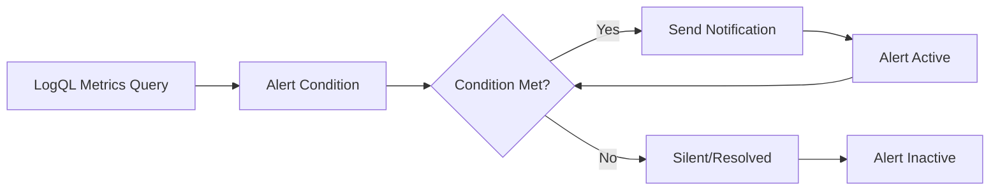

# Creating Alerts from Metrics

## Introduction

Alerts are a crucial part of any monitoring system. They notify you when something goes wrong, allowing you to respond quickly to issues before they impact your users. In Grafana Loki, you can create alerts based on metrics derived from your logs using LogQL, enabling proactive monitoring of your applications.

This guide will walk you through the process of creating alerts from LogQL metrics, explaining the concepts step by step and providing practical examples.

## Prerequisites

Before diving into alerts, make sure you:
- Have Grafana and Loki set up and configured
- Understand basic LogQL queries and metrics
- Have logs flowing into your Loki instance

## Understanding Alerting Concepts

Alerts in Grafana Loki follow a simple but powerful workflow:

1. **Query**: You define a LogQL metrics query that calculates values from your logs
2. **Condition**: You set conditions that determine when an alert should fire
3. **Notification**: You configure how and who to notify when the alert triggers
4. **Resolution**: The alert resolves when the condition is no longer met



## Creating Your First Alert from LogQL Metrics

Let's walk through creating a basic alert that will notify you when HTTP error rates exceed a threshold.

### Step 1: Define Your LogQL Metrics Query

First, we need a LogQL query that calculates error rates from our logs:

```
sum(rate({app="web-app"} |= "status=5xx" [5m])) 
  / 
sum(rate({app="web-app"} [5m])) * 100
```

This query:
1. Counts 5xx errors in our web application logs
2. Divides by the total number of logs
3. Multiplies by 100 to get a percentage

### Step 2: Create a New Alert Rule

In Grafana:

1. Navigate to "Alerting" in the left sidebar
2. Click "New alert rule"
3. Select "Loki" as your data source
4. Paste your LogQL metrics query
5. Set the evaluation interval (how often Grafana checks your condition)

### Step 3: Define Alert Conditions

Now, set the conditions that determine when your alert should fire:

```
WHEN last() OF query(A, 5m, now) > 5
```

This condition triggers when the error rate exceeds 5% for the most recent data point.

### Step 4: Configure Alert Details

Provide the following details for your alert:

- **Rule name**: "High HTTP Error Rate"
- **Description**: "Alert when HTTP 5xx errors exceed 5% of total requests"
- **Summary**: "High error rate detected for web-app"
- **Severity**: "warning" or "critical" depending on your needs

### Step 5: Set Up Notifications

Configure notification channels such as:
- Email
- Slack
- PagerDuty
- WebHooks
- Other integrated notification systems

For example, a Slack notification might appear like:

```
⚠️ [WARNING] High HTTP Error Rate
Web-app is experiencing 7.2% error rate (threshold: 5%)
Time: 2023-06-15 14:32:21
```

## Advanced Alerting Techniques

Once you're comfortable with basic alerts, you can explore more advanced techniques.

### Multi-Condition Alerts

You can create more sophisticated alerts by combining multiple conditions:

```
sum(rate({app="web-app", environment="production"} |= "status=5xx" [5m])) > 100
AND
sum(rate({app="web-app", environment="production"} |= "status=5xx" [5m])) 
  / 
sum(rate({app="web-app", environment="production"} [5m])) * 100 > 5
```

This alert triggers when both the absolute number of errors exceeds 100 AND the error rate exceeds 5%.

### Alerting with Log Patterns

You can use LogQL's parsing capabilities to alert on specific patterns in your logs:

```
sum(rate({app="payment-service"} | json | status=~"failed|rejected" [5m])) > 10
```

This would alert when payment failures exceed 10 per minute.

### Implementing Alert Deduplication

For noisy logs or frequently triggering alerts, implement deduplication:

```
sum by(endpoint) (
  rate({app="api-gateway"} | json | status >= 500 [5m])
) > 5
```

This groups errors by endpoint, so you receive distinct alerts for each problematic endpoint.

## Practical Example: Complete Production Alert

Let's create a comprehensive alert for monitoring API response times:

```
// Query A: Calculate 95th percentile response time
sum by(service) (
  quantile_over_time(0.95, 
    {app="api-gateway"} 
    | json 
    | unwrap response_time_ms [5m]
  )
)

// Alert condition
WHEN last() OF query(A, 5m, now) > 1000
FOR 15m
```

This alert will fire when the 95th percentile response time for any service exceeds 1000ms for 15 consecutive minutes.

In the notification, you might include:

```
🚨 High API Latency Detected

Service: {{$labels.service}}
Current P95 latency: {{$value}}ms
Threshold: 1000ms
Duration: 15+ minutes

Please investigate immediately as users are experiencing slow responses.
```

## Best Practices for LogQL Metrics Alerts

When creating alerts from LogQL metrics, follow these best practices:

1. **Avoid alert fatigue**: Set appropriate thresholds that balance sensitivity with importance
2. **Use rate functions**: For most metrics, use `rate()` or `count_over_time()` rather than raw counts
3. **Add context**: Include enough information in notifications to understand the issue quickly
4. **Consider trends**: Alert on trends rather than single data points where appropriate
5. **Test thoroughly**: Always test your alerts before deploying them to production
6. **Document alerts**: Keep a record of all alerts and their intended purpose
7. **Implement escalation paths**: Define different severity levels and appropriate response procedures

## Troubleshooting Alerts

Common issues with LogQL metrics alerts include:

### Too Many Alerts (Alert Storm)

If you're receiving too many alerts:
- Increase thresholds
- Add aggregation to group similar problems
- Implement alert grouping in your notification system

### No Alerts When Expected

If alerts aren't firing when they should:
- Verify your LogQL query returns data (test in Explore view)
- Check if evaluation intervals are too long
- Ensure notification channels are correctly configured

## Summary

Creating alerts from LogQL metrics allows you to proactively monitor your applications by:
1. Defining meaningful metrics using LogQL
2. Setting appropriate thresholds and conditions
3. Configuring effective notifications
4. Following best practices to avoid alert fatigue

This approach transforms Loki from a log storage system into a powerful monitoring solution that helps maintain system reliability and quickly respond to issues.

## Exercise: Create Your Own Alerts

To reinforce your learning, try creating these alerts:

1. Alert when log volume drops significantly (potential log pipeline issue)
2. Alert on increased error rates for a specific customer or tenant
3. Alert when a particular log message appears that requires immediate attention
4. Create a multi-condition alert that considers both error rates and system metrics

## Additional Resources

- [Grafana Alerting Documentation](https://grafana.com/docs/grafana/latest/alerting/)
- [LogQL Metrics Query Examples](https://grafana.com/docs/loki/latest/logql/)
- [Alert Notification Channel Configuration](https://grafana.com/docs/grafana/latest/alerting/notifications/)