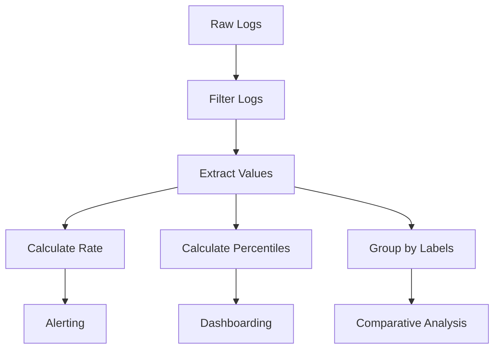

# Common Metric Patterns

## Introduction

LogQL, Loki's query language, provides powerful capabilities not just for retrieving logs but also for extracting metrics from your log data. This ability to transform logs into metrics bridges the gap between logging and monitoring systems, enabling you to derive quantitative insights from qualitative log data.

In this guide, we'll explore common metric patterns in LogQL that help you extract valuable metrics from your logs. These patterns are essential for effective monitoring, alerting, and visualization in Grafana Loki.

## Understanding LogQL Metric Queries

Before diving into specific patterns, let's understand the basic structure of a LogQL metric query:

```
logQL_stream_selector | logQL_pipeline_stages | metric_extraction_function(parameter)
```

A metric query in LogQL consists of three main components:

1. **Stream selector**: Selects the log streams to query (e.g., `{app="frontend"}`)
2. **Pipeline stages**: Optional transformations to prepare log lines (e.g., `| json | line_format "{{.message}}"`)
3. **Metric extraction**: Functions that convert logs into numeric values (e.g., `| rate()`)

Now, let's explore common metric patterns you'll use regularly.

## Common Metric Patterns

### 1. Rate of Log Lines

The most basic metric pattern is measuring the rate of log occurrences. This is useful for tracking error rates, activity levels, or any event frequency.

#### Example: Error Rate Monitoring

```logql
{app="payment-service"} |= "error" | rate(1m)
```

This query:
1. Selects logs from the payment service
2. Filters for lines containing "error"
3. Calculates the rate of these errors per second over a 1-minute window

#### Output Visualization

When visualized in Grafana, this produces a time series showing error frequency, allowing you to spot spikes or abnormal patterns.

### 2. Counting Specific Events

The `count_over_time` function lets you count occurrences within specific time windows.

#### Example: Login Attempts

```logql
{app="auth-service"} |= "login attempt" | count_over_time(5m)
```

This counts login attempts in 5-minute buckets, useful for authentication monitoring.

#### Difference from Rate

While `rate()` gives per-second values, `count_over_time()` provides absolute counts within each time window.

### 3. Extracting and Aggregating Numeric Values

A powerful pattern is extracting numeric values from logs and aggregating them.

#### Example: Average Response Time

```logql
{app="web-server"} 
| regexp `.*response_time=(?P<response_time>[0-9]+).*` 
| unwrap response_time 
| avg_over_time(1m)
```

This query:
1. Selects web server logs
2. Extracts response time using a regular expression
3. Unwraps the extracted value
4. Calculates the average over 1-minute windows

### 4. Calculating Percentiles

For performance monitoring, percentiles are often more useful than averages.

#### Example: 95th Percentile Response Time

```logql
{app="api-gateway"}
| json
| duration > 0
| unwrap duration
| quantile_over_time(0.95, 5m)
```

This query extracts the 95th percentile of API response durations over 5-minute windows.

### 5. Creating Histograms

Histograms provide distribution visualization of your metrics.

#### Example: Response Time Distribution

```logql
{app="web-server"} 
| regexp `.*response_time=(?P<response_time>[0-9]+).*` 
| unwrap response_time 
| histogram_quantile(0.5, sum by(le) (rate(${__range})))
```

This creates a histogram of response times and calculates the median (50th percentile).

### 6. Group-Based Metrics

Grouping metrics by labels allows for comparative analysis.

#### Example: Error Rates by Service

```logql
{environment="production"} |= "ERROR"
| label_format service_name="{{ service }}"
| rate(5m)
| sum by(service_name)
```

This query:
1. Selects production error logs
2. Formats a service name label
3. Calculates error rates
4. Sums rates by service

### 7. Absent Metrics (Detecting Missing Logs)

Sometimes the absence of logs is as important as their presence.

#### Example: Detecting Service Silence

```logql
absent(count_over_time({app="critical-service"} [10m]))
```

This returns a value of 1 when the critical service has no logs for 10 minutes, useful for detecting silent failures.

## Applying Metrics in Real-World Scenarios

Let's explore how these patterns apply to real-world monitoring scenarios.

### Application Performance Monitoring

```logql
{app="ecommerce"} 
| json 
| unwrap_duration(request_time) 
| sum by (endpoint) (rate(1m))
```

This tracks request rates across different endpoints in an e-commerce application.

### Error Budgeting

```logql
1 - (
  sum(rate({app="payment-gateway"} |= "success" [1h]))
  /
  sum(rate({app="payment-gateway"} [1h]))
)
```

This calculates the error rate as a proportion of total requests, useful for SLO monitoring.

### Security Monitoring

```logql
{app="auth-service"} 
|= "failed login" 
| json 
| label_format user="{{ username }}" 
| count_over_time(5m) 
| sum by(user)
```

This counts failed login attempts per user, helping identify potential brute force attacks.

## Visualizing Metrics in Grafana

These LogQL metric patterns can be visualized in Grafana using:

1. **Time series panels**: For rate, count, and numeric metrics over time
2. **Gauge panels**: For current values against thresholds
3. **Bar charts**: For comparing metrics across different services/components
4. **Heatmaps**: For visualizing histogram data

## Common Pitfalls and Optimization

### Potential Issues

1. **High cardinality**: Be cautious with high-cardinality labels in group operations
2. **Resource consumption**: Complex metric queries can be resource-intensive
3. **Time window selection**: Too small windows cause noise, too large lose detail

### Optimizations

```logql
# Instead of this (processes all logs first)
{app="busy-service"} | json | status=~"5.." | rate(1m)

# Do this (filters first)
{app="busy-service"} |= "status\":5" | json | rate(1m)
```

Always filter logs as early as possible in your query to improve performance.

## Combining Metric Patterns

You can combine patterns for more sophisticated monitoring:



## Summary

LogQL metric patterns transform your logs into valuable metrics, enabling:

- Rate-based monitoring for events and errors
- Extraction and analysis of numeric values
- Distribution analysis through percentiles and histograms
- Comparative analysis through grouping
- Detection of missing logs

By mastering these patterns, you can build comprehensive monitoring solutions that leverage your log data beyond traditional log analysis.

## Exercises

1. Create a query to monitor the 99th percentile response time for a web application
2. Develop a query that tracks error rates by HTTP status code
3. Build a query to detect when a critical service hasn't logged any activity for 5 minutes
4. Create a dashboard showing the top 5 users by login frequency

## Further Resources

- [Grafana Loki Documentation](https://grafana.com/docs/loki/latest/)
- [LogQL Query Language Reference](https://grafana.com/docs/loki/latest/logql/)
- [Metric Functions in LogQL](https://grafana.com/docs/loki/latest/logql/metric_queries/)