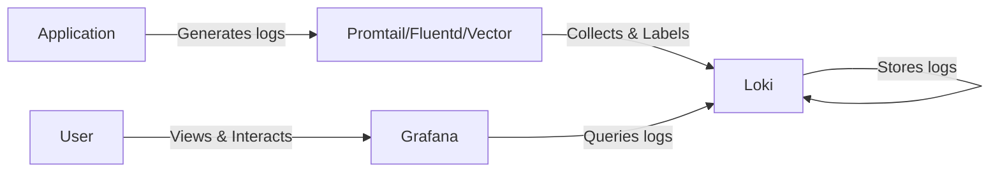

# Connecting Loki to Grafana

## Introduction

Grafana Loki is a horizontally scalable, highly available log aggregation system designed to be cost-effective and easy to operate. While Loki handles log collection and storage, Grafana provides the visualization interface. In this guide, we'll walk through how to connect Loki to Grafana, enabling you to query and visualize your logs effectively.

This integration is a critical step in building a complete observability stack, allowing you to correlate logs with metrics and traces for comprehensive system monitoring.

## Prerequisites

Before we begin, ensure you have:

- Grafana installed (version 7.0 or later recommended)
- Loki server running and accessible from your Grafana instance
- Basic understanding of Grafana's interface

## Adding Loki as a Data Source in Grafana

### Step 1: Access Grafana Data Sources

1. Log in to your Grafana instance
2. Navigate to the "Configuration" menu (gear icon) in the left sidebar
3. Select "Data Sources"

### Step 2: Add a New Data Source

1. Click the "Add data source" button
2. Search for "Loki" in the list of available data sources
3. Select "Loki" from the results

### Step 3: Configure the Loki Data Source

```
URL: http://loki:3100
```

This URL should point to your Loki server. Common configurations include:

- `http://localhost:3100` (for local installations)
- `http://loki:3100` (for Docker or Kubernetes deployments)
- `http://loki-gateway.monitoring:80` (for Kubernetes with service names)

### Step 4: Additional Configuration Options

**Basic Auth**

If your Loki instance requires authentication:

1. Toggle "Basic Auth" to ON
2. Enter the username and password

**Advanced HTTP Settings**

For production environments, you might need to configure:

- Timeout settings
- Keep-alive settings
- TLS/SSL certificate validation

**Query Settings**

You can adjust:

- Maximum number of lines to process
- Resolution step for derived fields

### Step 5: Save and Test

1. Scroll to the bottom of the configuration page
2. Click the "Save & Test" button
3. You should see a "Data source is working" message if the connection is successful

## Creating Your First Loki Query

### Accessing the Explore View

1. Click on the "Explore" icon (compass) in the left sidebar
2. Select "Loki" from the data source dropdown at the top

### Basic Log Querying

Loki uses a query language called LogQL, which is similar to Prometheus's PromQL but designed for logs.

**Simple Label Filter Query:**

```
{app="frontend"}
```

This query returns all logs from sources with the label `app=frontend`.

**Using Logical Operators:**

```
{app="frontend", environment="production"}
```

This returns logs that have both labels.

**Using Regular Expressions:**

```
{app="frontend"} |~ "error|warning"
```

This returns logs from the frontend app that contain either "error" or "warning".

### Visualizing Log Data

**Log Volume Graph:**

When you run a log query, Grafana automatically shows a histogram of log volume over time above the log lines.

**Creating Log Panels in Dashboards:**

1. Navigate to any dashboard
2. Click "Add panel"
3. Select "Logs" as the visualization type
4. Choose "Loki" as the data source
5. Enter your LogQL query

## Advanced Integration Features

### Using Derived Fields

Derived fields extract values from your logs to create links or additional context:

1. Go to the Loki data source configuration
2. Scroll to "Derived fields"
3. Add a new derived field:
   - Name: `trace_id`
   - Regex: `trace_id=(\w+)`
   - URL: `${__value.raw}`

This example extracts trace IDs from logs and makes them clickable links.

### Creating Variables for Dynamic Dashboards

To create dashboards where users can select different applications or environments:

1. Navigate to a dashboard
2. Click the settings (gear) icon
3. Select "Variables"
4. Add a new variable:
   - Name: `app`
   - Type: "Query"
   - Data source: Loki
   - Query: `label_values(app)`
5. Use the variable in your queries: `{app="$app"}`

### Combining Metrics and Logs

One of the most powerful aspects of the Grafana-Loki integration is the ability to correlate logs with metrics:

1. Create a dashboard with both Prometheus and Loki panels
2. Configure your Grafana "Data links"
3. Add a data link from a metric panel to the Explore view with a pre-configured Loki query

For example, clicking on a CPU spike could show you the logs from that specific time period.

## LogQL Advanced Queries

### Filtering with Pattern Matching

```
{app="frontend"} |= "error" != "timeout"
```

This query returns logs that contain "error" but not "timeout".

### Parsing and Extracting Fields

```
{app="frontend"} | json | response_time > 200
```

This query parses JSON logs and filters for responses that took longer than 200ms.

### Aggregating Log Data

```
sum(rate({app="frontend"} |= "error" [5m])) by (service)
```

This query counts error rates by service over 5-minute windows.

## Real-World Examples

### Monitoring Application Errors

Create a dashboard panel with:

```
sum(count_over_time({app=~"$app"} |= "error" [5m])) by (app)
```

This shows error counts per application over time.

### HTTP Status Code Analysis

```
{app="api-gateway"} | json | status_code >= 400
| sum(count_over_time({app="api-gateway"} | json | status_code >= 400 [1h])) by (status_code)
```

This counts HTTP errors by status code.

### Performance Troubleshooting Dashboard

Create a dashboard with multiple panels:

1. Latency metrics from Prometheus
2. Error rate metrics derived from Loki logs
3. Log panels showing specific errors or slow responses
4. Variables for selecting services, environments, and time ranges

## Best Practices

### Performance Optimization

1. **Use Label Filters First**: Always filter by labels before content
2. **Limit Time Ranges**: Be cautious with queries over large time ranges
3. **Avoid High-Cardinality Labels**: Too many unique label values can degrade performance

### Organization Tips

1. **Consistent Labeling**: Develop a consistent labeling strategy across applications
2. **Dashboard Organization**: Group related panels and organize dashboards by team or service
3. **Use Annotations**: Add Loki queries as annotations on dashboards to highlight important events

### Security Considerations

1. **Access Control**: Use Grafana's team-based permissions to control access to sensitive logs
2. **Sensitive Data**: Be careful not to expose sensitive information in logs
3. **Rate Limiting**: Consider implementing rate limiting for heavy queries

## Troubleshooting Common Issues

### Connection Problems

If you can't connect to Loki:

1. Verify the URL is correct
2. Check network connectivity and firewall rules
3. Ensure Loki is running and healthy

### Query Performance Issues

If queries are slow:

1. Add more specific label filters
2. Reduce the time range
3. Check Loki's resource utilization

### Missing Logs

If expected logs don't appear:

1. Verify that Promtail or other collectors are properly configured
2. Check that the correct labels are being applied
3. Ensure the time range in Grafana matches when the logs were generated

## Integration Architecture



## Summary

In this guide, we've covered how to:

1. Add Loki as a data source in Grafana
2. Create basic and advanced LogQL queries
3. Visualize log data in Grafana dashboards
4. Implement advanced features like derived fields and variables
5. Troubleshoot common integration issues

The Loki-Grafana integration provides a powerful, cost-effective way to store, query, and visualize your logs. By following these steps, you can create comprehensive observability dashboards that combine logs, metrics, and traces for complete system monitoring.

## Additional Resources

- [Official Grafana Loki Documentation](https://grafana.com/docs/loki/latest/)
- [LogQL Query Language Reference](https://grafana.com/docs/loki/latest/logql/)
- [Grafana Data Source Management](https://grafana.com/docs/grafana/latest/datasources/)
- [Loki Best Practices](https://grafana.com/docs/loki/latest/best-practices/)

## Exercises

1. Connect Loki to your Grafana instance and verify the connection
2. Create a simple dashboard with log volume from a specific application
3. Write a LogQL query that extracts and graphs error rates over time
4. Set up a dashboard variable to filter logs by environment or service
5. Create a data link from a metric panel to relevant logs in the Explore view