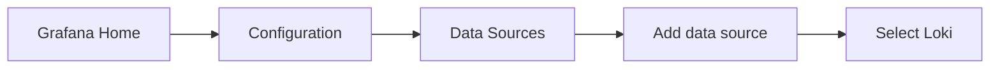

# Creating Loki Data Source

## Introduction

Loki is a horizontally-scalable, highly-available log aggregation system designed by Grafana Labs. It's often described as "Prometheus, but for logs" because it's built around the same design principles. In this tutorial, you'll learn how to integrate Loki with Grafana by creating and configuring a Loki data source.

Adding Loki as a data source in Grafana enables you to:

- Query and visualize your logs in Grafana
- Create alerts based on log data
- Correlate logs with metrics and traces for complete observability
- Utilize Loki's powerful LogQL query language

## Prerequisites

Before adding Loki as a data source, ensure you have:

- A running Grafana instance (version 7.0 or later)
- A running Loki instance with its URL accessible from your Grafana server
- Admin or editor permissions in Grafana

## Step-by-Step Configuration

### Step 1: Access Data Sources in Grafana

1. Log in to your Grafana instance
2. In the left sidebar, hover over the "Configuration" (gear) icon
3. Select "Data sources" from the dropdown menu



### Step 2: Add a New Data Source

1. Click the "Add data source" button at the top of the page
2. In the search field, type "Loki" or find it in the "Logging & document databases" section
3. Click on the Loki card to select it

### Step 3: Configure the Loki Data Source

Now you'll see the configuration page for the Loki data source. Let's go through each section:

#### Basic Configuration

```
Name: Loki
Default: Toggle on if you want Loki to be your default data source
```

#### HTTP Settings

The most crucial setting is the URL of your Loki instance:

```
URL: http://loki:3100
```

Replace `http://loki:3100` with the actual URL where your Loki instance is running. Common configurations include:

- `http://localhost:3100` for local development
- `http://loki:3100` for Docker Compose setups
- `http://loki.monitoring.svc.cluster.local:3100` for Kubernetes deployments

If your Loki instance requires authentication, expand the "Auth" section and configure the appropriate authentication method (Basic Auth, API Key, etc.).

```javascript
// Example curl command to test Loki connection
curl -G -s "http://loki:3100/loki/api/v1/labels" | jq
```

#### Advanced HTTP Settings

These settings are typically optional but may be required in specific environments:

- **Timeout**: Set a custom timeout for requests to Loki (default is 30 seconds)
- **TLS/SSL Settings**: If your Loki instance uses HTTPS, you might need to configure these settings
- **Custom Headers**: Add any custom HTTP headers required for your Loki setup

### Step 4: Additional Loki-Specific Options

Scroll down to find additional Loki-specific settings:

- **Maximum lines**: Controls the maximum number of log lines returned by Loki (default is 1000)
- **Derived fields**: Allows extracting fields from log lines to create links to other systems

#### Derived Fields Example

Derived fields are powerful for creating links from your logs to other systems. For example, you can extract a trace ID from your logs and link it to a trace visualization tool:

```
Name: TraceID
Regex: traceID=(\w+)
URL: http://tempo:3100/trace/${__value.raw}
```

This configuration will:
1. Look for the pattern `traceID=` followed by alphanumeric characters in log lines
2. Extract the value
3. Create a clickable link to your tracing system with the extracted trace ID

### Step 5: Save and Test

1. Click the "Save & test" button at the bottom of the page
2. If the connection is successful, you'll see a green "Data source is working" message
3. If there's an error, check the error message and review your configuration

## Using Loki Data Source

Once you've successfully added Loki as a data source, you can start querying your logs.

### Exploring Logs

1. Navigate to "Explore" from the Grafana sidebar
2. Select "Loki" from the data source dropdown at the top
3. Start querying your logs using LogQL

### Basic LogQL Queries

Here are some basic LogQL query examples to get you started:

```
# Show all logs from the "app" label
{app="my-application"}

# Filter logs containing the word "error"
{app="my-application"} |= "error"

# Count log lines by level
count_over_time({app="my-application"} [5m]) by (level)
```

### Sample Dashboard with Loki Logs

Here's how to create a simple panel that displays logs:

1. Create a new dashboard or edit an existing one
2. Add a new panel
3. Select "Logs" from the visualization options
4. Choose Loki as the data source
5. Enter a LogQL query like `{app="my-application"}`
6. Configure the time range and other panel options
7. Click "Apply" to add the panel to your dashboard

## Real-World Example: Monitoring Web Server Logs

Let's say you're running an Nginx web server and want to monitor HTTP error codes.

### 1. Configure Log Collection

First, ensure your Nginx logs are being collected by a log agent (like Promtail) and sent to Loki with appropriate labels:

```yaml
# Example Promtail configuration (promtail-config.yaml)
scrape_configs:
  - job_name: nginx
    static_configs:
      - targets:
          - localhost
        labels:
          job: nginx
          environment: production
          __path__: /var/log/nginx/access.log
```

### 2. Create Error Rate Dashboard

Now create a dashboard to monitor HTTP 5xx errors:

1. Create a new panel with a "Graph" visualization
2. Use this LogQL query:
   ```
   sum(rate({job="nginx"} |= "HTTP/1.1\" 5" [5m])) by (status_code)
   ```
3. Add a second panel with a "Logs" visualization
4. Use this query to see the actual error logs:
   ```
   {job="nginx"} |= "HTTP/1.1\" 5"
   ```

This setup provides both a visualization of the error rate and the ability to inspect the actual logs that generated those errors.

## Troubleshooting

### Common Issues

1. **"Data source is not working" error**:
   - Check if the Loki URL is correct and accessible from Grafana
   - Verify network connectivity and firewall settings
   - Ensure Loki is running and healthy

2. **No logs appear when querying**:
   - Verify that logs are actually being sent to Loki
   - Check the time range in Grafana
   - Ensure your query matches the labels used in your setup

3. **Slow queries or timeouts**:
   - Consider increasing the timeout in the data source settings
   - Optimize your LogQL queries
   - Check Loki's resources and scaling

## Summary

In this tutorial, you've learned how to:

- Add Loki as a data source in Grafana
- Configure the connection settings
- Set up advanced options like derived fields
- Create basic LogQL queries
- Build a real-world monitoring dashboard for web server logs

With Loki integrated as a data source, you now have powerful log exploration and visualization capabilities in your Grafana instance. This forms a critical part of your observability stack, allowing you to correlate logs with metrics and traces.

## Additional Resources

- [Loki Documentation](https://grafana.com/docs/loki/latest/)
- [LogQL Query Language Reference](https://grafana.com/docs/loki/latest/logql/)
- [Promtail Configuration for Log Collection](https://grafana.com/docs/loki/latest/clients/promtail/configuration/)

## Exercises

1. Configure a Loki data source to connect to a local Loki instance
2. Create a dashboard showing both logs and a graph of error rates
3. Experiment with different LogQL queries to filter and analyze logs
4. Set up a derived field to extract and link to a customer ID in your logs
5. Create an alert based on the frequency of error logs