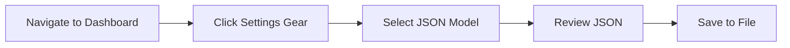

# Exporting Dashboards

## Introduction

After creating insightful dashboards with your Loki data in Grafana, you'll often need to share these dashboards with team members, move them between environments, or back them up for future use. In this guide, we'll explore how to export Grafana dashboards that visualize your Loki logs and metrics to various formats, and the best practices for storing and sharing them.

Exporting dashboards is a crucial skill for:
- Version controlling your monitoring configurations
- Sharing visualizations with team members
- Moving dashboards between development and production environments
- Creating templates for consistent monitoring setups

## Understanding Dashboard Exports

At its core, a Grafana dashboard is a JSON object that describes all panel configurations, queries, variables, and settings. When you export a dashboard, you're essentially saving this JSON configuration so it can be imported elsewhere.

## Exporting Dashboards Step-by-Step

### Method 1: Using the Grafana UI

The most straightforward approach to exporting a dashboard is through the Grafana user interface:

1. Navigate to the dashboard you want to export
2. Click on the gear icon (⚙️) in the top right to access dashboard settings
3. Click on the "JSON Model" option in the left sidebar
4. You'll see the complete JSON configuration of your dashboard
5. Click "Save to file" (or copy the JSON content)



Here's what the process looks like in the Grafana UI:

### Method 2: Using the Grafana API

For automation and programmatic access, Grafana offers a robust API for dashboard exports:

```bash
# Get dashboard by UID
curl -H "Authorization: Bearer YOUR_API_KEY" \
  http://your-grafana-instance/api/dashboards/uid/YOUR_DASHBOARD_UID \
  > loki_dashboard_export.json
```

The response will include a `dashboard` object which contains the dashboard definition along with metadata:

```json
{
  "meta": {
    "type": "db",
    "canSave": true,
    "canEdit": true,
    "canAdmin": true,
    "canStar": true,
    "slug": "loki-logs-overview",
    "url": "/d/abc123/loki-logs-overview",
    "expires": "0001-01-01T00:00:00Z",
    "created": "2023-01-15T10:54:48Z",
    "updated": "2023-02-20T15:47:32Z",
    "updatedBy": "admin",
    "createdBy": "admin",
    "version": 5,
    "hasAcl": false,
    "isFolder": false,
    "folderId": 0,
    "folderUid": "",
    "folderTitle": "General",
    "folderUrl": "",
    "provisioned": false,
    "provisionedExternalId": ""
  },
  "dashboard": {
    "annotations": { /* ... */ },
    "editable": true,
    "fiscalYearStartMonth": 0,
    "graphTooltip": 0,
    "id": 12,
    "links": [],
    "liveNow": false,
    "panels": [ /* ... */ ],
    "refresh": "5s",
    "schemaVersion": 38,
    "style": "dark",
    "tags": ["loki", "logs", "monitoring"],
    "templating": { /* ... */ },
    "time": {
      "from": "now-6h",
      "to": "now"
    },
    "timepicker": { /* ... */ },
    "timezone": "",
    "title": "Loki Logs Overview",
    "uid": "abc123",
    "version": 5,
    "weekStart": ""
  }
}
```

### Method 3: Grafana CLI

If you have access to the Grafana server, you can use the Grafana CLI tool:

```bash
grafana-cli dashboard export <dashboard-uid> --file=/path/to/dashboard.json
```

## Preparing Dashboards for Export

Before exporting dashboards that use Loki data sources, consider the following preparation steps:

### 1. Templating Variables

Make your dashboards portable by using template variables for environment-specific values:

```json
{
  "templating": {
    "list": [
      {
        "current": {
          "selected": false,
          "text": "Loki",
          "value": "Loki"
        },
        "description": "Loki data source",
        "hide": 0,
        "includeAll": false,
        "label": "Data source",
        "multi": false,
        "name": "DS_LOKI",
        "options": [],
        "query": "loki",
        "queryValue": "",
        "refresh": 1,
        "regex": "",
        "skipUrlSync": false,
        "type": "datasource"
      }
    ]
  }
}
```

With this approach, when imported, Grafana will prompt the user to map the placeholder `${DS_LOKI}` to an actual Loki data source in their environment.

### 2. Remove Sensitive Information

Ensure that your exported dashboards don't contain sensitive information:

- API keys
- Internal service URLs
- Environment-specific metadata
- User-specific preferences

### 3. Standardize Time Ranges

Set appropriate default time ranges that make sense for the dashboard's purpose:

```json
"time": {
  "from": "now-24h",
  "to": "now"
}
```

## Dashboard Export Formats

Grafana dashboards can be exported in different formats:

### 1. Standard JSON Format

The default export includes the complete dashboard definition as JSON.

### 2. Dashboard JSON Model

This is the raw dashboard model without Grafana-specific metadata, useful for version control.

### 3. Dashboard Provisioning Format

For use with Grafana's provisioning system:

```yaml
apiVersion: 1

providers:
  - name: 'loki-dashboards'
    orgId: 1
    folder: 'Loki'
    type: file
    disableDeletion: false
    updateIntervalSeconds: 10
    allowUiUpdates: true
    options:
      path: /var/lib/grafana/dashboards/loki
```

The dashboard JSON files would be stored in the path specified.

## Sharing Exported Dashboards

Once exported, you have several options for sharing:

### 1. Version Control Systems

Store dashboard JSON files in Git repositories alongside your application code:

```bash
# Add dashboard to git
git add dashboards/loki_logs_overview.json
git commit -m "Update Loki logs dashboard with latency panels"
git push
```

### 2. Grafana.com Dashboard Repository

Share with the broader community through Grafana's dashboard marketplace:

1. Create an account on Grafana.com
2. Click on "Dashboards" in your profile
3. Click "New Dashboard" and then "Import Dashboard JSON"
4. Provide metadata, readme, and upload your JSON file
5. Publish the dashboard

### 3. Direct Import

Share the JSON file directly with colleagues who can import it through Grafana's UI:

1. In Grafana, click "Dashboards" in the side menu
2. Click "New" and select "Import"
3. Upload the JSON file or paste its contents
4. Map any template variables to local data sources
5. Click "Import"

## Working with Loki-Specific Dashboard Elements

When exporting dashboards that visualize Loki data, pay special attention to:

### 1. LogQL Queries

Your Loki queries may need adjustment when moving between environments:

```json
{
  "targets": [
    {
      "datasource": {
        "type": "loki",
        "uid": "${DS_LOKI}"
      },
      "editorMode": "code",
      "expr": "{app=\"myapp\"} |= \"error\" | pattern `<_> - <level> - <message>` | level=~\"error|critical\"",
      "queryType": "range"
    }
  ]
}
```

Using template variables like `${app_name}` instead of hardcoded values makes these queries more portable.

### 2. Derived Fields

If you've configured derived fields for Loki in your dashboard, these will be included in the export:

```json
"fieldConfig": {
  "defaults": {
    "links": [
      {
        "title": "Trace View",
        "url": "${__data.fields.traceID}"
      }
    ]
  }
}
```

### 3. Data Links

Any data links configured to connect Loki logs to other systems should be reviewed for portability:

```json
"links": [
  {
    "targetBlank": true,
    "title": "View in Tempo",
    "url": "http://tempo:3100/explore?orgId=1&left=%5B%22now-1h%22,%22now%22,%22Tempo%22,%7B%22query%22:%22${__value.raw}%22%7D%5D"
  }
]
```

## Practical Examples

### Example 1: Creating a Shareable Production Error Dashboard

Let's walk through creating a Loki error dashboard and preparing it for export:

1. Create a dashboard with Loki queries showing error rates and logs
2. Add template variables for environment and application
3. Configure dashboard time settings to show the last 24 hours
4. Export the dashboard using the UI method
5. Edit the JSON to remove any instance-specific settings
6. Share with the team via your internal Git repository

### Example 2: Automating Dashboard Exports with CI/CD

For teams practicing GitOps, automating dashboard exports ensures configuration consistency:

```bash
#!/bin/bash
# Script to export all dashboards in a folder

# Set variables
GRAFANA_URL="http://grafana:3000"
API_KEY="your-api-key"
FOLDER_ID="5"
OUTPUT_DIR="./dashboards"

# Get all dashboards in the folder
DASHBOARDS=$(curl -s -H "Authorization: Bearer $API_KEY" $GRAFANA_URL/api/search?folderIds=$FOLDER_ID)

# Export each dashboard
for uid in $(echo $DASHBOARDS | jq -r '.[] | .uid'); do
  echo "Exporting dashboard with UID: $uid"
  curl -s -H "Authorization: Bearer $API_KEY" \
    $GRAFANA_URL/api/dashboards/uid/$uid > $OUTPUT_DIR/$uid.json
done

echo "Export complete. Dashboards saved to $OUTPUT_DIR"
```

This script could be part of a CI pipeline that runs weekly to back up all your Loki dashboards.

## Troubleshooting Dashboard Exports

Common issues you might encounter when exporting Grafana dashboards:

### Issue 1: Missing Data Sources After Import

If dashboard panels show "Data source not found" after import:

1. Check that the required data sources exist in the target environment
2. Verify template variable mappings during import
3. Update data source UIDs in the JSON if needed

### Issue 2: Version Compatibility

Dashboard format may change between Grafana versions:

```json
"schemaVersion": 38
```

Check that your target Grafana instance supports the dashboard schema version.

### Issue 3: Broken Panel Layouts

If the layout appears broken after import:

1. Check for any custom CSS or plugin dependencies
2. Verify that panel heights and widths use relative units
3. Test in different screen resolutions

## Summary

Exporting Grafana dashboards is essential for sharing your Loki data visualizations, implementing version control, and maintaining consistency across environments. By understanding the export formats, preparing your dashboards properly, and following best practices, you can ensure your monitoring configurations are portable and reusable.

The key points to remember:
- Dashboards are exported as JSON configurations
- Use template variables for environment-specific values
- Remove sensitive information before sharing
- Consider version control for dashboard files
- Pay special attention to Loki-specific elements like LogQL queries
- Test imported dashboards thoroughly

## Additional Resources

To learn more about Grafana dashboard exports and best practices:

- Explore Grafana's HTTP API for more automation options
- Learn about dashboard provisioning for GitOps workflows
- Investigate dashboard libraries for reusable components
- Practice creating and exporting different types of Loki dashboards

## Exercises

1. Create a simple dashboard visualizing Loki logs, export it, then import it to a different Grafana instance.
2. Modify an exported dashboard to use template variables instead of hardcoded values.
3. Write a script to export all dashboards from your Grafana instance.
4. Create a CI/CD pipeline that validates dashboard JSON before deployment.
5. Build a "starter pack" of essential Loki monitoring dashboards for new projects.