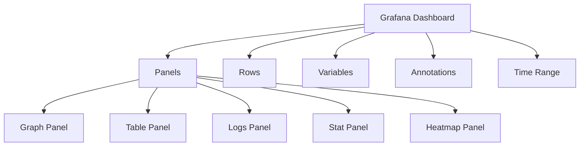

# Building Log Dashboards

## Introduction

Log dashboards are powerful visual interfaces that transform raw log data into actionable insights. In the context of Grafana and Loki, dashboards allow you to visualize, analyze, and monitor your log data in real-time, helping you identify patterns, troubleshoot issues, and make data-driven decisions.

This guide will walk you through the process of building effective log dashboards in Grafana using Loki as your log data source. You'll learn how to create visualizations that help you understand your log data, set up alerts, and customize dashboards to meet your specific monitoring needs.

## Prerequisites

Before you begin building log dashboards, ensure you have:

- Grafana installed and running
- Loki configured as a data source in Grafana
- Log data being collected and stored in Loki
- Basic understanding of LogQL (Loki's query language)

## Understanding Dashboard Components

A Grafana dashboard consists of several key components:

1. **Panels**: Individual visualization units (graphs, tables, logs, etc.)
2. **Rows**: Horizontal containers that organize panels
3. **Variables**: Dynamic values that can be changed via dashboard controls
4. **Annotations**: Event markers displayed on graphs
5. **Time Range**: Controls the time period for displayed data



## Creating Your First Log Dashboard

Let's create a basic log dashboard to monitor application errors:

### Step 1: Create a New Dashboard

1. Log in to your Grafana instance
2. Click on the "+" icon in the side menu
3. Select "Dashboard"
4. Click "Add new panel"

### Step 2: Configure a Logs Panel

1. Select "Logs" as the visualization type
2. Choose "Loki" as the data source
3. Enter a LogQL query to display error logs:

```
{app="myapp"} |= "error"
```

4. Set the time range to an appropriate value (e.g., last 6 hours)
5. Click "Apply"

### Step 3: Add a Graph Panel for Error Rate

1. Click "Add panel" in the dashboard
2. Select "Graph" as the visualization
3. Enter the following LogQL query to count errors over time:

```
sum(count_over_time({app="myapp"} |= "error" [$__interval]))
```

4. Set the panel title to "Error Rate"
5. Click "Apply"

### Step 4: Configure Dashboard Settings

1. Click the gear icon in the top right to open dashboard settings
2. Set a meaningful name for your dashboard, e.g., "Application Error Monitoring"
3. Add a description explaining the dashboard's purpose
4. Save your dashboard

## Advanced Dashboard Techniques

Once you've created a basic dashboard, you can enhance it with these advanced techniques:

### Using Variables for Dynamic Dashboards

Variables make your dashboards dynamic and reusable across different environments or services.

1. In dashboard settings, navigate to "Variables"
2. Click "Add variable"
3. Create an application variable:
   - Name: `app`
   - Type: "Query"
   - Data source: Loki
   - Query: `label_values(app)`
   - Include "All" option: Yes
4. Click "Add"

Now you can modify your queries to use this variable:

```
{app="$app"} |= "error"
```

### Creating Multi-Service Log Views

To compare logs across multiple services:

1. Add a new logs panel
2. Use a query with multiple log streams:

```
{app=~"service-a|service-b"} | json | line_format "{{.app}}: {{.message}}"
```

This shows logs from both services with the service name prefixed.

### Error Patterns Analysis

Identify common error patterns with a table panel:

1. Add a new Table panel
2. Use a query to extract and count error types:

```
{app="$app"} |= "error"
| json
| pattern `<_>error:<message>` 
| count by (message)
| sort by count_message desc
```

### Latency Visualization

Monitor API latency using log-derived metrics:

1. Add a new Graph panel
2. Use a query that extracts response times:

```
{app="api-gateway"} 
| json 
| response_time > 0 
| unwrap response_time
| histogram_quantile(0.95, sum by(le) (rate(${__interval})))
```

## Creating an Effective Log Dashboard Layout

An effective dashboard should tell a story and guide the viewer from high-level metrics to detailed information:

1. **Top row**: Overall system health and key metrics
   - Error rates across all systems
   - Log volume indicators
   - Service status indicators

2. **Middle rows**: Service-specific panels
   - Error counts by service
   - Top error types by service
   - Performance metrics derived from logs

3. **Bottom rows**: Detailed investigation tools
   - Searchable log panels
   - Error correlation views
   - Drilldown capabilities

## Best Practices for Log Dashboards

Follow these practices to create effective log dashboards:

### 1. Focus on Actionable Insights

- Design dashboards that answer specific questions
- Highlight anomalies and potential issues
- Include context with your visualizations

### 2. Optimize Performance

- Use efficient LogQL queries
- Limit the time range when possible
- Use appropriate aggregations for large datasets

### 3. Create Logical Groupings

- Organize panels by service, function, or error type
- Use consistent naming conventions
- Include descriptive titles and descriptions

### 4. Add Useful Annotations

Configure annotations to mark important events:

```
{app="deployment-service"} |= "Deployed version"
```

### 5. Set Up Appropriate Refresh Rates

- For real-time monitoring: 5-30 seconds
- For daily reports: 1 hour or manual refresh
- Consider Grafana server load when setting refresh rates

## Practical Example: Full-Stack Application Monitoring

Let's create a comprehensive monitoring dashboard for a web application with frontend, backend, and database components:

### Dashboard Layout

1. **Overview Section**
   - Service health status panel
   - Total error count panel
   - Active users panel

2. **Frontend Section**
   - JavaScript errors graph
   - Page load time panel
   - User interaction errors

3. **Backend Section**
   - API error rate panel
   - Endpoint latency heatmap
   - Authentication failures panel

4. **Database Section**
   - Query error panel
   - Slow query log panel
   - Connection issues panel

5. **Investigation Section**
   - Correlated logs panel with multiple services
   - Full-text search panel

### Example LogQL Queries

Here are example queries for some of these panels:

**Service Health Status**:

```
sum by (service) (
  count_over_time({env="production"} |= "error" [$__interval])
) > 0
```

**API Error Rate**:

```
sum(rate({app="backend"} |= "API error" [$__interval])) by (endpoint)
```

**Slow Query Log**:

```
{app="database"} |= "slow query"
| json
| duration > 1s
| sort by duration desc
```

## Adding Alerting to Your Dashboards

Connect your dashboard panels to Grafana alerts:

1. Edit a graph panel showing error rates
2. Go to the "Alert" tab
3. Configure alert conditions:
   - Condition: When max() of query(A,5m,now) is above 10
   - Evaluate every: 1m
   - For: 2m
4. Add notification message: "High error rate detected in `${app}` service"
5. Save the alert

## Exporting and Sharing Dashboards

To share your dashboard with your team:

1. Click the share icon in the dashboard toolbar
2. Choose "Export" to save as JSON
3. Import into another Grafana instance or commit to version control
4. Or generate a shareable link with appropriate permissions

## Summary

Building effective log dashboards with Grafana and Loki provides powerful visibility into your systems and applications. By following the steps and best practices outlined in this guide, you can create dashboards that help you monitor, troubleshoot, and optimize your applications.

Remember these key points:

- Design dashboards with a clear purpose in mind
- Use variables to make dashboards dynamic and reusable
- Organize panels logically to tell a story
- Combine different visualization types for comprehensive insights
- Set up alerts to proactively identify issues

With practice, you'll be able to create dashboards that transform your log data into valuable insights that drive better application performance and reliability.

## Additional Resources

- Explore the [official Grafana documentation](https://grafana.com/docs/grafana/latest/dashboards/) for more dashboard features
- Learn more about [LogQL](https://grafana.com/docs/loki/latest/logql/) to write more powerful queries
- Join the [Grafana community](https://community.grafana.com/) to share and discover dashboard templates

## Exercises

1. Create a dashboard that monitors HTTP status codes across your services
2. Build a dashboard that correlates deployment events with error rates
3. Design a dashboard focused on performance metrics extracted from logs
4. Create a security-focused dashboard that monitors authentication and authorization logs