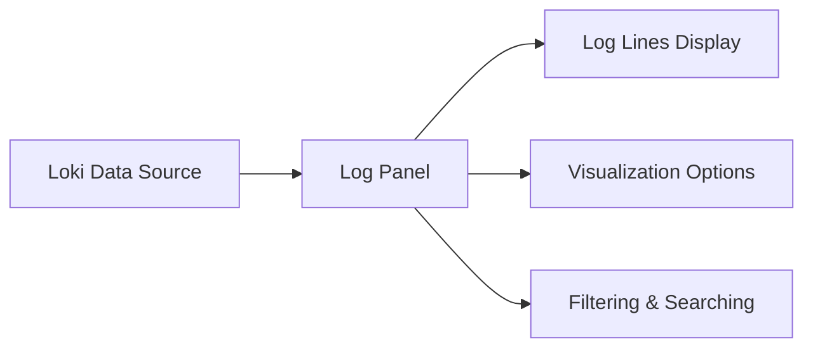

# Log Panel Configuration

## Introduction

Log panels in Grafana provide a powerful way to visualize and analyze log data from Loki and other logging data sources. Properly configured log panels allow you to quickly identify patterns, troubleshoot issues, and gain insights from your application and system logs. This guide will walk you through the process of configuring log panels in Grafana for use with Loki, helping you make the most of your log data.

## Understanding Log Panels

Log panels display your log data in a readable, searchable format. Unlike other visualization panels that aggregate data into charts or graphs, log panels show the actual log lines, making them ideal for debugging and detailed analysis.



## Basic Log Panel Setup

### Adding a Log Panel

To add a log panel to your Grafana dashboard:

1. Navigate to your dashboard and click the "Add panel" button
2. Select "Add a new panel"
3. In the visualization options, select "Logs"
4. Choose Loki as your data source

### Configuring the Query

The first step in setting up your log panel is configuring the Loki query:

```
{app="my-application", env="production"}
```

This simple LogQL query will fetch logs from the application named "my-application" in the production environment.

For more complex filtering, you can use LogQL operators:

```
{app="my-application"} |= "error" | logfmt | status_code >= 400
```

This query:
1. Selects logs from "my-application"
2. Filters for logs containing the word "error"
3. Parses logs in logfmt format
4. Further filters for status codes greater than or equal to 400

## Advanced Configuration Options

### Time Range Options

The time range selection affects how many logs are displayed. You can configure specific aspects of time handling:

- **Time column styles**: Controls how timestamps are displayed
- **Order**: Choose between showing newest logs first or oldest logs first
- **Resolution**: Adjust how detailed the time display is

### Visual Settings

Customize how your logs are displayed:

1. **Deduplication**: Removes duplicate log lines to reduce clutter
   - None: Show all logs
   - Exact: Hide exact duplicates
   - Numbers: Hide duplicates ignoring number differences
   - Signature: Hide duplicates with similar patterns

2. **Wrap lines**: Toggle whether long log lines should wrap or be truncated

3. **Pretty JSON**: Automatically formats JSON content in logs for better readability

Here's how to configure these settings:

1. Edit your log panel
2. Go to the "Panel options" tab
3. Scroll down to find the "Logs" section
4. Adjust the settings according to your needs

Example panel JSON configuration:

```json
{
  "options": {
    "showLabels": false,
    "showTime": true,
    "sortOrder": "Descending",
    "wrapLogMessage": true,
    "prettifyLogMessage": true,
    "enableLogDetails": true,
    "dedupStrategy": "exact",
    "showCommonLabels": false
  }
}
```

### Field Configuration

You can also customize which fields are displayed and how they're formatted:

1. Navigate to "Field" tab in the panel editor
2. Add field overrides for specific log fields
3. Configure options like:
   - Display name
   - Unit formatting
   - Color rules
   - Value mappings

## Practical Examples

### Example 1: Monitoring Application Errors

Let's set up a log panel to monitor application errors in real-time:

1. Create a new log panel
2. Configure a Loki query:
   ```
   {app="web-server", env="production"} |= "ERROR" | json
   ```
3. Set the time range to "Last 15 minutes"
4. Configure deduplication to "Signature" to group similar errors
5. Enable "Pretty JSON" to format error details

This panel will show recent error logs, helping you quickly identify and troubleshoot issues as they occur.

### Example 2: Creating a Multi-Service Log View

To monitor logs across multiple services:

1. Create a log panel
2. Add multiple Loki queries:
   ```
   {app="auth-service"}
   {app="payment-service"}
   {app="user-service"}
   ```
3. In the visualization options, enable "Show common labels" to see which service each log comes from
4. Set "Sort order" to "Descending" to see the newest logs first
5. Add a label filter to quickly switch between services

This configuration gives you a unified view of logs across your application's services, making it easier to track requests as they move through your system.

### Example 3: Creating Custom Log Formats

You can customize how log fields are displayed:

1. Configure your Loki query with parsing:
   ```
   {app="api-gateway"} | json | level="error"
   ```
2. Go to the "Field" tab
3. Add overrides for specific fields:
   - Make the "error" field red
   - Format the "latency" field as milliseconds
   - Hide less important fields

This creates a clean, focused view that highlights the most important information in your logs.

## Log Panel Interactions

Log panels in Grafana offer several interactive features:

- **Expand log lines**: Click on a log line to see the full content and all labels
- **Filter by label**: Click on labels to add them to the query filter
- **Context exploration**: Use the "Show context" feature to see logs before and after a specific log line
- **Linked visualizations**: Set up dashboard links to navigate to related panels

## Best Practices

1. **Query optimization**: Keep your Loki queries efficient to avoid slow loading times
2. **Use appropriate time ranges**: Shorter time ranges load faster and provide more focused information
3. **Leverage labels**: Use Loki's labeling system to make filtering more effective
4. **Combine with other panels**: Use log panels alongside metrics and other visualizations for comprehensive monitoring
5. **Create targeted panels**: Multiple focused log panels are often better than one general panel

## Troubleshooting Common Issues

### No Logs Appearing

If your log panel isn't showing any data:

1. Check your query syntax
2. Verify the time range (logs might be outside your selected range)
3. Confirm that logs are being sent to Loki
4. Check Loki's status and connectivity

### Panel Performance Issues

If your log panel is slow:

1. Narrow your time range
2. Add more specific filters to your query
3. Use label filters instead of text search when possible
4. Consider adjusting the query limit

## Summary

Log panels in Grafana provide a powerful interface for exploring and analyzing logs from Loki. By properly configuring your log panels, you can create efficient, focused views that help you monitor your applications, troubleshoot issues, and gain insights from your log data.

The key aspects of log panel configuration include:
- Setting up appropriate Loki queries
- Configuring visual options like deduplication and line wrapping
- Customizing field displays and formats
- Using interactive features for exploration

With these skills, you can create log panels that provide the information you need, when you need it.

## Additional Resources

- Explore LogQL, Loki's query language, to create more powerful queries
- Learn about alert creation based on log content
- Practice creating specialized log panels for different use cases
- Experiment with combining log data with metrics for correlated analysis