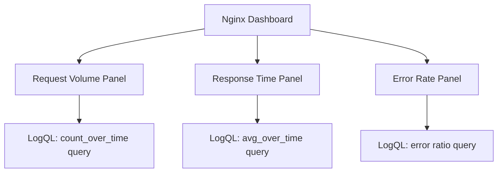

# Logs to Metrics

## Introduction

When monitoring applications and infrastructure, we often have two types of data: logs and metrics. Logs are text-based records of events that happened in your system, while metrics are numerical measurements of system behavior over time. 

While these data types serve different purposes, there's tremendous value in being able to extract metrics from logs. This process, known as "Logs to Metrics," allows you to:

- Quantify patterns in your log data
- Create visualizations based on log content
- Set up alerts based on log-derived metrics
- Correlate log events with performance metrics

In this guide, we'll explore how Grafana Loki allows you to transform logs into metrics using LogQL, Loki's query language. This powerful capability bridges the gap between qualitative log data and quantifiable metrics for monitoring and alerting.

## Understanding Logs to Metrics Conversion

### What Makes a Good Log-Based Metric?

Before diving into the technical implementation, let's understand what types of information in logs make good metrics:

1. **Numerical values** - Response times, error codes, request sizes
2. **Countable events** - Login attempts, API calls, errors 
3. **Categorical data** - HTTP status codes, error types, user actions

### Basic Concepts

When converting logs to metrics in Loki, we generally follow this process:

1. **Filter** the relevant logs using LogQL
2. **Extract** the values you care about (using patterns or parsing)
3. **Transform** these values into metrics using aggregation functions
4. **Visualize** the resulting metrics in Grafana dashboards

Let's see how this works in practice.

## Basic Log Metric Extraction with LogQL

Loki's LogQL language provides operators that allow you to extract and aggregate numerical data from your logs.

### Counting Log Lines

The simplest metric you can extract is a count of log occurrences. For example, to count error logs:

```logql
count_over_time({app="myapp"} |= "error" [5m])
```

This query:
1. Selects logs from the "myapp" application
2. Filters for logs containing the word "error"
3. Counts occurrences within 5-minute windows

### Extracting Numerical Values

To extract specific numerical values from logs, we use regex capture groups:

```logql
{app="webserver"} | regexp "request_time=(?P<request_time>[0-9.]+)" | unwrap request_time
```

This query:
1. Selects logs from the "webserver" application
2. Uses regex to extract the request time value
3. Unwraps the extracted value into a metric

### Aggregating Extracted Values

Once values are extracted, you can apply aggregation functions:

```logql
{app="webserver"} 
| regexp "request_time=(?P<request_time>[0-9.]+)" 
| unwrap request_time 
| avg_over_time[5m]
```

This calculates the average request time in 5-minute windows.

## Practical Examples

Let's go through some real-world examples of extracting metrics from different types of logs.

### Example 1: HTTP Response Times from Nginx Logs

Nginx logs typically contain response times. Let's extract and visualize these:

```logql
{job="nginx"} 
| regexp `.*HTTP/1\.\d" \d+ \d+ (?P<response_time>\d+\.\d+).*` 
| unwrap response_time 
| avg_over_time[1m]
```

This query:
1. Selects Nginx logs
2. Extracts the response time using regex
3. Calculates 1-minute average response times

In Grafana, you could visualize this as a time series graph showing how response times change over time.

### Example 2: Error Rate from Application Logs

Let's calculate an error rate from application logs:

```logql
sum(count_over_time({app="payment-service"} |= "ERROR" [1m])) 
/ 
sum(count_over_time({app="payment-service"} [1m]))
```

This query:
1. Counts error logs in 1-minute windows
2. Divides by the total number of logs to get an error rate percentage
3. Returns a metric that shows what percentage of logs are errors

### Example 3: Parsing JSON Logs

Many modern applications output logs in JSON format. Here's how to extract metrics from them:

```logql
{app="user-service"} 
| json 
| duration > 100ms 
| unwrap response_time_ms 
| sum_over_time[5m]
```

This query:
1. Selects logs from the user service
2. Parses them as JSON
3. Filters for slow responses (>100ms)
4. Extracts the response time
5. Sums these times over 5-minute windows

## Creating Log-Based Metrics Dashboards

Once you've defined your log-based metrics, you can visualize them in Grafana dashboards. Here's how:

1. Create a new dashboard in Grafana
2. Add a new panel
3. Select Loki as the data source
4. Enter your LogQL query
5. Configure visualization options (graph, gauge, etc.)

Let's see an example dashboard structure:



## Setting Up Alerts on Log-Derived Metrics

One of the most powerful features of converting logs to metrics is the ability to set up alerts based on log patterns.

For example, to alert when error rates exceed 5%:

1. Create a Grafana alert rule
2. Use your error rate LogQL query
3. Set a threshold condition (> 0.05)
4. Configure notification channels

Example alert definition:

```yaml
# Alert when error rate exceeds 5%
- name: HighErrorRate
  expr: sum(count_over_time({app="payment-service"} |= "ERROR" [5m])) / sum(count_over_time({app="payment-service"} [5m])) > 0.05
  for: 10m
  labels:
    severity: warning
  annotations:
    summary: High error rate detected
    description: Payment service error rate is above 5% for more than 10 minutes
```

## Advanced Techniques

### Using Vector Aggregation

LogQL supports vector aggregations similar to PromQL, allowing for more complex metric calculations:

```logql
sum by (status_code) (count_over_time({app="api"} | json | __error__="" [5m]))
```

This query counts log occurrences grouped by status code, creating a metric for each status code.

### Rate vs. Count

The `rate` function can be used instead of `count_over_time` to normalize results to a per-second value:

```logql
rate({app="api"} |= "error" [5m])
```

### Custom Labels and Metrics

You can create custom labels for your metrics using the `label_format` operator:

```logql
{app="webserver"} 
| json 
| label_format service_level=`{{.status}}xx` 
| unwrap response_time
```

This would create metrics with service level labels like "20x", "40x", etc.

## Best Practices

When implementing logs to metrics conversions, consider these best practices:

1. **Focus on actionable metrics** - Convert logs to metrics that help you make decisions
2. **Consider cardinality** - Too many unique label values can cause performance issues
3. **Balance precision and performance** - More detailed metrics require more processing
4. **Start simple** - Begin with basic counts before complex extractions
5. **Document your queries** - LogQL queries can become complex; documentation helps

## LogQL Cheat Sheet for Metrics Extraction

Here's a quick reference of useful LogQL functions for metrics extraction:

| Function          | Description                        | Example                                                             |
|-------------------|------------------------------------|---------------------------------------------------------------------|
| `count_over_time` | Count log lines over a time period | `count_over_time({app="auth"} \|= "failed" [5m])`                   |
| `rate`            | Per-second rate of log lines       | `rate({app="api"} [5m])`                                            |
| `unwrap`          | Extract a value as a sample        | `{app="web"} \| json \| unwrap duration_ms`                         |
| `avg_over_time`   | Average of values over time        | `avg_over_time({job="nginx"} \| regexp \| unwrap time [5m])`        |
| `sum_over_time`   | Sum of values over time            | `sum_over_time({app="orders"} \| json \| unwrap order_total [5m])`  |
| `max_over_time`   | Maximum value over time            | `max_over_time({app="api"} \| regexp \| unwrap response_time [5m])` |

## Summary

Converting logs to metrics bridges the gap between qualitative log data and quantifiable metrics. With Grafana Loki and LogQL, you can:

- Extract numerical data from your logs
- Aggregate this data into meaningful metrics
- Visualize patterns and trends in your log data
- Set up alerts based on log-derived metrics

This capability provides a more complete monitoring solution, especially for applications that don't directly expose metrics or when you need to correlate logs with performance data.

## Further Learning

To deepen your understanding of logs to metrics conversion in Grafana Loki, try these exercises:

1. Extract and visualize response times from your application logs
2. Create an error rate dashboard for your services
3. Set up an alert for unusual patterns in your logs
4. Experiment with different aggregation functions
5. Try combining log-derived metrics with traditional metrics

Remember that effective monitoring combines both logs and metrics for a complete picture of your system's health and performance.