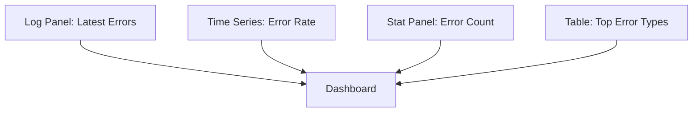
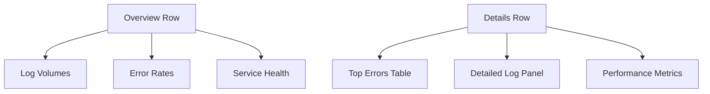

# Visualization Techniques

## Introduction

Effective visualization is crucial for making sense of the vast amounts of log data collected by Loki. Grafana provides powerful tools to transform raw logs into insightful visualizations that help you identify patterns, anomalies, and trends. This guide will walk you through various visualization techniques specifically designed for Loki log data in Grafana.

## Understanding Grafana's Visualization Options

Grafana offers a wide range of visualization panels that can be used with Loki data. Each visualization type serves different analytical purposes.

### Common Visualization Types for Loki Data

Grafana provides several visualization types that work particularly well with log data:

1. **Log Panel** - Displays raw log lines with filtering capabilities
2. **Time Series** - Shows trends over time based on log metrics
3. **Bar Gauge** - Visualizes single values with thresholds
4. **Stat Panel** - Displays big numbers with optional sparklines
5. **Heatmaps** - Shows data density patterns across time
6. **Tables** - Displays structured log data in tabular format

## Log Panel Visualization

The Log panel is the most basic yet essential visualization for log data.

### Basic Log Panel Setup

```javascript
// Loki Query Example
{job="myapp"} |= "error"
```

This simple query will display all logs from the "myapp" job containing the word "error".

### Enhancing Log Visualization

You can improve your log panel with these techniques:

1. **Coloring by Log Level**

Navigate to the Visualization tab and under "Display", enable "Color by field" and select the "level" field. This automatically colors your logs based on severity.

2. **Adding Derived Fields**

Derived fields let you extract and link to external systems:

```javascript
// Configuration in Loki Data Source Settings
{
  "name": "trace_id",
  "pattern": "traceID=(\\w+)",
  "url": "http://tempo:3100/trace/${__value.raw}"
}
```

This extracts trace IDs from logs and makes them clickable links to Tempo for distributed tracing.

## Time Series Visualization

Time series panels are perfect for visualizing log metrics over time.

### Creating a Log Rate Visualization

To visualize error rates over time:

```javascript
// Loki Query Example
sum(count_over_time({job="myapp"} |= "error"[5m])) by (job)
```

This query counts error occurrences in 5-minute windows, grouped by job.

### Log Rate Comparison Visualization

To compare error rates across services:

```javascript
// Loki Query Example
sum(count_over_time({job=~"service-.*"} |= "error"[5m])) by (job)
```

### Adding Alerts to Visualizations

You can add alerts to your time series visualization:

1. Click on the panel title
2. Select "Edit"
3. Navigate to the "Alert" tab
4. Define your alert conditions

For example, an alert when error rates exceed normal:

```javascript
// Alert Condition Example
WHEN max() OF query(A, 5m, now) > 100
```

## Bar Gauge and Stat Panel

These visualizations are perfect for displaying key metrics at a glance.

### Error Count Stat Panel

```javascript
// Loki Query Example
sum(count_over_time({job="myapp"} |= "error"[24h]))
```

This displays the total error count for the past 24 hours.

### Multiple Stats Comparison

```javascript
// Loki Query Example
sum(count_over_time({job="myapp"} |= "error"[24h])) by (severity)
```

This breaks down errors by severity level.

## Table Visualization

Tables are excellent for structured log data analysis.

### Creating a Top Errors Table

```javascript
// Loki Query Example
topk(10, sum(count_over_time({job="myapp"} |= "error"[24h])) by (error_type))
```

This shows the top 10 error types in the past 24 hours.

### Adding Instant Calculations

Use Transformations to add calculations to your table:

1. Go to the Transformations tab
2. Add "Add field from calculation"
3. Choose a calculation (e.g., percentage of total)

## Advanced Visualization Techniques

### Log Patterns Visualization

Visualizing common log patterns can help identify recurring issues:

```javascript
// Loki Query Example
{job="myapp"} | pattern
```

This uses Loki's pattern parser to group similar log lines.

### Log Volume Heatmap

A heatmap can show log volume density over time:

```javascript
// Loki Query Example
sum(count_over_time({job="myapp"}[5m])) by (level)
```

Configure the visualization as a heatmap with "level" as the Y-axis.

### Service Health Overview

Create a dashboard that combines multiple visualization types:



## Creating Effective Dashboards

Individual visualizations are powerful, but combining them into dashboards provides comprehensive insights.

### Dashboard Organization Best Practices

1. **Group Related Metrics** - Keep related visualizations together
2. **Use Variables** - Create dashboard variables for filtering:

```javascript
// Variable Query Example
label_values(job)
```

3. **Consistent Time Ranges** - Use the same time ranges for comparable panels
4. **Add Context** - Use text panels to explain dashboard components
5. **Progressive Disclosure** - Arrange panels from high-level to detailed information

### Sample Dashboard Layout



## Integration with Loki's LogQL

Mastering LogQL is essential for creating powerful visualizations.

### Using Metrics Queries

For time series visualizations:

```javascript
// Rate of error logs
rate({job="myapp"} |= "error"[5m])

// Quantify by extracting and counting numeric values
sum by (job) (
  count_over_time({job="myapp"} |= "latency=" | regexp `latency=(?P<value>[0-9]+)` | unwrap value [5m])
)
```

### Using Label Filters Effectively

Refine your visualizations with precise label filters:

```javascript
// Filter by multiple labels
{job="myapp", env="production", component="api"}

// Exclude with negative matching
{job="myapp"} != "debug"

// Regular expression matching
{job=~"service-.*"}
```

## Practical Example: Monitoring API Performance

Let's create a practical example dashboard for monitoring API performance:

1. **Error Rate Panel**:

```javascript
// Loki Query
sum(rate({job="api-service"} |= "ERROR" [5m])) by (endpoint)
```

2. **Latency Histogram**:

```javascript
// Loki Query
{job="api-service"} 
| regexp `latency=(?P<latency>[0-9]+)` 
| unwrap latency 
| histogram(latency, 10, 100, 200, 500, 1000, 2000)
```

3. **Status Code Distribution**:

```javascript
// Loki Query
sum(count_over_time({job="api-service"} | regexp `status=(?P<status>[0-9]+)` [1h])) by (status)
```

Configure this as a pie chart to visualize the distribution of HTTP status codes.

## Optimization Tips for Large-Scale Visualizations

When working with large volumes of log data, optimization becomes critical:

1. **Narrow Time Ranges** - Use shorter time ranges for detailed analysis
2. **Limit Label Cardinality** - Avoid grouping by high-cardinality labels
3. **Use Efficient Queries** - Filter logs as early as possible in your query
4. **Consider Aggregation** - Use pre-computed metrics when possible
5. **Implement Caching** - Enable query caching in Grafana

## Troubleshooting Visualization Issues

Common issues and their solutions:

1. **No Data Shows Up**
   - Check if your time range contains data
   - Verify your query syntax
   - Ensure the Loki data source is configured correctly

2. **Slow Visualizations**
   - Simplify your LogQL queries
   - Use more specific label filters
   - Check Loki's query limits

3. **Inaccurate Results**
   - Verify your metric calculation
   - Check for duplicate log entries
   - Adjust rate() and count_over_time() intervals

## Summary

Effective visualization of Loki log data in Grafana is a powerful skill that helps you gain insights from your logs. By mastering various visualization techniques, you can:

- Monitor system health in real-time
- Detect anomalies and troubleshoot issues faster
- Identify trends and patterns in log data
- Create comprehensive dashboards for different stakeholders

Remember that the best visualizations balance simplicity with informativeness. Start with basic panels and progressively add complexity as you become more comfortable with Grafana and Loki.

## Exercises

1. Create a time series visualization showing error rates for a specific service
2. Build a table showing the top 10 most frequent log messages
3. Design a dashboard with at least three different visualization types
4. Create a visualization that extracts and displays latency information from logs
5. Implement an alert based on a log pattern visualization

## Further Reading

- Grafana Official Documentation for Loki Data Source
- LogQL Query Language Reference
- Dashboard Best Practices Guide
- Alerting with Grafana and Loki