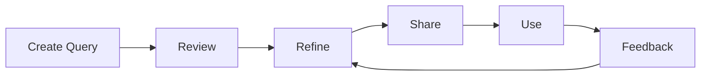

# Shared Queries in Grafana Loki

## Introduction

When working with Grafana Loki in a team environment, you'll often find multiple team members creating similar queries to analyze the same log data. This redundancy can lead to inconsistencies and wasted effort. Grafana's shared queries feature addresses this challenge by allowing users to save, share, and reuse queries across the organization.

In this guide, we'll explore how to effectively use shared queries in Grafana Loki to improve collaboration, maintain consistency, and enhance productivity across your team.

## What Are Shared Queries?

Shared queries are pre-configured Loki queries that can be saved and made available to other users within your Grafana instance. They serve several important purposes:

- **Standardization**: Ensure everyone uses the same query logic for consistent analysis
- **Knowledge Sharing**: Allow experts to create optimized queries for others to use
- **Efficiency**: Reduce duplicate work and save time
- **Onboarding**: Help new team members quickly access useful queries

## Setting Up Shared Queries

### Prerequisites

Before working with shared queries, ensure you have:

- Grafana v7.0 or newer
- Loki data source configured
- Appropriate permissions (Editor or Admin role)

### Creating a Shared Query

Let's walk through the process of creating and sharing a Loki query:

1. Navigate to the Explore view in Grafana
2. Select your Loki data source
3. Create your query using LogQL
4. Click the "Save" button in the query editor toolbar

Here's an example of creating a basic shared query to track error logs:

```
{app="payment-service"} |= "error" | json | status_code>=400
```

When saving, you'll be prompted to:
- Name your query (e.g., "Payment Service Errors")
- Add a description (e.g., "Shows all payment service errors with HTTP status codes 400 and above")
- Set permissions (Private, Team, or Public)

### Managing Shared Queries

To manage your shared queries:

1. Click on the "Queries" tab in the sidebar
2. You'll see a list of all queries you have access to
3. From here you can:
   - Edit existing queries
   - Delete queries you own
   - Clone queries to create variations
   - Change sharing permissions

## Using Shared Queries

### Accessing Shared Queries

To use a shared query:

1. Open the Explore view
2. Click on the "Queries" dropdown
3. Browse available queries or use the search function
4. Select the query you want to use

The query will be loaded into your query editor, where you can:
- Use it as-is
- Modify it for your current needs (without changing the saved version)
- Save your modifications as a new shared query

### Example: Shared Error Tracking Query

Let's look at a practical example of a shared query for tracking application errors across multiple services:

```
{environment="production"} 
| json 
| service=~"auth-service|payment-service|user-service" 
| level="error" 
| count_over_time([1h]) 
| sum by (service)
```

This query:
1. Filters logs from production environment
2. Parses JSON fields
3. Filters for specific services
4. Looks for error-level logs
5. Counts errors per hour
6. Groups results by service

Team members can use this query to monitor errors across key services without needing to understand all the LogQL syntax.

## Advanced Shared Query Techniques

### Using Variables in Shared Queries

You can make shared queries more flexible by incorporating Grafana variables:

```
{environment="$env"} 
| json 
| service=~"$services" 
| level="$log_level"
| count_over_time([$timeframe])
```

Users can then set the variables when using the query:
- `$env`: "production", "staging", "development"
- `$services`: Select which services to include
- `$log_level`: "error", "warn", "info"
- `$timeframe`: Time period for analysis

### Creating Query Libraries

For larger organizations, consider organizing queries into logical libraries:

- **Performance Queries**: Latency, throughput, performance bottlenecks
- **Error Tracking**: Exception monitoring, error rates, failure analysis
- **Security Monitoring**: Authentication failures, access attempts, security anomalies
- **User Activity**: Session tracking, feature usage, user journey analysis

## Best Practices for Shared Queries

### Naming Conventions

Establish consistent naming patterns for your shared queries:

- **[Category]-[Subsystem]-[Purpose]**
  - Example: "Perf-API-ResponseTime"
  - Example: "Sec-Auth-FailedLogins"

### Documentation

Always include detailed descriptions with your shared queries:

- What the query shows
- When to use it
- How to interpret results
- Any limitations or caveats

For example:

```
Description: This query tracks failed login attempts across all services. 
Use it to detect potential brute force attacks or authentication issues. 
Results show total failures grouped by IP address. 
Note: Only includes explicit failures, not timeouts.
```

### Query Optimization

Optimize shared queries for performance:

- Add specific label filters first (`{app="auth"}`)
- Use precise text matches (`|= "exact text"`)
- Limit time ranges when possible
- Apply line filtering before parsing with `json` or `logfmt`

### Version Control

Consider implementing a version control strategy for important queries:

```
# Payment Error Tracking v2.1
# Updated: 2025-03-15
# Changes: Added status_code filtering, improved performance
{app="payment"} |= "error" | json | status_code>=400
```

## Integration with Dashboards

Shared queries can be incorporated into dashboards for continuous monitoring:

1. Create and save your shared query
2. Create a new dashboard panel
3. Reference the shared query ID in the panel configuration
4. Add visualizations and thresholds

This allows you to maintain consistency between ad-hoc exploration and dashboard displays.

## Collaborative Workflows with Shared Queries

Shared queries enable effective team workflows:

1. **Query Development**: Experts create optimized, reliable queries
2. **Review Process**: Team reviews and refines queries
3. **Publication**: Approved queries are shared with appropriate permissions
4. **Usage**: Team members use queries for daily work
5. **Iteration**: Queries are updated as needs evolve



## Troubleshooting Shared Queries

Common issues and solutions:

| Issue | Possible Solution |
|-------|-------------------|
| Query not visible to team | Check sharing permissions |
| Query returns no results | Verify label filters and time range |
| Query performance is slow | Optimize filters, narrow time range |
| Variable substitution not working | Check variable syntax and availability |

## Summary

Shared queries in Grafana Loki provide a powerful way to standardize log analysis across your organization. By creating, sharing, and maintaining a library of well-documented queries, you can:

- Improve team productivity
- Ensure consistent analysis methods
- Share knowledge between experts and beginners
- Reduce redundant work
- Maintain institutional knowledge

As your Loki implementation grows, developing a thoughtful strategy for shared queries will help your team extract maximum value from your logging data.

## Additional Resources

To continue learning about Grafana Loki shared queries:

- Practice creating queries of varying complexity
- Experiment with different sharing permissions
- Create a query library for your most common use cases
- Set up a review process for shared queries in your team

## Exercises

1. Create a shared query that tracks error rates across your application stack and share it with your team.
2. Modify an existing shared query to make it more flexible using variables.
3. Create a set of related queries that monitor different aspects of a specific service.
4. Design a naming convention for shared queries in your organization.
5. Build a dashboard that incorporates several shared queries.