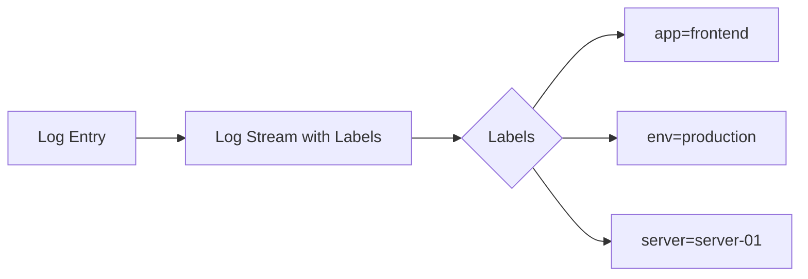

# Labels Introduction

When working with Grafana Loki, one of the most important concepts to understand is **labels**. If you're familiar with Prometheus, you'll find Loki's label system quite similar, as it was designed with the same principles in mind.

## What Are Labels?

Labels in Loki are key-value pairs attached to log streams that serve as metadata for identifying and querying logs. They provide a way to categorize and organize your logs, making them easier to search, filter, and analyze.



Think of labels as tags or attributes that help describe and categorize your log data. Each log stream in Loki is uniquely identified by its set of labels.

## Why Labels Matter

Labels are fundamental to Loki's architecture and performance for several reasons:

1. **Efficient Querying**: Loki is designed to be queried by label first, then filtered by log content. This approach makes searches fast and efficient.

2. **Horizontal Scaling**: Labels help Loki distribute log data across different storage instances, enabling better scalability.

3. **Organization**: Labels provide a logical way to organize vast amounts of log data from different sources.

4. **Compatibility**: Labels align with the broader Grafana ecosystem, particularly with Prometheus metrics, enabling unified observability.

## Basic Label Structure

Labels follow a simple `key=value` format:

```
{app="frontend", environment="production", server="web-01"}
```

Every log stream in Loki must have at least one label, and each unique combination of labels defines a separate stream.

## Label Sources

Labels can come from different sources:

### 1. Static Labels

These are fixed labels defined in your logging configuration:

```yaml
scrape_configs:
  - job_name: system
    static_configs:
    - targets:
        - localhost
      labels:
        job: varlogs
        env: production
        __path__: /var/log/*log
```

### 2. Dynamic Labels

Labels extracted from log content or file paths:

```yaml
scrape_configs:
  - job_name: system
    pipeline_stages:
      - regex:
          expression: '^\w+ (?P<level>\w+) (?P<component>\w+):'
      - labels:
          level:
          component:
```

### 3. Service Discovery Labels

Labels that come from service discovery mechanisms like Kubernetes:

```yaml
scrape_configs:
  - job_name: kubernetes-pods
    kubernetes_sd_configs:
      - role: pod
    relabel_configs:
      - source_labels: [__meta_kubernetes_pod_label_app]
        target_label: app
      - source_labels: [__meta_kubernetes_pod_container_name]
        target_label: container
```

## Practical Example: Structuring Labels for a Web Application

Let's consider a web application with frontend and backend components running in different environments:

```yaml
scrape_configs:
  # Frontend logs
  - job_name: frontend
    static_configs:
    - targets:
        - localhost
      labels:
        app: myapp
        component: frontend
        env: production
        __path__: /var/log/frontend/*.log

  # Backend logs
  - job_name: backend
    static_configs:
    - targets:
        - localhost
      labels:
        app: myapp
        component: backend
        env: production
        __path__: /var/log/backend/*.log

  # Extract additional labels from log content
  pipeline_stages:
    - regex:
        expression: '^\w+ (?P<level>\w+) \[(?P<module>\w+)\]'
    - labels:
        level:
        module:
```

With this configuration:

1. All logs are labeled with `app=myapp` and `env=production`
2. Logs are separated by `component` (frontend/backend)
3. Log levels and modules are extracted from log content and added as labels

## Querying Logs Using Labels

In LogQL (Loki's query language), labels are used as the primary selection mechanism:

```
{app="myapp", component="frontend", level="error"}
```

This query selects all error logs from the frontend component of myapp.

You can also use label matching operators:

```
{app="myapp", component=~"front.*|back.*", level!="debug"}
```

This selects all non-debug logs from components that start with "front" or "back".

## Best Practices for Labels

1. **Be Selective with Labels**
   
   Each unique combination of label values creates a new stream in Loki. Too many high-cardinality labels can impact performance.

   ```
   # Good - Low cardinality labels
   {app="frontend", environment="production", log_level="error"}

   # Bad - High cardinality labels
   {app="frontend", environment="production", user_id="12345", request_id="abc-123-def-456"}
   ```

2. **Use Consistent Naming Conventions**

   Establish and follow consistent naming patterns for your labels.

   ```
   # Consistent naming
   {app="frontend", env="production", region="us-west"}

   # Inconsistent naming
   {application="frontend", environment="production", aws_region="us-west"}
   ```

3. **Labels for Infrastructure, Content for Details**

   Use labels for identifying log sources, not for storing information that should be in the log content.

   ```
   # Good
   {app="payment-service", env="production"} | json | order_id="12345"

   # Bad
   {app="payment-service", env="production", order_id="12345"}
   ```

4. **Limit the Number of Labels**

   Keep the number of labels per stream reasonable (typically under 10).

5. **Plan for Scale**

   Consider how your labeling scheme will work as your infrastructure grows.

## Common Labeling Patterns

### Hierarchical Labels

Organizing labels in a hierarchical manner:

```
{
  region="us-west",
  datacenter="dc1",
  rack="rack-a12",
  server="server-0021"
}
```

### Application-Centric Labels

Focusing on application-specific attributes:

```
{
  app="shopping-cart",
  service="checkout",
  version="v2.3",
  instance="pod-123abc"
}
```

### Environment-Based Labels

Separating logs by deployment environment:

```
{
  env="production",
  tier="web",
  instance="web-01"
}
```

## Summary

Labels in Loki are powerful metadata that help organize, query, and manage your logs efficiently. They act as the primary index for all log data, making them crucial for both performance and usability.

Key points to remember:

- Labels are key-value pairs attached to log streams
- They provide the primary mechanism for querying logs
- Labels should have low cardinality to maintain performance
- Static labels come from configuration, dynamic labels from log content
- Well-designed labels make log exploration and troubleshooting much easier

By following the best practices outlined in this guide, you'll be able to design an effective labeling strategy for your Loki deployment, ensuring efficient log storage and retrieval.

## Additional Exercises

1. Design a labeling scheme for a microservice architecture with 5 services.
2. Create a Loki configuration that extracts dynamic labels from JSON-formatted logs.
3. Write LogQL queries that use label matching operators to filter logs from different environments.
4. Analyze your current logging setup and identify high-cardinality labels that might cause issues in Loki.

## Next Steps

In the next section, we'll explore how to effectively use Loki's metadata alongside labels to create even more powerful log management capabilities.