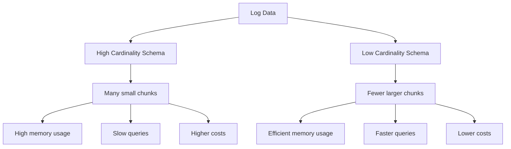

# Designing Label Schemas

## Introduction

Labels are at the heart of Grafana Loki's log management system. They are key-value pairs attached to log streams that allow for efficient querying, filtering, and organizing of your logs. A well-designed label schema can drastically improve query performance, reduce operational costs, and make troubleshooting much easier.

In this guide, we'll explore how to design effective label schemas for your Loki deployment, understanding the tradeoffs involved, and learning best practices that will help you avoid common pitfalls.

## Understanding Labels in Loki

Before diving into schema design, let's clarify what labels are in Loki:

- **Labels**: Key-value pairs that identify and categorize log streams
- **Log Stream**: A series of log entries with the exact same label set
- **Cardinality**: The number of unique label combinations in your system

Labels in Loki serve a similar purpose to labels in Prometheus, with one key distinction: while high cardinality is often desirable in metrics for granular insights, it can be problematic in Loki due to the way log data is stored and queried.

## Label Schema Design Principles

### 1. Keep Cardinality Under Control

The most important principle in Loki label design is controlling cardinality. High cardinality leads to:

- Increased memory usage
- Slower queries
- Higher operational costs
- Potential system instability

Let's visualize what happens with high vs. low cardinality label schemas:



### 2. Choose Static Labels

Prefer labels that don't change frequently for a given application or service. Good candidates include:

- `app` or `service`: The application or service name 
- `env`: Environment (prod, staging, dev)
- `region` or `datacenter`: Physical or cloud location
- `namespace`: Kubernetes namespace
- `job`: The type of job/process generating logs

### 3. Avoid High-Cardinality Fields as Labels

Never use these high-cardinality fields as labels:

- User IDs
- Request IDs
- Session IDs
- IP addresses
- Timestamps
- Unique object identifiers

Instead, put this information in the log content itself, where it can be queried using LogQL filters.

## Practical Examples

Let's look at some examples of good and bad label schemas.

### Example 1: Poor Label Schema (High Cardinality)

```yaml
scrape_configs:
  - job_name: application_logs
    static_configs:
      - targets: [localhost]
        labels:
          job: application
          env: production
          instance: "{{.pod_name}}"
          user_id: "{{.user_id}}"
          request_id: "{{.request_id}}"
```

This schema is problematic because:
- `user_id` could have thousands or millions of values
- `request_id` is unique per request, creating a new stream for each request
- `instance` using pod names in Kubernetes can be highly dynamic

### Example 2: Improved Label Schema (Controlled Cardinality)

```yaml
scrape_configs:
  - job_name: application_logs
    static_configs:
      - targets: [localhost]
        labels:
          job: application
          env: production
          component: api
          tier: frontend
```

This schema is better because:
- All labels are static or low cardinality
- High-cardinality information can still be included in the log content
- The number of unique label combinations is limited

### Example 3: Real-world Kubernetes Example

For Kubernetes environments, a good practice is to use a Promtail pipeline that carefully controls which Kubernetes metadata becomes labels:

```yaml
scrape_configs:
  - job_name: kubernetes-pods
    kubernetes_sd_configs:
      - role: pod
    relabel_configs:
      # Keep only necessary labels
      - action: labelmap
        regex: __meta_kubernetes_pod_label_app
        replacement: app
      - action: labelmap
        regex: __meta_kubernetes_namespace
        replacement: namespace
      - action: labelmap
        regex: __meta_kubernetes_pod_node_name
        replacement: node
      # Drop other potentially high-cardinality labels
      - action: labeldrop
        regex: __meta_kubernetes_pod_uid
      - action: labeldrop
        regex: __meta_kubernetes_pod_ip
```

## LogQL with Label Schemas

A well-designed label schema makes your LogQL queries more efficient. Here are some examples:

Basic filtering by labels:

```
{app="payment-service", env="production", namespace="finance"}
```

Combining label filtering with log content search:

```
{app="payment-service", env="production", namespace="finance"} |= "error" | json | order_id != "" | user_email =~ ".*@example.com"
```

Notice how labels are used for initial filtering, while log content fields (`order_id`, `user_email`) are filtered afterward.

## Balancing Act: Common Scenarios and Solutions

Let's look at common scenarios and how to approach them:

### Scenario 1: Microservices Architecture

In a microservices environment with dozens or hundreds of services:

**Do:**
- Use labels for service name, environment, and broad component categories
- Keep deployment-specific information in the log content

**Don't:**
- Create unique label combinations for each instance of each service
- Add version numbers as labels (unless you have very few versions running simultaneously)

### Scenario 2: Multi-tenant Applications

For applications serving multiple customers or tenants:

**Do:**
- Use customer segmentation as labels only if you have a small number of customers
- Consider using tenant category or tier as a label instead of tenant ID

**Don't:**
- Add individual tenant/customer IDs as labels
- Create separate streams for each user's actions

### Scenario 3: Geographic Distribution

For globally distributed applications:

**Do:**
- Use region, datacenter, or availability zone as labels
- Group by meaningful geographic units

**Don't:**
- Use fine-grained location data like city or precise coordinates as labels

## Best Practices Checklist

Use this checklist when designing your label schema:

- [ ] Keep the total number of label combinations under 10,000 per tenant
- [ ] Use no more than 5-10 different labels for most applications
- [ ] Ensure labels are static or change infrequently 
- [ ] Put dynamic, unique identifiers in log content, not labels
- [ ] Test your schema with realistic data volumes
- [ ] Monitor cardinality growth over time
- [ ] Regularly review and refine your label strategy

## Monitoring Your Label Cardinality

It's important to monitor your label cardinality. You can use Loki's metrics to track this:

```
# Count of active streams by tenant
sum by (tenant) (loki_ingester_memory_streams)

# Series cardinality by tenant
sum by (tenant) (loki_ingester_tsdb_index_entries)
```

Set up alerts if these values grow beyond expected thresholds.

## Common Pitfalls to Avoid

1. **Dynamic Pod Names**: In Kubernetes, pod names contain random suffixes. Using the full pod name as a label creates high cardinality.

2. **Version Explosion**: Adding build numbers or commit hashes as labels leads to high cardinality, especially with frequent deployments.

3. **Too Granular**: Creating labels for every possible filter dimension makes the system inefficient.

4. **Too Coarse**: Having too few labels makes filtering difficult and can lead to scanning excessive amounts of log data.

5. **Inconsistent Naming**: Using different label naming conventions across services makes querying more difficult.

## Label Schema Evolution

As your system grows, you may need to evolve your label schema. Here are some tips:

1. **Plan for Growth**: Design with future scale in mind
2. **Gradual Changes**: Phase in schema changes gradually
3. **Monitor Impact**: Watch for performance changes during transitions
4. **Documentation**: Keep your label standards documented

## Summary

Designing an effective label schema for Grafana Loki requires balancing query flexibility with performance considerations. Remember these key points:

- Keep cardinality under control by using static, low-cardinality labels
- Put high-cardinality information in log content, not labels
- Design for current needs but plan for future growth
- Monitor label cardinality regularly and adjust as needed

A well-designed label schema will make your Loki deployment more efficient, cost-effective, and easier to use for troubleshooting and analysis.

## Exercises

1. Review an existing application and design an appropriate Loki label schema for it.
2. Calculate the potential cardinality of a given label schema with realistic data volumes.
3. Take a high-cardinality label schema and refactor it to be more efficient.
4. Write LogQL queries that effectively use labels for filtering while using log content for detailed searches.

## Additional Resources

- [Grafana Loki Documentation on Labels](https://grafana.com/docs/loki/latest/fundamentals/labels/)
- [LogQL Documentation](https://grafana.com/docs/loki/latest/logql/)
- [Cardinality in Loki](https://grafana.com/blog/2020/04/21/how-labels-in-loki-can-make-log-queries-faster-and-easier/)