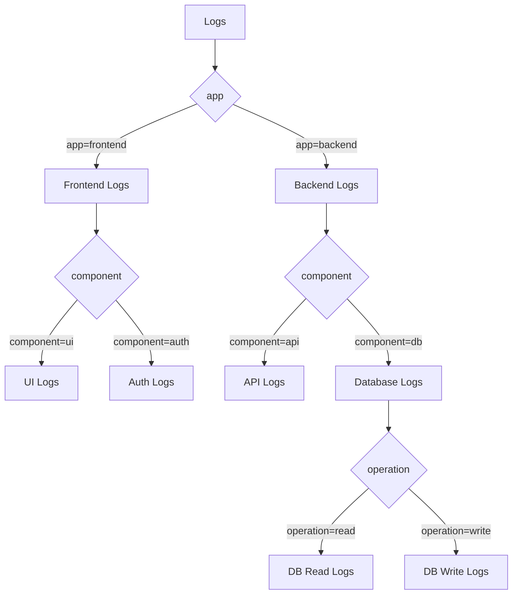

# Application Labels

## Introduction

Application labels are a fundamental concept in Grafana Loki that helps you categorize and identify log streams based on their source application. In a microservices architecture or any environment with multiple applications generating logs, application labels provide a way to quickly filter and query logs from specific applications or services.

In this guide, we'll explore how to effectively use application labels in Loki to organize your logs and improve your observability workflow.

## What Are Application Labels?

Application labels are key-value pairs attached to log streams that identify which application or service generated those logs. The most common application label is `app`, though you might also see variations like `application`, `service`, or `component` depending on your organization's naming conventions.

These labels become part of Loki's label system, which follows a similar model to Prometheus labels. Let's examine what makes application labels special and how they fit into Loki's label hierarchy.

## Why Application Labels Matter

Application labels provide several important benefits:

1. **Quick filtering** - Easily isolate logs from a specific application
2. **Reduced query complexity** - Simplify log queries by starting with application context
3. **Cross-application correlation** - Compare logs across different applications during incident investigation
4. **Consistent organization** - Establish a standardized approach to log categorization

## Setting Up Application Labels

There are several ways to add application labels to your logs:

### 1. Using Promtail

[Promtail](https://grafana.com/docs/loki/latest/clients/promtail/) is Loki's official log shipping agent. You can configure it to add application labels to logs it collects.

Here's a basic example of configuring Promtail to add application labels:

```yaml
scrape_configs:
  - job_name: application_logs
    static_configs:
      - targets:
          - localhost
        labels:
          app: user-service
          component: api
          environment: production
    pipeline_stages:
      - json:
          expressions:
            level: level
            message: message
      - labels:
          level:
```

This configuration tells Promtail to:
- Add static labels `app: user-service`, `component: api`, and `environment: production` to all logs collected by this job
- Parse JSON logs to extract `level` and `message` fields
- Set the `level` field as an additional label

### 2. Using Docker Driver

If you're running applications in Docker containers, you can use the Loki Docker driver to send logs directly to Loki with application labels:

```bash
docker run --log-driver=loki \
    --log-opt loki-url="http://loki:3100/loki/api/v1/push" \
    --log-opt loki-external-labels="app=payment-service,environment=staging" \
    your-docker-image
```

### 3. Using Log Libraries

You can also add application labels directly in your application code using various logging libraries. For example, with Go and Promtail:

```go
package main

import (
    "github.com/sirupsen/logrus"
    loki "github.com/grafana/loki/pkg/logql"
)

func main() {
    log := logrus.New()
    
    // Configure logger with application labels
    log.WithFields(logrus.Fields{
        "app": "inventory-service",
        "component": "database",
    }).Info("Database connection established")
}
```

## Best Practices for Application Labels

To get the most out of application labels, follow these best practices:

1. **Be consistent with naming** - Standardize on label names like `app` or `service` across your organization
2. **Use hierarchical labels when needed** - For complex applications, consider labels like `app`, `component`, and `subcomponent`
3. **Keep label values simple** - Use short, descriptive names without special characters
4. **Avoid high cardinality** - Don't use values that change frequently (like user IDs or request IDs) as application labels
5. **Combine with other labels** - Pair application labels with environment labels (`env: production`) and instance labels (`instance: web-server-01`)

## Querying Logs Using Application Labels

Application labels shine when querying logs in Loki. Here are some example queries:

### Basic Filtering by Application

To view all logs from a specific application:

```logql
{app="auth-service"}
```

### Combining Application and Level Filters

To find error logs from a specific application:

```logql
{app="payment-service", level="error"}
```

### Finding Logs Across Related Services

To investigate a transaction flowing through multiple services:

```logql
{app=~"(payment|order|notification)-service"} |= "transaction_id=abc123"
```

### Rate of Errors by Application

To visualize error rates across applications:

```logql
sum by(app) (rate({level="error"}[5m]))
```

## Real-World Example: Microservices Debugging

Let's look at a practical example of using application labels in a microservices environment.

Imagine you have an e-commerce platform with these services:
- `product-catalog`
- `shopping-cart`
- `payment-processor`
- `order-fulfillment`
- `notification-service`

When a customer reports a failed order, you can trace the request through each service:

1. First, find the error in the order service:

```logql
{app="order-fulfillment", level="error"} |= "order_id=12345"
```

2. Look for the payment that triggered this order:

```logql
{app="payment-processor"} |= "order_id=12345"
```

3. Check if notifications were sent to the customer:

```logql
{app="notification-service"} |= "order_id=12345"
```

Application labels make this workflow much simpler than searching through all logs or maintaining separate log storage for each application.

## Visualizing Application Log Data

Application labels can also power useful Grafana dashboards. Here's an example of a Loki query that visualizes log volume by application:

```logql
sum by(app) (count_over_time({job="application_logs"}[5m]))
```

This query can be used in a Grafana panel to create a stacked graph showing log volume by application over time, helping you identify unusual patterns or spikes in log generation.

## Application Label Hierarchies with Mermaid

Let's visualize how application labels can be organized in a hierarchical manner:



This diagram shows how application labels can form a hierarchy, allowing you to drill down from high-level application categories to specific components and operations.

## Summary

Application labels are a powerful way to organize and query your logs in Grafana Loki. By consistently applying these labels across your infrastructure, you can:

- Quickly filter logs by application source
- Simplify complex queries
- Correlate events across services
- Build meaningful visualizations

As your logging needs grow, application labels provide a scalable foundation for your observability strategy, ensuring you can always find the logs you need when troubleshooting or analyzing application behavior.

## Additional Resources

- Practice integrating application labels with different log shippers
- Experiment with combining application labels with other label types
- Create Grafana dashboards that visualize log data grouped by application
- Set up alerting based on error rates for specific applications

## Exercises

1. Configure Promtail to add application labels to logs from a sample application
2. Write LogQL queries to filter logs by application and severity level
3. Create a Grafana dashboard panel showing error rates across different applications
4. Implement a logging strategy for a multi-service application using application labels