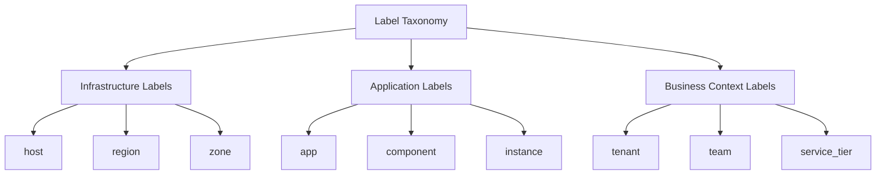

# Standardizing Labels

## Introduction

Labels form the foundation of Grafana Loki's log indexing system. While labels provide powerful querying capabilities, inconsistent labeling can lead to inefficient storage, poor query performance, and a confusing user experience. This guide explores how to standardize your labeling approach in Loki to create a more maintainable and efficient logging system.

## Why Standardize Labels?

Before diving into standardization techniques, let's understand why label standardization matters:

1. **Query Efficiency**: Standardized labels make querying more intuitive and consistent
2. **Cardinality Control**: Reduces the risk of high cardinality issues that can impact performance
3. **Storage Optimization**: More efficient storage utilization
4. **Maintenance**: Easier to maintain and scale your logging infrastructure
5. **Collaboration**: Improves team collaboration with consistent conventions

## Core Concepts in Label Standardization

### Label Naming Conventions

Establishing consistent naming conventions is the first step toward standardization:

```logql
// Inconsistent naming (avoid)
{app="payment-service", ENVIRONMENT="production", Host="server-01"}

// Standardized naming (recommended)
{app="payment-service", environment="production", host="server-01"}
```

**Best Practices**:
- Use lowercase for label names
- Use snake_case or simple lowercase for multi-word labels
- Be consistent with singular vs. plural forms (e.g., always use `app` not `apps`)
- Avoid abbreviations unless they're universally understood

### Label Value Consistency

Standardizing label values is equally important:

```logql
// Inconsistent values (avoid)
{environment="PROD"} // Monday
{environment="Production"} // Tuesday
{environment="prod"} // Wednesday

// Standardized values (recommended)
{environment="prod"} // Always use this format
```

**Best Practices**:
- Define an allowed set of values for each label
- Use lowercase for simpler matching
- For boolean concepts, use "true"/"false" rather than 1/0 or yes/no
- Document your conventions in a central location

## Implementing Label Standardization

### Using Promtail for Standardization

Promtail, Loki's agent, offers powerful label manipulation capabilities:

```yaml
scrape_configs:
  - job_name: standardize_labels
    static_configs:
      - targets: [localhost]
        labels:
          job: varlogs
          __path__: /var/log/*.log
    pipeline_stages:
      - regex:
          expression: '.*environment=(?P<raw_env>\w+).*'
      - labels:
          # Standardize environment values
          environment:
            source: raw_env
            action: replace
            regex: 'PROD|Production|prod'
            replacement: 'prod'
```

This configuration:
1. Extracts the raw environment value using a regex
2. Standardizes various forms of "production" to the standard "prod"

### Creating a Label Taxonomy

For larger organizations, creating a formal label taxonomy helps maintain consistency:



Your taxonomy should define:
- Mandatory vs. optional labels
- Valid values and formats
- Specific use cases for each label

### Automated Label Validation

Implement validation in your CI/CD pipeline to enforce standards:

```bash
#!/bin/bash
# Example script to validate Loki labels in configuration files

ERRORS=0

# Check for uppercase in label names
if grep -E '^\s+[A-Z]+[a-zA-Z_]*:' config/*.yaml; then
  echo "ERROR: Uppercase characters found in label names"
  ERRORS=$((ERRORS+1))
fi

# Check for inconsistent environment values
if grep -E 'environment: "(PROD|Production)"' config/*.yaml; then
  echo "ERROR: Non-standardized environment values found"
  ERRORS=$((ERRORS+1))
fi

exit $ERRORS
```

## Real-world Application Examples

### E-commerce Platform Example

Consider an e-commerce platform with multiple services:

```yaml
# Before standardization
- service: "PaymentProcessor"
  ENV: "prod" 
  server_id: "payment-01"
  
- service: "inventory-service"
  environment: "PRODUCTION"
  server: "inv-server-03"
  
# After standardization
- service: "payment"
  environment: "prod"
  instance: "payment-01"
  
- service: "inventory"
  environment: "prod" 
  instance: "inventory-03"
```

After standardization, querying becomes more intuitive:

```logql
{service=~"payment|inventory", environment="prod"}
```

### Microservices Architecture Example

For a microservices architecture, standard labels help trace requests across services:

```logql
# Query logs across the entire checkout flow with standardized labels
{component=~"checkout|payment|inventory", transaction_id="tx-12345"}
```

This is only possible with consistent labeling of `component` and `transaction_id` across all services.

## Common Pitfalls in Label Standardization

1. **Over-labeling**: Adding too many labels increases cardinality
   ```logql
   # Avoid this level of detail in labels
   {app="api", user_id="12345", session_id="a1b2c3", request_id="req123", timestamp="1613456789"}
   ```

2. **Dynamic values as labels**: Using unique IDs as label values
   ```logql
   # Problematic - high cardinality
   {app="api", user_id="12345"}
   
   # Better approach - keep IDs in the log content
   {app="api"} |= "user_id=12345"
   ```

3. **Inconsistent casing**:
   ```logql
   # Confusing mix
   {app="backend", Environment="prod", HOST_TYPE="vm"}
   ```

## Transitioning Existing Systems

Transitioning to standardized labels requires careful planning:

1. **Audit current labels**: Identify all current label names and values
2. **Create a mapping document**: Map old labels to new standardized ones
3. **Implement parallel labeling**: During transition, maintain both old and new labels
4. **Update dashboards and alerts**: Gradually update queries in dashboards and alerts
5. **Phase out old labels**: Once all systems use new labels, remove the old ones

### Example Transition Plan

```yaml
# Promtail configuration for transition period
pipeline_stages:
  - regex:
      expression: '.*ENV=(?P<old_env>\w+).*'
  - labels:
      # Keep old label for backward compatibility
      ENV:
        source: old_env
      # Add new standardized label
      environment:
        source: old_env
        action: replace
        regex: 'PROD|Production'
        replacement: 'prod'
```

## Summary

Standardizing labels in Grafana Loki is crucial for building a scalable and maintainable logging system. By establishing clear naming conventions, controlling label values, and implementing validation processes, you can significantly improve your log querying experience and system performance.

Remember these key points:
- Use consistent naming conventions for labels
- Standardize label values across all systems
- Implement automation to enforce standards
- Be mindful of cardinality when designing your labeling strategy
- Create a clear transition plan when standardizing existing systems

## Exercises

1. Audit your current Loki setup and identify inconsistent label naming patterns
2. Create a label taxonomy document for your organization
3. Implement a Promtail configuration that standardizes at least three common labels
4. Write a LogQL query that would benefit from standardized labels
5. Design a validation script that checks for label standardization in your configuration files

## Additional Resources

- [Loki Best Practices](https://grafana.com/docs/loki/latest/best-practices/)
- [LogQL Documentation](https://grafana.com/docs/loki/latest/logql/)
- [Promtail Pipeline Documentation](https://grafana.com/docs/loki/latest/clients/promtail/pipelines/)
- [Cardinality in Loki](https://grafana.com/docs/loki/latest/best-practices/cardinality/)