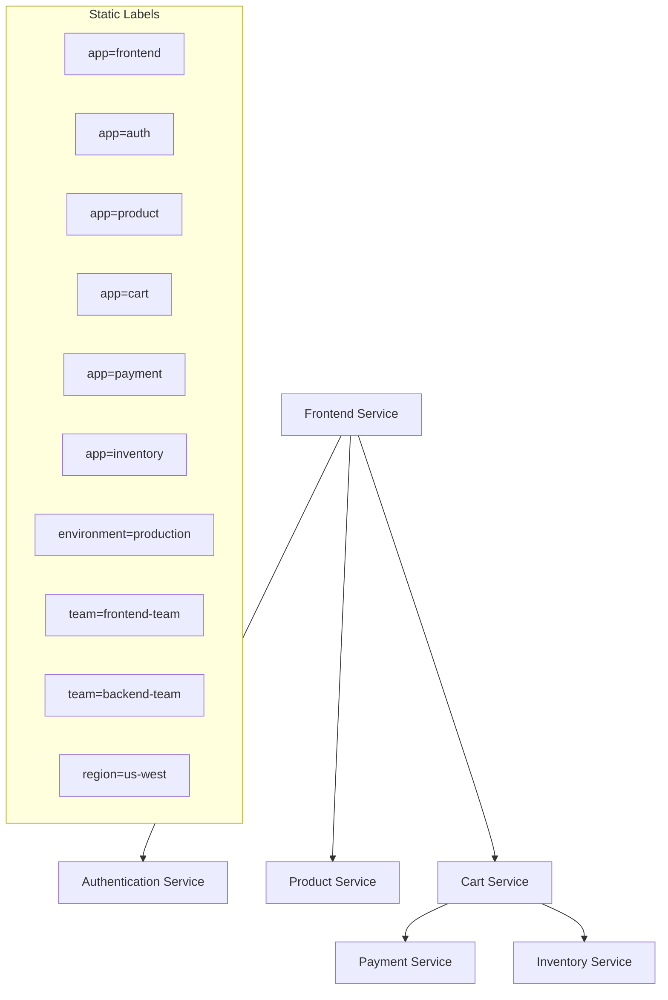

# Static Labels

## Introduction

Static labels are a fundamental concept in Grafana Loki's log management system. They serve as unchanging metadata attached to log streams, providing a consistent way to categorize, filter, and organize your logs. Unlike dynamic labels that might change based on log content, static labels remain constant for an entire log stream, making them perfect for identifying the source and context of your logs.

In this guide, we'll explore what static labels are, how they work in Loki, and how to effectively use them to improve your log management strategy.

## What Are Static Labels?

Static labels in Loki are key-value pairs attached to log streams that:

- Are defined when logs are sent to Loki
- Remain constant for the entire log stream
- Are used to identify the source and context of logs
- Serve as the primary method for querying logs in Loki

Think of static labels like the address on an envelope - they tell you where the log came from and provide essential context about its origin before you even look at the content.

## Why Static Labels Matter

Static labels are critical in Loki for several reasons:

1. **They define your log streams**: Loki organizes logs into streams based on their unique combination of labels
2. **They power efficient querying**: Loki's query performance depends heavily on how well you structure your labels
3. **They enable effective filtering**: Labels let you quickly narrow down to the specific logs you need
4. **They organize your log data**: A good labeling strategy makes your logs easier to navigate and understand

## Common Static Label Types

While you can create any labels that make sense for your environment, some common static labels include:

- `app` or `service`: Identifies which application or service generated the log
- `environment`: Indicates if logs are from production, staging, development, etc.
- `instance` or `pod`: Identifies the specific instance that produced the log
- `namespace`: In Kubernetes environments, identifies the namespace
- `region` or `datacenter`: Identifies the physical or cloud region 
- `team` or `owner`: Identifies which team is responsible for the service

## Adding Static Labels in Different Environments

### Using Promtail

Promtail is Loki's agent for collecting and forwarding logs. Here's how to configure static labels in Promtail:

```yaml
scrape_configs:
  - job_name: system
    static_configs:
      - targets:
          - localhost
        labels:
          job: varlogs
          environment: production
          datacenter: us-west
          __path__: /var/log/*log
```

In this example, all logs collected from `/var/log/*log` will have the static labels `job=varlogs`, `environment=production`, and `datacenter=us-west`.

### Using Docker Driver

If you're using Docker with the Loki logging driver:

```bash
docker run --log-driver=loki \
    --log-opt loki-url="http://loki:3100/loki/api/v1/push" \
    --log-opt loki-external-labels="environment=production,app=myapp" \
    your-image
```

### Using Fluentd

With the Fluentd Loki plugin:

```ruby
<match **>
  @type loki
  url "http://loki:3100/loki/api/v1/push"
  extra_labels {"environment":"production", "app":"myapp"}
</match>
```

## Best Practices for Static Labels

### Do

1. **Use meaningful labels**: Choose labels that provide useful context
2. **Be consistent**: Use the same labeling scheme across all your services
3. **Keep cardinality low**: Limit the number of unique label combinations
4. **Use hierarchical labels**: Organize labels in a logical hierarchy (e.g., `cluster`, `namespace`, `pod`)
5. **Document your labeling strategy**: Make sure your team understands the labeling convention

### Don't

1. **Don't use high-cardinality labels**: Avoid using user IDs, request IDs, or timestamps as static labels
2. **Don't create too many labels**: Each unique label combination creates a separate stream in Loki
3. **Don't duplicate information**: Don't repeat information that's already in the log content
4. **Don't use labels for frequently changing values**: Use static labels only for stable metadata

## Querying Using Static Labels

Loki's LogQL query language lets you filter logs based on their static labels:

```logql
{app="payment-service", environment="production"}
```

This query retrieves all logs from the payment service in the production environment.

You can combine multiple label selectors:

```logql
{app="payment-service", environment="production", datacenter="us-west"}
```

And use regex matching:

```logql
{app=~"payment.*", environment!="development"}
```

## Real-World Example: Microservice Architecture

Let's consider a practical example in a microservice architecture:



In this architecture, we might implement a labeling strategy like:

```yaml
# Frontend Service
labels:
  app: frontend
  component: ui
  team: frontend-team
  environment: production
  region: us-west

# Authentication Service
labels:
  app: auth
  component: backend
  team: security-team
  environment: production
  region: us-west

# Product Service
labels:
  app: product
  component: backend
  team: catalog-team
  environment: production
  region: us-west
```

With these labels, we can easily query all services:

- From a specific team: `{team="frontend-team"}`
- By component type: `{component="backend"}`
- In a specific region: `{region="us-west"}`
- A specific service: `{app="auth"}`

## Example: Troubleshooting with Static Labels

Let's say users are reporting slow response times in your application. With proper static labels, you can quickly narrow down the issue:

1. Check frontend logs:
   ```logql
   {app="frontend", environment="production"} |= "response time"
   ```

2. If you see high response times, check the backend services:
   ```logql
   {component="backend", environment="production"} |= "error" or |= "latency"
   ```

3. If you suspect a specific service:
   ```logql
   {app="payment", environment="production"}
   ```

4. Compare across regions:
   ```logql
   {app="payment", environment="production", region="us-west"}
   ```

This systematic approach, enabled by static labels, helps you quickly identify which component is causing the issue.

## Static vs. Dynamic Labels

Understanding the difference between static and dynamic labels is crucial:

| Feature | Static Labels | Dynamic Labels |
|---------|--------------|----------------|
| Definition time | When logs are sent to Loki | Extracted from log content after ingestion |
| Change frequency | Remain constant for a stream | Can change between log lines |
| Storage impact | Define log streams | Don't impact stream definition |
| Query performance | Highly efficient for filtering | Less efficient, used for post-filtering |
| Use case | Source identification | Content categorization |

Static labels define your log streams, while dynamic labels (created through log parsing) help you analyze content within those streams.

## Summary

Static labels are a cornerstone of effective log management in Grafana Loki. By thoughtfully defining your static labeling strategy, you can:

- Organize your logs logically
- Query and filter logs efficiently
- Troubleshoot issues more quickly
- Maintain good performance in your Loki deployment

Remember that the labels you choose dramatically impact both the usability and performance of your logging system. Focus on creating a consistent, low-cardinality labeling scheme that provides meaningful context without creating too many unique combinations.

## Additional Resources

- Try creating a labeling strategy for a sample application with at least three services
- Experiment with different LogQL queries using static labels
- Read the [official Loki documentation](https://grafana.com/docs/loki/latest/) for more advanced labeling strategies
- Explore how static labels integrate with Grafana dashboards for visualization

**Next steps:** In the next section, we'll explore Dynamic Labels and how they complement static labels to provide deeper insights into your log content.