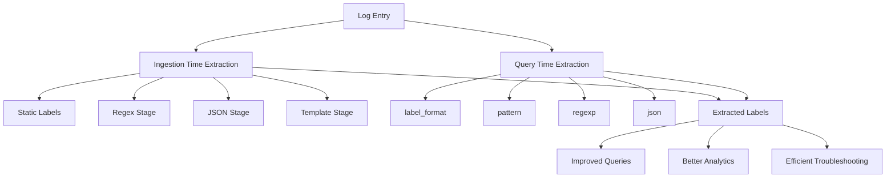

# Label Extraction Methods

## Introduction

Labels are a fundamental concept in Grafana Loki that help you organize, filter, and query your log data efficiently. While some labels are automatically attached to your logs during ingestion, Loki provides powerful methods to extract additional labels from the log content itself. These extraction methods allow you to transform unstructured log data into structured, queryable information.

In this guide, we'll explore various techniques for extracting labels from your log streams, allowing you to enhance your logs with meaningful metadata that makes querying and analysis more effective.

## Why Extract Labels?

Before diving into the methods, let's understand why label extraction is important:

1. **Improved query performance** - Labels are indexed, making filtered queries extremely fast
2. **Better organization** - Group related logs together based on extracted information
3. **Enhanced analytics** - Extract metrics and patterns from your logs
4. **Simplified troubleshooting** - Quickly filter logs based on specific error codes, user IDs, or other relevant data

## Label Extraction During Log Ingestion

### Using the Static Labels Pipeline Stage

The simplest form of label addition happens during ingestion using static labels in your promtail configuration:

```yaml
scrape_configs:
  - job_name: system
    static_configs:
      - targets:
          - localhost
        labels:
          job: varlogs
          environment: production
          __path__: /var/log/*log
```

This assigns fixed labels to all logs from a specific source, but doesn't extract information from the logs themselves.

### Using the Regex Pipeline Stage

The regex stage allows you to extract labels from log content using regular expressions:

```yaml
scrape_configs:
  - job_name: application_logs
    static_configs:
      - targets:
          - localhost
        labels:
          job: app
          __path__: /var/log/app/*.log
    pipeline_stages:
      - regex:
          expression: '(?P<user_id>[a-zA-Z0-9]+) - (?P<status>[0-9]{3}) (?P<path>/[a-zA-Z0-9/]*)'
      - labels:
          user_id:
          status:
          path:
```

**Example:**

For a log line like:
```
user123 - 404 /products/not-found
```

This would extract:
- `user_id`: user123
- `status`: 404
- `path`: /products/not-found

### Using the JSON Pipeline Stage

For JSON logs, you can extract labels directly from JSON fields:

```yaml
scrape_configs:
  - job_name: json_logs
    static_configs:
      - targets:
          - localhost
        labels:
          job: json_app
          __path__: /var/log/json-app/*.log
    pipeline_stages:
      - json:
          expressions:
            user_id: user.id
            level: level
            service: app.service
      - labels:
          user_id:
          level:
          service:
```

**Example:**

For a JSON log line like:
```json
{"timestamp":"2023-04-01T12:00:00Z", "level":"error", "user":{"id":"user456"}, "app":{"service":"authentication"}, "message":"Login failed"}
```

This would extract:
- `user_id`: user456
- `level`: error
- `service`: authentication

### Using the Template Pipeline Stage

The template stage allows for more complex label extraction with Go templates:

```yaml
scrape_configs:
  - job_name: template_logs
    static_configs:
      - targets:
          - localhost
        labels:
          job: complex_app
          __path__: /var/log/complex-app/*.log
    pipeline_stages:
      - regex:
          expression: '.*traceID=(?P<trace_id>[a-f0-9]+).*'
      - template:
          source: trace_id
          template: '{{ if eq .Value "0000000000000000" }}no_trace{{ else }}{{ .Value }}{{ end }}'
      - labels:
          trace_id:
```

This example shows how to handle a special case for trace IDs, replacing zeros with a more meaningful label.

## Label Extraction During Query Time

Loki also allows you to extract and manipulate labels during query time using LogQL.

### Using the `| label_format` Operator

The `label_format` operator lets you create new labels from existing ones:

```logql
{app="frontend"} | label_format request_path=path
```

This creates a new label `request_path` with the value from the existing `path` label.

### Using the `| pattern` Operator

The pattern operator is powerful for extraction during query time:

```logql
{job="varlogs"} |= "ERROR" | pattern `<_>:<_>:<_>:<_>:<ip>:<_>` | label_format client_ip=ip
```

Given a log line like:
```
2023-04-01 12:00:00 ERROR Connection refused: client:192.168.1.10:timeout
```

This would extract `192.168.1.10` into a label called `ip` and then rename it to `client_ip`.

### Using the `| regexp` Operator

The regexp operator provides regex-based extraction:

```logql
{job="nginx"} | regexp `(?P<http_method>GET|POST|PUT|DELETE) (?P<url>\S+)`
```

For a log like:
```
2023-04-01T12:00:00Z INFO "GET /api/users HTTP/1.1" 200 1234
```

This would extract:
- `http_method`: GET
- `url`: /api/users

### Using the `| json` Operator

Similar to the ingestion stage, you can extract JSON fields at query time:

```logql
{app="payment-service"} | json | status_code >= 400
```

This extracts all fields from JSON log entries and then filters for status codes that indicate errors.

## Advanced Label Manipulation

### Combining Multiple Extraction Methods

You can chain extraction methods for complex scenarios:

```logql
{app="web"} 
| json 
| logfmt 
| line_format "{{.status_code}} {{.method}} {{.path}}" 
| regexp "(?P<status>[0-9]{3}) (?P<method>GET|POST) (?P<endpoint>/[a-z]+)"
| label_format api={{.endpoint}}
```

This extracts from JSON, then from logfmt format, reformats the line, applies regex extraction, and finally creates a new label.

### Adding Dynamic Labels Based on Content

You can use conditional logic to create dynamic labels:

```logql
{app="backend"}
| json
| label_format severity="info"
| label_format severity="error" | status >= 400
| label_format severity="critical" | status >= 500
```

This assigns a severity label based on the status code extracted from JSON logs.

## Real-World Examples

### Monitoring API Performance by Endpoint

```logql
{app="api-gateway"}
| json
| label_format endpoint=path
| unwrap duration_ms
| avg by (endpoint)
```

This extracts the API endpoint as a label, unwraps the duration metric, and calculates the average response time by endpoint.

### Error Rate Analysis by User Type

```yaml
# In Promtail config
scrape_configs:
  - job_name: user_logs
    pipeline_stages:
      - json:
          expressions:
            user_type: metadata.user_type
            status: response.status
      - labels:
          user_type:
          status:
```

Then in LogQL:
```logql
sum by (user_type) (count_over_time({job="user_logs", status=~"5.."}[5m])) 
/ 
sum by (user_type) (count_over_time({job="user_logs"}[5m]))
```

This gives you the error rate broken down by user type.

### Session Tracking with Extracted Session IDs

```yaml
# In Promtail config
scrape_configs:
  - job_name: session_logs
    pipeline_stages:
      - regex:
          expression: 'session_id=(?P<session_id>[a-f0-9-]+)'
      - labels:
          session_id:
```

Then in LogQL:
```logql
{job="session_logs"} 
| logfmt 
| line_format "{{.level}} {{.msg}}"
| by (session_id)
```

This allows you to trace a user's journey through your application by following their session ID.

## Performance Considerations

When implementing label extraction, keep these performance tips in mind:

1. **Be selective** - Only extract labels you'll actually use for querying
2. **Avoid high cardinality** - Don't extract labels with too many unique values (like timestamps or UUIDs)
3. **Prefer ingestion-time extraction** - When possible, extract during ingestion rather than query time
4. **Use efficient regex patterns** - Complex regex patterns can slow down processing
5. **Monitor label metrics** - Watch for `loki_logql_queries_instant_duration_seconds` and similar metrics to identify slow queries



## Summary

Label extraction is a powerful feature in Grafana Loki that transforms unstructured logs into structured, queryable data. We've explored methods for extracting labels both during ingestion (using Promtail pipeline stages) and at query time (using LogQL operators).

By mastering these extraction techniques, you can:
- Create highly specific and efficient queries
- Gain deeper insights into your application behavior
- Build more meaningful visualizations and alerts
- Troubleshoot issues faster by quickly filtering to relevant logs

## Exercises

1. **Basic Extraction**: Configure Promtail to extract HTTP status codes from nginx logs and create a panel in Grafana showing error rates.

2. **JSON Handling**: Extract service name, environment, and error type from JSON-formatted logs and create a dashboard showing errors by service and environment.

3. **Advanced Patterns**: Use the pattern operator to extract structured data from a complex log format of your choice, and create labels for the most important fields.

4. **Performance Analysis**: Compare the performance of the same extraction done at ingestion time versus query time. Which is more efficient for your use case?

5. **High Cardinality Challenge**: Identify a high-cardinality field in your logs (like a user ID) and devise a strategy to extract useful information without creating performance problems.

## Additional Resources

- [Grafana Loki Documentation](https://grafana.com/docs/loki/latest/)
- [LogQL Query Language Reference](https://grafana.com/docs/loki/latest/logql/)
- [Promtail Pipeline Stages](https://grafana.com/docs/loki/latest/clients/promtail/stages/)
- [Loki Best Practices](https://grafana.com/docs/loki/latest/best-practices/)