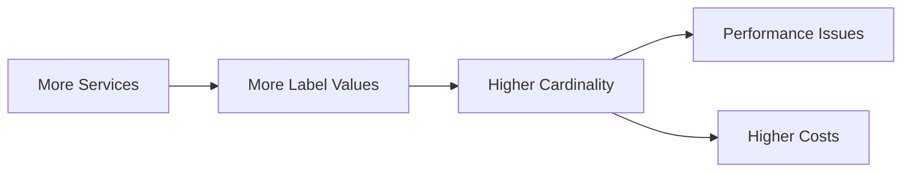

# Cardinality Considerations

## Introduction

When working with Grafana Loki, understanding **cardinality** is crucial for maintaining efficient log storage and query performance. Cardinality refers to the number of unique combinations of label values in your log data. While labels help organize and query your logs efficiently, high cardinality can lead to performance issues and increased resource consumption.

In this guide, we'll explore what cardinality means in the context of Grafana Loki, why it matters, and best practices for managing it effectively.

## What is Cardinality?

Cardinality in Loki refers to the total number of unique label combinations across your log streams. Each unique combination of label values creates a separate stream in Loki's storage.

For example, if you have labels like:
- `app`
- `environment`
- `server`

And each has multiple possible values, the potential combinations grow multiplicatively:
- 10 different apps
- 4 environments (dev, test, staging, prod)
- 100 servers

This could result in up to 10 × 4 × 100 = 4,000 unique streams!

## Why Cardinality Matters

### Performance Impact

High cardinality directly affects Loki's performance:

1. **Increased Memory Usage**: Each unique label combination requires separate in-memory indexes.
2. **Slower Queries**: More streams mean more work during query execution.
3. **Higher Storage Requirements**: Metadata overhead increases with more unique streams.
4. **Reduced Write Performance**: Ingestion slows as the number of active streams grows.

### Scale Considerations

As your logging system scales, cardinality problems often worsen:



## Common Cardinality Pitfalls

### 1. Using Highly Variable Labels

Adding labels with many possible values creates cardinality explosion:

```javascript
// ❌ Bad practice - high cardinality
{app="payment-service", user_id="12345", request_id="abc-123-def-456"}
```

Here, `user_id` and `request_id` would create millions of unique streams!

### 2. Using IP Addresses as Labels

```javascript
// ❌ Problematic - high cardinality
{app="web-server", client_ip="192.168.1.242", path="/home"}
```

Client IPs change frequently, leading to many unique label combinations.

### 3. Using Timestamps in Labels

```javascript
// ❌ Terrible idea - extreme cardinality
{app="batch-job", run_date="2023-05-15", status="success"}
```

Dates and times create new streams constantly.

## Best Practices for Managing Cardinality

### 1. Choose Static Labels Carefully

Use static, low-cardinality values for labels:

```javascript
// ✅ Good practice - low cardinality
{app="payment-service", environment="production", component="api"}
```

These values change rarely and have a limited set of possibilities.

### 2. Put Variable Data in Log Content, Not Labels

Keep high-cardinality information in the log content:

```javascript
// ✅ Good approach
// Label - low cardinality
{app="user-service", environment="production"}

// Log content - high cardinality information
{"timestamp":"2023-05-15T14:22:10Z", "user_id":"12345", "action":"login", "status":"success"}
```

### 3. Use Log Patterns Instead of Individual IDs

Group similar logs using patterns rather than specific identifiers:

```javascript
// ✅ Better approach
{app="api", endpoint="/users", status="error"}

// Instead of
{app="api", endpoint="/users/12345", request_id="abc-123", status="error"}
```

### 4. Limit the Number of Label Combinations

A good rule of thumb is to keep your total number of streams (unique label combinations) under 10,000 for smaller deployments, and carefully plan growth for larger systems.

## Monitoring Cardinality

Loki provides metrics to help monitor cardinality:

```javascript
// Check active streams
rate(loki_ingester_memory_streams{job="loki"}[5m])

// Check total series
sum(loki_ingester_memory_streams{job="loki"})
```

Use Grafana dashboards to track these metrics over time and identify cardinality issues before they become problematic.

## Practical Example: Refactoring High-Cardinality Labels

Let's walk through refactoring a problematic labeling scheme:

### Original High-Cardinality Setup

```javascript
// Original high-cardinality approach
{
  app="payment-processor",
  environment="production",
  user_id="user-12345",
  transaction_id="tx-abcdef123456", 
  server="server-042",
  request_path="/api/v1/payments/process"
}
```

### Refactored Low-Cardinality Approach

```javascript
// Refactored low-cardinality approach
{
  app="payment-processor",
  environment="production",
  component="api"
}

// Log content
{
  "timestamp": "2023-05-15T14:22:10Z",
  "level": "info",
  "user_id": "user-12345",
  "transaction_id": "tx-abcdef123456",
  "server": "server-042",
  "request_path": "/api/v1/payments/process",
  "message": "Payment processed successfully"
}
```

With this refactoring, we've reduced from potentially millions of unique streams to just a single stream for the production payment processor API component.

## Implementing Dynamic Derived Labels

Sometimes you need to extract information from logs during ingestion. Loki provides the ability to create derived labels using pipelines:

```yaml
scrape_configs:
  - job_name: system
    static_configs:
    - targets:
        - localhost
      labels:
        job: varlogs
        __path__: /var/log/*log
    pipeline_stages:
    - regex:
        expression: 'level=(?P<level>\w+)'
    - labels:
        level:
```

This extracts the log level into a label, which generally has low cardinality (info, warn, error, etc.).

## Summary

Managing cardinality in Grafana Loki is a critical skill for maintaining performance and cost efficiency. Remember these key points:

- High cardinality = many unique label combinations = performance problems
- Keep labels static and limited in possible values
- Put variable/unique data in log content, not labels
- Monitor your cardinality metrics over time
- Design your labeling scheme with future scale in mind

By following these best practices, you'll build a Loki logging system that remains performant and cost-effective as your application grows.

## Additional Resources

- [Grafana Loki Cardinality Documentation](https://grafana.com/docs/loki/latest/best-practices/)
- Loki's design principles: [LogQL](https://grafana.com/docs/loki/latest/logql/)
- The [Grafana Community Forums](https://community.grafana.com) for specific questions

## Exercises

1. Analyze a set of logs from your application and identify potential high-cardinality label candidates.
2. Refactor an existing labeling scheme to reduce cardinality while maintaining queryability.
3. Set up a Grafana dashboard to monitor stream cardinality in your Loki deployment.
4. Experiment with LogQL queries that can help identify high-cardinality labels in your system.