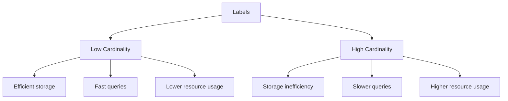

# Best Practices for Labels

## Introduction

Labels are a fundamental concept in Grafana Loki that allow you to organize, query, and filter your logs efficiently. Unlike traditional logging systems that index the full content of logs, Loki only indexes the labels associated with your log streams. This approach makes Loki more resource-efficient but requires careful consideration of how you use labels.

In this guide, we'll explore best practices for designing and implementing an effective labeling strategy for your Loki deployment. We'll cover key concepts like cardinality, common labeling patterns, and optimization techniques to help you build a scalable and performant logging system.

## Understanding Label Cardinality

Before diving into best practices, it's essential to understand the concept of **cardinality** in the context of Loki.

### What is Cardinality?

Cardinality refers to the number of unique label combinations in your logging system. For example, if you have labels for:

- environment (prod, dev, staging)
- application (app1, app2, app3)
- instance (instance-1, instance-2, ..., instance-n)

The potential cardinality is the product of all possible values: 3 environments × 3 applications × n instances.

High cardinality can significantly impact Loki's performance and resource usage. Let's examine why this matters and how to manage it.



## Label Best Practices

### 1. Keep Cardinality Under Control

**DO:**
- Use labels for identifying the source of logs (service name, environment)
- Limit high-cardinality data to a small number of labels

**DON'T:**
- Add labels with unbounded values (user IDs, request IDs)
- Create labels for data that changes frequently

**Example: Bad Practice**

```yaml
scrape_configs:
  - job_name: app_logs
    static_configs:
      - targets:
          - localhost
        labels:
          job: app_logs
          user_id: "{{.user_id}}"  # HIGH CARDINALITY!
          request_id: "{{.request_id}}"  # HIGH CARDINALITY!
          environment: prod
```

**Example: Good Practice**

```yaml
scrape_configs:
  - job_name: app_logs
    static_configs:
      - targets:
          - localhost
        labels:
          job: app_logs
          service: payment-api
          environment: prod
          # user_id and request_id should be IN the log content
```

### 2. Use Static Labels for Fixed Dimensions

Static labels work best for dimensions that don't change or change very infrequently.

**Good candidates for labels:**
- environment (prod, staging, dev)
- region or datacenter (us-west, eu-central)
- service or component name (auth-service, payment-api)
- instance type (web, worker, database)

```yaml
labels:
  environment: production
  region: us-west-2
  service: payment-processing
  tier: web
```

### 3. Follow Consistent Naming Conventions

A consistent naming pattern helps with clarity and usability.

**DO:**
- Use lowercase names
- Separate words with underscores
- Be descriptive but concise
- Use consistent plural/singular forms

**Example:**

```yaml
# Consistent naming
labels:
  environment: production
  service_name: auth_api
  instance_type: worker
  log_level: error
```

### 4. Choose Labels for Query Efficiency

Design your labels based on how you expect to query your logs.

**Example: Common Query Patterns**

If you frequently need to find all errors across services:

```yaml
# Label structure optimized for querying errors
labels:
  app: myapp
  component: api
  severity: error  # Good label for filtering
```

Then your LogQL query becomes straightforward:

```
{app="myapp", severity="error"} |= "failed to connect"
```

### 5. Use Dynamic Labels Sparingly

Dynamic labels that are derived from the log content can be useful but should be used cautiously.

**Example: Using a Pipeline Stage to Extract Labels**

```yaml
pipeline_stages:
  - json:
      expressions:
        level: level
        component: component
  - labels:
      level:
      component:
```

This extracts `level` and `component` from JSON logs and converts them to labels, but be careful that these don't have too many possible values.

### 6. Balance Between Labels and Log Content

Not everything needs to be a label. High-cardinality information should be kept within the log content.

**Example: Proper Balance**

```yaml
# As labels (low cardinality)
labels:
  app: shopping_cart
  environment: production
  
# Within log content (high cardinality)
# "user_id=12345 request_id=abc-123 action=add_item item_id=56789"
```

### 7. Use Template Labels Effectively

When using Prometheus service discovery or similar mechanisms, template labels help maintain consistency.

**Example:**

```yaml
scrape_configs:
  - job_name: kubernetes-pods
    kubernetes_sd_configs:
      - role: pod
    relabel_configs:
      - source_labels: [__meta_kubernetes_pod_label_app]
        target_label: app
      - source_labels: [__meta_kubernetes_namespace]
        target_label: namespace
      - source_labels: [__meta_kubernetes_pod_name]
        target_label: pod
```

## Real-World Examples

### Example 1: Microservice Architecture

In a microservice environment, you might use labels to categorize logs by service boundaries and infrastructure components:

```yaml
labels:
  # Core identifiers
  environment: production
  region: us-east-1
  
  # Service information
  service: payment-processing
  component: transaction-validator
  
  # Infrastructure 
  kubernetes_namespace: payments
  kubernetes_pod_name: transaction-validator-67d8fb7b59-2njx4
  
  # Runtime context
  version: v2.3.1
```

### Example 2: Monitoring Multiple Applications

When monitoring several applications with shared infrastructure:

```yaml
scrape_configs:
  - job_name: application_logs
    static_configs:
      - targets:
          - localhost
        labels:
          environment: production
          tenant: customer_a
          app: frontend
          
      - targets:
          - localhost
        labels:
          environment: production
          tenant: customer_a
          app: backend
          
      - targets:
          - localhost
        labels:
          environment: staging
          tenant: internal
          app: frontend
```

### Example 3: Structured Logging with Dynamic Label Extraction

Using Loki's pipeline stages to extract important fields from structured logs:

```yaml
scrape_configs:
  - job_name: application_logs
    static_configs:
      - targets:
          - localhost
        labels:
          job: app_logs
          environment: production
    
    pipeline_stages:
      - json:
          expressions:
            service: service
            component: component
            level: level
      - labels:
          service:
          component:
          level:
```

With corresponding structured log:

```json
{"timestamp":"2023-07-25T15:04:05Z","service":"auth-service","component":"oauth","level":"error","message":"Failed to validate token","token_id":"abcd1234","error":"token expired"}
```

Only `service`, `component`, and `level` become labels, while high-cardinality fields like `token_id` remain in the log content.

## Performance Impact of Labels

### Measuring Cardinality

You can use Loki's metrics to monitor the cardinality of your system:

```
sum(count by(__name__)({__name__=~"loki_index_.*"}))
```

### Storage Implications

Each unique label combination creates a new stream in Loki. More streams mean:

1. More index entries
2. Smaller individual chunks
3. Less efficient compression
4. Higher query overhead

A good rule of thumb is to keep your active streams (unique label combinations) under 10,000 per tenant for small deployments, though larger deployments can handle more with proper scaling.

## Common Mistakes to Avoid

1. **Using labels for high-cardinality data**:
   - User IDs
   - Session IDs
   - Request IDs
   - Timestamps as label values

2. **Creating too many label dimensions**:
   - Every new label multiplies potential combinations

3. **Inconsistent labeling across services**:
   - Using different naming patterns
   - Representing the same concept with different labels

4. **Over-relying on labels instead of log content**:
   - Remember that Loki's filtering on log content is still fast

## Summary

Effective label management in Grafana Loki requires balancing between queryability and cardinality. By following these best practices, you can build a scalable, efficient logging system:

- Keep cardinality under control by limiting high-cardinality data
- Use static labels for fixed dimensions
- Follow consistent naming conventions
- Design labels around your query patterns
- Use dynamic labels sparingly
- Balance between labels and log content
- Leverage template labels for consistency

Remember that labels in Loki are for identifying and selecting log streams, not for storing all metadata. The log content itself should contain the detailed information that changes frequently or has high cardinality.

## Exercises

1. Analyze your current logging setup and identify any high-cardinality labels that could be moved to log content.
2. Design a labeling scheme for a microservice architecture with 5-10 services across development, staging, and production environments.
3. Write LogQL queries that would efficiently find:
   - All errors across production services
   - All logs from a specific service in the last hour
   - All database-related warnings in staging

## Further Learning

- Explore dynamic pipeline stages for extracting labels
- Learn about LogQL and how label selection affects query performance
- Study Loki's internal architecture to understand how labels impact storage