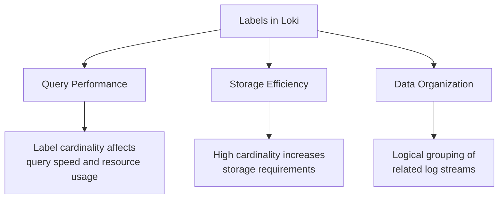

# Label Management

## Introduction

Labels are a fundamental concept in Grafana Loki's data model. They are key-value pairs attached to log streams that allow you to organize, query, and filter your logs efficiently. Proper label management is critical for both query performance and storage efficiency in Loki deployments of any size.

In this guide, you'll learn how to effectively manage labels in Grafana Loki, including best practices for naming, cardinality control, and optimization techniques that will help you build a scalable logging system.

## Understanding Label Importance

Labels in Loki serve a similar purpose as labels in Prometheus—they are the primary means of identifying and querying log streams. However, there's a critical difference in how they impact system performance:



Unlike metrics systems where you might have hundreds of labels, Loki performs best when you use labels judiciously. Each unique combination of label-value pairs creates a separate stream that Loki must track and store.

## Label Naming Conventions

Consistent naming conventions make your logging system more maintainable and user-friendly.

### Best Practices

- Use lowercase letters, numbers, and underscores
- Make names descriptive but concise
- Use consistent naming patterns across all applications
- Avoid special characters that might require escaping in queries

```javascript
// Good label naming
{
  app="payment-service",
  environment="production",
  region="us-west-1"
}

// Poor label naming
{
  App Name="Payment Service",
  Env.="PROD",
  AWS-Region="US_WEST_1"
}
```

## Managing Label Cardinality

Label cardinality refers to the number of unique label combinations in your system. High cardinality can lead to performance issues and increased storage requirements.

### What Causes High Cardinality?

- Using unique identifiers as label values (user IDs, request IDs, etc.)
- Using timestamps or frequently changing values as labels
- Having too many different label combinations

### Strategies to Control Cardinality

1. **Reserve labels for stable, low-cardinality data**:

```yaml
# Good practice - Low cardinality
scrape_configs:
  - job_name: app_logs
    static_configs:
      - targets: ['localhost']
        labels:
          app: payment-service
          component: api
          environment: production
```

2. **Keep high-cardinality data in the log content, not in labels**:

```bash
# Instead of this (high cardinality label)
{app="payment-service", user_id="12345"} User logged in

# Do this (lower cardinality labels, details in log)
{app="payment-service", component="auth"} User 12345 logged in
```

3. **Use label_format to manipulate labels during ingestion**:

```yaml
scrape_configs:
  - job_name: app_logs
    static_configs:
      - targets: ['localhost']
        labels:
          app: payment-service
    pipeline_stages:
      - regex:
          expression: 'level=(debug|info|warn|error)'
      - labels:
          level:
```

## Dynamic Label Management

As your applications evolve, you may need to add, modify, or remove labels. Here's how to handle these changes effectively:

### Adding New Labels

When adding new labels, consider:
- Will this label add value for querying?
- What will be the cardinality impact?
- Is this information better kept in the log content?

### Relabeling Techniques

Loki supports relabeling configurations similar to Prometheus, allowing you to modify labels during ingestion:

```yaml
scrape_configs:
  - job_name: system_logs
    static_configs:
      - targets: ['localhost']
        labels:
          job: syslog
    relabel_configs:
      # Convert 'job' label to 'source'
      - source_labels: ['job']
        target_label: 'source'
      # Drop unwanted labels
      - action: labeldrop
        regex: 'unwanted_label_.*'
```

## Label Transformation with Pipeline Stages

Loki's pipeline stages offer powerful tools for extracting and managing labels from log content:

```yaml
scrape_configs:
  - job_name: nginx_logs
    static_configs:
      - targets: ['localhost']
        labels:
          job: nginx
    pipeline_stages:
      # Extract HTTP method and status code from log line
      - regex:
          expression: '(?P<method>GET|POST|PUT|DELETE) .* (?P<status>\d{3})'
      # Add them as labels
      - labels:
          method:
          status:
      # Drop status label if it's a 200 response to reduce cardinality
      - match:
          selector: '{status="200"}'
          action: drop
          drop_counter_reason: success_responses
```

## Practical Examples

Let's look at some real-world examples of effective label management:

### Example 1: Kubernetes Logging

When collecting logs from Kubernetes, you typically want labels for:

```yaml
# Promtail configuration for Kubernetes
scrape_configs:
  - job_name: kubernetes-pods
    kubernetes_sd_configs:
      - role: pod
    relabel_configs:
      # Keep only essential labels
      - source_labels: [__meta_kubernetes_pod_label_app]
        target_label: app
      - source_labels: [__meta_kubernetes_namespace]
        target_label: namespace
      - source_labels: [__meta_kubernetes_pod_name]
        target_label: pod
      # Drop pods in kube-system to reduce noise
      - source_labels: [__meta_kubernetes_namespace]
        regex: kube-system
        action: drop
```

### Example 2: Microservices Architecture

For a microservices environment, consider organizing labels like this:

```yaml
# Promtail configuration for microservices
scrape_configs:
  - job_name: microservice_logs
    static_configs:
      - targets: ['localhost']
        labels:
          system: ecommerce
          service: payment-processor
          tier: backend
          environment: production
          region: us-west
```

This approach allows for drill-down queries like:

```logql
{system="ecommerce", tier="backend"} |= "error"
```

## Monitoring Label Cardinality

Tracking the number of unique label combinations helps identify potential issues:

```logql
# Count unique streams per app
count by (app) (count_over_time({job="logs"}[1h]))

# Find labels with high cardinality
topk(10, count by (__name__, label_name) (count_over_time({job="logs"}[1h])))
```

## Querying with Labels Efficiently

Efficient label usage leads to more efficient queries:

```logql
# A very efficient query - uses labels for filtering
{app="payment-service", environment="production"} |= "error"

# Less efficient - filtering large volumes with log content
{app="payment-service"} |= "error" |= "production"
```

## Summary

Effective label management in Grafana Loki is essential for building a scalable, performant logging system. By following these best practices, you can:

- Maintain query performance as your log volume grows
- Control storage costs through cardinality management
- Create an intuitive, organized structure for your logs
- Enable powerful filtering and aggregation capabilities

Remember that the optimal labeling strategy depends on your specific use case and query patterns. Start with minimal labels and add more as needed, always keeping an eye on cardinality.

## Additional Resources

For further learning, explore:

- LogQL query language documentation
- Loki's pipeline stages for advanced label extraction
- Cardinality analysis tools and techniques
- Loki's series API for investigating label combinations

## Exercises

1. Analyze an existing logging setup and identify labels that might contribute to high cardinality
2. Create a Promtail configuration that extracts useful labels from application logs
3. Write queries that efficiently filter logs using labels
4. Implement a strategy to monitor and alert on label cardinality issues