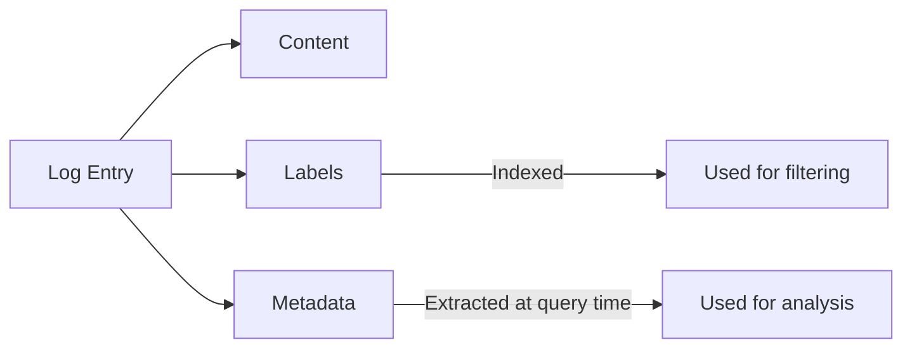

# Metadata Handling in Grafana Loki

## Introduction

Metadata in Grafana Loki refers to additional contextual information attached to log entries beyond their core content. While labels help categorize and filter logs, metadata provides enriched information about each log entry. Effectively handling metadata allows you to create more powerful queries, derive deeper insights, and build more comprehensive dashboards.

In this guide, we'll explore how Grafana Loki manages metadata, how to extract and query it, and best practices for metadata handling in production environments.

## Understanding Metadata in Loki

### What is Metadata?

In Loki, metadata consists of:

1. **Structured data** embedded within log entries
2. **Extracted fields** derived from log parsing
3. **System-generated information** like timestamps and source identifiers

Unlike labels which are indexed and used for filtering, metadata is typically stored with the log content and extracted at query time.



## Extracting Metadata with LogQL

Loki's query language (LogQL) provides powerful tools for extracting and working with metadata.

### Basic Metadata Extraction

The simplest way to extract metadata is using the `|` pipe operator with extraction functions:

```sql
{app="myapp"} | json
```

This extracts all JSON fields from matching log lines, making them available as metadata.

For specific fields:

```sql
{app="myapp"} | json field="user_id", field2="response_time"
```

### Example: Extracting HTTP Status Codes

Consider these JSON logs:

```json
{"timestamp": "2023-10-15T14:22:10Z", "level": "info", "message": "Request processed", "status": 200, "path": "/api/users", "duration_ms": 45}
{"timestamp": "2023-10-15T14:22:11Z", "level": "error", "message": "Request failed", "status": 500, "path": "/api/orders", "duration_ms": 132}
```

To extract status codes:

```sql
{app="web-server"} | json | status >= 400
```

**Output:**
```
{app="web-server"} status=500 level="error" message="Request failed" path="/api/orders" duration_ms=132
```

### Advanced Pattern Extraction

For non-JSON logs, you can use regex patterns:

```sql
{app="myapp"} | pattern `<pattern>`
```

For example, to extract information from a standard log format:

```sql
{app="backend"} | pattern `[<timestamp>] <level>: <message> (user=<user_id>)`
```

## Transforming and Manipulating Metadata

Once extracted, you can transform metadata for analysis:

### Mathematical Operations

```sql
{app="web-server"} | json | duration_ms > 100 | duration_sec = duration_ms / 1000
```

This creates a new `duration_sec` field by converting milliseconds to seconds.

### String Manipulations

```sql
{app="auth-service"} | json | user_email = lower(email) | user_domain = label_format("{{.user_email}}", "{{.user_email | regexp `@(.+)$` `$1`}}")
```

## Practical Examples

### Example 1: Analyzing API Performance

Let's analyze API endpoint performance using metadata:

```sql
{app="api-gateway"} 
| json 
| path != "" 
| unwrap duration_ms 
| by(path) 
| quantile=0.95
```

This query:
1. Filters for API gateway logs
2. Extracts JSON fields
3. Ensures path is not empty
4. Uses the duration_ms field for analysis
5. Groups by path
6. Calculates the 95th percentile response time

### Example 2: Error Rate by Service and Version

```sql
sum by(service, version) (
  rate({env="production"} | json | level="error" [5m])
) / 
sum by(service, version) (
  rate({env="production"} | json [5m])
)
```

This calculates the error rate per service and version by dividing the error count by the total log count.

### Example 3: User Activity Tracking

For a login service with logs like:

```json
{"timestamp": "2023-10-15T10:45:12Z", "level": "info", "msg": "User login", "user_id": "u-123", "success": true, "location": {"country": "US", "city": "San Francisco"}}
```

We can track login attempts by location:

```sql
{app="login-service"} 
| json 
| success="true" 
| line_format "{{.user_id}} logged in from {{.location.city}}, {{.location.country}}"
```

## Metadata Handling Best Practices

### Performance Considerations

1. **Extract only what you need**: Extracting all fields from high-volume logs can impact performance
2. **Pre-extract common fields**: Use log processors to extract common fields before they reach Loki
3. **Use labels for high-cardinality data**: For data you'll frequently filter on

### Structuring Your Logs for Optimal Metadata Handling

1. **Consistent format**: Use consistent JSON structures or log formats
2. **Avoid deeply nested structures**: Flatten when possible for easier extraction
3. **Include contextual information**: Add service version, environment, and other relevant metadata

### Avoiding Common Pitfalls

1. **Over-extraction**: Extracting too many fields adds processing overhead
2. **High cardinality in labels**: Keep high-cardinality data as metadata, not labels
3. **Complex regex patterns**: Complex patterns are CPU-intensive and can slow queries

## Integration with Other Grafana Components

Extracted metadata can be used with other Grafana components:

1. **Alerting**: Create alerts based on metadata patterns
   ```sql
   sum(rate({app="payment-service"} | json | status >= 500 [5m])) > 10
   ```

2. **Dashboards**: Build dashboards with metadata-based visualizations
   ```sql
   sum by(path) (rate({app="api"} | json | status >= 400 and status < 500 [5m]))
   ```

3. **Derived metrics**: Create metrics from log metadata for long-term storage in Prometheus

## Summary

Effective metadata handling is crucial for getting the most value from your logs in Grafana Loki. By properly extracting, transforming, and analyzing metadata, you can gain deeper insights into your applications and infrastructure.

Key points to remember:
- Metadata provides context and detail beyond basic log content
- LogQL offers powerful extraction capabilities for JSON and pattern-based logs
- Transformation functions let you derive new insights from existing metadata
- Balance extraction needs with performance considerations
- Use metadata strategically alongside labels for optimal performance

## Further Exercises

1. Extract metadata from logs in different formats (JSON, key-value pairs, XML)
2. Build a dashboard showing API performance based on extracted duration metadata
3. Create an alert that triggers when error rates exceed a threshold for a specific user segment
4. Implement a log preprocessing pipeline that extracts common metadata before ingestion

## Additional Resources

- [LogQL Documentation](https://grafana.com/docs/loki/latest/logql/)
- [Loki Parser Documentation](https://grafana.com/docs/loki/latest/clients/promtail/stages/transform/)
- [Grafana Dashboard Best Practices](https://grafana.com/docs/grafana/latest/best-practices/best-practices-for-creating-dashboards/)