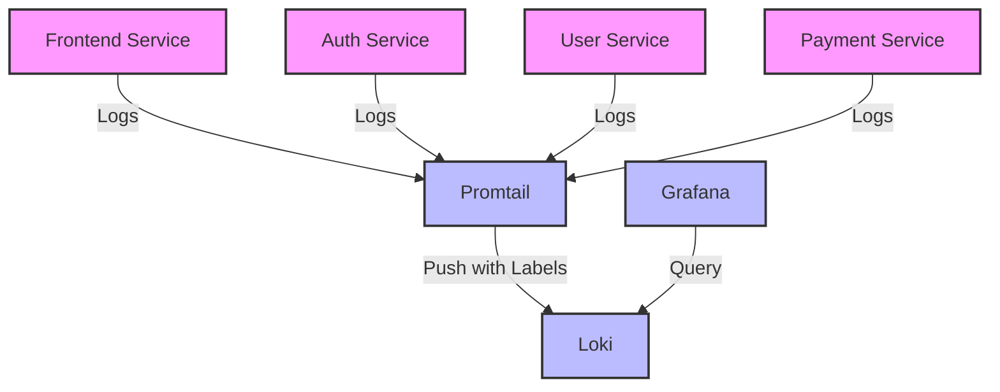

# Environment Labels

## Introduction

Environment labels are a critical component of Grafana Loki's label-based log organization system. They allow you to tag log streams with specific environment information such as `production`, `staging`, or `development`. This labeling approach enables powerful filtering and organization capabilities, making it easier to isolate logs from specific environments during troubleshooting or analysis.

In this guide, we'll explore how to effectively implement environment labels in Grafana Loki, their benefits, and best practices for managing logs across different deployment environments.

## What Are Environment Labels?

Environment labels are key-value pairs attached to log streams that identify which environment the logs originate from. They are part of Loki's broader label system, which organizes logs horizontally rather than in hierarchical folders.

For example, a typical environment label might look like:

```
environment="production"
```

## Why Use Environment Labels?

Environment labels provide several important benefits:

1. **Isolation of logs**: Easily separate logs from different environments (production, staging, testing)
2. **Targeted troubleshooting**: Focus on issues in specific environments
3. **Environment-specific alerting**: Create alerts that only trigger for certain environments
4. **Simplified access control**: Restrict access to logs based on environment
5. **Reduced query complexity**: Filter logs without complex regex expressions

## Implementing Environment Labels

### Adding Environment Labels with Promtail

Promtail, Loki's official log shipping agent, allows you to add environment labels to your logs during collection. Here's how to configure it:

```yaml
scrape_configs:
  - job_name: system
    static_configs:
      - targets:
          - localhost
        labels:
          job: varlogs
          environment: production
          __path__: /var/log/*log
```

In this example, all logs from `/var/log/*log` will be tagged with `environment="production"`.

### Adding Environment Labels with Docker Driver

If you're using Docker, you can add environment labels when configuring the Loki Docker driver:

```bash
docker run --log-driver=loki \
  --log-opt loki-url="http://loki:3100/loki/api/v1/push" \
  --log-opt loki-external-labels="environment=staging" \
  your-container-image
```

### Dynamic Environment Labels

You can also set environment labels dynamically based on the deployment process:

```yaml
scrape_configs:
  - job_name: kubernetes
    kubernetes_sd_configs:
      - role: pod
    relabel_configs:
      - source_labels: [__meta_kubernetes_namespace]
        target_label: namespace
      - source_labels: [__meta_kubernetes_pod_label_environment]
        target_label: environment
```

This configuration extracts environment information from Kubernetes pod labels.

## Querying Using Environment Labels

One of the primary benefits of environment labels is the ability to filter logs efficiently. Here are some examples:

### Basic Environment Filtering

To view logs only from the production environment:

```logql
{environment="production"}
```

To exclude production logs:

```logql
{environment!="production"}
```

### Combining Environment Labels with Other Filters

Environment labels become even more powerful when combined with other filters:

```logql
{environment="staging", app="user-service", level="error"}
```

This query returns only error logs from the user service in the staging environment.

### Using Environment Labels with Log Content Filtering

You can also combine environment labels with log content matching:

```logql
{environment="production"} |= "exception" |~ "database.*error"
```

This query finds production logs containing the word "exception" and matching the regex pattern "database.*error".

## Environment Label Best Practices

### Consistent Naming

Establish a consistent naming convention for your environment labels:

```
environment="production"  # Not prod, prd, or production-env
environment="staging"     # Not stg, stage, or staging-env
environment="development" # Not dev, develop, or development-env
```

### Granular Environment Classification

Consider using more granular environment classifications when needed:

```
environment="production-us"
environment="production-eu"
environment="staging-feature-x"
```

### Label Cardinality Considerations

Be cautious about creating too many unique environment label values. High cardinality can impact Loki's performance. Aim for a limited set of environment values.

### Labeling in Multi-Tenant Setups

In multi-tenant Loki deployments, combine tenant and environment labels:

```
tenant="customer-a"
environment="production"
```

## Real-World Example: Microservice Architecture

Let's examine a practical example of using environment labels in a microservice architecture:



Configuration for different environments:

**Development Environment:**

```yaml
scrape_configs:
  - job_name: microservices-dev
    static_configs:
      - targets:
          - localhost
        labels:
          environment: development
          __path__: /var/log/services/*.log
```

**Production Environment:**

```yaml
scrape_configs:
  - job_name: microservices-prod
    static_configs:
      - targets:
          - localhost
        labels:
          environment: production
          __path__: /var/log/services/*.log
```

This setup allows you to:

1. View logs from a specific service in production:
   ```logql
   {environment="production", service="payment-service"}
   ```

2. Compare error rates across environments:
   ```logql
   count_over_time({service="auth-service", level="error"}[1h]) by (environment)
   ```

3. Set up environment-specific dashboards in Grafana.

## Implementing Environment-Based Retention

Loki allows you to set different retention periods based on labels. You can use environment labels to implement environment-specific retention policies:

```yaml
limits_config:
  retention_period: 744h  # Default retention (31 days)

schema_config:
  configs:
    - from: 2020-07-01
      store: boltdb-shipper
      object_store: s3
      schema: v11
      index:
        prefix: index_
        period: 24h

retention_config:
  deletes_enabled: true
  retention_period: 744h # Default retention
  retention_period_config:
    - labels:
        - environment: production
      retention_period: 2160h # 90 days for production
    - labels:
        - environment: staging
      retention_period: 168h # 7 days for staging
```

## Summary

Environment labels provide a powerful way to organize and query logs in Grafana Loki. By consistently applying environment labels across your infrastructure, you can:

- Efficiently filter logs by environment
- Create environment-specific alerting rules
- Implement targeted retention policies
- Simplify troubleshooting processes

Remember that effective log management with environment labels begins at the collection point. Configure your log shippers to add consistent environment information, and design your queries to leverage these labels for maximum efficiency.

## Additional Resources

- Explore the [Loki LogQL documentation](https://grafana.com/docs/loki/latest/logql/) to learn more advanced querying techniques
- Practice creating dashboard panels in Grafana that use environment labels for filtering
- Experiment with different label combinations to find the most effective organization for your specific use case

## Exercises

1. Configure Promtail to add environment labels to logs from two different application environments
2. Write a LogQL query that compares error rates between production and staging environments
3. Create a Grafana dashboard with panels showing logs filtered by different environments
4. Implement a labeling strategy that combines environment labels with application and component labels
5. Set up environment-specific retention policies using the retention configuration