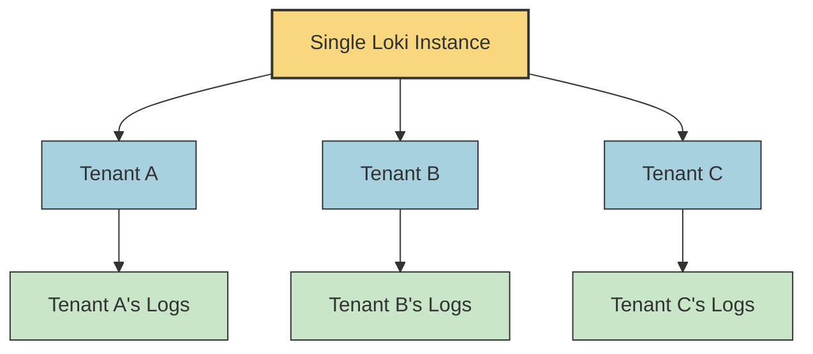

I'll create a comprehensive educational content piece for "Multi-Tenancy Basics" in Docusaurus MDX format. This will be designed for beginners learning Grafana Loki as part of your learning path structure.

---
title: Multi-Tenancy Basics
description: Learn the fundamentals of multi-tenancy in Grafana Loki, how it works, and why it's important for log management at scale.

---

# Multi-Tenancy Basics

## Introduction

Multi-tenancy is a fundamental architectural concept in Grafana Loki that allows a single Loki instance to serve multiple users or teams (tenants) while keeping their data isolated from each other. In a multi-tenant environment, each tenant operates as if they have their own dedicated instance of Loki, even though they're sharing the underlying infrastructure.

This approach offers significant benefits in terms of resource efficiency, operational simplicity, and cost-effectiveness, especially in large organizations or service providers managing logs for multiple clients or teams.

## What is Multi-Tenancy?

At its core, multi-tenancy refers to a software architecture where a single instance of an application serves multiple customers or organizational units. Each customer (tenant) gets their own logical view of the application with their data kept separate from other tenants.



In Grafana Loki, each tenant is identified by a unique ID, and all operations (ingesting logs, querying logs) are performed in the context of a specific tenant.

## How Multi-Tenancy Works in Loki

### Tenant IDs

In Loki, each tenant is assigned a unique identifier called a "tenant ID." This ID is used to:

1. Tag incoming log data with the appropriate tenant
2. Enforce data isolation between tenants
3. Apply tenant-specific configurations and limits

Here's how tenant IDs are used in practice:

```yaml
# Example of how tenant IDs appear in Loki's configuration
limits_config:
  per_tenant_override_config: /etc/loki/tenant-overrides.yaml
  tenant_id_header: X-Scope-OrgID
```

When sending requests to Loki, the tenant ID is typically included in an HTTP header. By default, this header is `X-Scope-OrgID`, but it can be customized in Loki's configuration.

### Data Isolation

One of the most important aspects of multi-tenancy is ensuring that data from one tenant cannot be accessed by another tenant. Loki achieves this isolation at multiple levels:

1. **Storage Isolation**: Log data for each tenant is stored separately in the backend storage (object store, filesystem, etc.)
2. **Query Isolation**: Queries only return results from the tenant making the request
3. **Authentication & Authorization**: Proper authentication ensures users can only access data from their assigned tenant

## Configuring Multi-Tenancy in Loki

Let's look at how to configure basic multi-tenancy in Loki:

### Basic Configuration

```yaml
auth_enabled: true

server:
  http_listen_port: 3100

ingester:
  lifecycler:
    ring:
      kvstore:
        store: inmemory
  chunk_idle_period: 5m
  max_chunk_age: 1h
  
limits_config:
  enforce_metric_name: false
  reject_old_samples: true
  reject_old_samples_max_age: 168h
  tenant_id_header: X-Scope-OrgID
```

In this configuration:
- `auth_enabled: true` enables authentication, which is required for multi-tenancy
- `tenant_id_header` specifies the HTTP header that contains the tenant ID

### Per-Tenant Limits and Configurations

Loki allows setting different limits and configurations for each tenant using the `per_tenant_override_config` option:

```yaml
# tenant-overrides.yaml
overrides:
  tenant1:
    ingestion_rate_mb: 10
    ingestion_burst_size_mb: 20
    max_global_streams_per_user: 10000
  tenant2:
    ingestion_rate_mb: 20
    ingestion_burst_size_mb: 30
    max_global_streams_per_user: 20000
```

## Using Multi-Tenancy with Promtail

[Promtail](https://grafana.com/docs/loki/latest/clients/promtail/) is Loki's agent for collecting and forwarding logs. To use it with multi-tenancy, you need to configure it to include the tenant ID header:

```yaml
clients:
  - url: http://loki:3100/loki/api/v1/push
    tenant_id: tenant1
```

This configuration tells Promtail to include the `X-Scope-OrgID: tenant1` header in all requests to Loki.

## Practical Example: Multi-Tenancy in a Company

Let's consider a practical example of how multi-tenancy can be used in a company with multiple teams:

### Scenario

A company has three teams:
- Development team
- Operations team
- Security team

Each team needs to access logs, but they should only see logs relevant to their responsibilities.

### Implementation

1. **Create Tenant IDs for each team**:
   - `dev-team`
   - `ops-team`
   - `security-team`

2. **Configure Promtail for each application**:

```yaml
# Web application Promtail config
clients:
  - url: http://loki:3100/loki/api/v1/push
    tenant_id: dev-team
    labels:
      app: web
      environment: production
```

```yaml
# Infrastructure Promtail config
clients:
  - url: http://loki:3100/loki/api/v1/push
    tenant_id: ops-team
    labels:
      app: infrastructure
      environment: production
```

3. **Set up Grafana with different data sources for each team**:

```ini
# Grafana datasource for Dev team
apiVersion: 1
datasources:
  - name: Loki-Dev
    type: loki
    access: proxy
    url: http://loki:3100
    jsonData:
      httpHeaderName1: "X-Scope-OrgID"
    secureJsonData:
      httpHeaderValue1: "dev-team"
```

With this setup:
- The development team can only see logs from applications they're responsible for
- The operations team can only see infrastructure logs
- The security team can be granted access to all logs for security monitoring

## Benefits of Multi-Tenancy

1. **Resource Efficiency**: A single Loki instance serves multiple tenants, reducing operational overhead and infrastructure costs
2. **Isolation**: Each tenant's data is isolated, ensuring privacy and security
3. **Independent Scaling**: Different tenants can have different resource limits based on their needs
4. **Simplified Management**: Centralized administration while maintaining logical separation
5. **Cost Allocation**: Usage can be tracked per tenant for chargebacks or billing

## Common Challenges and Solutions

### Challenge: Cross-Tenant Queries

Sometimes, administrators need to query logs across all tenants. This can be achieved using a special "admin" tenant with appropriate permissions.

### Challenge: Different Retention Policies

Different tenants may need different retention policies. Loki supports this with per-tenant configurations:

```yaml
overrides:
  tenant1:
    retention_period: 720h  # 30 days
  tenant2:
    retention_period: 2160h  # 90 days
```

### Challenge: Tenant Resource Consumption

To prevent one tenant from consuming all resources, implement limits:

```yaml
overrides:
  tenant1:
    ingestion_rate_mb: 4
    ingestion_burst_size_mb: 6
    max_query_parallelism: 8
```

## Summary

Multi-tenancy in Grafana Loki provides a powerful mechanism for serving multiple users or teams with a single Loki instance. By assigning unique tenant IDs and properly configuring authentication, you can ensure that each tenant's logs are isolated while maximizing resource efficiency.

Key takeaways:
- Multi-tenancy allows a single Loki instance to serve multiple tenants
- Each tenant is identified by a unique ID, typically passed via the `X-Scope-OrgID` header
- Tenant data is isolated at the storage and query levels
- Per-tenant configurations allow for customized limits and policies
- Proper authentication is essential for secure multi-tenancy

## Additional Resources and Exercises

### Resources
- [Grafana Loki Multi-tenancy Documentation](https://grafana.com/docs/loki/latest/operations/multi-tenancy/)
- [Loki Authentication Documentation](https://grafana.com/docs/loki/latest/operations/authentication/)

### Exercises

1. **Basic Multi-Tenant Setup**:
   Set up a local Loki instance with two tenants and configure Promtail to send logs to both tenants.

2. **Custom Limits**:
   Create a custom limits configuration file with different ingestion rates and query limits for three different tenants.

3. **Authentication Integration**:
   Configure Loki to work with an external authentication provider and map users to different tenant IDs.

4. **Monitoring Tenant Usage**:
   Set up metrics to monitor resource usage per tenant and create alerts for when tenants approach their limits.

By implementing these exercises, you'll gain hands-on experience with multi-tenancy in Grafana Loki and be better prepared to implement it in production environments.