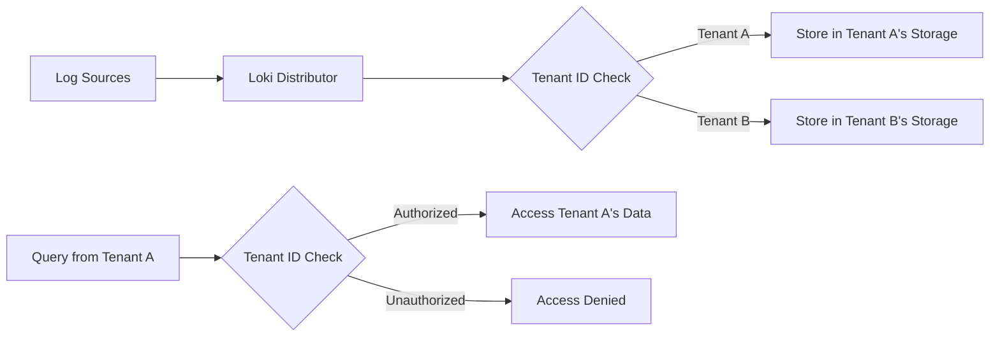

# Tenant IDs

## Introduction

In a multi-tenant environment like Grafana Loki, **Tenant IDs** are critical identifiers that help segregate and manage data belonging to different users, teams, or organizations. A tenant ID serves as a boundary that ensures one tenant cannot access or manipulate another tenant's logs, maintaining data isolation and security.

This guide will walk you through the concept of Tenant IDs in Grafana Loki, explain how they work, and demonstrate their implementation in various scenarios.

## What are Tenant IDs?

Tenant IDs in Grafana Loki are unique identifiers assigned to each tenant (user, team, or organization) using the system. They function as a fundamental isolation mechanism that:

- Separates log data between different tenants
- Controls access to logs based on tenant ownership
- Enables resource allocation and usage tracking per tenant
- Prevents unauthorized cross-tenant data access

## How Tenant IDs Work in Loki

When Loki processes log data, it associates each log entry with a specific Tenant ID. This association happens during the ingestion process and carries through to querying, ensuring that tenants can only access their own data.



## Tenant ID Headers

In Loki, the Tenant ID is typically passed as an HTTP header called `X-Scope-OrgID`. This header is required for all API requests to Loki when multi-tenancy is enabled.

### Example HTTP Request with Tenant ID

```bash
curl -X POST -H "Content-Type: application/json" \
  -H "X-Scope-OrgID: tenant-123" \
  -d '{
    "streams": [
      {
        "stream": {
          "job": "test-job",
          "level": "info"
        },
        "values": [
          ["1609746000000000000", "This is a test log message"]
        ]
      }
    ]
  }' \
  http://localhost:3100/loki/api/v1/push
```

This request pushes log data to Loki under the tenant identified by `tenant-123`.

## Configuring Tenant IDs in Loki

### Server-Side Configuration

Loki requires configuration to enable and manage multi-tenancy. Below is an example configuration snippet:

```yaml
auth_enabled: true

server:
  http_listen_port: 3100

limits_config:
  enforce_metric_name: false
  reject_old_samples: true
  reject_old_samples_max_age: 168h
  per_tenant_override_config: /etc/loki/tenant-overrides.yaml

# Multi-tenancy specific configuration
multi_tenant_enabled: true
```

### Tenant-Specific Overrides

You can specify different limits for different tenants using a tenant overrides configuration file:

```yaml
# /etc/loki/tenant-overrides.yaml
tenant-123:
  ingestion_rate_mb: 10
  ingestion_burst_size_mb: 20
  max_line_size_bytes: 512000
  max_chunks_per_query: 2000000
  
tenant-456:
  ingestion_rate_mb: 5
  ingestion_burst_size_mb: 10
```

## Client Configuration for Tenant IDs

### Promtail Configuration

When setting up Promtail (Loki's log collection agent) for a multi-tenant environment, you need to configure it to include the Tenant ID with log data:

```yaml
clients:
  - url: http://loki:3100/loki/api/v1/push
    tenant_id: tenant-123
    basic_auth:
      username: user
      password: pass
```

### Configuring Grafana for Multi-Tenancy

To query logs with the correct Tenant ID in Grafana:

```yaml
apiVersion: 1
datasources:
  - name: Loki
    type: loki
    url: http://loki:3100
    jsonData:
      timeout: 60
      maxLines: 1000
    secureJsonData:
      httpHeaderValue1: "tenant-123"
    httpHeaders:
      X-Scope-OrgID: ${TENANT_ID}
```

## Best Practices for Managing Tenant IDs

1. **Use Meaningful IDs**: Choose tenant IDs that are meaningful and easy to track (e.g., based on organization names or team identifiers).

2. **Secure Tenant IDs**: Treat tenant IDs as sensitive information; they should not be exposed unnecessarily.

3. **Implement Tenant ID Validation**: Validate tenant IDs at the application level to prevent unauthorized access:

```go
func validateTenantID(r *http.Request) (string, error) {
    tenantID := r.Header.Get("X-Scope-OrgID")
    if tenantID == "" {
        return "", errors.New("missing tenant ID")
    }
    
    // Additional validation logic here
    
    return tenantID, nil
}
```

4. **Set Default Tenant ID**: For testing or single-tenant deployments, configure a default tenant ID:

```yaml
# Promtail configuration with default tenant
clients:
  - url: http://loki:3100/loki/api/v1/push
    tenant_id: default
```

5. **Document Tenant ID Assignments**: Keep clear documentation of which tenant ID belongs to which organization or team.

## Tenant ID Mapping Strategies

Depending on your organization's requirements, you might adopt different strategies for tenant ID mapping:

### Direct Mapping

Each organization or team gets its own unique tenant ID:

| Organization | Tenant ID     |
|--------------|---------------|
| Acme Corp    | acme-corp     |
| TechStar Inc | techstar-inc  |
| DevOps Team  | devops-team   |

### Hierarchical Mapping

Tenant IDs follow organizational hierarchy:

| Organization | Department   | Tenant ID        |
|--------------|--------------|------------------|
| Acme Corp    | Engineering  | acme-eng         |
| Acme Corp    | Marketing    | acme-marketing   |
| TechStar Inc | Development  | techstar-dev     |

## Common Issues and Troubleshooting

### Missing Tenant ID

**Problem**: Requests failing with status code 401 or 403.

**Solution**: Ensure the `X-Scope-OrgID` header is properly set in all requests.

```bash
# Checking if a request includes the tenant ID header
curl -v -X GET \
  -H "X-Scope-OrgID: tenant-123" \
  http://localhost:3100/loki/api/v1/labels | grep "X-Scope-OrgID"
```

### Cross-Tenant Access Issues

**Problem**: Unable to see logs from another tenant.

**Solution**: This is expected behavior. If cross-tenant access is required, consider:

1. Implementing a proxy service that can aggregate data across tenants
2. Using a shared tenant ID for specific shared resources
3. Setting up federation between Loki instances

## Real-World Implementation Example

Let's look at a complete example of setting up a multi-tenant Loki environment for a company with multiple teams:

### 1. Loki Configuration

```yaml
# loki-config.yaml
auth_enabled: true

server:
  http_listen_port: 3100

multi_tenant_enabled: true

limits_config:
  enforce_metric_name: false
  reject_old_samples: true
  reject_old_samples_max_age: 168h
  per_tenant_override_config: /etc/loki/tenant-overrides.yaml

schema_config:
  configs:
    - from: 2020-10-24
      store: boltdb-shipper
      object_store: filesystem
      schema: v11
      index:
        prefix: index_
        period: 24h

storage_config:
  boltdb_shipper:
    active_index_directory: /loki/boltdb-shipper-active
    cache_location: /loki/boltdb-shipper-cache
    cache_ttl: 24h
    shared_store: filesystem
  filesystem:
    directory: /loki/chunks

compactor:
  working_directory: /loki/compactor
  shared_store: filesystem
```

### 2. Tenant Overrides Configuration

```yaml
# tenant-overrides.yaml
engineering-team:
  ingestion_rate_mb: 10
  ingestion_burst_size_mb: 20
  max_chunks_per_query: 2000000

operations-team:
  ingestion_rate_mb: 15
  ingestion_burst_size_mb: 25
  max_chunks_per_query: 3000000

security-team:
  ingestion_rate_mb: 8
  ingestion_burst_size_mb: 16
  max_chunks_per_query: 1500000
```

### 3. Promtail Configuration for Engineering Team

```yaml
# promtail-engineering.yaml
server:
  http_listen_port: 9080
  grpc_listen_port: 0

positions:
  filename: /tmp/positions.yaml

clients:
  - url: http://loki:3100/loki/api/v1/push
    tenant_id: engineering-team

scrape_configs:
  - job_name: engineering_logs
    static_configs:
      - targets:
          - localhost
        labels:
          job: engineering
          env: production
          team: engineering
    pipeline_stages:
      - regex:
          expression: '(?P<level>\w+):\s(?P<message>.*)'
      - labels:
          level:
```

### 4. Grafana Data Source Configuration

```yaml
# grafana-datasource.yaml
apiVersion: 1
datasources:
  - name: Loki (Engineering)
    type: loki
    url: http://loki:3100
    jsonData:
      timeout: 60
      maxLines: 1000
    secureJsonData:
      httpHeaderValue1: "engineering-team"
    httpHeaders:
      X-Scope-OrgID: ${TENANT_ID}
```

## Practical Application Scenarios

### Scenario 1: SaaS Provider with Multiple Customers

A SaaS company provides a monitoring solution to multiple customers. Each customer's data needs to be isolated:

1. Assign each customer a unique tenant ID (e.g., `customer-123`, `customer-456`)
2. Configure Promtail instances to push logs with the appropriate tenant ID
3. Set resource limits based on customer tier (standard, premium, enterprise)
4. Provide Grafana instances or users with appropriate tenant ID configuration

### Scenario 2: Large Organization with Multiple Teams

A large enterprise needs to separate logs for different departments:

1. Create tenant IDs for each department (`marketing`, `finance`, `engineering`)
2. Deploy department-specific Promtail configurations
3. Set different retention and query limits based on department needs
4. Configure RBAC in Grafana to ensure users can only access their department's data

## Summary

Tenant IDs are a cornerstone of Grafana Loki's multi-tenancy implementation. They provide:

- Data isolation between different users or organizations
- Configurable resource limits per tenant
- Secure access control to log data
- Flexibility for various organizational structures

By properly implementing and managing tenant IDs, you can ensure that your Loki deployment efficiently handles logs from multiple sources while maintaining appropriate access controls and resource allocation.

## Exercises

1. **Basic Setup**: Configure a Loki instance with multi-tenancy enabled and create two different tenant IDs.

2. **Querying Logs**: Write LogQL queries to retrieve logs from a specific tenant and verify that cross-tenant access is prevented.

3. **Advanced Configuration**: Implement tenant-specific rate limits and verify they're enforced correctly.

4. **Integration Challenge**: Set up a complete pipeline with Promtail, Loki, and Grafana using tenant IDs to isolate different data sources.

## Additional Resources

- [Grafana Loki Documentation](https://grafana.com/docs/loki/latest/)
- [Multi-tenancy in Loki Design Document](https://grafana.com/docs/loki/latest/operations/multi-tenancy/)
- [LogQL Query Language Reference](https://grafana.com/docs/loki/latest/logql/)
- [Grafana Loki Best Practices](https://grafana.com/docs/loki/latest/best-practices/)