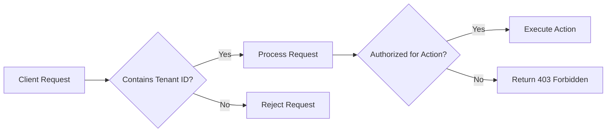

# Authorization Controls

## Introduction

Authorization controls are a critical aspect of multi-tenant Loki deployments. They determine what actions users or services can perform on specific resources within the system. In a multi-tenant environment, proper authorization ensures that tenants can only access their own data and resources, maintaining security and isolation between different users of the same Loki instance.

This guide will walk you through the concepts, implementation, and best practices for authorization controls in Grafana Loki, with practical examples to help you understand how to apply these concepts in real-world scenarios.

## Understanding Authorization in Loki

Authorization in Loki determines who can:
- Read logs (query access)
- Write logs (push access)
- Configure rules and alerts
- Manage tenant configurations

Let's break down the key components of Loki's authorization system:

### 1. Tenant ID (Org ID)

The foundation of Loki's multi-tenancy model is the tenant ID, sometimes referred to as the Org ID. Every request to Loki must include a tenant ID, which serves as the primary identifier for authorization decisions.



### 2. Authentication vs. Authorization

Before diving deeper, let's clarify the difference:

- **Authentication**: Verifies identity (who you are)
- **Authorization**: Determines permissions (what you can do)

Loki requires both components for a secure multi-tenant deployment.

## Implementing Authorization Controls

### Basic Authorization with HTTP Headers

The simplest form of authorization in Loki uses HTTP headers to pass tenant information:

```bash
# Query logs with explicit tenant ID
curl -H "X-Scope-OrgID: tenant1" \
  "http://loki:3100/loki/api/v1/query_range?query={app=\"myapp\"}&start=1601554800&end=1601558400"
```

This header tells Loki to execute the query in the context of `tenant1`, and the response will only include logs from that tenant.

### Authentication Methods

Loki doesn't enforce a specific authentication mechanism but works well with:

1. **API Keys/Tokens**
2. **Basic Authentication**
3. **OAuth/OIDC**

### Configuring Authorization in Loki

To implement authorization controls, you'll need to configure several components in your Loki configuration:

```yaml
auth_enabled: true

server:
  http_listen_port: 3100

ingester:
  lifecycler:
    ring:
      kvstore:
        store: inmemory
      replication_factor: 1

limits_config:
  enforce_metric_name: false
  reject_old_samples: true
  reject_old_samples_max_age: 168h
  max_entries_limit_per_query: 5000
  
  # Per-tenant rate limits
  ingestion_rate_mb: 4
  ingestion_burst_size_mb: 6
  per_tenant_override_config: /etc/loki/tenant-overrides.yaml
  
schema_config:
  configs:
    - from: 2020-10-01
      store: boltdb-shipper
      object_store: filesystem
      schema: v11
      index:
        prefix: index_
        period: 24h

storage_config:
  boltdb_shipper:
    active_index_directory: /loki/boltdb-shipper-active
    cache_location: /loki/boltdb-shipper-cache
    cache_ttl: 24h
    shared_store: filesystem
  filesystem:
    directory: /loki/chunks
```

### Using Tenant-Specific Overrides

You can implement different authorization policies for different tenants using overrides:

```yaml
# /etc/loki/tenant-overrides.yaml
overrides:
  "tenant1":
    ingestion_rate_mb: 10
    ingestion_burst_size_mb: 15
    max_streams_per_user: 1000
  "tenant2":
    ingestion_rate_mb: 5
    ingestion_burst_size_mb: 10
    max_streams_per_user: 500
```

This allows for fine-grained control over tenant permissions and resource allocation.

## Role-Based Access Control (RBAC)

For more sophisticated authorization needs, you can implement RBAC by integrating Loki with an identity provider that supports role-based authorization:

### Example: RBAC with Grafana Authentication Proxy

```yaml
# Grafana configuration (grafana.ini)
[auth.proxy]
enabled = true
header_name = X-WEBAUTH-USER
header_property = username
auto_sign_up = true
```

With this configuration, Grafana acts as an authentication proxy and forwards requests to Loki with appropriate tenant context based on the user's role.

## Practical Example: Implementing Tenant Isolation

Let's walk through a complete example of implementing authorization controls to ensure tenant isolation:

### Step 1: Configure Loki with Authentication Enabled

```yaml
# loki-config.yaml
auth_enabled: true

server:
  http_listen_port: 3100
  
# Other configuration details remain the same
```

### Step 2: Create a Client for Log Ingestion

Let's create a simple application that sends logs to Loki with tenant information:

```python
import requests
import json
import time

def send_logs(tenant_id, message, labels):
    """Send logs to Loki with tenant ID header."""
    current_time_ns = int(time.time() * 1e9)
    
    payload = {
        "streams": [
            {
                "stream": labels,
                "values": [
                    [str(current_time_ns), message]
                ]
            }
        ]
    }
    
    headers = {
        "Content-Type": "application/json",
        "X-Scope-OrgID": tenant_id
    }
    
    response = requests.post(
        "http://localhost:3100/loki/api/v1/push",
        data=json.dumps(payload),
        headers=headers
    )
    
    return response.status_code

# Example usage
labels = {"app": "auth-example", "environment": "production"}
response_code = send_logs("tenant1", "Authorization test log", labels)
print(f"Log sent with response code: {response_code}")
```

### Step 3: Query Logs with Tenant Context

```python
import requests
import time

def query_logs(tenant_id, query_expr, start_time=None, end_time=None):
    """Query logs from Loki with tenant ID header."""
    if start_time is None:
        start_time = int(time.time() - 3600)  # Last hour
    if end_time is None:
        end_time = int(time.time())
    
    params = {
        "query": query_expr,
        "start": start_time,
        "end": end_time,
        "limit": 100
    }
    
    headers = {
        "X-Scope-OrgID": tenant_id
    }
    
    response = requests.get(
        "http://localhost:3100/loki/api/v1/query_range",
        params=params,
        headers=headers
    )
    
    if response.status_code == 200:
        return response.json()
    else:
        print(f"Error: {response.status_code}")
        print(response.text)
        return None

# Example usage
query = '{app="auth-example"}'
results = query_logs("tenant1", query)

if results and "data" in results:
    for stream in results["data"]["result"]:
        print(f"Stream: {stream['stream']}")
        for value in stream["values"]:
            print(f"  {value[1]}")
```

### Output:

When running the above query as tenant1:

```
Stream: {'app': 'auth-example', 'environment': 'production'}
  Authorization test log
```

When trying to query the same logs as tenant2, you would get:

```
Error: 404
No logs found
```

This demonstrates that logs are properly isolated between tenants.

## Advanced Authorization Patterns

### 1. Grafana Dashboard Access Controls

When using Loki with Grafana, you can implement dashboard-level authorization controls:

```yaml
# Grafana provisioning/dashboards/loki-dashboards.yaml
apiVersion: 1

providers:
  - name: 'Loki Dashboards'
    orgId: 1
    folder: 'Loki'
    type: file
    disableDeletion: false
    updateIntervalSeconds: 10
    allowUiUpdates: false
    options:
      path: /etc/grafana/provisioning/dashboards
      foldersFromFilesStructure: true
```

Combined with Grafana team permissions, this ensures users only see dashboards relevant to their tenant.

### 2. Using Auth Middleware

For custom applications, implement middleware that adds tenant context:

```javascript
// Example Express.js middleware
function tenantAuthMiddleware(req, res, next) {
  const user = req.user; // Assuming authentication is already done
  
  if (!user || !user.tenantId) {
    return res.status(401).json({ error: 'Missing tenant information' });
  }
  
  // Add tenant header for downstream Loki requests
  req.headers['X-Scope-OrgID'] = user.tenantId;
  next();
}

app.use(tenantAuthMiddleware);
```

### 3. Configuration Validation

Implement validation checks to prevent misconfiguration:

```go
// Go code example for a service validating Loki configurations
func validateTenantConfig(tenantID string, config map[string]interface{}) error {
    // Check if tenant is authorized for the requested configuration
    if maxStreams, ok := config["max_streams_per_user"].(int); ok {
        if maxStreams > getTenantLimit(tenantID, "max_streams") {
            return fmt.Errorf("requested max_streams exceeds allowed limit for tenant %s", tenantID)
        }
    }
    
    // Additional validation logic...
    return nil
}
```

## Troubleshooting Authorization Issues

Common authorization issues and their solutions:

1. **Missing Tenant ID**
   - Error: `no org id`
   - Solution: Ensure the `X-Scope-OrgID` header is included in all requests

2. **Unauthorized Access**
   - Error: `unauthorized access`
   - Solution: Verify the tenant ID has permissions for the requested operation

3. **Rate Limit Exceeded**
   - Error: `rate limit exceeded`
   - Solution: Check tenant-specific rate limits in the overrides configuration

## Best Practices for Authorization Controls

1. **Least Privilege Principle**: Grant only the permissions each tenant needs
2. **Regular Audit**: Periodically review tenant access patterns and permissions
3. **Consistent Tenant IDs**: Use the same tenant identifier across your stack
4. **Separate Query/Push Permissions**: Some tenants may need read-only access
5. **Use HTTPS**: Always encrypt communications to prevent header spoofing
6. **Implement Rate Limiting**: Protect shared resources from abusive tenants
7. **Document Tenant Policies**: Maintain clear documentation of tenant permissions

## Summary

Authorization controls are essential for secure multi-tenant Loki deployments. By implementing proper tenant isolation, role-based access controls, and following best practices, you can ensure each tenant's data remains separate and secure while sharing the same Loki infrastructure.

The key components to remember are:
- Using tenant IDs consistently across all Loki interactions
- Configuring tenant-specific limits and policies
- Implementing proper authentication to verify identities
- Regular auditing and monitoring of authorization policies

With these controls in place, your Loki deployment can securely serve multiple tenants with proper isolation and security.

## Additional Resources

- [Grafana Loki Multi-tenancy Documentation](https://grafana.com/docs/loki/latest/operations/multi-tenancy/)
- [Loki Security Best Practices](https://grafana.com/docs/loki/latest/best-practices/)
- [Grafana RBAC Documentation](https://grafana.com/docs/grafana/latest/administration/roles-and-permissions/)

## Exercises

1. Configure a Loki instance with two tenants, each with different rate limits
2. Implement a simple logging client that respects tenant boundaries
3. Create a Grafana dashboard that shows logs from only one tenant
4. Implement a custom authentication proxy that adds tenant context to requests
5. Design an audit system that tracks authorization decisions in your Loki deployment