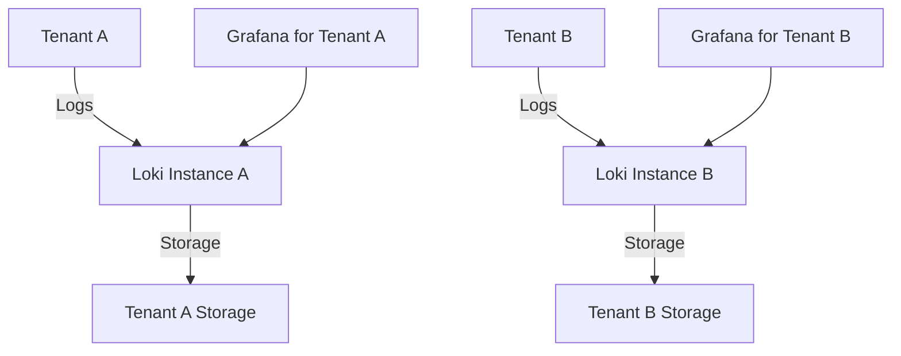
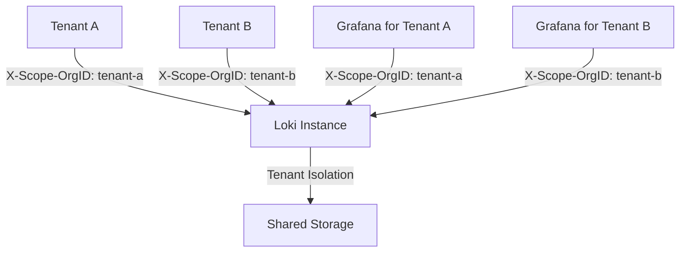
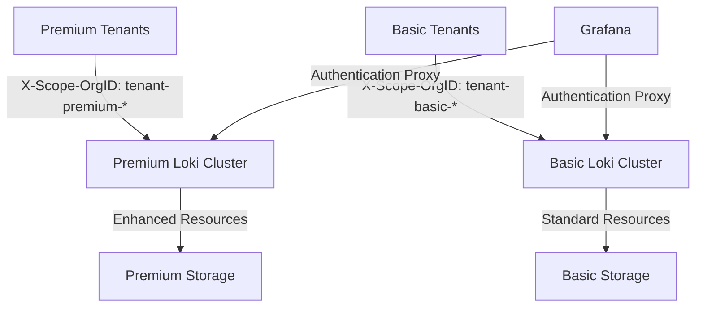

# Tenant Isolation in Grafana Loki

In multi-tenant environments, maintaining strict separation between different tenants' data is crucial for security, compliance, and resource management. This guide explores how Grafana Loki implements tenant isolation and how you can configure and manage it effectively.

## Introduction to Tenant Isolation

Tenant isolation refers to the mechanisms that keep one tenant's logs and queries completely separate from other tenants. In Grafana Loki, this isolation is fundamental to the multi-tenancy architecture and ensures that:

- Tenants can only access their own data
- Queries from one tenant don't impact performance for others
- Resource limits can be applied on a per-tenant basis
- Tenant-specific configurations can be maintained

Without proper isolation, you risk data leaks between tenants, performance degradation, and security vulnerabilities.

## How Tenant Isolation Works in Loki

Loki uses a tenant ID (also called an "organization ID") as the primary mechanism for isolation. This ID serves as the boundary between different tenants' data.

### Key Components of Tenant Isolation

1. **X-Scope-OrgID Header**: The HTTP header that identifies which tenant is making a request
2. **Data Segregation**: Physical or logical separation of log data in storage
3. **Query Isolation**: Ensuring queries only return data for the requesting tenant
4. **Resource Quotas**: Per-tenant limits on resources like storage, query rate, and ingestion

## Implementing Tenant Isolation

Let's look at how to implement and configure tenant isolation in Loki:

### Basic Tenant ID Configuration

When sending logs to Loki or querying from Loki, the tenant ID must be provided in the `X-Scope-OrgID` header:

```javascript
// Example of sending logs with tenant ID using JavaScript fetch
const sendLogs = async (logs, tenantId) => {
  const response = await fetch('http://loki:3100/loki/api/v1/push', {
    method: 'POST',
    headers: {
      'Content-Type': 'application/json',
      'X-Scope-OrgID': tenantId
    },
    body: JSON.stringify({
      streams: logs
    })
  });
  
  return response.ok;
};

// Usage
const logs = [{
  stream: {
    app: "payment-service",
    environment: "production"
  },
  values: [
    ["1627581999000000000", "INFO Payment processed successfully for order #12345"]
  ]
}];

sendLogs(logs, "tenant-123");
```

### Configuring Tenant Isolation in Loki Server

To enforce tenant isolation at the server level, you'll need to configure your Loki server properly. Here's an example configuration:

```yaml
auth_enabled: true

server:
  http_listen_port: 3100

limits_config:
  enforce_metric_name: false
  reject_old_samples: true
  reject_old_samples_max_age: 168h
  
  # Per-tenant rate limits
  ingestion_rate_mb: 4
  ingestion_burst_size_mb: 6
  
  # Per-tenant query limits
  max_query_length: 721h
  max_query_parallelism: 14
  cardinality_limit: 100000
  
  # Per-tenant retention period
  retention_period: 744h

# Multi-tenancy configuration
multi_kv_config:
  per_tenant_override_config: /etc/loki/overrides.yaml

# Storage configuration with tenant isolation
storage_config:
  boltdb_shipper:
    active_index_directory: /loki/index
    cache_location: /loki/cache
    cache_ttl: 24h
    shared_store: s3
  aws:
    s3: s3://loki:password@s3-endpoint:443
    bucketnames: loki-data
    region: us-east-1
```

The corresponding `/etc/loki/overrides.yaml` file allows you to customize limits for specific tenants:

```yaml
overrides:
  "tenant-premium":
    ingestion_rate_mb: 16
    ingestion_burst_size_mb: 24
    max_query_length: 1440h
    max_query_parallelism: 32
    retention_period: 2160h
  
  "tenant-basic":
    ingestion_rate_mb: 4
    ingestion_burst_size_mb: 6
    max_query_length: 168h
    max_query_parallelism: 8
    retention_period: 168h
```

## Verifying Tenant Isolation

To verify that tenant isolation is working correctly, you can run test queries to ensure data segregation:

```bash
# Query logs as tenant-1
curl -H "X-Scope-OrgID: tenant-1" \
  "http://loki:3100/loki/api/v1/query_range" \
  --data-urlencode "query={app=\"payment-service\"}" \
  --data-urlencode "start=1627581999000000000" \
  --data-urlencode "end=1627668399000000000"

# Query logs as tenant-2 (should return different results)
curl -H "X-Scope-OrgID: tenant-2" \
  "http://loki:3100/loki/api/v1/query_range" \
  --data-urlencode "query={app=\"payment-service\"}" \
  --data-urlencode "start=1627581999000000000" \
  --data-urlencode "end=1627668399000000000"
```

## Common Tenant Isolation Patterns

Let's look at some real-world patterns for tenant isolation in Loki:

### 1. Physical Isolation with Multiple Instances

For the highest level of isolation, run separate Loki instances for each tenant:



### 2. Logical Isolation within Single Instance

More commonly, use a single Loki instance with tenant ID-based logical isolation:



### 3. Hybrid Approach with Tiered Tenants

For organizations with varied requirements:



## Practical Example: Setting Up Tenant Isolation in Kubernetes

Let's implement a practical example of tenant isolation in a Kubernetes environment using Helm:

```yaml
# values.yaml for Loki Helm chart
loki:
  auth_enabled: true
  
  limits_config:
    per_tenant_override_config: /etc/loki/overrides.yaml
    
  storage:
    bucketNames: loki-${tenant}
    s3:
      region: us-east-1
  
  # Default tenant configurations
  tenant_configs:
    - tenant: default
      storage:
        s3:
          bucketNames: loki-default
      
    - tenant: team-a
      storage:
        s3:
          bucketNames: loki-team-a
      limits:
        ingestion_rate_mb: 8
        retention_period: 336h
      
    - tenant: team-b
      storage:
        s3: 
          bucketNames: loki-team-b
      limits:
        ingestion_rate_mb: 4
        retention_period: 168h

# Authentication middleware to enforce tenant ID
gateway:
  enabled: true
  replicas: 2
  
  auth:
    enabled: true
    type: enterprise
    tenantHeader: X-Scope-OrgID
    tenantFromHeader: true
```

This configuration creates separate storage buckets for each tenant and applies different resource limits.

## Troubleshooting Tenant Isolation

Common issues with tenant isolation and how to fix them:

| Issue | Symptom | Solution |
|-------|---------|----------|
| Missing tenant ID | `no org id` error | Ensure X-Scope-OrgID header is set in all requests |
| Cross-tenant data access | Data leakage between tenants | Verify authentication middleware is correctly configured |
| Tenant exceeding limits | 429 Too Many Requests errors | Adjust rate limits in overrides.yaml or upgrade tenant tier |
| Storage conflicts | Failed writes or corrupted reads | Ensure proper storage segregation (separate buckets or prefixes) |

## Best Practices for Tenant Isolation

1. **Use a reverse proxy** for additional authentication layers
2. **Implement distinct service accounts** for each tenant
3. **Monitor tenant usage patterns** to detect abnormal access
4. **Regularly audit tenant separation** to ensure isolation is maintained
5. **Document tenant identifiers** and their associated resource limits
6. **Implement graduated tenant tiers** to match different customer needs
7. **Use automation** to provision and manage tenant configurations

## Security Considerations

When implementing tenant isolation, consider these security aspects:

- **Header Spoofing**: Protect against X-Scope-OrgID spoofing with a trusted proxy
- **Authorization**: Combine tenant ID with user-level permissions
- **Encryption**: Consider per-tenant encryption keys for sensitive data
- **Auditing**: Implement logging of all cross-tenant operations
- **Least Privilege**: Service accounts should only access what's needed

## Summary

Tenant isolation is a crucial aspect of running Grafana Loki in multi-tenant environments. By properly implementing tenant isolation using the X-Scope-OrgID header, configuring per-tenant limits, and following security best practices, you can ensure that:

- Each tenant's data remains secure and private
- Resource consumption is fairly allocated
- System performance remains stable
- Regulatory compliance requirements can be met

With the configuration patterns and examples provided in this guide, you should be able to implement robust tenant isolation in your Grafana Loki deployment.

## Additional Resources

- [Grafana Loki Multi-tenancy Documentation](https://grafana.com/docs/loki/latest/operations/multi-tenancy/)
- [Loki API Reference for X-Scope-OrgID](https://grafana.com/docs/loki/latest/api/#org-id-header)
- [Loki Rate Limiting Configuration](https://grafana.com/docs/loki/latest/configuration/limits-config/)

## Exercises

1. Set up a local Loki instance with two different tenants and verify isolation by pushing and querying logs.
2. Implement per-tenant rate limiting and observe the behavior when limits are exceeded.
3. Create a Kubernetes deployment with tenant isolation for three different teams with varying resource requirements.
4. Design an authentication proxy that maps user identities to tenant IDs for a Loki deployment.
5. Implement a monitoring solution to track resource usage by tenant and alert on unusual patterns.