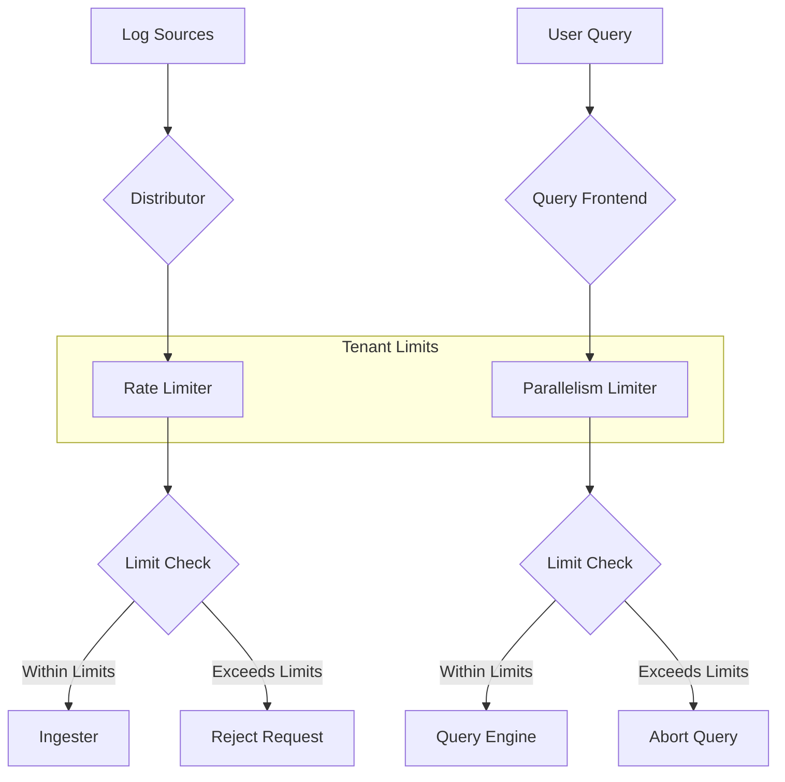

# Resource Limits

When running Grafana Loki in a multi-tenant environment, implementing proper resource limits is crucial to ensure fairness, prevent abuse, and maintain system stability. This guide will explain how resource limits work in Loki and how to configure them effectively.

## Introduction to Resource Limits

In a multi-tenant Loki deployment, different tenants (teams, applications, or environments) share the same infrastructure. Without proper limits, a single tenant could:

- Consume excessive storage by sending too much log data
- Overload the system with too many queries
- Degrade performance for other tenants through resource-intensive operations

Resource limits allow you to control and restrict how much of Loki's resources each tenant can use, ensuring fair allocation and preventing "noisy neighbor" problems.

## Core Limit Types in Loki

Loki supports several types of limits that can be applied globally or per-tenant:

### 1. Ingestion Limits

Ingestion limits control how much data tenants can send to Loki:

- **Rate limits**: Maximum log entries per second
- **Size limits**: Maximum size of individual log entries
- **Stream limits**: Maximum number of active streams per tenant

### 2. Query Limits

Query limits protect the query path from excessive load:

- **Query timeout**: Maximum duration for query execution
- **Query parallelism**: Number of shards that can be queried simultaneously
- **Cardinality limits**: Restrictions on the number of series that can be processed

### 3. Storage Limits

Storage limits control how much data each tenant can store:

- **Retention period**: How long logs are kept before deletion
- **Per-tenant storage quotas**: Maximum storage capacity allocated

## Configuring Global Limits

Loki's global limits apply to all tenants and serve as default values. They are defined in the `limits_config` section of Loki's configuration.

```yaml
limits_config:
  ingestion_rate_mb: 4
  ingestion_burst_size_mb: 6
  max_entries_limit_per_query: 5000
  max_label_name_length: 1024
  max_label_value_length: 2048
  reject_old_samples: true
  reject_old_samples_max_age: 168h
  max_query_length: 721h
  max_query_parallelism: 14
  max_streams_per_user: 10000
```

## Per-Tenant Overrides

You can override global limits for specific tenants using the `overrides` configuration:

```yaml
limits_config:
  # Global limits as shown above
  
  per_tenant_override_config:
    filename: /etc/loki/overrides.yaml

# In overrides.yaml:
overrides:
  tenant1:
    ingestion_rate_mb: 10
    ingestion_burst_size_mb: 15
    max_streams_per_user: 20000
  tenant2:
    max_query_length: 168h
    max_query_parallelism: 32
```

## Understanding Critical Limits

Let's examine some of the most important limits in detail:

### Ingestion Rate Limits

Rate limits are defined in MB per second and include a "burst" capacity to handle temporary spikes:

```yaml
limits_config:
  ingestion_rate_mb: 4       # 4 MB/s steady state
  ingestion_burst_size_mb: 6 # 6 MB burst capacity
```

When a tenant exceeds these limits, Loki will reject their log entries with a 429 (Too Many Requests) HTTP response.

### Stream Limits

The `max_streams_per_user` setting controls the maximum number of active streams a tenant can have:

```yaml
limits_config:
  max_streams_per_user: 10000
```

This limit prevents cardinality explosions, which can happen when log entries have too many unique label combinations.

## Measuring and Monitoring Limits

Loki exposes metrics that help you monitor resource usage and limit enforcement:

- `loki_distributor_bytes_received_total`: Total bytes received per tenant
- `loki_ingester_streams_created_total`: Number of streams created per tenant
- `loki_request_duration_seconds`: Request latency by tenant
- `loki_discarded_samples_total`: Samples discarded due to rate limiting

You can use these metrics to set up alerts and create dashboards to monitor tenant behavior.

## Dynamic Limit Configuration

For more flexibility, you can use Loki's runtime configuration feature to update limits without restarting:

```yaml
runtime_config:
  file: /etc/loki/runtime.yaml
```

This allows you to adjust limits on-the-fly as your workloads and requirements change.

## Practical Example: Multi-Environment Setup

Consider a scenario where you're running Loki for development, staging, and production environments:

```yaml
limits_config:
  # Default limits for all tenants
  ingestion_rate_mb: 2
  ingestion_burst_size_mb: 4
  max_query_length: 24h
  
  per_tenant_override_config:
    filename: /etc/loki/overrides.yaml

# In overrides.yaml:
overrides:
  dev:
    ingestion_rate_mb: 1
    max_query_length: 48h
  staging:
    ingestion_rate_mb: 3
    max_streams_per_user: 5000
  production:
    ingestion_rate_mb: 10
    ingestion_burst_size_mb: 20
    max_query_length: 72h
    max_query_parallelism: 32
    max_streams_per_user: 50000
```

This configuration allocates the most resources to production while limiting development and staging to smaller quotas.

## Limit Visualization

Here's a visual representation of how resource limits work in a multi-tenant environment:



## Best Practices for Resource Limits

1. **Start conservative**: Begin with stricter limits and gradually increase them based on observed usage patterns.

2. **Monitor limit errors**: Track the frequency of rate limit errors per tenant to identify problematic workloads.

3. **Implement graduated limits**: Provide different tiers of limits based on tenant requirements or service levels.

4. **Regular review**: Periodically review and adjust limits based on system capacity and tenant needs.

5. **Communicate limits**: Ensure tenants understand their resource allocations and limits.

6. **Use data to inform limits**: Base limits on actual usage patterns rather than arbitrary values.

## Implementing a Limit Strategy

Here's a step-by-step approach to implementing resource limits:

1. **Baseline measurement**: Monitor your Loki deployment without strict limits to understand natural usage patterns.

2. **Global limit configuration**: Set sensible global limits based on your total system capacity.

3. **Tenant classification**: Categorize tenants based on their expected workload and importance.

4. **Per-tenant overrides**: Configure specific limits for high-priority or high-volume tenants.

5. **Monitoring setup**: Create dashboards to track resource usage and limit violations.

6. **Adjustment cycle**: Regularly review and adjust limits based on monitoring data.

## Summary

Resource limits are an essential aspect of running Loki in a multi-tenant environment. They protect your infrastructure from overload, ensure fair resource allocation, and help maintain predictable performance.

By understanding and properly configuring ingestion, query, and storage limits, you can create a stable and reliable logging system that serves multiple tenants effectively.

## Additional Resources

- [Loki Configuration Documentation](https://grafana.com/docs/loki/latest/configuration/)
- [Loki Multi-tenancy Guide](https://grafana.com/docs/loki/latest/operations/multi-tenancy/)
- [Monitoring Loki](https://grafana.com/docs/loki/latest/operations/observability/)

## Exercises

1. Configure basic resource limits for a Loki deployment with three tenants of different priorities.

2. Set up a Grafana dashboard to monitor tenant resource usage and limit violations.

3. Implement dynamic limit configuration and practice updating limits at runtime.

4. Design a graduated limit strategy with at least three different service tiers.

5. Create an incident response plan for dealing with tenants that consistently reach or exceed their resource limits.