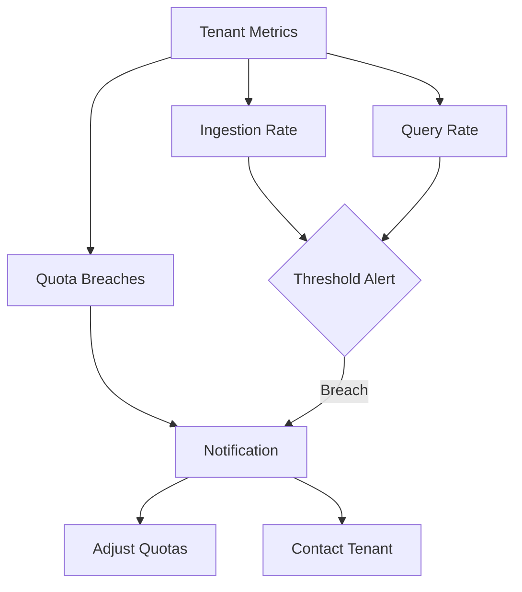

# Per-Tenant Quotas

## Introduction

In a multi-tenant Grafana Loki environment, different teams, applications, or customers (tenants) share the same Loki infrastructure. While this approach is cost-effective, it introduces a challenge: how do you prevent one tenant from consuming excessive resources and impacting others? This is where per-tenant quotas come in.

Per-tenant quotas allow you to set specific limits on resource consumption for each tenant, ensuring fair usage and system stability. These quotas help you:

- Prevent resource monopolization by any single tenant
- Maintain consistent performance for all users
- Plan capacity and resource allocation effectively
- Implement tiered service levels for different customer groups

## Understanding Quota Types in Loki

Loki supports several types of quotas that can be configured on a per-tenant basis:

### 1. Ingestion Quotas

These quotas limit how much data a tenant can send to Loki:

- **Ingestion rate**: Limits the volume of log data (measured in bytes) that can be ingested per second
- **Sample rate**: Restricts the number of log lines that can be ingested per second
- **Maximum label names per series**: Controls the complexity of tenant log metadata

### 2. Query Quotas

These quotas control how tenants can query their data:

- **Query timeout**: Maximum duration a query can run before being terminated
- **Query parallelism**: Number of queries a tenant can run in parallel
- **Query series limit**: Maximum number of series a tenant can select in a single query
- **Maximum chunk age**: Oldest data a tenant can query (retention control)

### 3. API Quotas

These quotas affect API usage:

- **Maximum requests per second**: Controls how frequently a tenant can call Loki APIs

## Configuring Per-Tenant Quotas

Loki allows you to configure quotas through configuration files or runtime overrides. Let's look at both approaches:

### Configuration File Method

Quotas can be specified in Loki's configuration file. Here's an example configuration that sets up different quota limits for two tenants:

```yaml
limits_config:
  # Global defaults that apply to all tenants
  ingestion_rate: 10MB
  ingestion_burst_size: 20MB
  max_label_names_per_series: 30
  max_label_name_length: 1024
  max_label_value_length: 2048

  # Per-tenant overrides
  per_tenant_override_config:
    filename: /etc/loki/tenant-quotas.yaml

# Contents of tenant-quotas.yaml
overrides:
  tenant1:
    ingestion_rate: 20MB
    ingestion_burst_size: 30MB
    max_query_parallelism: 16
  
  tenant2:
    ingestion_rate: 5MB
    ingestion_burst_size: 10MB
    max_query_parallelism: 8
    max_query_series: 5000
```

This configuration:
- Sets global defaults for all tenants
- Provides tenant1 with higher ingestion limits (20MB/s) and query parallelism (16)
- Restricts tenant2 to lower ingestion limits (5MB/s) and query parallelism (8)

### Runtime Configuration with API

Loki also provides an API to manage quotas dynamically. This is useful for adjusting limits without restarting Loki:

```bash
# Set a new ingestion rate for tenant1
curl -X POST http://loki:3100/config/v1/overrides \
  -H "Content-Type: application/json" \
  -H "X-Scope-OrgID: tenant1" \
  -d '{"ingestion_rate": "25MB"}'

# Get current quotas for tenant2
curl -X GET http://loki:3100/config/v1/overrides \
  -H "X-Scope-OrgID: tenant2"
```

## Monitoring Quota Usage

To effectively manage quotas, you need visibility into how tenants are using their allocated resources. Loki exports several metrics that help monitor quota usage:

```yaml
# Grafana dashboard query examples
# Query to show ingestion rate by tenant
sum by(tenant) (rate(loki_distributor_bytes_received_total[5m]))

# Query to show quota limit breaches
sum by(tenant) (rate(loki_overrides_limits_overrides_total{limit="ingestion_rate"}[5m]))
```

Let's create a visual monitoring dashboard to track tenant quota usage:



## Implementing a Progressive Quota Strategy

When implementing quotas, consider a progressive approach that balances system protection with tenant experience:

### Step 1: Monitor Usage Patterns

Before setting strict limits, monitor how your tenants naturally use the system:

```yaml
# Prometheus query to identify tenant usage patterns over 30 days
max_over_time(sum by(tenant) (rate(loki_distributor_bytes_received_total[5m]))[30d:1h])
```

### Step 2: Set Generous Initial Quotas

Start with quotas well above observed usage to avoid disrupting workloads:

```yaml
overrides:
  tenant1:
    ingestion_rate: "200% of observed peak"
    max_query_parallelism: 32  # High initial value
```

### Step 3: Gradually Refine Quotas

Tighten quotas gradually as you understand usage patterns better:

```yaml
# Month 1: 200% of observed peak
# Month 2: 150% of observed peak
# Month 3: 120% of observed peak + buffer
```

## Real-World Example: E-commerce Application

Let's examine how per-tenant quotas would work in a real-world scenario with an e-commerce platform:

| Tenant | Description | Quota Strategy |
|--------|-------------|----------------|
| Orders Service | Handles order processing | Higher ingestion during sales events |
| User Service | Manages user accounts | Consistent, predictable load |
| Analytics | Business intelligence | Higher query limits, lower priority |

Here's how you might configure quotas for this scenario:

```yaml
overrides:
  orders-service:
    ingestion_rate: 15MB
    ingestion_burst_size: 30MB  # Allows for sales spikes
    max_query_parallelism: 8
    
  user-service:
    ingestion_rate: 5MB
    ingestion_burst_size: 8MB
    max_query_parallelism: 4
    
  analytics:
    ingestion_rate: 2MB
    max_query_parallelism: 16
    query_timeout: 5m  # Longer timeout for complex analytics
```

## Handling Quota Breaches

When tenants hit their quotas, Loki will reject requests with appropriate error messages. You can implement additional handling:

### 1. Graceful Degradation

Configure your application to handle quota breaches gracefully:

```go
// Example of client-side handling in Go
func sendLogsWithRetry(logs []Log, tenant string) error {
    for attempts := 0; attempts < 3; attempts++ {
        err := sendLogs(logs, tenant)
        if err != nil {
            if isQuotaError(err) {
                // If quota error, wait with exponential backoff
                time.Sleep(time.Second * time.Duration(math.Pow(2, float64(attempts))))
                continue
            }
            return err
        }
        return nil
    }
    // If we reach here, all attempts failed
    // Sample logs and send important ones only
    return sendLogs(sampleCriticalLogs(logs), tenant)
}
```

### 2. Alerting on Quota Breaches

Set up alerts to notify when tenants approach or exceed their quotas:

```yaml
# Prometheus alerting rule example
groups:
- name: loki_quota_alerts
  rules:
  - alert: TenantNearIngestionQuota
    expr: sum by(tenant) (rate(loki_distributor_bytes_received_total[5m])) / on(tenant) group_left max by(tenant) (loki_limits_ingestion_rate_bytes) > 0.8
    for: 15m
    labels:
      severity: warning
    annotations:
      summary: "Tenant {{ $labels.tenant }} approaching ingestion quota"
      description: "Tenant is using {{ $value | humanizePercentage }} of allocated ingestion quota"
```

## Implementing Tiered Service Levels

Per-tenant quotas can be used to implement different service tiers:

```yaml
overrides:
  # Free tier
  tier-free:
    ingestion_rate: 1MB
    max_query_parallelism: 2
    retention_period: 7d
  
  # Standard tier
  tier-standard:
    ingestion_rate: 10MB
    max_query_parallelism: 8
    retention_period: 30d
  
  # Enterprise tier
  tier-enterprise:
    ingestion_rate: 50MB
    max_query_parallelism: 32
    retention_period: 90d
```

This approach allows you to offer differentiated service levels based on customer needs and pricing.

## Common Pitfalls and Best Practices

When implementing per-tenant quotas, be aware of these common challenges:

### Pitfalls to Avoid

1. **Setting quotas too low**: Can cause legitimate traffic to be rejected
2. **Ignoring burst patterns**: Many applications have periodic spikes in logging
3. **One-size-fits-all approach**: Different tenants have different needs
4. **Lack of monitoring**: Without visibility, quota issues go undetected

### Best Practices

1. **Start with monitoring**: Understand usage before setting limits
2. **Communicate clearly**: Ensure tenants understand their limits
3. **Implement gradual enforcement**: Warn before enforcing strictly
4. **Plan for exceptions**: Have a process for temporary quota increases
5. **Regular reviews**: Periodically review and adjust quotas

## Summary

Per-tenant quotas are a critical component of multi-tenant Loki deployments, allowing you to:

- Allocate resources fairly across tenants
- Protect system stability and performance
- Implement tiered service levels
- Manage capacity planning effectively

By carefully configuring ingestion, query, and API quotas, you can ensure that your Loki deployment serves all tenants reliably while preventing resource monopolization. Remember to start with monitoring, set reasonable initial limits, and gradually refine your quota strategy as you gain more insights into tenant usage patterns.

## Exercise: Building a Quota Management Strategy

1. Monitor a multi-tenant Loki deployment for 1 week without quotas
2. Identify the p95 and p99 usage patterns for each tenant
3. Design appropriate quota levels for each tenant
4. Implement the quotas with a 2-week warning period
5. Monitor the effects after full enforcement

## Additional Resources

- [Loki Configuration Documentation](https://grafana.com/docs/loki/latest/configuration/)
- [Multi-tenancy Best Practices](https://grafana.com/docs/loki/latest/operations/multi-tenancy/)
- [Prometheus Monitoring for Loki](https://grafana.com/grafana/dashboards/13639-loki-operational/)