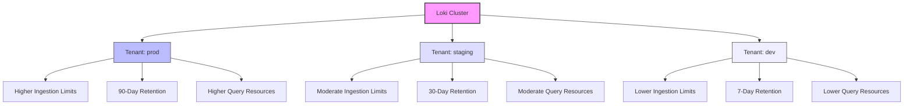

# Tenant Configuration

## Introduction

In a multi-tenant Grafana Loki deployment, proper tenant configuration is essential for maintaining separation between different users or organizations sharing the same Loki infrastructure. Tenant configuration allows administrators to define resource limits, retention policies, and access controls on a per-tenant basis, ensuring fair resource allocation and data isolation.

This guide will walk you through the process of configuring tenants in Loki, helping you understand the key parameters and best practices for managing a multi-tenant environment.

## Understanding Tenant IDs in Loki

In Loki, each tenant is identified by a unique identifier known as a **tenant ID**. This ID is used throughout Loki's internal systems to segregate data and apply tenant-specific configurations.

### The X-Scope-OrgID Header

Loki uses the `X-Scope-OrgID` HTTP header to identify tenants in API requests. Every request made to Loki must include this header to specify which tenant's data is being accessed or modified.

For example, when pushing logs to Loki:

```bash
curl -H "Content-Type: application/json" \
     -H "X-Scope-OrgID: tenant-123" \
     -X POST \
     -d '{
       "streams": [
         {
           "stream": {
             "job": "app",
             "level": "info"
           },
           "values": [
             [ "1630000000000000000", "log message for tenant-123" ]
           ]
         }
       ]
     }' \
     http://localhost:3100/loki/api/v1/push
```

In this example, the log data is associated with the tenant identified by `tenant-123`.

## Tenant Configuration in Loki's Runtime Configuration

Tenant-specific configurations are defined in Loki's runtime configuration file, typically specified with the `-runtime-config.file` flag when starting Loki.

Here's an example of a runtime configuration file with tenant-specific settings:

```yaml
# runtime-config.yaml

overrides:
  tenant-123:
    ingestion_rate_mb: 10
    ingestion_burst_size_mb: 20
    max_streams_per_user: 10000
    max_chunks_per_query: 1000000
    retention_period: 744h
  
  tenant-456:
    ingestion_rate_mb: 5
    ingestion_burst_size_mb: 10
    max_streams_per_user: 5000
    max_chunks_per_query: 500000
    retention_period: 168h
```

## Key Tenant Configuration Parameters

Let's explore the main parameters you can configure for each tenant:

### Ingestion Limits

```yaml
ingestion_rate_mb: 10
ingestion_burst_size_mb: 20
max_line_size_bytes: 256000
max_line_size: 256000  # Deprecated in favor of max_line_size_bytes
max_streams_per_user: 10000
max_global_streams_per_user: 10000
max_chunks_per_user: 1000000
```

- **ingestion_rate_mb**: Maximum ingestion rate in MB per second
- **ingestion_burst_size_mb**: Maximum burst size for ingestion in MB
- **max_line_size_bytes**: Maximum size of a single log line in bytes
- **max_streams_per_user**: Maximum number of active streams per tenant
- **max_global_streams_per_user**: Maximum number of streams across all indices per tenant
- **max_chunks_per_user**: Maximum number of chunks that can exist in a store for a tenant

### Query Limits

```yaml
max_chunks_per_query: 1000000
max_query_series: 500
max_query_lookback: 720h
max_query_length: 24h
max_query_parallelism: 32
query_timeout: 1m
query_split_duration: 30m
```

- **max_chunks_per_query**: Maximum number of chunks that can be fetched by a single query
- **max_query_series**: Maximum number of series a query can return
- **max_query_lookback**: Maximum duration into the past a query can look
- **max_query_length**: Maximum time range for a query
- **max_query_parallelism**: Maximum number of parallel query workers
- **query_timeout**: Maximum duration for a query to execute
- **query_split_duration**: Split queries by time interval for improved performance

### Retention Settings

```yaml
retention_period: 744h
```

- **retention_period**: How long log data is kept before being deleted (e.g., 744h = 31 days)

### Cardinality Limits

```yaml
cardinality_limit: 100000
max_label_name_length: 1024
max_label_value_length: 2048
max_label_names_per_series: 30
```

- **cardinality_limit**: Maximum number of active series per tenant
- **max_label_name_length**: Maximum length for label names
- **max_label_value_length**: Maximum length for label values
- **max_label_names_per_series**: Maximum number of label names per series

## Default Tenant Configuration

When no tenant-specific overrides are defined, Loki applies default limits specified in the `limits_config` section of the main configuration:

```yaml
limits_config:
  ingestion_rate_mb: 4
  ingestion_burst_size_mb: 6
  max_streams_per_user: 10000
  max_chunks_per_query: 1000000
  retention_period: 744h
```

## Dynamic Tenant Configuration

Loki supports dynamic runtime configuration, allowing you to update tenant settings without restarting the service. You can reload the runtime configuration by sending a `POST` request to the `/-/reload` endpoint:

```bash
curl -X POST http://localhost:3100/-/reload
```

## Practical Example: Multi-Environment Tenant Configuration

Let's look at a practical example where we configure Loki for multiple environments within an organization:

```yaml
# runtime-config.yaml
overrides:
  # Production environment with higher limits
  prod:
    ingestion_rate_mb: 20
    ingestion_burst_size_mb: 30
    max_streams_per_user: 50000
    max_chunks_per_query: 2000000
    retention_period: 2160h  # 90 days
    max_query_length: 72h
    max_query_parallelism: 32
    query_timeout: 5m
    
  # Staging environment with moderate limits
  staging:
    ingestion_rate_mb: 10
    ingestion_burst_size_mb: 15
    max_streams_per_user: 20000
    max_chunks_per_query: 1000000
    retention_period: 720h  # 30 days
    max_query_length: 48h
    max_query_parallelism: 16
    query_timeout: 2m
    
  # Development environment with lower limits
  dev:
    ingestion_rate_mb: 5
    ingestion_burst_size_mb: 8
    max_streams_per_user: 10000
    max_chunks_per_query: 500000
    retention_period: 168h  # 7 days
    max_query_length: 24h
    max_query_parallelism: 8
    query_timeout: 1m
```

To visualize how these tenants are isolated:



## Configuring Promtail for Multi-Tenancy

When sending logs from Promtail (Loki's log collection agent) to a multi-tenant Loki setup, you need to configure Promtail to use the appropriate tenant ID:

```yaml
# promtail-config.yaml
clients:
  - url: http://loki:3100/loki/api/v1/push
    tenant_id: prod
    basic_auth:
      username: loki
      password: secret
```

For more complex scenarios, you can use relabeling to dynamically set the tenant ID based on labels:

```yaml
clients:
  - url: http://loki:3100/loki/api/v1/push
    tenant_id: ${NAMESPACE}
    
scrape_configs:
  - job_name: kubernetes-pods
    kubernetes_sd_configs:
      - role: pod
    relabel_configs:
      - source_labels: [__meta_kubernetes_namespace]
        target_label: NAMESPACE
```

In this example, the Kubernetes namespace is used as the tenant ID, allowing for separate tenants per namespace.

## Best Practices for Tenant Configuration

1. **Start with Conservative Limits**: Begin with conservative resource limits and gradually increase them as needed based on actual usage patterns.

2. **Align Tenants with Organizational Structure**: Map tenants to your organizational structure—for example, by department, team, or environment (prod, staging, dev).

3. **Monitor Tenant Resource Usage**: Implement monitoring to track each tenant's resource consumption, helping identify when limits need adjustment.

4. **Use Federation for Large-Scale Deployments**: For very large deployments, consider running separate Loki instances for high-traffic tenants and using federation for querying across them.

5. **Document Tenant Configurations**: Maintain clear documentation of tenant configurations, including why specific limits were chosen.

6. **Consider Automation**: For environments with many tenants, use automation to generate and update tenant configurations based on templates.

7. **Implement Regular Reviews**: Regularly review tenant configurations to ensure they remain appropriate as usage patterns evolve.

## Troubleshooting Tenant Issues

### Rate Limiting Errors

If users encounter `429 Too Many Requests` errors, it indicates they've exceeded their ingestion rate limits:

```
Error: server returned HTTP status 429 Too Many Requests: Ingestion rate limit (10.00MB/sec) exceeded
```

Solutions:
- Increase the `ingestion_rate_mb` and `ingestion_burst_size_mb` values for the affected tenant
- Implement backpressure handling in your log shipping configuration
- Consider log sampling for high-volume sources

### Query Performance Issues

If queries are timing out or performing poorly:

Solutions:
- Adjust `max_chunks_per_query` or `max_query_series` limits
- Increase `query_timeout` for complex queries
- Use more specific label selectors to reduce the scope of queries
- Split large time ranges into smaller queries

## Summary

Proper tenant configuration is crucial for managing a multi-tenant Loki deployment. By understanding and applying tenant-specific limits for ingestion, querying, and retention, you can ensure fair resource allocation and data isolation between different users or organizations sharing the same Loki infrastructure.

Key takeaways:
- Each tenant has a unique ID specified via the `X-Scope-OrgID` header
- Tenant configurations are defined in Loki's runtime configuration file
- Important parameters include ingestion limits, query limits, and retention periods
- Dynamic configuration allows updating tenant settings without service restarts
- Tenant configurations should align with your organizational structure and usage patterns

## Additional Resources and Exercises

### Exercises

1. Set up a Loki instance with three different tenants, each with distinct resource limits and retention periods.

2. Configure Promtail to send logs to Loki using different tenant IDs based on the source application.

3. Create a monitoring dashboard to track resource usage per tenant, helping identify when limits need adjustment.

4. Implement a script that generates tenant configurations based on a template and a list of tenant properties.

### Further Reading

- [Loki Multi-tenancy Documentation](https://grafana.com/docs/loki/latest/operations/multi-tenancy/)
- [Loki Configuration Reference](https://grafana.com/docs/loki/latest/configuration/)
- [Scaling Loki Guide](https://grafana.com/docs/loki/latest/operations/scalability/)
- [Promtail Configuration Guide](https://grafana.com/docs/loki/latest/clients/promtail/configuration/)