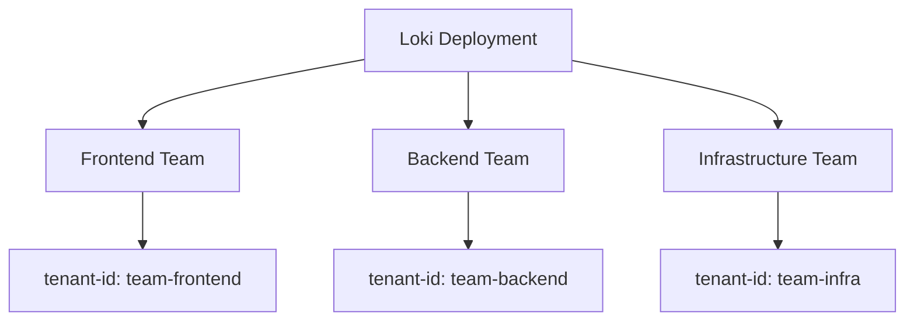
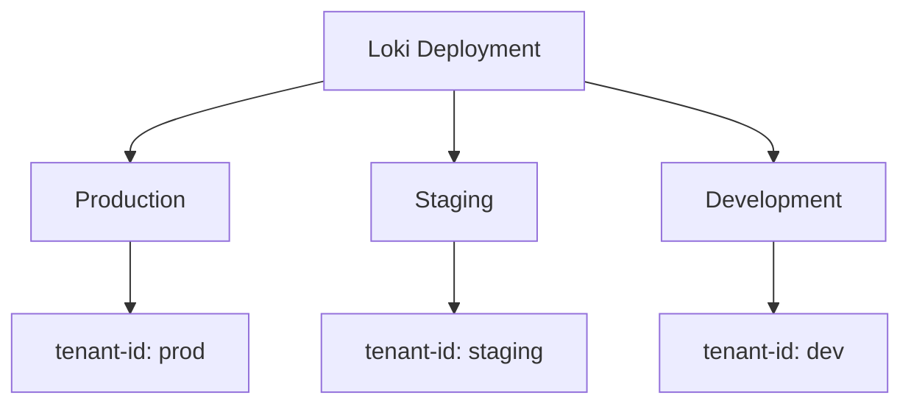

# Managing Multiple Teams

## Introduction

In a production environment, Grafana Loki is rarely used by just one team. As organizations scale, multiple teams need to work with the same Loki instance while maintaining isolation, security, and resource efficiency. This is where multi-tenancy becomes crucial.

Multi-tenancy in Grafana Loki allows multiple teams to use the same Loki installation without interfering with each other's logs or queries. This document explores how to effectively manage multiple teams in a Loki deployment through tenant IDs, access controls, and resource allocation strategies.

## Understanding Multi-Tenancy in Loki

At its core, Loki's multi-tenancy is built around the concept of **tenant IDs**. Every request to Loki must include a tenant ID, which serves as a namespace that logically separates data between different teams or applications.

### Key Concepts

- **Tenant ID**: A unique identifier that segregates logs between different teams
- **X-Scope-OrgID**: The HTTP header used to specify the tenant ID
- **Resource Isolation**: Ensuring one team's queries don't impact other teams
- **Authentication & Authorization**: Managing who can access what logs

## Setting Up Multi-Tenancy

### Basic Configuration

The simplest way to enable multi-tenancy is through Loki's configuration file:

```yaml
auth_enabled: true

server:
  http_listen_port: 3100

common:
  path_prefix: /loki
  storage:
    filesystem:
      chunks_directory: /loki/chunks
      rules_directory: /loki/rules
  replication_factor: 1
  ring:
    kvstore:
      store: inmemory

limits_config:
  enforce_metric_name: false
  reject_old_samples: true
  reject_old_samples_max_age: 168h
  max_entries_limit_per_query: 5000
  max_query_parallelism: 32
```

The critical setting here is `auth_enabled: true`, which enforces tenant ID validation for all requests.

### Tenant ID Management

When sending logs to Loki, you must include a tenant ID through the `X-Scope-OrgID` HTTP header:

```bash
curl -H "X-Scope-OrgID: team-frontend" -H "Content-Type: application/json" \
  -XPOST -s "http://localhost:3100/loki/api/v1/push" \
  --data-raw '{"streams": [{"stream": {"job": "frontend", "level": "info"}, "values": [ ["1620000000000000000", "This is a log line from the frontend team"] ]}]}'
```

When querying Loki, you must use the same tenant ID:

```bash
curl -H "X-Scope-OrgID: team-frontend" \
  -G -s "http://localhost:3100/loki/api/v1/query_range" \
  --data-urlencode 'query={job="frontend"}' \
  --data-urlencode 'start=1620000000000000000' \
  --data-urlencode 'end=1620100000000000000'
```

## Practical Multi-Team Setups

Let's look at how to manage multiple teams in real-world scenarios:

### Scenario 1: Development Teams Structure

Consider an organization with three development teams:



Each team would use their unique tenant ID for pushing and querying logs:

```yaml
# Promtail configuration for Frontend Team
clients:
  - url: http://loki:3100/loki/api/v1/push
    tenant_id: team-frontend

# Promtail configuration for Backend Team
clients:
  - url: http://loki:3100/loki/api/v1/push
    tenant_id: team-backend

# Promtail configuration for Infrastructure Team
clients:
  - url: http://loki:3100/loki/api/v1/push
    tenant_id: team-infra
```

### Scenario 2: Environment-Based Structure

Another approach is to organize by environments:



## Implementing Access Controls

### Using Auth Proxy

For production environments, you'll want more sophisticated authentication. A common approach is to use an auth proxy like NGINX:

```nginx
server {
    listen 3100;
    
    location /loki/api/v1/push {
        auth_request /auth;
        proxy_pass http://loki:3100$request_uri;
    }
    
    location = /auth {
        proxy_pass http://auth-service/validate;
        proxy_pass_request_body off;
        proxy_set_header Content-Length "";
        proxy_set_header X-Original-URI $request_uri;
    }
}
```

### Integration with Grafana

When integrating with Grafana, you can map Grafana organizations to Loki tenant IDs:

```yaml
# Grafana datasource configuration
apiVersion: 1
datasources:
  - name: Loki
    type: loki
    access: proxy
    url: http://loki:3100
    jsonData:
      httpHeaderName1: "X-Scope-OrgID"
    secureJsonData:
      httpHeaderValue1: "${__org.name}"
```

This setup automatically uses the Grafana organization name as the tenant ID.

## Resource Limits and Quotas

Preventing one team from consuming all resources is crucial in a multi-tenant setup.

### Per-Tenant Limits

Configure limits in Loki's configuration file:

```yaml
limits_config:
  per_tenant_override_config: /etc/loki/tenant-limits.yaml
  
  # Default limits
  ingestion_rate_mb: 4
  ingestion_burst_size_mb: 6
  max_query_parallelism: 16
  max_query_series: 500
```

Then define team-specific limits in `tenant-limits.yaml`:

```yaml
overrides:
  "team-frontend":
    ingestion_rate_mb: 10
    ingestion_burst_size_mb: 15
    max_query_series: 1000
  
  "team-backend":
    ingestion_rate_mb: 8
    ingestion_burst_size_mb: 12
    
  "team-infra":
    ingestion_rate_mb: 20
    ingestion_burst_size_mb: 25
    max_query_parallelism: 32
```

## Best Practices

1. **Use Meaningful Tenant IDs**: Choose tenant IDs that clearly represent teams or applications.

2. **Document Your Multi-Tenancy Strategy**: Create clear documentation about which tenant IDs exist and who should use them.

3. **Implement Graduated Limits**: Assign larger resource quotas to teams with greater logging needs.

4. **Monitor Tenant Usage**: Set up monitoring dashboards to track each tenant's resource consumption.

5. **Regular Audits**: Periodically review tenant IDs to remove unused ones and optimize resource allocation.

Here's an example of a Grafana dashboard query to monitor per-tenant metrics:

```
sum by (tenant_id) (rate(loki_distributor_bytes_received_total[5m]))
```

## Troubleshooting Multi-Tenant Setups

### Common Issues and Solutions

1. **Missing Tenant ID**:

   - Symptom: Error message `tenant ID missing`
   - Solution: Ensure all requests include the `X-Scope-OrgID` header

2. **Unauthorized Tenant Access**:

   - Symptom: Error message `tenant has no access to X`
   - Solution: Check authentication configuration and permissions

3. **Tenant Exceeding Limits**:

   - Symptom: Error message `rate limit reached for tenant X`
   - Solution: Increase limits for that tenant or optimize logging volume

## Summary

Managing multiple teams in Grafana Loki through multi-tenancy allows organizations to efficiently share a single Loki installation while maintaining isolation and security. By properly configuring tenant IDs, access controls, and resource limits, you can create a scalable logging infrastructure that serves multiple teams effectively.

Proper multi-tenancy setup ensures:
- Log data isolation between teams
- Appropriate access controls
- Fair resource allocation
- Predictable performance for all teams

## Additional Resources

- Read the [Loki Multi-tenancy documentation](https://grafana.com/docs/loki/latest/operations/multi-tenancy/)
- Explore [tenant isolation best practices](https://grafana.com/docs/loki/latest/operations/storage/retention/)
- Practice implementing [per-tenant rate limits](https://grafana.com/docs/loki/latest/configuration/examples/)

## Exercises

1. Set up a local Loki instance with two tenant IDs and configure Promtail to send different application logs to each tenant.

2. Create a custom limits configuration file with different quotas for three imaginary teams.

3. Implement an authentication proxy that validates tenant IDs before forwarding requests to Loki.