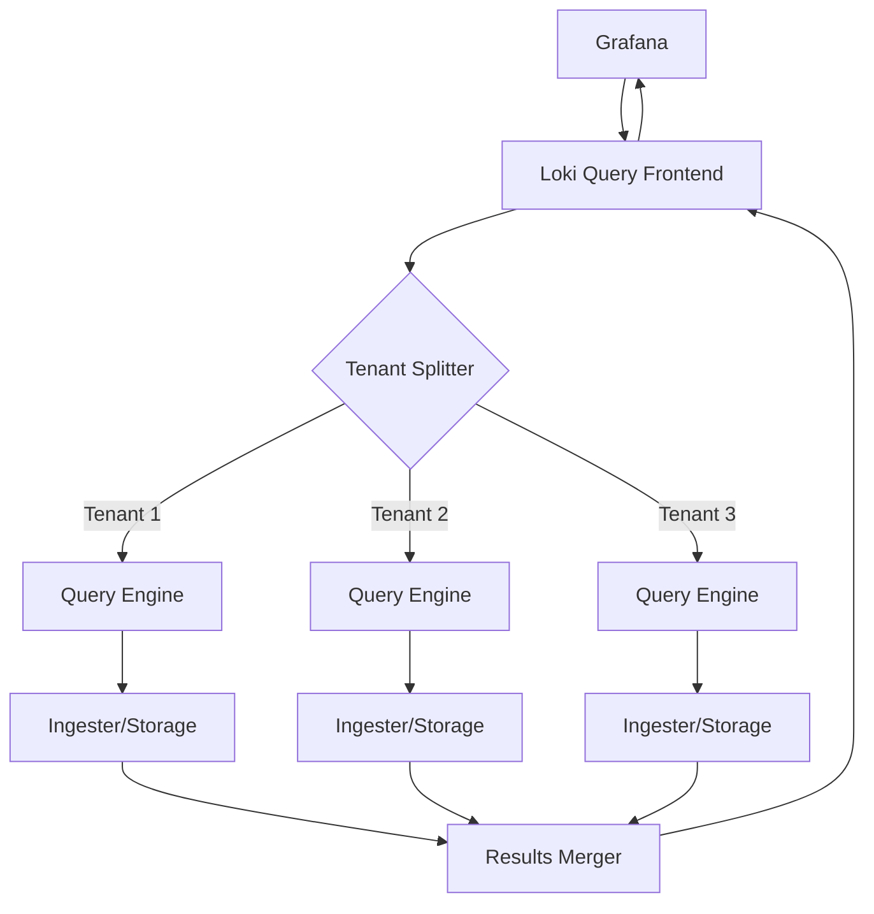

# Cross-Tenant Queries

## Introduction

In a multi-tenant Grafana Loki deployment, data is typically segregated by tenant to ensure isolation and security. However, there are scenarios where you need to query logs across multiple tenants simultaneously. This is where cross-tenant queries come into play.

Cross-tenant queries allow administrators and authorized users to search and analyze logs from multiple tenants in a single query operation. This feature is particularly valuable for global monitoring, troubleshooting, and creating comprehensive dashboards that span across organizational boundaries.

## Prerequisites

Before diving into cross-tenant queries, ensure you have:

- A working Grafana Loki deployment with multi-tenancy enabled
- Administrator privileges or appropriate permissions
- Basic understanding of Loki's LogQL query language
- Familiarity with Loki's tenant concepts

## Understanding Cross-Tenant Query Capabilities

Cross-tenant queries extend Loki's powerful LogQL language to work across tenant boundaries. Let's look at the key components that make this possible.

### The `tenant` Query Parameter

The primary mechanism for cross-tenant queries is the `tenant` query parameter that can be added to Loki API requests:

```bash
curl -H "X-Scope-OrgID: admin" http://loki:3100/loki/api/v1/query?query={app="frontend"}&tenant=tenant1,tenant2,tenant3
```

This query will fetch logs matching `{app="frontend"}` from three different tenants: tenant1, tenant2, and tenant3.

### Using Wildcards for Tenant Selection

You can also use wildcards to select multiple tenants that match a pattern:

```bash
curl -H "X-Scope-OrgID: admin" http://loki:3100/loki/api/v1/query?query={app="frontend"}&tenant=team-*
```

This will query all tenants with names starting with "team-".

## Configuring Cross-Tenant Queries

To enable cross-tenant query functionality, you'll need to configure your Loki deployment appropriately.

### Configuration in `loki-config.yaml`

The cross-tenant query feature needs to be explicitly enabled in your Loki configuration:

```yaml
auth_enabled: true

server:
  http_listen_port: 3100

tenant:
  cross_tenant_queries_enabled: true
  # List of users with cross-tenant query permissions
  cross_tenant_query_admins:
    - "admin"
    - "global-monitoring"
  # Optional: define which tenants specific users can query
  tenant_access_rules:
    global-monitoring:
      can_query:
        - "tenant1"
        - "tenant2"
    regional-admin:
      can_query:
        - "region-eu-*"
```

In this configuration:
- `cross_tenant_queries_enabled: true` enables the feature
- `cross_tenant_query_admins` lists users who can perform cross-tenant queries
- `tenant_access_rules` defines granular permissions for specific users

### Permission Model

The permission model for cross-tenant queries follows these rules:

1. Users listed in `cross_tenant_query_admins` can query across tenants
2. If `tenant_access_rules` is specified, it restricts which tenants each user can query
3. Without specific rules, admin users can query all tenants

## Practical Examples

Let's explore some practical examples of cross-tenant queries in different scenarios.

### Example 1: Troubleshooting a Distributed Application

Imagine you have a microservice architecture with services spread across multiple tenants based on team ownership. When troubleshooting an issue, you might need to correlate logs from different services:

```bash
curl -H "X-Scope-OrgID: admin" http://loki:3100/loki/api/v1/query_range?query={app=~"payment-service|order-service|inventory-service"}&tenant=team-payments,team-orders,team-inventory&start=1609459200&end=1609545600
```

This query fetches logs from three different services owned by three different teams, helping you trace a transaction across organizational boundaries.

### Example 2: Aggregating Metrics Across Environments

You might organize your tenants by environment (development, staging, production). To compare error rates across environments:

```bash
curl -H "X-Scope-OrgID: admin" http://loki:3100/loki/api/v1/query?query=sum(count_over_time({level="error"}[1h])) by (env)&tenant=dev,staging,prod
```

This query counts error logs across all three environments, allowing you to identify patterns or anomalies.

### Example 3: Using Grafana for Cross-Tenant Visualization

In Grafana, you can leverage cross-tenant queries by adding the tenant parameter to your Loki data source query:

```javascript
// Example Grafana panel query
{
  "expr": "{app=\"nginx\"} |= \"error\"",
  "tenant": "tenant1,tenant2",
  "refId": "A"
}
```

This allows you to create dashboards that show consolidated information across multiple tenants.

## Cross-Tenant Query Architecture

Let's understand how cross-tenant queries work behind the scenes:



When a cross-tenant query is received:

1. The query frontend receives the request with multiple tenants specified
2. It splits the query into individual tenant-specific queries
3. Each query is executed separately against its tenant's data
4. Results are merged and returned to the client

This architecture ensures that tenant data remains isolated while allowing authorized queries across boundaries.

## Performance Considerations

Cross-tenant queries can be resource-intensive, as they multiply the work that Loki needs to perform. Consider these best practices:

- Limit the time range of cross-tenant queries
- Be specific with your label filters to reduce the amount of data processed
- Consider caching frequently used cross-tenant query results
- Monitor query performance and adjust resource allocation if needed

For example, this query is more efficient:

```
{app="nginx", environment="production", status_code="500"} | tenant="tenant1,tenant2"
```

Than this broader query:

```
{app="nginx"} | tenant="tenant1,tenant2,tenant3,tenant4,tenant5"
```

## Security Implications

Cross-tenant queries introduce security considerations that should be carefully managed:

1. **Privilege Escalation**: Users with cross-tenant query capabilities can potentially access data they wouldn't normally have access to
2. **Information Disclosure**: Aggregate results might reveal information about tenant activity
3. **Resource Contention**: Abusive queries could impact multiple tenants' performance

Mitigate these risks by:

- Limiting cross-tenant query permissions to essential personnel
- Using the granular access rules to restrict which tenants can be queried together
- Implementing query quotas and rate limits for cross-tenant queries
- Regularly auditing cross-tenant query usage

## Common Troubleshooting

Here are some common issues and their solutions:

### Query Returns "Unauthorized for tenant" Error

If you receive this error, check:
- Your user is listed in `cross_tenant_query_admins`
- Tenant access rules allow your user to query the specified tenant
- The X-Scope-OrgID header is correctly set in your request

### Cross-Tenant Queries Are Slow

If your queries are running slowly:
- Narrow the time range of your query
- Add more specific label selectors
- Consider using the `limit` parameter to limit results
- Check if tenant data is distributed across different storage nodes

### No Results from Some Tenants

If some tenants return results while others don't:
- Verify the tenant names are spelled correctly
- Check if the queried tenants have data in the specified time range
- Ensure your query matches logs in all specified tenants

## Summary

Cross-tenant queries in Grafana Loki provide a powerful mechanism for monitoring and troubleshooting across organizational boundaries in multi-tenant deployments. By allowing authorized users to query multiple tenants simultaneously, Loki enables comprehensive observability while maintaining tenant isolation.

Key points to remember:
- Cross-tenant queries must be explicitly enabled in configuration
- Permissions should be carefully managed to prevent unauthorized access
- Performance considerations are important due to the increased workload
- Proper label filtering helps optimize query performance

## Exercises

1. Configure a local Loki deployment with cross-tenant queries enabled and three sample tenants.
2. Create a LogQL query that finds error logs across all tenants and groups them by application.
3. Set up a Grafana dashboard that visualizes request rates across multiple tenants.
4. Implement tenant access rules that grant a monitoring user access to production tenants only.
5. Measure and compare the performance of a cross-tenant query versus individual tenant queries.

## Additional Resources

- [Grafana Loki Multi-tenancy Documentation](https://grafana.com/docs/loki/latest/operations/multi-tenancy/)
- [LogQL Query Language Reference](https://grafana.com/docs/loki/latest/logql/)
- [Grafana Loki Performance Optimization Guide](https://grafana.com/docs/loki/latest/best-practices/)