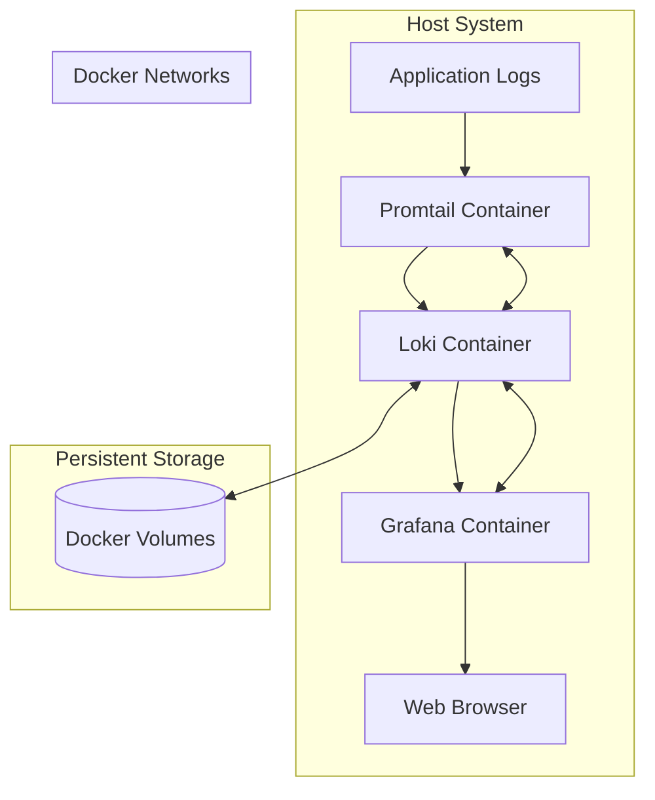

# Docker Deployment

Docker provides one of the simplest and most flexible ways to deploy Grafana Loki in various environments. In this guide, we'll walk through the process of setting up Loki using Docker, understand the core concepts, and explore practical deployment scenarios.

## Introduction to Docker Deployment for Loki

[Docker](https://www.docker.com/) is a containerization platform that packages applications and their dependencies together in isolated environments called containers. Deploying Loki with Docker offers several advantages:

- **Consistency**: Ensures Loki runs the same way across different environments
- **Isolation**: Keeps Loki and its dependencies separate from other applications
- **Portability**: Makes it easy to move your Loki deployment between environments
- **Scalability**: Simplifies scaling your logging infrastructure as your needs grow

Grafana Loki was designed with containerization in mind, making Docker a natural fit for deployment.

## Prerequisites

Before starting, ensure you have:

- Docker installed on your system
- Basic understanding of Docker concepts (images, containers, volumes)
- Docker Compose (recommended for multi-container setups)
- At least 1GB of free RAM for a basic setup

## Simple Docker Deployment

Let's start with a basic Loki deployment using Docker.

### Using Docker Run

The simplest way to get Loki running is with a single Docker command:

```bash
docker run -d --name loki -p 3100:3100 grafana/loki:latest
```

This command:
- Pulls the latest Loki image from Docker Hub
- Creates a container named "loki"
- Maps port 3100 on your host to port 3100 in the container
- Runs Loki in detached mode (background)

You can verify Loki is running by accessing its API:

```bash
curl http://localhost:3100/ready
```

Expected output:
```
ready
```

While this approach works for testing, it's not suitable for production as it lacks persistence and proper configuration.

## Docker Compose Deployment

For a more complete setup, Docker Compose provides a way to define and run multi-container Docker applications.

### Basic Loki Stack

Create a file named `docker-compose.yml` with the following content:

```yaml
version: "3"

services:
  loki:
    image: grafana/loki:latest
    ports:
      - "3100:3100"
    volumes:
      - loki-data:/loki
    command: -config.file=/etc/loki/local-config.yaml
    networks:
      - loki

  promtail:
    image: grafana/promtail:latest
    volumes:
      - /var/log:/var/log
      - ./promtail-config.yaml:/etc/promtail/config.yml
    command: -config.file=/etc/promtail/config.yml
    networks:
      - loki
    depends_on:
      - loki

  grafana:
    image: grafana/grafana:latest
    ports:
      - "3000:3000"
    environment:
      - GF_PATHS_PROVISIONING=/etc/grafana/provisioning
      - GF_AUTH_ANONYMOUS_ENABLED=true
      - GF_AUTH_ANONYMOUS_ORG_ROLE=Admin
    volumes:
      - ./grafana-datasources.yaml:/etc/grafana/provisioning/datasources/datasources.yaml
    networks:
      - loki
    depends_on:
      - loki

networks:
  loki:

volumes:
  loki-data:
```

You'll need to create a basic Promtail configuration file named `promtail-config.yaml`:

```yaml
server:
  http_listen_port: 9080
  grpc_listen_port: 0

positions:
  filename: /tmp/positions.yaml

clients:
  - url: http://loki:3100/loki/api/v1/push

scrape_configs:
  - job_name: system
    static_configs:
      - targets:
          - localhost
        labels:
          job: varlogs
          __path__: /var/log/*log
```

And a Grafana data source configuration file named `grafana-datasources.yaml`:

```yaml
apiVersion: 1

datasources:
  - name: Loki
    type: loki
    access: proxy
    url: http://loki:3100
    version: 1
    editable: true
```

Start the stack with:

```bash
docker-compose up -d
```

This will deploy:
- Loki as the log storage and query engine
- Promtail as the log collector
- Grafana for visualizing and querying logs

Access Grafana at http://localhost:3000 and start exploring your logs.

## Understanding Docker Deployment Architecture

Let's visualize the architecture of a Docker-based Loki deployment:



## Production Considerations

For production environments, consider the following enhancements:

### 1. Custom Configuration

Create a custom Loki configuration file `loki-config.yaml`:

```yaml
auth_enabled: false

server:
  http_listen_port: 3100

ingester:
  lifecycler:
    address: 127.0.0.1
    ring:
      kvstore:
        store: inmemory
      replication_factor: 1
    final_sleep: 0s
  chunk_idle_period: 5m
  chunk_retain_period: 30s

schema_config:
  configs:
    - from: 2020-10-24
      store: boltdb-shipper
      object_store: filesystem
      schema: v11
      index:
        prefix: index_
        period: 24h

storage_config:
  boltdb_shipper:
    active_index_directory: /loki/boltdb-shipper-active
    cache_location: /loki/boltdb-shipper-cache
    cache_ttl: 24h
    shared_store: filesystem
  filesystem:
    directory: /loki/chunks

compactor:
  working_directory: /loki/compactor
  shared_store: filesystem

limits_config:
  reject_old_samples: true
  reject_old_samples_max_age: 168h

chunk_store_config:
  max_look_back_period: 0s

table_manager:
  retention_deletes_enabled: false
  retention_period: 0s
```

And update your `docker-compose.yml` to use this configuration:

```yaml
loki:
  image: grafana/loki:latest
  ports:
    - "3100:3100"
  volumes:
    - loki-data:/loki
    - ./loki-config.yaml:/etc/loki/local-config.yaml
  command: -config.file=/etc/loki/local-config.yaml
```

### 2. Persistent Storage

For production, use named volumes or bind mounts:

```yaml
volumes:
  - loki-data:/loki
```

Or for better control, use host-mounted directories:

```yaml
volumes:
  - /path/on/host/loki:/loki
```

### 3. Resource Constraints

Limit container resources:

```yaml
loki:
  # ... other configuration
  deploy:
    resources:
      limits:
        cpus: '1'
        memory: 1G
      reservations:
        cpus: '0.5'
        memory: 512M
```

### 4. High Availability

For high availability, you can deploy Loki in microservices mode:

```yaml
services:
  loki-distributor:
    image: grafana/loki:latest
    command: -target=distributor -config.file=/etc/loki/config.yaml
    # ...
  
  loki-ingester:
    image: grafana/loki:latest
    command: -target=ingester -config.file=/etc/loki/config.yaml
    # ...
  
  loki-querier:
    image: grafana/loki:latest
    command: -target=querier -config.file=/etc/loki/config.yaml
    # ...
```

## Docker Swarm Deployment

For larger environments, Docker Swarm offers orchestration capabilities:

```bash
# Initialize swarm
docker swarm init

# Deploy the stack
docker stack deploy -c docker-compose.yml loki
```

## Kubernetes Compatibility

Docker-based Loki deployments can be migrated to Kubernetes using similar configuration principles. The container images and volume concepts remain the same, making migration straightforward.

## Common Issues and Troubleshooting

### 1. Container fails to start

Check container logs:

```bash
docker logs loki
```

### 2. Cannot connect to Loki

Verify network settings:

```bash
docker network inspect loki
```

### 3. Logs not appearing

Check Promtail logs:

```bash
docker logs promtail
```

### 4. High memory usage

Adjust `limits_config` in Loki configuration to manage resource usage.

## Practical Example: Monitoring Web Server Logs

Let's create a practical example of monitoring Nginx logs:

1. Add a new service to your `docker-compose.yml`:

```yaml
nginx:
  image: nginx:latest
  ports:
    - "80:80"
  volumes:
    - ./nginx/logs:/var/log/nginx
  networks:
    - loki
```

2. Update your Promtail configuration:

```yaml
scrape_configs:
  # ... existing configs
  - job_name: nginx
    static_configs:
      - targets:
          - localhost
        labels:
          job: nginx
          __path__: /var/log/nginx/*log
```

3. Restart your stack:

```bash
docker-compose down
docker-compose up -d
```

4. Generate some logs by visiting http://localhost:80

5. Query logs in Grafana using LogQL:

```
{job="nginx"}
```

## Docker Performance Tuning

For optimal Loki performance in Docker:

1. Use local SSD storage for volumes
2. Allocate sufficient memory to containers
3. Consider network optimizations for distributed setups
4. Use Docker volumes instead of bind mounts for better I/O performance

## Summary

Docker provides a flexible and powerful platform for deploying Grafana Loki. In this guide, we've covered:

- Basic Docker deployment with a single container
- Multi-container setup with Docker Compose
- Production considerations including configuration, persistence, and scaling
- Practical example of monitoring web server logs
- Performance tuning recommendations

By leveraging Docker, you can deploy Loki in various environments with consistent performance and manage your logging infrastructure efficiently.

## Additional Resources

- Try implementing a complete monitoring solution with Prometheus and Loki
- Experiment with different log sources and parsing configurations
- Practice setting up alerting based on log patterns

## Practice Exercises

1. Extend the basic setup to collect logs from a database container
2. Implement log rotation and retention policies in your Loki configuration
3. Create a dashboard in Grafana to visualize error rates from your logs
4. Set up multiple Promtail instances to collect logs from different sources